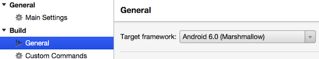

# Adding AppCompat and Material Design

_Follow these steps to convert existing Xamarin.Forms Android apps to use AppCompat and Material Design_

<!-- source https://gist.github.com/jassmith/a3b2a543f99126782936
https://blog.xamarin.com/material-design-for-your-xamarin-forms-android-apps/ -->

## Overview

These instructions explain how to update your existing Xamarin.Forms Android
applications to use the AppCompat library and enable Material Design in the
Android version of your Xamarin.Forms apps.

### 1. Update Xamarin.Forms

Ensure the solution is using Xamarin.Forms 2.0 or newer. Update the Xamarin.Forms
  NuGet package to 2.0 if required.

### 2. Check Android version

Ensure the Android project's target framework is Android 6.0 (Marshmallow). Check
  the **Android project > Options > Build > General** settings to ensure
  the corrent framework is selected:

 

### 3. Add new themes to support Material Design

Create the following three files in your Android project and paste
  in the contents below. Google provides a
  [style guide](https://www.google.com/design/spec/style/color.html#color-color-palette)
  and a [color palette generator](https://www.materialpalette.com/) to help
  you choose an alternate color scheme to the one specified.

**Resources/values/colors.xml**

```xml
<resources>
  <color name="primary">#2196F3</color>
  <color name="primaryDark">#1976D2</color>
  <color name="accent">#FFC107</color>
  <color name="window_background">#F5F5F5</color>
</resources>
```

**Resources/values/style.xml**

```xml
<resources>
  <style name="MyTheme" parent="MyTheme.Base">
  </style>
  <style name="MyTheme.Base" parent="Theme.AppCompat.Light.NoActionBar">
    <item name="colorPrimary">@color/primary</item>
    <item name="colorPrimaryDark">@color/primaryDark</item>
    <item name="colorAccent">@color/accent</item>
    <item name="android:windowBackground">@color/window_background</item>
    <item name="windowActionModeOverlay">true</item>
  </style>
</resources>
```

An additional style must be included in the **values-v21** folder to apply
specific properties when running on Android Lollipop and newer.

**Resources/values-v21/style.xml**

```xml
<resources>
  <style name="MyTheme" parent="MyTheme.Base">
    <!--If you are using FlyoutPage you will want to set these, else you can leave them out-->
    <!--<item name="android:windowDrawsSystemBarBackgrounds">true</item>
    <item name="android:statusBarColor">@android:color/transparent</item>-->
  </style>
</resources>
```

### 4. Update AndroidManifest.xml

To ensure this new theme information is used, set theme in the **AndroidManifest** file by adding
`android:theme="@style/MyTheme"` (leave the rest of the XML as it was).

**Properties/AndroidManifest.xml**

```xml
...
<application android:label="AppName" android:icon="@drawable/icon"
  android:theme="@style/MyTheme">
...
```

### 5. Provide toolbar and tab layouts

Create **Tabbar.axml** and **Toolbar.axml** files in the **Resources/layout**
directory and paste in their contents from below:

**Resources/layout/Tabbar.axml**

```xml
<android.support.design.widget.TabLayout
    xmlns:android="http://schemas.android.com/apk/res/android"
    xmlns:app="http://schemas.android.com/apk/res-auto"
    android:id="@+id/sliding_tabs"
    android:layout_width="match_parent"
    android:layout_height="wrap_content"
    android:background="?attr/colorPrimary"
    android:theme="@style/ThemeOverlay.AppCompat.Dark.ActionBar"
    app:tabIndicatorColor="@android:color/white"
    app:tabGravity="fill"
    app:tabMode="fixed" />
```

A few properties for the tabs have been set including the tab’s gravity to `fill` and
mode to `fixed`.
If you have a lot of tabs you may want to switch this to scrollable - read through the
Android [TabLayout documentation](https://developer.android.com/reference/android/support/design/widget/TabLayout.html)
to learn more.

**Resources/layout/Toolbar.axml**

```xml
<android.support.v7.widget.Toolbar
    xmlns:android="http://schemas.android.com/apk/res/android"
    xmlns:app="http://schemas.android.com/apk/res-auto"
    android:id="@+id/toolbar"
    android:layout_width="match_parent"
    android:layout_height="?attr/actionBarSize"
    android:minHeight="?attr/actionBarSize"
    android:background="?attr/colorPrimary"
    android:theme="@style/ThemeOverlay.AppCompat.Dark.ActionBar"
    app:popupTheme="@style/ThemeOverlay.AppCompat.Light"
    app:layout_scrollFlags="scroll|enterAlways" />
```

In these files we're creating specific theme for the toolbar that may vary for your application.
Refer to the [Hello Toolbar](https://blog.xamarin.com/android-tips-hello-toolbar-goodbye-action-bar/)
blog post to learn more.

### 6. Update the `MainActivity`

In existing Xamarin.Forms apps the **MainActivity.cs** class will inherit
from `FormsApplicationActivity`. This must be replaced with `FormsAppCompatActivity`
to enable the new functionality.

**MainActivity.cs**

```csharp
public class MainActivity : FormsAppCompatActivity  // was FormsApplicationActivity
```

Finally, "wire up" the new layouts from step 5 in the `OnCreate` method,
as shown here:

```csharp
protected override void OnCreate(Bundle bundle)
{
  // set the layout resources first
  FormsAppCompatActivity.ToolbarResource = Resource.Layout.Toolbar;
  FormsAppCompatActivity.TabLayoutResource = Resource.Layout.Tabbar;

  // then call base.OnCreate and the Xamarin.Forms methods
  base.OnCreate(bundle);
  Forms.Init(this, bundle);
  LoadApplication(new App());
}
```
