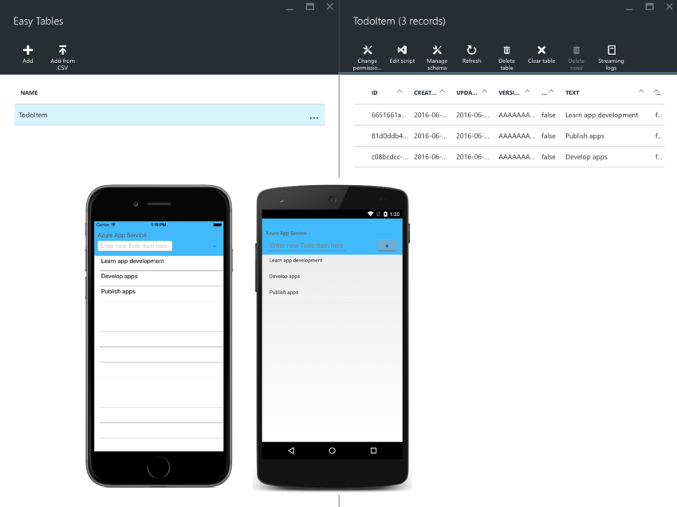

# Consuming an Azure Mobile App

[ Download the sample](https://developer.xamarin.com/samples/xamarin-forms/WebServices/TodoAzure/)

_Azure Mobile Apps allow you to develop apps with scalable backends hosted in Azure App Service, with support for mobile authentication, offline sync, and push notifications. This article, which is only applicable to Azure Mobile Apps that use a Node.js backend, explains how to query, insert, update, and delete data stored in a table in an Azure Mobile Apps instance._

> [!NOTE]
> Starting on June 30, all new Azure Mobile Apps will be created with TLS 1.2 by default. In addition, it's also recommended that existing Azure Mobile Apps be reconfigured to use TLS 1.2. For information on how to enforce TLS 1.2 in an Azure Mobile App, see [Enforce TLS versions](/azure/app-service/app-service-web-tutorial-custom-ssl#enforce-tls-versions). For information on how to configure Xamarin projects to use TLS 1.2, see [Transport Layer Security (TLS) 1.2](~/cross-platform/app-fundamentals/transport-layer-security.md).

For information on how to create an Azure Mobile Apps instance that can be consumed by Xamarin.Forms, see [Create a Xamarin.Forms app](https://azure.microsoft.com/documentation/articles/app-service-mobile-xamarin-forms-get-started/). After following these instructions, the downloadable sample application can be configured to consume the Azure Mobile Apps instance by setting the `Constants.ApplicationURL` to the URL of the Azure Mobile Apps instance. Then, when the sample application is run it will connect to the Azure Mobile Apps instance, as shown in the following screenshot:



Access to Azure Mobile Apps is through the [Azure Mobile Client SDK](https://www.nuget.org/packages/Microsoft.Azure.Mobile.Client/), and all connections from the Xamarin.Forms sample application to Azure are made over HTTPS.

> [!NOTE]
> In iOS 9 and greater, App Transport Security (ATS) enforces secure connections between internet resources (such as the app's back-end server) and the app, thereby preventing accidental disclosure of sensitive information. Since ATS is enabled by default in apps built for iOS 9, all connections will be subject to ATS security requirements. If connections do not meet these requirements, they will fail with an exception.
> ATS can be opted out of if it is not possible to use the `HTTPS` protocol and secure communication for internet resources. This can be achieved by updating the app's **Info.plist** file. For more information see [App Transport Security](~/ios/app-fundamentals/ats.md).

## Consuming an Azure Mobile App Instance

The [Azure Mobile Client SDK](https://www.nuget.org/packages/Microsoft.Azure.Mobile.Client/) provides the `MobileServiceClient` class, which is used by a Xamarin.Forms application to access the Azure Mobile Apps instance, as shown in the following code example:

```csharp
IMobileServiceTable<TodoItem> todoTable;
MobileServiceClient client;

public TodoItemManager ()
{
  client = new MobileServiceClient (Constants.ApplicationURL);
  todoTable = client.GetTable<TodoItem> ();
}
```

When the `MobileServiceClient` instance is created, an application URL must be specified to identify the Azure Mobile Apps instance. This value can be obtained from the dashboard for the mobile app in the [Microsoft Azure Portal](https://portal.azure.com/).

A reference to the `TodoItem` table stored in the Azure Mobile Apps instance must be obtained before operations can be performed on that table. This is achieved by calling the `GetTable` method on the `MobileServiceClient` instance, which returns a `IMobileServiceTable<TodoItem>` reference.

### Querying Data

The contents of a table can be retrieved by calling the `IMobileServiceTable.ToEnumerableAsync` method that asynchronously evaluates the query and returns the results. Data can also be filtered server side by including a `Where` clause in the query. The `Where` clause applies a row filtering predicate to the query against the table, as shown in the following code example:

```csharp
public async Task<ObservableCollection<TodoItem>> GetTodoItemsAsync (bool syncItems = false)
{
  ...
  IEnumerable<TodoItem> items = await todoTable
              .Where (todoItem => !todoItem.Done)
              .ToEnumerableAsync ();

  return new ObservableCollection<TodoItem> (items);
}
```

This query returns all the items from the `TodoItem` table whose `Done` property is equal to `false`. The query results are then placed in an `ObservableCollection` for display.

### Inserting Data

When inserting data in the Azure Mobile Apps instance, new columns will automatically be generated in the table as required, provided that dynamic schema is enabled in the Azure Mobile Apps instance. The `IMobileServiceTable.InsertAsync` method is used to insert a new row of data into the specified table, as shown in the following code example:

```csharp
public async Task SaveTaskAsync (TodoItem item)
{
  ...
  await todoTable.InsertAsync (item);
  ...
}
```

When making an insert request, an ID must not be specified in the data being passed to the Azure Mobile Apps instance. If the insert request contains an ID a `MobileServiceInvalidOperationException` will be thrown.

After the `InsertAsync` method completes, the ID of the data in the Azure Mobile Apps instance will be populated in the `TodoItem` instance in the Xamarin.Forms application.

### Updating Data

When updating data in the Azure Mobile Apps instance, new columns will automatically be generated in the table as required, provided that dynamic schema is enabled in the Azure Mobile Apps instance. The `IMobileServiceTable.UpdateAsync` method is used to update existing data with new information, as shown in the following code example:

```csharp
public async Task SaveTaskAsync (TodoItem item)
{
  ...
  await todoTable.UpdateAsync (item);
  ...
}
```

When making an update request, an ID must be specified so that the Azure Mobile Apps instance can identify the data to be updated. This ID value is stored in the `TodoItem.ID` property. If the update request doesn't contain an ID there is no way for the Azure Mobile Apps instance to determine the data to be updated, and so a `MobileServiceInvalidOperationException` will be thrown.

### Deleting Data

The `IMobileServiceTable.DeleteAsync` method is used to delete data from an Azure Mobile Apps table, as shown in the following code example:

```csharp
public async Task DeleteTaskAsync (TodoItem item)
{
  ...
  await todoTable.DeleteAsync(item);
  ...
}
```

When making a delete request, an ID must be specified so that the Azure Mob`ile App sinstance can identify the data to be deleted. This ID value is stored in the `TodoItem.ID` property. If the delete request doesn't contain an ID, there is no way for the Azure Mobile Apps instance to determine the data to be deleted, and so a `MobileServiceInvalidOperationException` will be thrown.

## Summary

This article explained how to use the [Azure Mobile Client SDK](https://www.nuget.org/packages/Microsoft.Azure.Mobile.Client/) to query, insert, update, and delete data stored in a table in an Azure Mobile apps instance. The SDK provides the `MobileServiceClient` class that is used by a Xamarin.Forms application to access the Azure Mobile Apps instance.


## Related Links

- [TodoAzure (sample)](https://developer.xamarin.com/samples/xamarin-forms/WebServices/TodoAzure/)
- [Create a Xamarin.Forms app](https://azure.microsoft.com/documentation/articles/app-service-mobile-xamarin-forms-get-started/)
- [Azure Mobile Client SDK](https://www.nuget.org/packages/Microsoft.Azure.Mobile.Client/)
- [MobileServiceClient](https://msdn.microsoft.com/library/azure/microsoft.windowsazure.mobileservices.mobileserviceclient(v=azure.10).aspx)
