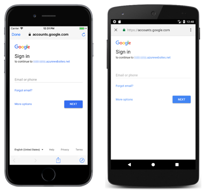

# Authenticating Users with Azure Mobile Apps

[ Download the sample](https://developer.xamarin.com/samples/xamarin-forms/WebServices/TodoAzureAuth/)

_Azure Mobile Apps use a variety of external identity providers to support authenticating and authorizing application users, including Facebook, Google, Microsoft, Twitter, and Azure Active Directory. Permissions can be set on tables to restrict access to authenticated users only. This article explains how to use Azure Mobile Apps to manage the authentication process in a Xamarin.Forms application._

## Overview

The process for having Azure Mobile Apps manage the authentication process in a Xamarin.Forms application is as follows:

1. Register your Azure Mobile App at an identity provider's site, and then set the provider-generated credentials in the Mobile Apps back end. For more information, see [Register your app for authentication and configure App Services](/azure/app-service-mobile/app-service-mobile-xamarin-forms-get-started-users#register-your-app-for-authentication-and-configure-app-services).
1. Define a new URL scheme for your Xamarin.Forms application, which allows the authentication system to redirect back to Xamarin.Forms application once the authentication process is complete. For more information, see [Add your app to the Allowed External Redirect URLs](/azure/app-service-mobile/app-service-mobile-xamarin-forms-get-started-users#redirecturl).
1. Restrict access to the Azure Mobile Apps back end to only authenticated clients. For more information, see [Restrict permissions to authenticated users](/azure/app-service-mobile/app-service-mobile-xamarin-forms-get-started-users#restrict-permissions-to-authenticated-users).
1. Invoke authentication from the Xamarin.Forms application. For more information, see [Add authentication to the portable class library](/azure/app-service-mobile/app-service-mobile-xamarin-forms-get-started-users#add-authentication-to-the-portable-class-library), [Add authentication to the iOS app](/azure/app-service-mobile/app-service-mobile-xamarin-forms-get-started-users#add-authentication-to-the-ios-app), [Add authentication to the Android app](/azure/app-service-mobile/app-service-mobile-xamarin-forms-get-started-users#add-authentication-to-the-android-app), and [Add authentication to Windows 10 app projects](/azure/app-service-mobile/app-service-mobile-xamarin-forms-get-started-users#add-authentication-to-windows-10-including-phone-app-projects).

> [!NOTE]
> In iOS 9 and greater, App Transport Security (ATS) enforces secure connections between internet resources (such as the app's back-end server) and the app, thereby preventing accidental disclosure of sensitive information. Since ATS is enabled by default in apps built for iOS 9, all connections will be subject to ATS security requirements. If connections do not meet these requirements, they will fail with an exception.
> ATS can be opted out of if it is not possible to use the `HTTPS` protocol and secure communication for internet resources. This can be achieved by updating the app's **Info.plist** file. For more information see [App Transport Security](~/ios/app-fundamentals/ats.md).

Historically, mobile applications have used embedded web views to perform authentication with identity provider's. This is no longer recommended for the following reasons:

- The application that hosts the web view can access the user's full authentication credential, not just the authorization grant that was intended for the application. This violates the principle of least privilege, as the application has access to more powerful credentials than it requires, potentially increasing the attack surface of the application.
- The host application could capture usernames and passwords, automatically submit forms and bypass user-consent, and copy session cookies and use them to perform authenticated actions as the user.
- Embedded web views don't share the authentication state with other applications, or the device's web browser, requiring the user to sign-in for every authorization request which is considered an inferior user experience.
- Some authorization endpoints take steps to detect and block authorization requests that come from web views.

The alternative is to use the device's web browser to perform authentication, which is the approach taken by the latest version of the [Azure Mobile Client SDK](https://www.nuget.org/packages/Microsoft.Azure.Mobile.Client/). Using the device browser for authentication requests improves the usability of an application, as users only need to sign-in to the identity provider once per device, improving conversion rates of sign-in and authorization flows in the application. The device browser also provides improved security as applications are able to inspect and modify content in a web view, but not content shown in the browser.

## Using an Azure Mobile Apps Instance

The [Azure Mobile Client SDK](https://www.nuget.org/packages/Microsoft.Azure.Mobile.Client/) provides the `MobileServiceClient` class, which is used by a Xamarin.Forms application to access the Azure Mobile Apps instance.

The sample application uses Google as the identity provider, which allows users with Google accounts to login to the Xamarin.Forms application. While Google is used as the identity provider in this article, the approach is equally applicable to other identity providers.

<a name="logging-in" />

### Logging in Users

The login screen in the sample application is shown in the following screenshots:



While Google is used as the identity provider, a variety of other identity providers can be used, including Facebook, Microsoft, Twitter, and Azure Active Directory.

The following code example shows how the login process is invoked:

```csharp
async void OnLoginButtonClicked(object sender, EventArgs e)
{
  ...
  if (App.Authenticator != null)
  {
    authenticated = await App.Authenticator.AuthenticateAsync();
  }
  ...
}
```

The `App.Authenticator` property is an `IAuthenticate` instance that's set by each platform-specific project. The `IAuthenticate` interface specifies an `AuthenticateAsync` operation that must be provided by each platform project. Therefore, invoking the `App.Authenticator.AuthenticateAsync` method executes the `IAuthenticate.AuthenticateAsync` method in a platform project.

All of the platform `IAuthenticate.AuthenticateAsync` methods call the `MobileServiceClient.LoginAsync` method to display a login interface and cache data. The following code example shows the `LoginAsync` method for the iOS platform:

```csharp
public async Task<bool> AuthenticateAsync()
{
  ...
  // The authentication provider could also be Facebook, Twitter, or Microsoft
  user = await TodoItemManager.DefaultManager.CurrentClient.LoginAsync(
    UIApplication.SharedApplication.KeyWindow.RootViewController,
    MobileServiceAuthenticationProvider.Google,
    Constants.URLScheme);
  ...
}
```

The following code example shows the `LoginAsync` method for the Android platform:

```csharp
public async Task<bool> AuthenticateAsync()
{
  ...
  // The authentication provider could also be Facebook, Twitter, or Microsoft
  user = await TodoItemManager.DefaultManager.CurrentClient.LoginAsync(
    this,
    MobileServiceAuthenticationProvider.Google,
    Constants.URLScheme);
  ...
}
```

The following code example shows the `LoginAsync` method for the Universal Windows Platform:

```csharp
public async Task<bool> AuthenticateAsync()
{
  ...
  // The authentication provider could also be Facebook, Twitter, or Microsoft
  user = await TodoItemManager.DefaultManager.CurrentClient.LoginAsync(
    MobileServiceAuthenticationProvider.Google,
    Constants.URLScheme);
  ...
}
```

On all platforms, the `MobileServiceAuthenticationProvider` enumeration is used to specify the identity provider that will be used in the authentication process. When the `MobileServiceClient.LoginAsync` method is invoked, Azure Mobile Apps initiates an authentication flow by displaying the login page of the selected provider, and by generating an authentication token after successful login with the identity provider. The `MobileServiceClient.LoginAsync` method returns a `MobileServiceUser` instance that will be stored in the `MobileServiceClient.CurrentUser` property. This property provides `UserId` and `MobileServiceAuthenticationToken` properties. These represent the authenticated user and an authentication token for the user. The authentication token will be included in all requests made to the Azure Mobile Apps instance, allowing the Xamarin.Forms application to perform actions on the Azure Mobile App instance that require authenticated user permissions.

<a name="logging-out" />

### Logging Out Users

The following code example shows how the logout process is invoked:

```csharp
async void OnLogoutButtonClicked(object sender, EventArgs e)
{
  bool loggedOut = false;

  if (App.Authenticator != null)
  {
    loggedOut = await App.Authenticator.LogoutAsync ();
  }
  ...
}
```

The `App.Authenticator` property is an `IAuthenticate` instance that's set by each platformproject. The `IAuthenticate` interface specifies an `LogoutAsync` operation that must be provided by each platform project. Therefore, invoking the `App.Authenticator.LogoutAsync` method executes the `IAuthenticate.LogoutAsync` method in a platform project.

All of the platform `IAuthenticate.LogoutAsync` methods call the `MobileServiceClient.LogoutAsync` method to de-authenticate the logged-in user with the identity provider. The following code example shows the `LogoutAsync` method for the iOS platform:

```csharp
public async Task<bool> LogoutAsync()
{
  ...
  foreach (var cookie in NSHttpCookieStorage.SharedStorage.Cookies)
  {
    NSHttpCookieStorage.SharedStorage.DeleteCookie (cookie);
  }
  await TodoItemManager.DefaultManager.CurrentClient.LogoutAsync();
  ...
}
```

The following code example shows the `LogoutAsync` method for the Android platform:

```csharp
public async Task<bool> LogoutAsync()
{
  ...
  CookieManager.Instance.RemoveAllCookie();
  await TodoItemManager.DefaultManager.CurrentClient.LogoutAsync();
  ...
}
```

The following code example shows the `LogoutAsync` method for the Universal Windows Platform:

```csharp
public async Task<bool> LogoutAsync()
{
  ...
  await TodoItemManager.DefaultManager.CurrentClient.LogoutAsync();
  ...
}
```

When the `IAuthenticate.LogoutAsync` method is invoked, any cookies set by the identity provider are cleared, before the `MobileServiceClient.LogoutAsync` method is invoked to de-authenticate the logged-in user with the identity provider.

## Summary

This article explained how to use Azure Mobile Apps to manage the authentication process in a Xamarin.Forms application. Azure Mobile Apps use a variety of external identity providers to support authenticating and authorizing application users, including Facebook, Google, Microsoft, Twitter, and Azure Active Directory. The `MobileServiceClient` class is used by the Xamarin.Forms application to control access to the Azure Mobile Apps instance.


## Related Links

- [TodoAzureAuth (sample)](https://developer.xamarin.com/samples/xamarin-forms/WebServices/TodoAzureAuth/)
- [Consuming an Azure Mobile App](~/xamarin-forms/data-cloud/consuming/azure.md)
- [Add authentication to your Xamarin.Forms app](/azure/app-service-mobile/app-service-mobile-xamarin-forms-get-started-users/)
- [Azure Mobile Client SDK](https://www.nuget.org/packages/Microsoft.Azure.Mobile.Client/)
- [MobileServiceClient](https://msdn.microsoft.com/library/azure/microsoft.windowsazure.mobileservices.mobileserviceclient(v=azure.10).aspx)
