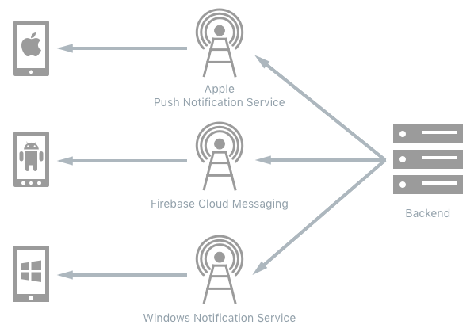
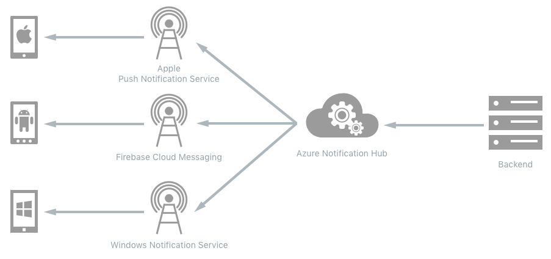
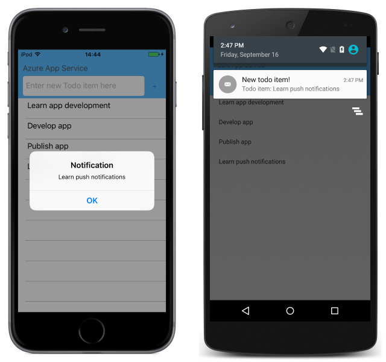

# Sending Push Notifications from Azure Mobile Apps

[ Download the sample](https://developer.xamarin.com/samples/xamarin-forms/WebServices/TodoAzurePush/)

_Azure Notification Hubs provide a scalable push infrastructure for sending mobile push notifications from any backend to any mobile platform, while eliminating the complexity of a backend having to communicate with different platform notification systems. This article explains how to use Azure Notification Hubs to send push notifications from an Azure Mobile Apps instance to a Xamarin.Forms application._

> [!VIDEO https://youtube.com/embed/le2lDY22xwM]

**Azure Push Notification Hub and Xamarin.Forms video**

A push notification is used to deliver information, such as a message, from a backend system to an application on a mobile device to increase application engagement and usage. The notification can be sent at anytime, even when the user is not actively using the targeted application.

Backend systems send push notifications to mobile devices through Platform Notification Systems (PNS), as shown in the following diagram:

[](4-push-images/pns-large.png#lightbox "Platform Notification Systems")

To send a push notification, the backend system contacts the platform-specific PNS to send a notification to a client application instance. This significantly increases the complexity of the backend when cross-platform push notifications are required, because the backend must use each platform-specific PNS API and protocol.

Azure Notification Hubs eliminate this complexity by abstracting the details of the different platform notification systems, allowing a cross-platform notification to be sent with a single API call, as shown in the following diagram:

[](4-push-images/notification-hub-large.png#lightbox)

To send a push notification, the backend system only contacts the Azure Notification Hub, which in turn communicates with the different platform notification systems, therefore decreasing the complexity of the backend code that sends push notifications.

Azure Mobile Apps have built-in support for push notifications using notification hubs. The process for sending a push notification from an Azure Mobile Apps instance to a Xamarin.Forms application is as follows:

1. The Xamarin.Forms application registers with the PNS, which returns a handle.
1. The Azure Mobile Apps instance sends a notification to its Azure Notification Hub, specifying the handle of the device to be targeted.
1. The Azure Notification Hub sends the notification to the appropriate PNS for the device.
1. The PNS sends the notification to the specified device.
1. The Xamarin.Forms application processes the notification and displays it.

The sample application demonstrates a todo list application whose data is stored in an Azure Mobile Apps instance. Every time a new item is added to the Azure Mobile Apps instance, a push notification is sent to the Xamarin.Forms application. The following screenshots show each platform displaying the received push notification:

[](4-push-images/screenshots-large.png#lightbox "Sample Application Receiving a Push Notification")

For more information about Azure Notification Hubs, see [Azure Notification Hubs](https://azure.microsoft.com/documentation/articles/notification-hubs-push-notification-overview/) and [Add push notifications to your Xamarin.Forms app](/azure/app-service-mobile/app-service-mobile-xamarin-forms-get-started-push/).

## Azure and Platform Notification System Setup

The process for integrating an Azure Notification Hub into an Azure Mobile Apps instance is as follows:

1. Create an Azure Mobile Apps instance. For more information, see [Consuming an Azure Mobile App](~/xamarin-forms/data-cloud/consuming/azure.md).
1. Configure a notification hub. For more information, see [Configure a notification hub](/azure/app-service-mobile/app-service-mobile-xamarin-forms-get-started-push#configure-hub).
1. Update the Azure Mobile Apps instance to send push notifications. For more information, see [Update the server project to send push notifications](/azure/app-service-mobile/app-service-mobile-xamarin-forms-get-started-push#update-the-server-project-to-send-push-notifications).
1. Register with each PNS.
1. Configure the notification hub to communicate with each PNS.

The following sections provide additional setup instructions for each platform.

### iOS

The following additional steps must be carried out to use Apple Push Notification Service (APNS) from an Azure Notification Hub:

1. Generate a certificate signing request for the push certificate with the Keychain Access tool. For more information, see [Generate the Certificate Signing Request file for the push certificate](https://azure.microsoft.com/documentation/articles/app-service-mobile-xamarin-forms-get-started-push/#generate-the-certificate-signing-request-file-for-the-push-certificate) on the Azure Documentation Center.
1. Register the Xamarin.Forms application for push notification support on the Apple Developer Center. For more information, see [Register your app for push notifications](https://azure.microsoft.com/documentation/articles/app-service-mobile-xamarin-forms-get-started-push/#register-your-app-for-push-notifications) on the Azure Documentation Center.
1. Create a push notifications enabled provisioning profile for the Xamarin.Forms application on the Apple Developer Center. For more information, see [Create a provisioning profile for the app](https://azure.microsoft.com/documentation/articles/app-service-mobile-xamarin-forms-get-started-push/#create-a-provisioning-profile-for-the-app) on the Azure Documentation Center.
1. Configure the notification hub to communicate with APNS. For more information, see [Configure the notification hub for APNS](https://azure.microsoft.com/documentation/articles/app-service-mobile-xamarin-forms-get-started-push/#configure-the-notification-hub-for-apns).
1. Configure the Xamarin.Forms application to use the new App ID and provisioning profile. For more information, see [Configuring the iOS project in Xamarin Studio](https://azure.microsoft.com/documentation/articles/app-service-mobile-xamarin-forms-get-started-push/#configuring-the-ios-project-in-xamarin-studio) or [Configuring the iOS project in Visual Studio](https://azure.microsoft.com/documentation/articles/app-service-mobile-xamarin-forms-get-started-push/#configuring-the-ios-project-in-visual-studio) on the Azure Documentation Center.

### Android

The following additional steps must be carried out to use Firebase Cloud Messaging (FCM) from an Azure Notification Hub:

1. Register for FCM. A Server API key and a Client ID are automatically generated, and packed in a `google-services.json` file that is downloaded. For more information, see [Enable Firebase Cloud Messaging (FCM)](/azure/app-service-mobile/app-service-mobile-xamarin-forms-get-started-push#enable-firebase-cloud-messaging-fcm).
1. Configure the notification hub to communicate with FCM. For more information, see [Configure the Mobile Apps back end to send push requests by using FCM](/azure/app-service-mobile/app-service-mobile-xamarin-forms-get-started-push#configure-the-mobile-apps-back-end-to-send-push-requests-by-using-fcm).

### Universal Windows Platform

The following additional steps must be carried out to use the Windows Notification Service (WNS) from an Azure Notification Hub:

1. Register for the Windows Notification Service (WNS). For more information, see [Register your Windows app for push notifications with WNS](https://azure.microsoft.com/documentation/articles/app-service-mobile-xamarin-forms-get-started-push/#register-your-windows-app-for-push-notifications-with-wns) on the Azure Documentation Center.
1. Configure the notification hub to communicate with WNS. For more information, see [Configure the notification hub for WNS](https://azure.microsoft.com/documentation/articles/app-service-mobile-xamarin-forms-get-started-push/#configure-the-notification-hub-for-wns) on the Azure Documentation Center.

## Adding Push Notification Support to the Xamarin.Forms Application

The following sections discuss the implementation required in each platform-specific project to support push notifications.

### iOS

The process for implementing push notification support in an iOS application is as follows:

1. Register with the Apple Push Notification Service (APNS) in the `AppDelegate.FinishedLaunching` method. For more information, see [Registering with the Apple Push Notification System](#ios_register).
1. Implement the `AppDelegate.RegisteredForRemoteNotifications` method to handle the registration response. For more information, see [Handling the Registration Response](#ios_registration_response).
1. Implement the `AppDelegate.DidReceiveRemoteNotification` method to process incoming push notifications. For more information, see [Processing Incoming Push Notifications](#ios_process_incoming).

<a name="ios_register" />

### Registering with the Apple Push Notification Service

Before an iOS application can receive push notifications, it must register with the Apple Push Notification Service (APNS), which will generate a unique device token and return it to the application. Registration is invoked in the `FinishedLaunching` override in the `AppDelegate` class:

```csharp
public override bool FinishedLaunching(UIApplication app, NSDictionary options)
{
    ...
    var settings = UIUserNotificationSettings.GetSettingsForTypes(
        UIUserNotificationType.Alert, new NSSet());

    UIApplication.SharedApplication.RegisterUserNotificationSettings(settings);
    UIApplication.SharedApplication.RegisterForRemoteNotifications();
    ...
}
```

When an iOS application registers with APNS it must specify the types of push notifications it would like to receive. The `RegisterUserNotificationSettings` method registers the types of notifications the application can receive, with the `RegisterForRemoteNotifications` method registering to receive push notifications from APNS.

> [!NOTE]
> Failing to call the `RegisterUserNotificationSettings` method will result in push notifications being silently received by the application.

<a name="ios_registration_response" />

### Handling the Registration Response

The APNS registration request occurs in the background. When the response is received, iOS will call the `RegisteredForRemoteNotifications` override in the `AppDelegate` class:

```csharp
public override void RegisteredForRemoteNotifications(UIApplication application, NSData deviceToken)
{
    const string templateBodyAPNS = "{\"aps\":{\"alert\":\"$(messageParam)\"}}";

    JObject templates = new JObject();
    templates["genericMessage"] = new JObject
    {
        {"body", templateBodyAPNS}
    };

    // Register for push with the Azure mobile app
    Push push = TodoItemManager.DefaultManager.CurrentClient.GetPush();
    push.RegisterAsync(deviceToken, templates);
}
```

This method creates a simple notification message template as JSON, and registers the device to receive template notifications from the notification hub.

> [!NOTE]
> The `FailedToRegisterForRemoteNotifications` override should be implemented to handle situations such as no network connection. This is important because users might start the application while offline.

<a name="ios_process_incoming" />

### Processing Incoming Push Notifications

The `DidReceiveRemoteNotification` override in the `AppDelegate` class is used to process incoming push notifications when the application is running, and is invoked when a notification is received:

```csharp
public override void DidReceiveRemoteNotification(
    UIApplication application, NSDictionary userInfo, Action<UIBackgroundFetchResult> completionHandler)
{
    NSDictionary aps = userInfo.ObjectForKey(new NSString("aps")) as NSDictionary;

    string alert = string.Empty;
    if (aps.ContainsKey(new NSString("alert")))
        alert = (aps[new NSString("alert")] as NSString).ToString();

    // Show alert
    if (!string.IsNullOrEmpty(alert))
    {
      var notificationAlert = UIAlertController.Create("Notification", alert, UIAlertControllerStyle.Alert);
      notificationAlert.AddAction(UIAlertAction.Create("OK", UIAlertActionStyle.Cancel, null));
      UIApplication.SharedApplication.KeyWindow.RootViewController.PresentViewController(notificationAlert, true, null);
    }
}
```

The `userInfo` dictionary contains the `aps` key, whose value is the `alert` dictionary with the remaining notification data. This dictionary is retrieved, with the `string` notification message being displayed in a dialog box.

> [!NOTE]
> If an application isn't running when a push notification arrives, the application will be launched but the `DidReceiveRemoteNotification` method won't process the notification. Instead, get the notification payload and respond appropriately from the `WillFinishLaunching` or `FinishedLaunching` overrides.

For more information about APNS, see [Push Notifications in iOS](~/ios/platform/user-notifications/deprecated/remote-notifications-in-ios.md).

### Android

The process for implementing push notification support in an Android application is as follows:

1. Add the [Xamarin.Firebase.Messaging](https://www.nuget.org/packages/Xamarin.Firebase.Messaging/) NuGet package to the Android project, and set the application's target version to Android 7.0 or higher.
1. Add the `google-services.json` file, downloaded from the Firebase console, to the root of the Android project and set its build action to **GoogleServicesJson**. For more information, see [Add the Google Services JSON File](~/android/data-cloud/google-messaging/remote-notifications-with-fcm.md).
1. Register with Firebase Cloud Messaging (FCM) by declaring a receiver in the Android manifest file, and by implementing the `FirebaseRegistrationService.OnTokenRefresh` method. For more information, see [Registering with Firebase Cloud Messaging](#android_register_fcm).
1. Register with the Azure Notification Hub in the `AzureNotificationHubService.RegisterAsync` method. For more information, see [Registering with the Azure Notification Hub](#android_register_azure).
1. Implement the `FirebaseNotificationService.OnMessageReceived` method to process incoming push notifications. For more information, see [Displaying the Contents of a Push Notification](#android_displaying_notification).

For more information about Firebase Cloud Messaging, see [Firebase Cloud Messaging](~/android/data-cloud/google-messaging/firebase-cloud-messaging.md) and [Remote Notifications with Firebase Cloud Messaging](~/android/data-cloud/google-messaging/remote-notifications-with-fcm.md).

<a name="android_register_fcm" />

#### Registering with Firebase Cloud Messaging

Before an Android application can receive push notifications, it must register with FCM, which will generate a registration token and return it to the application. For more information about registration tokens, see [Registration with FCM](~/android/data-cloud/google-messaging/firebase-cloud-messaging.md#registration).

This is accomplished by:

- Declaring a receiver in the Android manifest. For more information, see [Declaring the Receiver in the Android Manifest](#declaring_a_receiver).
- Implementing the Firebase Instance ID Service. For more information, see [Implementing the Firebase Instance ID Service](#implementing-firebase-instance-id-service).

<a name="declaring_a_receiver" />

##### Declaring the Receiver in the Android Manifest

Edit **AndroidManifest.xml** and insert the following `<receiver>` elements into the `<application>` element:

```xml
<receiver android:name="com.google.firebase.iid.FirebaseInstanceIdInternalReceiver" android:exported="false" />
<receiver android:name="com.google.firebase.iid.FirebaseInstanceIdReceiver" android:exported="true" android:permission="com.google.android.c2dm.permission.SEND">
  <intent-filter>
    <action android:name="com.google.android.c2dm.intent.RECEIVE" />
    <action android:name="com.google.android.c2dm.intent.REGISTRATION" />
    <category android:name="${applicationId}" />
  </intent-filter>
</receiver>
```

This XML performs the following operations:

- Declares an internal `FirebaseInstanceIdInternalReceiver` implementation that is used to start services securely.
- Declares a `FirebaseInstanceIdReceiver` implementation that provides a unique identifier for each app instance. This receiver also authenticates and authorizes actions.

The `FirebaseInstanceIdReceiver` receives `FirebaseInstanceId` and `FirebaseMessaging` events and delivers them to the class that's derived from `FirebasesInstanceIdService`.

<a name="implementing-firebase-instance-id-service" />

##### Implementing the Firebase Instance ID Service

Registering the application with FCM is achieved by deriving a class from the `FirebaseInstanceIdService` class. This class is responsible for generating security tokens that authorize the client application to access FCM. In the sample application the `FirebaseRegistrationService` class derives from the `FirebaseInstanceIdService` class and is shown in the following code example:

```csharp
[Service]
[IntentFilter(new[] { "com.google.firebase.INSTANCE_ID_EVENT" })]
public class FirebaseRegistrationService : FirebaseInstanceIdService
{
    const string TAG = "FirebaseRegistrationService";

    public override void OnTokenRefresh()
    {
        var refreshedToken = FirebaseInstanceId.Instance.Token;
        Log.Debug(TAG, "Refreshed token: " + refreshedToken);
        SendRegistrationTokenToAzureNotificationHub(refreshedToken);
    }

    void SendRegistrationTokenToAzureNotificationHub(string token)
    {
        // Update notification hub registration
        Task.Run(async () =>
        {
            await AzureNotificationHubService.RegisterAsync(TodoItemManager.DefaultManager.CurrentClient.GetPush(), token);
        });
    }
}
```

The `OnTokenRefresh` method is invoked when the application receives a registration token from FCM. The method retrieves the token from the `FirebaseInstanceId.Instance.Token` property, which is asynchronously updated by FCM. The `OnTokenRefresh` method is infrequently invoked, because the token is only updated when the application is installed or uninstalled, when the user deletes application data, when the application erases the Instance ID, or when the security of the token has been compromised. In addition, the FCM Instance ID service will request that the application refreshes its token periodically, typically every 6 months.

The `OnTokenRefresh` method also invokes the `SendRegistrationTokenToAzureNotificationHub` method, which is used to associate the user's registration token with the Azure Notification Hub.

<a name="android_register_azure" />

#### Registering with the Azure Notification Hub

The `AzureNotificationHubService` class provides the `RegisterAsync` method, which associates the user's registration token with the Azure Notification Hub. The following code example shows the `RegisterAsync` method, which is invoked by the `FirebaseRegistrationService` class when the user's registration token changes:

```csharp
public class AzureNotificationHubService
{
    const string TAG = "AzureNotificationHubService";

    public static async Task RegisterAsync(Push push, string token)
    {
        try
        {
            const string templateBody = "{\"data\":{\"message\":\"$(messageParam)\"}}";
            JObject templates = new JObject();
            templates["genericMessage"] = new JObject
            {
                {"body", templateBody}
            };

            await push.RegisterAsync(token, templates);
            Log.Info("Push Installation Id: ", push.InstallationId.ToString());
        }
        catch (Exception ex)
        {
            Log.Error(TAG, "Could not register with Notification Hub: " + ex.Message);
        }
    }
}
```

This method creates a simple notification message template as JSON, and registers to receive template notifications from the notification hub, using the Firebase registration token. This ensures that any notifications sent from the Azure Notification Hub will target the device represented by the registration token.

<a name="android_displaying_notification" />

#### Displaying the Contents of a Push Notification

Displaying the contents of a push notification is achieved by deriving a class from the `FirebaseMessagingService` class. This class includes the overridable `OnMessageReceived` method, which is invoked when the application receives a notification from FCM, provided that the application is running in the foreground. In the sample application the `FirebaseNotificationService` class derives from the `FirebaseMessagingService` class, and is shown in the following code example:

```csharp
[Service]
[IntentFilter(new[] { "com.google.firebase.MESSAGING_EVENT" })]
public class FirebaseNotificationService : FirebaseMessagingService
{
    const string TAG = "FirebaseNotificationService";

    public override void OnMessageReceived(RemoteMessage message)
    {
        Log.Debug(TAG, "From: " + message.From);

        // Pull message body out of the template
        var messageBody = message.Data["message"];
        if (string.IsNullOrWhiteSpace(messageBody))
            return;

        Log.Debug(TAG, "Notification message body: " + messageBody);
        SendNotification(messageBody);
    }

    void SendNotification(string messageBody)
    {
        var intent = new Intent(this, typeof(MainActivity));
        intent.AddFlags(ActivityFlags.ClearTop);
        var pendingIntent = PendingIntent.GetActivity(this, 0, intent, PendingIntentFlags.OneShot);

        var notificationBuilder = new NotificationCompat.Builder(this)
            .SetSmallIcon(Resource.Drawable.ic_stat_ic_notification)
            .SetContentTitle("New Todo Item")
            .SetContentText(messageBody)
            .SetContentIntent(pendingIntent)
            .SetSound(RingtoneManager.GetDefaultUri(RingtoneType.Notification))
            .SetAutoCancel(true);

        var notificationManager = NotificationManager.FromContext(this);
        notificationManager.Notify(0, notificationBuilder.Build());
    }
}
```

When the application receives a notification from FCM, the `OnMessageReceived` method extracts the message content, and calls the `SendNotification` method. This method converts the message content into a local notification that's launched while the application is running, with the notification appearing in the notification area.

##### Handling Notification Intents

When a user taps a notification, any data accompanying the notification message is made available in the `Intent` extras. This data can be extracted with the following code:

```csharp
if (Intent.Extras != null)
{
  foreach (var key in Intent.Extras.KeySet())
  {
    var value = Intent.Extras.GetString(key);
    Log.Debug(TAG, "Key: {0} Value: {1}", key, value);
  }
}
```

The application's launcher `Intent` is fired when the user taps its notification message, so this code will log any accompanying data in the `Intent` to the output window.

### Universal Windows Platform

Before a Universal Windows Platform (UWP) application can receive push notifications it must register with the Windows Notification Service (WNS), which will return a notification channel. Registration is invoked by the `InitNotificationsAsync` method in the `App` class:

```csharp
private async Task InitNotificationsAsync()
{
    var channel = await PushNotificationChannelManager
          .CreatePushNotificationChannelForApplicationAsync();

    const string templateBodyWNS =
        "<toast><visual><binding template=\"ToastText01\"><text id=\"1\">$(messageParam)</text></binding></visual></toast>";

    JObject headers = new JObject();
    headers["X-WNS-Type"] = "wns/toast";

    JObject templates = new JObject();
    templates["genericMessage"] = new JObject
    {
        {"body", templateBodyWNS},
        {"headers", headers} // Needed for WNS.
    };

    await TodoItemManager.DefaultManager.CurrentClient.GetPush()
          .RegisterAsync(channel.Uri, templates);
}
```

This method gets the push notification channel, creates a notification message template as JSON, and registers the device to receive template notifications from the notification hub.

The `InitNotificationsAsync` method is invoked from the `OnLaunched` override in the `App` class:

```csharp
protected override async void OnLaunched(LaunchActivatedEventArgs e)
{
    ...
    await InitNotificationsAsync();
}
```

This ensures that the push notification registration is created or refreshed every time the application is launched, therefore ensuring that the WNS push channel is always active.

When a push notification is received it will automatically be displayed as a *toast* – a modeless window containing the message.

## Summary

This article demonstrated how to use Azure Notification Hubs to send push notifications from an Azure Mobile Apps instance to a Xamarin.Forms application. Azure Notification Hubs provide a scalable push infrastructure for sending mobile push notifications from any backend to any mobile platform, while eliminating the complexity of a backend having to communicate with different platform notification systems.


## Related Links

- [Consuming an Azure Mobile App](~/xamarin-forms/data-cloud/consuming/azure.md)
- [Azure Notification Hubs](https://azure.microsoft.com/documentation/articles/notification-hubs-push-notification-overview/)
- [Add push notifications to your Xamarin.Forms app](https://azure.microsoft.com/documentation/articles/app-service-mobile-xamarin-forms-get-started-push/)
- [Push Notifications in iOS](~/ios/platform/user-notifications/deprecated/remote-notifications-in-ios.md)
- [Firebase Cloud Messaging](~/android/data-cloud/google-messaging/firebase-cloud-messaging.md)
- [TodoAzurePush (sample)](https://developer.xamarin.com/samples/xamarin-forms/WebServices/TodoAzurePush/)
- [Azure Mobile Client SDK](https://www.nuget.org/packages/Microsoft.Azure.Mobile.Client/)
