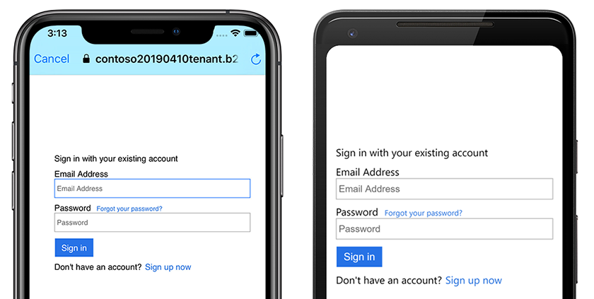
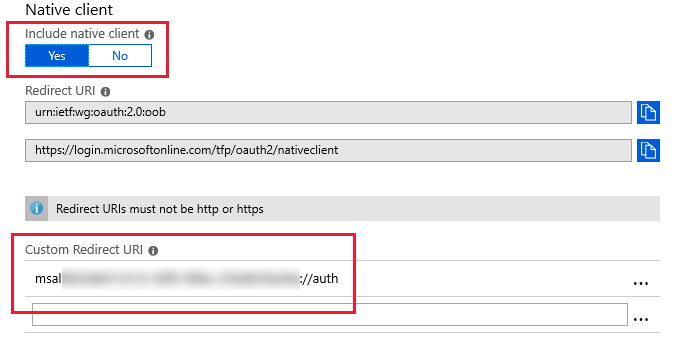
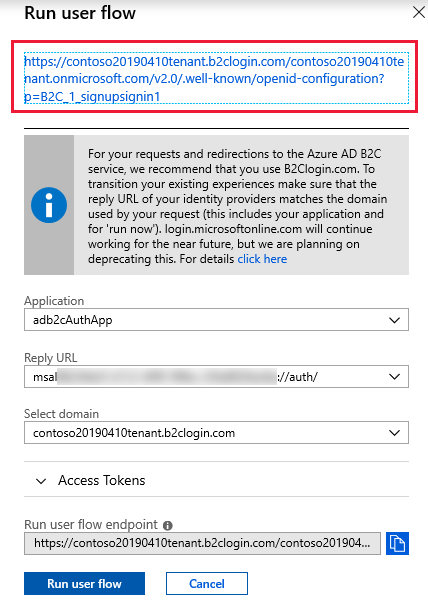
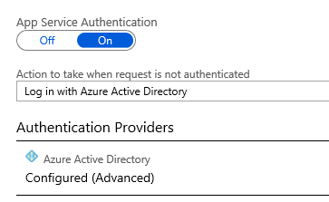
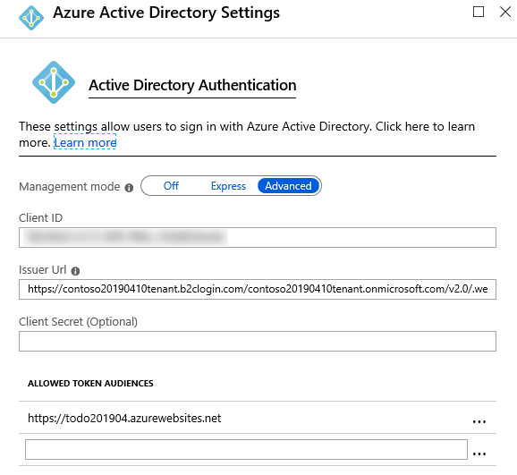
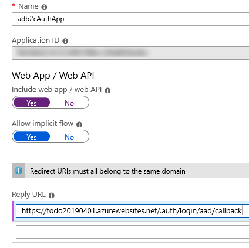
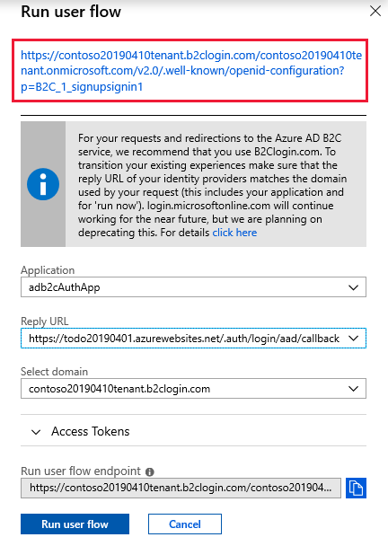

# Integrating Azure Active Directory B2C with Azure Mobile Apps

[ Download the sample](https://developer.xamarin.com/samples/xamarin-forms/WebServices/TodoAzureAuthADB2CClientFlow/)

_Azure Active Directory B2C provides cloud identity management for consumer-facing applications. This article explains how to use Azure Active Directory B2C to integrate identity management into an Azure Mobile Apps instance with Xamarin.Forms._

## Overview

Azure Mobile Apps allow you to develop applications with a scalable backend, hosted in Azure App Service. It supports mobile authentication, offline sync, and push notifications. For more information about Azure Mobile Apps, see [Consuming an Azure Mobile App](~/xamarin-forms/data-cloud/consuming/azure.md), and [Authenticating Users with Azure Mobile Apps](~/xamarin-forms/data-cloud/authentication/azure.md).

Azure Active Directory B2C is an identity management service for consumer-facing applications, that allows consumers to:

- Sign in with their existing social accounts (Microsoft, Google, Facebook, Amazon, LinkedIn).
- Create new credentials (email address and password, or username and password). These credentials are referred to as *local* accounts.

For more information about Azure Active Directory B2C, see [Authenticating Users with Azure Active Directory B2C](~/xamarin-forms/data-cloud/authentication/azure-ad-b2c.md).

Azure Active Directory B2C can be used to manage the authentication workflow for an Azure Mobile App. This approach configures identity management in the cloud and allows changes without modifying application code.


Azure Mobile Apps with Azure Active Directory B2C allows two authentication methods:

- [Client-managed](#client-managed-authentication) – the Xamarin.Forms mobile application starts the authentication process with the Azure Active Directory B2C tenant, and passes the received authentication token to the Azure Mobile Apps instance.
- [Server-managed](#server-managed-authentication) – the Azure Mobile Apps instance uses the Azure Active Directory B2C tenant to start the authentication process through a web-based workflow.

In both cases, the authentication experience is provided by the Azure Active Directory B2C tenant. In the sample application, the sign-in screen should look like the following screenshots:



This example shows sign in with a local account but you can also enable Microsoft, Google, Facebook, and other identity providers.

## Setup

In both workflows, the initial process for integrating an Azure Active Directory B2C tenant with Azure Mobile Apps is as follows:

1. Create an Azure Mobile Apps instance in the Azure portal. This generates an starting project similar to the sample project. For more information, see [Consuming an Azure Mobile App](~/xamarin-forms/data-cloud/consuming/azure.md).
1. Create an Azure Active Directory B2C tenant. For more information, see [Authenticating Users with Azure Active Directory B2C](~/xamarin-forms/data-cloud/authentication/azure-ad-b2c.md).
1. Enable authentication in the Azure Mobile Apps instance and the Xamarin.Forms application. For more information, see [Authenticating Users with Azure Mobile Apps](~/xamarin-forms/data-cloud/authentication/azure.md).

> [!NOTE]
> The Microsoft Authentication Library (MSAL) is required when using a client-managed authentication workflow. MSAL uses the device's web browser to authenticate. After authentication is completed in the browser, the user is redirected to a custom URL scheme. The application registers the custom URL scheme, allowing it to regain control of the user experience and respond to the authentication. For more information about using MSAL to communicate with an Azure Active Directory B2C tenant, see [Authenticating Users with Azure Active Directory B2C](~/xamarin-forms/data-cloud/authentication/azure-ad-b2c.md).

## Client-managed authentication

In client-managed authentication, a Xamarin.Forms application contacts an Azure Active Directory B2C tenant to start the authentication flow. After sign-on, the Azure Active Directory B2C tenant returns an identity token, which is provided to the Azure Mobile Apps instance. This allows the Xamarin.Forms application to perform actions that require authenticated user permissions.

### Azure Active Directory B2C client-managed tenant configuration

For a client-managed authentication workflow, the Azure Active Directory B2C tenant should be configured as follows:

- Set **Include native client** to "Yes".
- Set the Custom Redirect URI. The MSAL documentation recommends using "msal" combined with your App ID, and followed by "://auth/". For more information, see [MSAL client applications redirect URI](https://github.com/AzureAD/microsoft-authentication-library-for-dotnet/wiki/Client-Applications#redirect-uri).

The following screenshot demonstrates this configuration:

[](5-ad-b2c-mobile-app-images/azure-redirect-uri.png#lightbox "Azure Active Directory B2C configuration")

The sign-in policy used in the Azure Active Directory B2C tenant should also be configured so that the reply URL is set to the same custom URL scheme. This can be achieved by selecting **Run user flow** in the Azure portal to access the policy settings. Save the metadata URL found on this screen as you'll need it for the Mobile App configuration. The following screenshot demonstrates this configuration and the URL you should copy:

[](5-ad-b2c-mobile-app-images/client-flow-policies.png#lightbox "Azure Active Directory B2C policy configuration")

### Azure Mobile App configuration

For a client-managed authentication workflow, configure the Azure Mobile Apps instance as follows:

- App Service Authentication should be turned on.
- The action to take when a request isn't authenticated should be set to **Sign in with Azure Active Directory**.

The following screenshot demonstrates this configuration:

[](5-ad-b2c-mobile-app-images/ama-config.png#lightbox "Azure Mobile Apps authentication configuration")

Configure the Azure Mobile Apps instance to communicate with the Azure Active Directory B2C tenant:

- Click on Azure Active Directory configuration and enable **Advanced** mode for the Azure Active Directory authentication provider.
- Set **Client ID** to the **Application ID** of the Azure Active Directory B2C tenant.
- Set the **Issuer Url** to the policy's metadata URL that you copied previously during tenant configuration.

The following screenshot demonstrates this configuration:



### Signing in

The following code example shows key method calls for starting a client-managed authentication workflow:

```csharp
public async Task<bool> LoginAsync(bool useSilent = false)
{
    ...

    authenticationResult = await ADB2CClient.AcquireTokenAsync(
        Constants.Scopes,
        string.Empty,
        UIBehavior.SelectAccount,
        string.Empty,
        App.UiParent);

    ...

    var payload = new JObject();
    if (authenticationResult != null && !string.IsNullOrWhiteSpace(authenticationResult.AccessToken))
    {
        payload["access_token"] = authenticationResult.AccessToken;
    }

    User = await TodoItemManager.DefaultManager.CurrentClient.LoginAsync(
        MobileServiceAuthenticationProvider.WindowsAzureActiveDirectory,
        payload);
    success = true;

    ...
}
```

The Microsoft Authentication Library (MSAL) is used to start an authentication workflow with the Azure Active Directory B2C tenant. The `AcquireTokenAsync` method launches the device's web browser and displays authentication options defined in the Azure Active Directory B2C policy that's specified by the policy referenced through the `Constants.AuthoritySignin` constant. This policy defines the user's sign-in and sign-up experience, and the claims the application receives upon successful authentication.

The result of the `AcquireTokenAsync` method call is an `AuthenticationResult` instance. If authentication is successful, the `AuthenticationResult` instance will contain an access token, which will be cached locally. If authentication is unsuccessful, the `AuthenticationResult` instance will contain data that indicates why authentication failed. For information on how to use MSAL to communicate with an Azure Active Directory B2C tenant, see [Authenticating Users with Azure Active Directory B2C](~/xamarin-forms/data-cloud/authentication/azure-ad-b2c.md).

When the `CurrentClient.LoginAsync` method is invoked, the Azure Mobile Apps instance receives the access token wrapped in a `JObject`. The presence of a valid token means that the Azure Mobile Apps instance doesn't need to start its own OAuth 2.0 authentication flow. Instead, the `CurrentClient.LoginAsync` method returns a `MobileServiceUser` instance that will be stored in the `MobileServiceClient.CurrentUser` property. This property provides `UserId` and `MobileServiceAuthenticationToken` properties. These represent the authenticated user and token, which can be used until it expires. The authentication token will be included in all requests made to the Azure Mobile Apps instance, allowing the Xamarin.Forms application to perform actions that require authenticated user permissions.

### Signing out

The following code example shows how the client-managed sign-out process is invoked:

```csharp
public async Task<bool> LogoutAsync()
{
    ...

    IEnumerable<IAccount> accounts = await ADB2CClient.GetAccountsAsync();
    while (accounts.Any())
    {
        await ADB2CClient.RemoveAsync(accounts.First());
        accounts = await ADB2CClient.GetAccountsAsync();
    }
    User = null;

    ...
}
```

The `CurrentClient.LogoutAsync` method de-authenticates the user with the Azure Mobile Apps instance, and then all authentication tokens are cleared from the local cache created by MSAL.

## Server-managed authentication

In server-managed authentication, a Xamarin.Forms application contacts an Azure Mobile Apps instance, which uses the Azure Active Directory B2C tenant to manage the OAuth 2.0 authentication flow by displaying a sign-in page as defined in the B2C policy. Following successful sign-on, the Azure Mobile Apps instance returns a token that allows the Xamarin.Forms application to perform actions that require authenticated user permissions.

### Azure Active Directory B2C server-managed tenant configuration

For a server-managed authentication workflow, the Azure Active Directory B2C tenant should be configured as follows:

- Include a web app/web API, and allow the implicit flow.
- Set the Reply URL to the address of the Azure Mobile App, followed by `/.auth/login/aad/callback`.

The following screenshot demonstrates this configuration:

[](5-ad-b2c-mobile-app-images/server-flow-config.png#lightbox "Azure Active Directory B2C configuration")

The policy used in the Azure Active Directory B2C tenant needs to have the Reply URL configured. This is achieved by setting the Reply URL to the address of your Azure Mobile App, followed by `/.auth/login/aad/callback`. You should also save the metadata URL found at the top of this screen as you'll need it for the Mobile App configuration. The following screenshot demonstrates this configuration and the metadata URL you should save:



### Azure Mobile Apps instance configuration

For a server-managed authentication workflow, the Azure Mobile Apps instance should be configured as follows:

- App Service Authentication should be turned on.
- The action to take when a request isn't authenticated should be set to **Sign in with Azure Active Directory**.

The following screenshot demonstrates this configuration:

[](5-ad-b2c-mobile-app-images/ama-config.png#lightbox "Azure Mobile Apps authentication configuration")

The Azure Mobile Apps instance should also be configured to communicate with the Azure Active Directory B2C tenant:

- Click on Azure Active Directory configuration and enable **Advanced** mode for the Azure Active Directory authentication provider.
- Set **Client ID** to the **Application ID** of the Azure Active Directory B2C tenant.
- The **Issuer Url** is the policy's metadata URL that you copied previously during tenant configuration.

The following screenshot demonstrates this configuration:


### Signing in

The following code example shows how to start a server-managed authentication workflow:

```csharp
public async Task<bool> AuthenticateAsync()
{
    ...

    MobileServiceUser user = await TodoItemManager.DefaultManager.CurrentClient.LoginAsync(
        MobileServiceAuthenticationProvider.WindowsAzureActiveDirectory,
        Constants.URLScheme);

    ...
}
```

When the `CurrentClient.LoginAsync` method is invoked, the Azure Mobile Apps instance executes the linked Azure Active Directory B2C policy, which starts the OAuth 2.0 authentication flow. Each `AuthenticateAsync` method is platform-specific. However, each `AuthenticateAsync` method calls the `CurrentClient.LoginAsync` method and specifies that an Azure Active Directory tenant will be used in the authentication process. For more information, see [Logging in Users](~/xamarin-forms/data-cloud/authentication/azure.md#logging-in).

The `CurrentClient.LoginAsync` method returns a `MobileServiceUser` instance that will be stored in the `CurrentClient.CurrentUser` property. This property provides `UserId` and `MobileServiceAuthenticationToken` properties. These represent the authenticated user and an authentication token for the user, which can be used until it expires. The authentication token will be included in all requests made to the Azure Mobile Apps instance, allowing the Xamarin.Forms application to perform actions on the Azure Mobile Apps instance that require authenticated user permissions.

### Signing out

The following code example shows how the server-managed sign-out process is invoked:

```csharp
public async Task<bool> LogoutAsync()
{
    ...

    await TodoItemManager.DefaultManager.CurrentClient.LogoutAsync();

    ...
}
```

The `MobileServiceClient.LogoutAsync` method de-authenticates the user with the Azure Mobile Apps instance. For more information, see [Logging Out Users](~/xamarin-forms/data-cloud/authentication/azure.md#logging-out).


## Related links

- [TodoAzureAuth ClientFlow (sample)](https://developer.xamarin.com/samples/xamarin-forms/WebServices/TodoAzureAuthADB2CClientFlow/)
- [TodoAzureAuth ServerFlow (sample)](https://developer.xamarin.com/samples/xamarin-forms/WebServices/TodoAzureAuthADB2CServerFlow/)
- [Consuming an Azure Mobile App](~/xamarin-forms/data-cloud/consuming/azure.md)
- [Authenticating Users with Azure Mobile Apps](~/xamarin-forms/data-cloud/authentication/azure.md)
- [Authenticating Users with Azure Active Directory B2C](~/xamarin-forms/data-cloud/authentication/azure-ad-b2c.md)
- [Microsoft Authentication Library nuget package](https://www.nuget.org/packages/Microsoft.Identity.Client)
- [Microsoft Authentication Library documentation](https://github.com/AzureAD/microsoft-authentication-library-for-dotnet/wiki)
