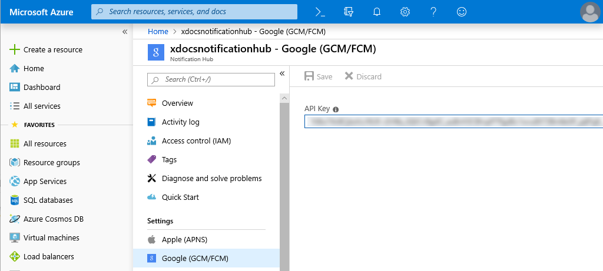
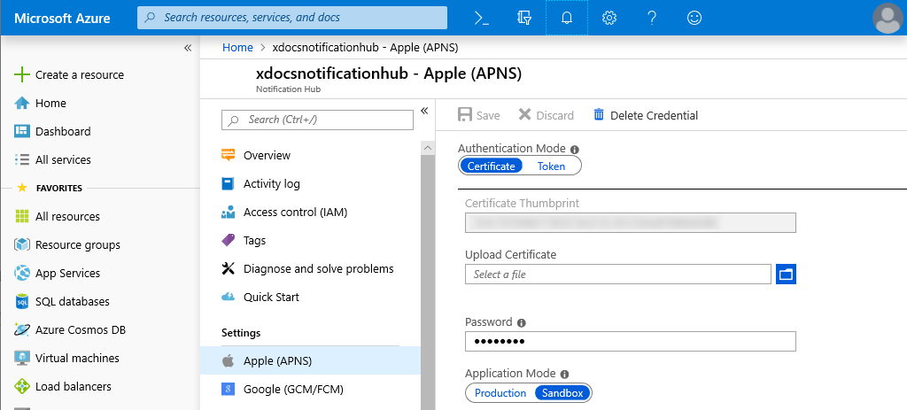
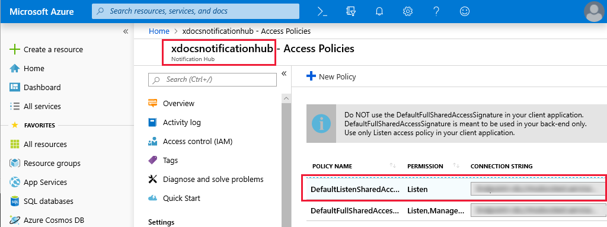
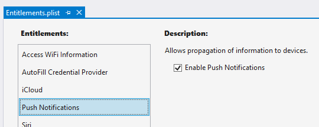
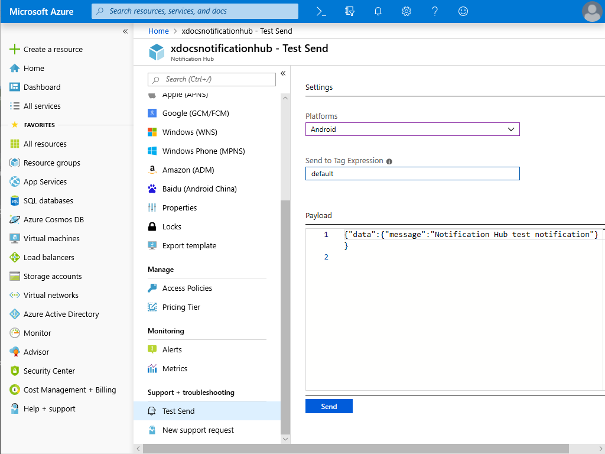
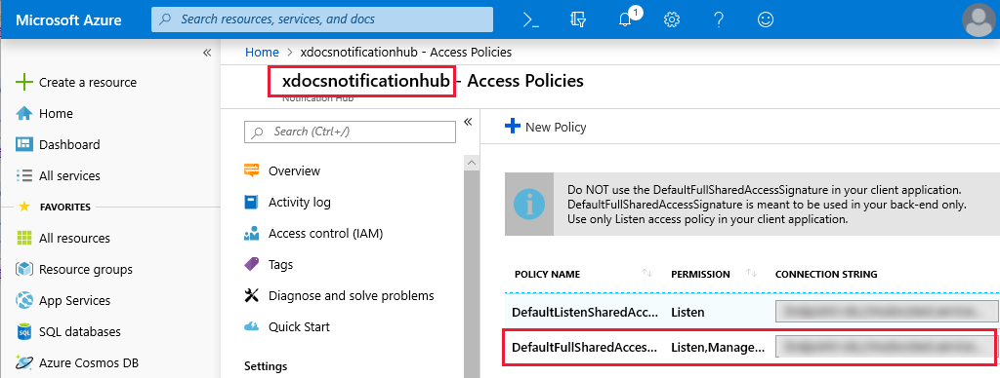

# Send and receive push notifications with Azure Notification Hubs and Xamarin.Forms

[Download the sample](/samples/xamarin/xamarin-forms-samples/webservices-azurenotificationhub/)

Push notifications deliver information from a backend system to a mobile application. Apple, Google, and other platforms each have their own Push Notification Service (PNS). Azure Notification Hubs enable you to centralize notifications across platforms so your backend application can communicate with a single hub, which takes care of distributing the notifications to each platform-specific PNS.

Integrate Azure Notification Hubs into mobile apps by following these steps:

1. [Set up Push Notification Services and Azure Notification Hub](#set-up-push-notification-services-and-azure-notification-hub).
1. [Understand how to use templates and tags](#register-templates-and-tags-with-the-azure-notification-hub).
1. [Create a cross-platform Xamarin.Forms application](#xamarinforms-application-functionality).
1. [Configure the native Android project for push notifications](#configure-the-android-application-for-notifications).
1. [Configure the native iOS project for push notifications](#configure-ios-for-notifications).
1. [Test notifications using the Azure Notification Hub](#test-notifications-in-the-azure-portal).
1. [Create a backend application to send notifications](#create-a-notification-dispatcher).

> [!NOTE]
> If you don't have an [Azure subscription](/azure/guides/developer/azure-developer-guide#understanding-accounts-subscriptions-and-billing), create a [free account](https://aka.ms/azfree-docs-mobileapps) before you begin.

## Set up Push Notification Services and Azure Notification Hub

Integrating Azure Notification Hubs with a Xamarin.Forms mobile app is similar to integrating Azure Notification Hubs with a Xamarin native application. Set up a Firebase Cloud Messaging (FCM) application by following the Firebase console steps in [Push notifications to Xamarin.Android using Azure Notification Hubs](/azure/notification-hubs/xamarin-notification-hubs-push-notifications-android-gcm#create-a-firebase-project-and-enable-firebase-cloud-messaging). Complete the following steps using the Xamarin.Android tutorial:

1. Define an Android package name such as `com.xamarin.notifysample`, which is used in the sample.
1. Download `google-services.json` from the Firebase console. You'll add this file to your Android application in a future step.
1. Create an Azure Notification Hub instance and give it a name. This article and sample use `xdocsnotificationhub` as the hub name.
1. Copy the FCM **Server Key** and save it as the **API Key** under **Google (GCM/FCM)** in your Azure Notification Hub.

The following screenshot shows the Google platform configuration in the Azure Notification Hub:



You will need a macOS machine to complete the setup for iOS devices. Set up Apple Push Notification Services (APNS) by following the initial steps in [Push notifications to Xamarin.iOS using Azure Notification Hubs](/azure/notification-hubs/xamarin-notification-hubs-ios-push-notification-apns-get-started#generate-the-certificate-signing-request-file). Complete the following steps using the Xamarin.iOS tutorial:

1. Define an iOS bundle identifier. This article and sample use `com.xamarin.notifysample` as the bundle identifier.
1. Create a Certificate Signing Request (CSR) file and use it to generate a push notification certificate.
1. Upload the push notification certificate under **Apple (APNS)** in your Azure Notification Hub.

The following screenshot shows the Apple platform configuration in the Azure Notification Hub:



## Register templates and tags with the Azure Notification Hub

Azure Notification Hub requires mobile applications to register with the hub, define templates and subscribe to tags. Registration links a platform-specific PNS handle to an identifier in the Azure Notification Hub. To learn more about registrations, see [Registration Management](/azure/notification-hubs/notification-hubs-push-notification-registration-management).

Templates allow devices to specify parameterized message templates. Incoming messages can be customized per device, per tag. To learn more about templates, see [Templates](/azure/notification-hubs/notification-hubs-templates-cross-platform-push-messages).

Tags can be used to subscribe to message categories such as news, sports, and weather. For simplicity, the sample application defines a default template with a single parameter called `messageParam` and a single tag called `default`. In more complex systems, user-specific tags can be used to message a user across devices for personalized notifications. To learn more about tags, see [Routing and tag expressions](/azure/notification-hubs/notification-hubs-tags-segment-push-message).

To successfully receive messages, each native application must perform these steps:

1. Obtain a PNS Handle or token from the platform PNS.
1. Register the PNS Handle with Azure Notification Hub.
1. Specify a template that contains the same parameters as outgoing messages.
1. Subscribe to the tag targeted by outgoing messages.

These steps are described in further detail for each platform in the [Configure the Android application for notifications](#configure-the-android-application-for-notifications) and [Configure iOS for notifications](#configure-ios-for-notifications) sections.

## Xamarin.Forms application functionality

The sample Xamarin.Forms application displays a list of push notification messages. This is achieved with the `AddMessage` method, which adds the specified push notification message to the UI. This method also prevents duplicate messages from being added to the UI, and runs on the main thread so it can be called from any thread. The following code shows the `AddMessage` method:

```csharp
public void AddMessage(string message)
{
    Device.BeginInvokeOnMainThread(() =>
    {
        if (messageDisplay.Children.OfType<Label>().Where(c => c.Text == message).Any())
        {
            // Do nothing, an identical message already exists
        }
        else
        {
            Label label = new Label()
            {
                Text = message,
                HorizontalOptions = LayoutOptions.CenterAndExpand,
                VerticalOptions = LayoutOptions.Start
            };
            messageDisplay.Children.Add(label);
        }
    });
}
```

The sample application contains a `AppConstants.cs` file, which defines properties used by the platform projects. This file needs to be customized with values from your Azure Notification Hub. The following code shows the `AppConstants.cs` file:

```csharp
public static class AppConstants
{
    public static string NotificationChannelName { get; set; } = "XamarinNotifyChannel";
    public static string NotificationHubName { get; set; } = "< Insert your Azure Notification Hub name >";
    public static string ListenConnectionString { get; set; } = "< Insert your DefaultListenSharedAccessSignature >";
    public static string DebugTag { get; set; } = "XamarinNotify";
    public static string[] SubscriptionTags { get; set; } = { "default" };
    public static string FCMTemplateBody { get; set; } = "{\"data\":{\"message\":\"$(messageParam)\"}}";
    public static string APNTemplateBody { get; set; } = "{\"aps\":{\"alert\":\"$(messageParam)\"}}";
}
```

Customize the following values in `AppConstants` to connect the sample application to your Azure Notification Hub:

* `NotificationHubName`: Use the name of the Azure Notification Hub you created in your Azure portal.
* `ListenConnectionString`: This value is found in the Azure Notification Hub under **Access Policies**.

The following screenshot shows where these values are located in the Azure portal:



## Configure the Android application for notifications

Complete the following steps to configure the Android application to receive and process notifications:

1. Configure the Android **Package name** to match the package name in the Firebase console.
1. Install the following NuGet packages to interact with Google Play, Firebase and Azure Notification Hubs:
    1. `Xamarin.GooglePlayServices.Base`
    1. `Xamarin.Firebase.Messaging`
    1. `Xamarin.Azure.NotificationHubs.Android`
1. Copy the `google-services.json` file that you downloaded during FCM setup to the project and set the Build Action to `GoogleServicesJson`.
1. [Configure](#configure-android-manifest) `AndroidManifest.xml` to communicate with Firebase.
1. [Override](#override-firebasemessagingservice-to-handle-messages) `FirebaseMessagingService` to handle messages.
1. [Add](#add-incoming-notifications-to-the-xamarinforms-ui) incoming notifications to Xamarin.Forms UI.

The `GoogleServicesJson` build action is part of the `Xamarin.GooglePlayServices.Base` NuGet package. Visual Studio 2019 sets the available Build Actions during startup. If you do not see `GoogleServicesJson` as a Build Action, restart Visual Studio 2019 after installing the NuGet packages.

> [!IMPORTANT]
> Delivery of push notifications while the app is asleep now requires the use of AndroidX. For information about migrating to AndroidX, see [AndroidX migration in Xamarin.Forms](~/xamarin-forms/platform/android/androidx-migration.md).

### Configure Android manifest

The `receiver` elements within the `application` element allow the app to communicate with Firebase. The `uses-permission` elements allow the app to handle messages and register with Azure Notification Hub. The complete `AndroidManifest.xml` should look similar to the example below:

```xml
<manifest xmlns:android="http://schemas.android.com/apk/res/android" android:versionCode="1" android:versionName="1.0" package="YOUR_PACKAGE_NAME" android:installLocation="auto">
  <uses-sdk android:minSdkVersion="21" />
  <uses-permission android:name="android.permission.INTERNET" />
  <uses-permission android:name="com.google.android.c2dm.permission.RECEIVE" />
  <uses-permission android:name="android.permission.WAKE_LOCK" />
  <uses-permission android:name="android.permission.GET_ACCOUNTS"/>
  <application android:label="Notification Hub Sample">
    <receiver android:name="com.google.firebase.iid.FirebaseInstanceIdInternalReceiver" android:exported="false" />
    <receiver android:name="com.google.firebase.iid.FirebaseInstanceIdReceiver" android:exported="true" android:permission="com.google.android.c2dm.permission.SEND">
      <intent-filter>
        <action android:name="com.google.android.c2dm.intent.RECEIVE" />
        <action android:name="com.google.android.c2dm.intent.REGISTRATION" />
        <category android:name="${applicationId}" />
      </intent-filter>
    </receiver>
  </application>
</manifest>
```

### Override `FirebaseMessagingService` to handle messages

To register with Firebase and handle messages, subclass the `FirebaseMessagingService` class. The sample application defines a `FirebaseService` class that subclasses the `FirebaseMessagingService`. This class is tagged with an `IntentFilter` attribute, which includes the `com.google.firebase.MESSAGING_EVENT` filter. This filter allows Android to pass incoming messages to this class for handling:

```csharp
[Service]
[IntentFilter(new[] { "com.google.firebase.MESSAGING_EVENT" })]
public class FirebaseService : FirebaseMessagingService
{
    // ...
}

```

When the application is started, the Firebase SDK will automatically request a unique token identifier from the Firebase server. Upon successful request, the `OnNewToken` method will be called on the `FirebaseService` class. The sample project overrides this method and registers the token with Azure Notification Hubs:

```csharp
public override void OnNewToken(string token)
{
    // NOTE: save token instance locally, or log if desired

    SendRegistrationToServer(token);
}

void SendRegistrationToServer(string token)
{
    try
    {
        NotificationHub hub = new NotificationHub(AppConstants.NotificationHubName, AppConstants.ListenConnectionString, this);

        // register device with Azure Notification Hub using the token from FCM
        Registration registration = hub.Register(token, AppConstants.SubscriptionTags);

        // subscribe to the SubscriptionTags list with a simple template.
        string pnsHandle = registration.PNSHandle;
        TemplateRegistration templateReg = hub.RegisterTemplate(pnsHandle, "defaultTemplate", AppConstants.FCMTemplateBody, AppConstants.SubscriptionTags);
    }
    catch (Exception e)
    {
        Log.Error(AppConstants.DebugTag, $"Error registering device: {e.Message}");
    }
}
```

The `SendRegistrationToServer` method registers the device with the Azure Notification Hub and subscribes to tags with a template. The sample application defines a single tag called `default` and a template with a single parameter called `messageParam` in the `AppConstants.cs` file. For more information about registration, tags, and templates, see [Register templates and tags with the Azure Notification Hub](#register-templates-and-tags-with-the-azure-notification-hub).

When a message is received, the `OnMessageReceived` method will be called on the `FirebaseService` class:

```csharp
public override void OnMessageReceived(RemoteMessage message)
{
    base.OnMessageReceived(message);
    string messageBody = string.Empty;

    if (message.GetNotification() != null)
    {
        messageBody = message.GetNotification().Body;
    }

    // NOTE: test messages sent via the Azure portal will be received here
    else
    {
        messageBody = message.Data.Values.First();
    }

    // convert the incoming message to a local notification
    SendLocalNotification(messageBody);

    // send the incoming message directly to the MainPage
    SendMessageToMainPage(messageBody);
}

void SendLocalNotification(string body)
{
    var intent = new Intent(this, typeof(MainActivity));
    intent.AddFlags(ActivityFlags.ClearTop);
    intent.PutExtra("message", body);

    //Unique request code to avoid PendingIntent collision.
    var requestCode = new Random().Next();
    var pendingIntent = PendingIntent.GetActivity(this, requestCode, intent, PendingIntentFlags.OneShot);

    var notificationBuilder = new NotificationCompat.Builder(this, AppConstants.NotificationChannelName)
        .SetContentTitle("XamarinNotify Message")
        .SetSmallIcon(Resource.Drawable.ic_launcher)
        .SetContentText(body)
        .SetAutoCancel(true)
        .SetShowWhen(false)
        .SetContentIntent(pendingIntent);

    if (Build.VERSION.SdkInt >= BuildVersionCodes.O)
    {
        notificationBuilder.SetChannelId(AppConstants.NotificationChannelName);
    }

    var notificationManager = NotificationManager.FromContext(this);
    notificationManager.Notify(0, notificationBuilder.Build());
}

void SendMessageToMainPage(string body)
{
    (App.Current.MainPage as MainPage)?.AddMessage(body);
}
```

Incoming messages are converted to a local notification with the `SendLocalNotification` method. This method creates a new `Intent` and places the message content into the `Intent` as a `string` `Extra`. When the user taps the local notification, whether the app is in the foreground or the background, the `MainActivity` is launched and has access to the message contents through the `Intent` object.

The local notification and `Intent` example requires the user to take the action of tapping on the notification. This is desirable when the user should take action before the application state changes. However, you may want to access the message data without requiring a user action in some cases. The previous example also sends the message directly to the current `MainPage` instance with the `SendMessageToMainPage` method. In production, if you implement both methods for a single message type, the `MainPage` object will get duplicate messages if the user taps the notification.

### Add incoming notifications to the Xamarin.Forms UI

The `MainActivity` class needs to obtain permission to handle notifications and manage incoming message data. The following code shows the complete `MainActivity` implementation:

```csharp
[Activity(Label = "NotificationHubSample", Icon = "@mipmap/icon", Theme = "@style/MainTheme", MainLauncher = true, ConfigurationChanges = ConfigChanges.ScreenSize | ConfigChanges.Orientation, LaunchMode = LaunchMode.SingleTop)]
public class MainActivity : global::Xamarin.Forms.Platform.Android.FormsAppCompatActivity
{
    protected override void OnCreate(Bundle savedInstanceState)
    {
        TabLayoutResource = Resource.Layout.Tabbar;
        ToolbarResource = Resource.Layout.Toolbar;

        base.OnCreate(savedInstanceState);

        global::Xamarin.Forms.Forms.Init(this, savedInstanceState);
        LoadApplication(new App());

        if (!IsPlayServiceAvailable())
        {
            throw new Exception("This device does not have Google Play Services and cannot receive push notifications.");
        }

        CreateNotificationChannel();
    }

    protected override void OnNewIntent(Intent intent)
    {
        if (intent.Extras != null)
        {
            var message = intent.GetStringExtra("message");
            (App.Current.MainPage as MainPage)?.AddMessage(message);
        }

        base.OnNewIntent(intent);
    }

    bool IsPlayServiceAvailable()
    {
        int resultCode = GoogleApiAvailability.Instance.IsGooglePlayServicesAvailable(this);
        if (resultCode != ConnectionResult.Success)
        {
            if (GoogleApiAvailability.Instance.IsUserResolvableError(resultCode))
                Log.Debug(AppConstants.DebugTag, GoogleApiAvailability.Instance.GetErrorString(resultCode));
            else
            {
                Log.Debug(AppConstants.DebugTag, "This device is not supported");
            }
            return false;
        }
        return true;
    }

    void CreateNotificationChannel()
    {
        // Notification channels are new as of "Oreo".
        // There is no need to create a notification channel on older versions of Android.
        if (Build.VERSION.SdkInt >= BuildVersionCodes.O)
        {
            var channelName = AppConstants.NotificationChannelName;
            var channelDescription = String.Empty;
            var channel = new NotificationChannel(channelName, channelName, NotificationImportance.Default)
            {
                Description = channelDescription
            };

            var notificationManager = (NotificationManager)GetSystemService(NotificationService);
            notificationManager.CreateNotificationChannel(channel);
        }
    }
}
```

The `Activity` attribute sets the application `LaunchMode` to `SingleTop`. This launch mode tells the Android OS to only allow a single instance of this activity. With this launch mode, incoming `Intent` data is routed to the `OnNewIntent` method, which extracts message data and sends it to the `MainPage` instance through the `AddMessage` method. If your application uses a different launch mode, it must handle `Intent` data differently.

The `OnCreate` method uses a helper method called `IsPlayServiceAvailable` to ensure the device supports Google Play Service. Emulators or devices that do not support Google Play Service cannot receive push notifications from Firebase.

## Configure iOS for notifications

The process for configuring the iOS application to receive notifications is:

1. Configure the **Bundle Identifier** in the `Info.plist` file to match the value used in the provisioning profile.
1. Add the **Enable Push Notifications** option to the `Entitlements.plist` file.
1. Add the `Xamarin.Azure.NotificationHubs.iOS` NuGet package to your project.
1. [Register](#register-for-notifications-with-apns) for notifications with APNS.
1. [Register](#register-with-azure-notification-hub-and-subscribe-to-tags) the application with Azure Notification Hub and subscribe to tags.
1. [Add](#add-apns-notifications-to-xamarinforms-ui) APNS notifications to Xamarin.Forms UI.

The following screenshot shows the **Enable Push Notifications** option selected in the `Entitlements.plist` file within Visual Studio:



### Register for notifications with APNS

The `FinishedLaunching` method in the `AppDelegate.cs` file must be overridden to register for remote notifications. Registration differs depending on the iOS version being used on the device. The iOS project in the sample application overrides the `FinishedLaunching` method to call `RegisterForRemoteNotifications` as shown in the following example:

```csharp
public override bool FinishedLaunching(UIApplication app, NSDictionary options)
{
    global::Xamarin.Forms.Forms.Init();
    LoadApplication(new App());

    base.FinishedLaunching(app, options);

    RegisterForRemoteNotifications();

    return true;
}

void RegisterForRemoteNotifications()
{
    // register for remote notifications based on system version
    if (UIDevice.CurrentDevice.CheckSystemVersion(10, 0))
    {
        UNUserNotificationCenter.Current.RequestAuthorization(UNAuthorizationOptions.Alert |
            UNAuthorizationOptions.Badge |
            UNAuthorizationOptions.Sound,
            (granted, error) =>
            {
                if (granted)
                    InvokeOnMainThread(UIApplication.SharedApplication.RegisterForRemoteNotifications);
            });
    }
    else if (UIDevice.CurrentDevice.CheckSystemVersion(8, 0))
    {
        var pushSettings = UIUserNotificationSettings.GetSettingsForTypes(
        UIUserNotificationType.Alert | UIUserNotificationType.Badge | UIUserNotificationType.Sound,
        new NSSet());

        UIApplication.SharedApplication.RegisterUserNotificationSettings(pushSettings);
        UIApplication.SharedApplication.RegisterForRemoteNotifications();
    }
    else
    {
        UIRemoteNotificationType notificationTypes = UIRemoteNotificationType.Alert | UIRemoteNotificationType.Badge | UIRemoteNotificationType.Sound;
        UIApplication.SharedApplication.RegisterForRemoteNotificationTypes(notificationTypes);
    }
}
```

### Register with Azure Notification Hub and subscribe to tags

When the device has successfully registered for remote notifications during the `FinishedLaunching` method, iOS will call the `RegisteredForRemoteNotifications` method. This method should be overridden to perform the following actions:

1. Instantiate the `SBNotificationHub`.
1. Unregister any existing registrations.
1. Register the device with your notification hub.
1. Subscribe to specific tags with a template.

For more information about registration of the device, templates, and tags, see [Register templates and tags with the Azure Notification Hub](#register-templates-and-tags-with-the-azure-notification-hub). The following code demonstrates registration of the device and templates:

```csharp
public override void RegisteredForRemoteNotifications(UIApplication application, NSData deviceToken)
{
    Hub = new SBNotificationHub(AppConstants.ListenConnectionString, AppConstants.NotificationHubName);

    // update registration with Azure Notification Hub
    Hub.UnregisterAll(deviceToken, (error) =>
    {
        if (error != null)
        {
            Debug.WriteLine($"Unable to call unregister {error}");
            return;
        }

        var tags = new NSSet(AppConstants.SubscriptionTags.ToArray());
        Hub.RegisterNative(deviceToken, tags, (errorCallback) =>
        {
            if (errorCallback != null)
            {
                Debug.WriteLine($"RegisterNativeAsync error: {errorCallback}");
            }
        });

        var templateExpiration = DateTime.Now.AddDays(120).ToString(System.Globalization.CultureInfo.CreateSpecificCulture("en-US"));
        Hub.RegisterTemplate(deviceToken, "defaultTemplate", AppConstants.APNTemplateBody, templateExpiration, tags, (errorCallback) =>
        {
            if (errorCallback != null)
            {
                Debug.WriteLine($"RegisterTemplateAsync error: {errorCallback}");
            }
        });
    });
}
```

> [!NOTE]
> Registering for remote notifications can fail in situations such as no network connection. You can choose to override the `FailedToRegisterForRemoteNotifications` method to handle registration failure.

### Add APNS notifications to Xamarin.Forms UI

When a device receives a remote notification, iOS calls the `ReceivedRemoteNotification` method. Incoming message JSON is converted into an `NSDictionary` object, and the `ProcessNotification` method extracts values from the dictionary and sends them to the Xamarin.Forms `MainPage` instance. The `ReceivedRemoteNotifications` method is overridden to call `ProcessNotification` as shown in the following code:

```csharp
public override void ReceivedRemoteNotification(UIApplication application, NSDictionary userInfo)
{
    ProcessNotification(userInfo, false);
}

void ProcessNotification(NSDictionary options, bool fromFinishedLaunching)
{
    // make sure we have a payload
    if (options != null && options.ContainsKey(new NSString("aps")))
    {
        // get the APS dictionary and extract message payload. Message JSON will be converted
        // into a NSDictionary so more complex payloads may require more processing
        NSDictionary aps = options.ObjectForKey(new NSString("aps")) as NSDictionary;
        string payload = string.Empty;
        NSString payloadKey = new NSString("alert");
        if (aps.ContainsKey(payloadKey))
        {
            payload = aps[payloadKey].ToString();
        }

        if (!string.IsNullOrWhiteSpace(payload))
        {
            (App.Current.MainPage as MainPage)?.AddMessage(payload);
        }

    }
    else
    {
        Debug.WriteLine($"Received request to process notification but there was no payload.");
    }
}
```

## Test notifications in the Azure portal

Azure Notification Hubs enable you to check that your application can receive test messages. The **Test Send** section in the notification hub allows you to choose the target platform and send a message. Setting the **Send to Tag expression** to `default` will send messages to applications that have registered a template for the `default` tag. Clicking the **Send** button generates a report that includes the number of devices reached with the message. The following screenshot shows an Android notification test in the Azure portal:



### Testing tips

1. When testing that an application can receive push notifications, you must use a physical device. Android and iOS virtual devices may not be configured correctly to receive push notifications.
1. The sample Android application registers its token and templates once when the Firebase token is issued. During testing you may need to request a new token and re-register with the Azure Notification Hub. The best way to force this is to clean your project, delete the `bin` and `obj` folders and uninstall the application from the device before rebuilding and deploying.
1. Many parts of the push notification flow are executed asynchronously. This may result in breakpoints not being hit or being hit in an unexpected order. Use device or debug logging to trace execution without interrupting application flow. Filter the Android device log using the `DebugTag` specified in `Constants`.
1. When debugging is stopped in Visual Studio, the app is force closed. Any message receivers or other services launched as part of the debugging process will be closed and will not respond to message events.

## Create a notification dispatcher

Azure Notification Hubs enable your backend application to dispatch notifications to devices across platforms. The sample demonstrates notification dispatch with a console application. The application includes the `DispatcherConstants.cs` file, which defines the following properties:

```csharp
public static class DispatcherConstants
{
    public static string[] SubscriptionTags { get; set; } = { "default" };
    public static string NotificationHubName { get; set; } = "< Insert your Azure Notification Hub name >";
    public static string FullAccessConnectionString { get; set; } = "< Insert your DefaultFullSharedAccessSignature >";
}
```

You must configure the `DispatcherConstants.cs` file to match your Azure Notification Hub configuration. The value of the `SubscriptionTags` property should match the values used in the client apps. The `NotificationHubName` property is the name of your Azure Notification Hub instance. The `FullAccessConnectionString` property is the access key found in your notification hub **Access Policies**. The following screenshot shows the location of the `NotificationHubName` and `FullAccessConnectionString` properties in the Azure portal:



The console application loops through each `SubscriptionTags` value and sends notifications to subscribers using an instance of the `NotificationHubClient` class. The following code shows the console application `Program` class:

``` csharp
class Program
{
    static int messageCount = 0;

    static void Main(string[] args)
    {
        Console.WriteLine($"Press the spacebar to send a message to each tag in {string.Join(", ", DispatcherConstants.SubscriptionTags)}");
        WriteSeparator();
        while (Console.ReadKey().Key == ConsoleKey.Spacebar)
        {
            SendTemplateNotificationsAsync().GetAwaiter().GetResult();
        }
    }

    private static async Task SendTemplateNotificationsAsync()
    {
        NotificationHubClient hub = NotificationHubClient.CreateClientFromConnectionString(DispatcherConstants.FullAccessConnectionString, DispatcherConstants.NotificationHubName);
        Dictionary<string, string> templateParameters = new Dictionary<string, string>();

        messageCount++;

        // Send a template notification to each tag. This will go to any devices that
        // have subscribed to this tag with a template that includes "messageParam"
        // as a parameter
        foreach (var tag in DispatcherConstants.SubscriptionTags)
        {
            templateParameters["messageParam"] = $"Notification #{messageCount} to {tag} category subscribers!";
            try
            {
                await hub.SendTemplateNotificationAsync(templateParameters, tag);
                Console.WriteLine($"Sent message to {tag} subscribers.");
            }
            catch (Exception ex)
            {
                Console.WriteLine($"Failed to send template notification: {ex.Message}");
            }
        }

        Console.WriteLine($"Sent messages to {DispatcherConstants.SubscriptionTags.Length} tags.");
        WriteSeparator();
    }

    private static void WriteSeparator()
    {
        Console.WriteLine("==========================================================================");
    }
}
```

When the sample console application is run, the spacebar can be pressed to send messages. Devices running the client applications should receive numbered notifications, provided they are properly configured.

## Related links

* [Push Notification Templates](/azure/notification-hubs/notification-hubs-templates-cross-platform-push-messages).
* [Device Registration Management](/azure/notification-hubs/notification-hubs-push-notification-registration-management).
* [Routing and Tag Expressions](/azure/notification-hubs/notification-hubs-tags-segment-push-message).
* [Xamarin.Android Azure Notification Hubs Tutorial](/azure/notification-hubs/xamarin-notification-hubs-push-notifications-android-gcm).
* [Xamarin.iOS Azure Notification Hubs Tutorial](/azure/notification-hubs/xamarin-notification-hubs-ios-push-notification-apns-get-started).
