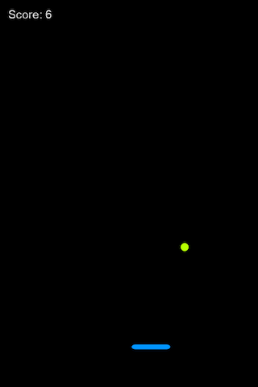
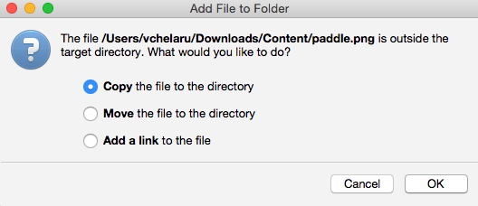
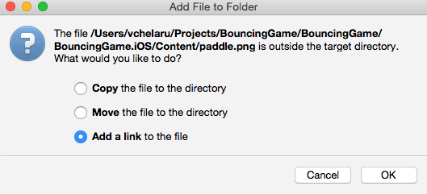
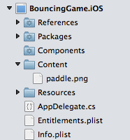
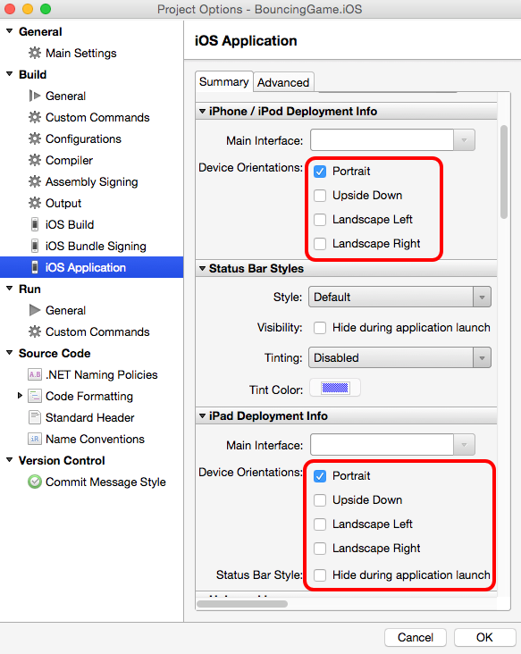

# BouncingGame details

> [!TIP]
> The code for BouncingGame can be found in the [Xamarin
> samples](https://developer.xamarin.com/samples/mobile/BouncingGame/). To
> best follow along with this guide, download and explore the code as the
> guide references it.

This walkthrough shows how to implement a simple bouncing ball game using
CocosSharp. 

 - Unzipping game content
 - Common CocosSharp visual elements
 - Adding visual elements to `GameLayer`
 - Implementing every-frame logic

Our finished game will look like this:



## Unzipping game content

Game developers often use the term *content* to refer to non-code files which are usually created by visual artists, game designers, or audio designers. Common types of content include files used to display visuals, play sound, or control artificial intelligence (AI) behavior. From a game development team’s perspective, content is usually created by non-programmers. Our game includes two types of content:

 - png files to define how the ball and paddle appear.
 - A single xnb file to define the font used by the score display (discussed in more detail when we add the score display below)

This content used here can be found in [content zip](https://github.com/xamarin/mobile-samples/blob/master/BouncingGame/Resources/Content.zip?raw=true). We’ll need these files downloaded and unzipped to a location that we will access later in this walkthrough.

## Common CocosSharp visual elements

CocosSharp provides a number of classes used to display visuals. Some elements are directly visible, while others are used for organization. We’ll use the following in the game:

 - `CCNode` – Base class for all visual objects in CocosSharp. The `CCNode` class contains an `AddChild` function which can be used to construct a parent/child hierarchy, also referred to as a *visual tree* or *scene graph*. All classes mentioned below inherit from `CCNode`.
 - `CCScene` – Root of the visual tree for all CocosSharp games. All visual elements must be part of a visual tree with a `CCScene` at the root, or they won’t be visible.
 - `CCLayer` – Container for visual objects, such as `CCSprite`. As the name implies, the `CCLayer` class is used to control how visual elements layer on top of each other.
 - `CCSprite` – Displays an image or a portion of an image. `CCSprite` instances can be positioned, resized, and provide a number of visual effects.
 - `CCLabel` – Displays a string on screen. The font used by `CCLabel` is defined in an xnb file. We’ll discuss xnbs in more detail below.

To understand how the different types are used we’ll consider a single `CCSprite`. Visual elements must be added to a `CCLayer`, and the visual tree must have a `CCScene` at its root. Therefore, the parent/child relationship for a single `CCSprite` would be `CCScene` > `CCLayer` > `CCSprite`.

## Adding visual elements to GameLayer

### Adding the paddle sprite

Initially we’ll set the game's background to black and also add a single `CCSprite` rendering on the screen. Modify the `GameLayer` class to add a `CCSprite` as follows:

```csharp
using System;
using System.Collections.Generic;
using CocosSharp;
namespace BouncingGame
{
    public class GameLayer : CCLayer
    {
        CCSprite paddleSprite;
        public GameLayer () : base(CCColor4B.Black)
        {
            // "paddle" refers to the paddle.png image
            paddleSprite = new CCSprite ("paddle");
            paddleSprite.PositionX = 100;
            paddleSprite.PositionY = 100;
            AddChild (paddleSprite);
        }
        protected override void AddedToScene ()
        {
            base.AddedToScene ();
            // Use the bounds to layout the positioning of the drawable assets
            CCRect bounds = VisibleBoundsWorldspace;
            // Register for touch events
            var touchListener = new CCEventListenerTouchAllAtOnce ();
            touchListener.OnTouchesEnded = OnTouchesEnded;
            AddEventListener (touchListener, this);
        }
        void OnTouchesEnded (List<CCTouch> touches, CCEvent touchEvent)
        {
            if (touches.Count > 0)
            {
                // Perform touch handling here
            }
        }
    }
}
```

The code above creates a single `CCSprite` and adds it as a child of the `GameLayer`. The `CCSprite` constructor allows us to define the image file to use as a string. Our code tells CocosSharp to look for a file called `paddle` (the extension is omitted, which we'll discuss later in this guide). CocosSharp will look for any file names `paddle` in the root content folder (which is **Content**) as well as any folders added to the `gameView.ContentManager.SearchPaths` (discussed in the previous section).

We'll add the files directly to the root **Content** folder for both iOS and Android. To do this, right-click or Control-click on the **Content** folder in the iOS project and select **Add** > **Add Files...** Navigate to where we unzipped the content earlier and select **paddle.png**. If asked about how to add the file to folder, we should select the **Copy** option:



Next, we'll add the file to the Android project. Right-click or Control-click on the Content folder (which is in the **Assets** folder on Android projects) and select **Add** > **Add Files...**. This time, navigate to the iOS project's **Content** folder. When asked about how to add the file, select the **Add a link** option:



We'll discuss why files had to be added to both projects below. Each project's **Content** folder now contain the **paddle.png** file:



If we run the game we’ll see the `CCSprite` being drawn:


### File details

So far we’ve added a single file to the project, and the process was fairly straight-forward. We simply added the **paddle.png** file to the **Content** folders and referenced it in code. Let’s take a moment to look at some considerations when working with files in CocosSharp.

#### Capitalization

Notice that the file name and the string we used in code to access the file are both lower-case. This is because some platforms (such as Windows desktop and iOS simulator) are case insensitive, while other platforms (such as Android and iOS device) are case sensitive. We will use all lower-case files for the remainder of this tutorial so that the files and code remain as cross-platform as possible.

#### Extensions

The constructor for creating the Sprite does not include the ".png" extension when referencing the paddle file. The extension for files is typically omitted when working on CocosSharp projects as file extensions for the same asset type may differ between platforms. For example, audio files may be of .aiff, .mp3, or .wma file formats depending on the platform. Leaving off the extension allows the same code to work on all platforms regardless of the file extension.

#### Content in platform-specific projects

Unlike most of the code files which can be in a PCL, content files must be added to each platform-specific project. CocosSharp requires this for two reasons:

1. Each platform has different **Build actions**. Content added to iOS projects should use the **BundleResource** build action. Content added to Android projects should use the **AndroidAsset** build action.
2. Some platforms require platform-specific file formats. For example, font .xnb files differ between iOS and Android, as we'll see later in this walkthrough.

If a file format does not differ between platforms (such as .png), then each platform can use the same file, where one or more platforms may link the file from the same location.

## Orientation

Just like any other app, CocosSharp apps can run in portrait or landscape orientations. We’ll adjust the game to run in portrait-only mode. First, we’ll change the resolution code in the game to handle a portrait aspect ratio. To do this, modify the `width` and `height` values in the `LoadGame` method in the `ViewController` class on iOS and `MainActivity` class on Android:

```csharp
void LoadGame (object sender, EventArgs e)
{
    CCGameView gameView = sender as CCGameView;

    if (gameView != null)
    {
        var contentSearchPaths = new List<string> () { "Fonts", "Sounds" };
        CCSizeI viewSize = gameView.ViewSize;

        int width = 768;
        int height = 1027;
    // ...
```

Next we’ll need to modify each platform-specific project to run in portrait mode.

### iOS orientation

To modify the iOS project’s orientation, Select the **Info.plist** file in the **BouncingGame.iOS** project, and change **iPhone/iPod Deployment Info** and the **iPad Deployment Info** to only include Portrait orientations:



### Android orientation

To modify the Android project’s orientation, open the MainActivity.cs file in the BouncingGame.Android project. Modify the Activity attribute definition so it specifies only a portrait orientation as follows:

```csharp
[Activity (
    Label = "BouncingGame.Android",
    AlwaysRetainTaskState = true,
    Icon = "@drawable/icon",
    Theme = "@android:style/Theme.NoTitleBar",
    ScreenOrientation = ScreenOrientation.Portrait,
    LaunchMode = LaunchMode.SingleInstance,
    MainLauncher = true,
    ConfigurationChanges = ConfigChanges.Orientation | ConfigChanges.ScreenSize | ConfigChanges.Keyboard | ConfigChanges.KeyboardHidden)
]
public class MainActivity : Activity
{ 
...
```

## Default coordinate system

Our code, which instantiates a `CCSprite`, sets the `PositionX` and `PositionY` values to 100. By default, this means that the `CCSprite` center will be positioned at 100 pixels up and to the right from the bottom-left of the screen. The coordinate system can be modified by attaching a `CCCamera` to the `CCLayer`. We won’t be working with `CCCamera` in this project, but more information on `CCCamera` can be found in the [CocosSharp API docs](https://developer.xamarin.com/api/type/CocosSharp.CCLayer/).

The 100 pixels mentioned above "game" pixels as opposed to pixels on the hardware. This means that running the same game on a device of a different resolution (such as an iPad vs. an iPhone) will result in objects being positioned and sized correctly relative to the physical screen. Specifically, the game’s visible area will always be 1024 pixels tall and 768 pixels wide, as this is the resolution we’ve specified earlier in the `LoadGame` method.

## Adding the ball sprite

Now that we’re familiar with the basics of working with `CCSprite`, we’ll add the second `CCSprite` – a ball. We’ll be following steps which are very similar to how we created the paddle `CCSprite`. 

First, we’ll add the **ball.png** image from the unzipped folder into the iOS project’s **Content** folder. Select to **Copy** the file to the **Content** directory. Follow the same steps as above to add a link to the **ball.png** file in the Android project.

Next create the `CCSprite` for this ball by adding a member called `ballSprite` to the `GameScene` class, as well as instantiation code for the `ballSprite`. When finished the `GameLayer` class will look like this:

```csharp
public class GameLayer : CCLayer
{
    CCSprite paddleSprite;
    CCSprite ballSprite;
    public GameLayer () : base (CCColor4B.Black)
    {
        // "paddle" refers to the paddle.png image
        paddleSprite = new CCSprite ("paddle");
        paddleSprite.PositionX = 100;
        paddleSprite.PositionY = 100;
        AddChild (paddleSprite);
        ballSprite = new CCSprite ("ball");
        ballSprite.PositionX = 320;
        ballSprite.PositionY = 600;
        AddChild (ballSprite);
    }
```

## Adding the score label

The last visual element we’ll add to the game is a `CCLabel` to display the number of times the user has successfully bounced the ball. The `CCLabel` uses a font specified in the constructor to display strings on screen.

Add the following code to create a `CCLabel` instance in `GameLayer`. Once finished the code should look like this:

```csharp
public class GameLayer : CCLayer
{
    CCSprite paddleSprite;
    CCSprite ballSprite;
    CCLabel scoreLabel;
    public GameLayer () : base (CCColor4B.Black)
    {
        // "paddle" refers to the paddle.png image
        paddleSprite = new CCSprite ("paddle");
        paddleSprite.PositionX = 100;
        paddleSprite.PositionY = 100;
        AddChild (paddleSprite);
        ballSprite = new CCSprite ("ball");
        ballSprite.PositionX = 320;
        ballSprite.PositionY = 600;
        AddChild (ballSprite);
        scoreLabel = new CCLabel ("Score: 0", "Arial", 20, CCLabelFormat.SystemFont);
        scoreLabel.PositionX = 50;
        scoreLabel.PositionY = 1000;
        scoreLabel.AnchorPoint = CCPoint.AnchorUpperLeft;
        AddChild (scoreLabel);
    }
    // ...
```

Notice that the scoreLabel is using an `AnchorPoint` of `CCPoint.AnchorUpperLeft`, which means that the `PositionX` and `PositionY` values define its upper-left position. This lets us position the `scoreLabel` relative to the top-left of the screen without having to consider the label's dimensions.

## Implementing every-frame logic

So far, the game presents a static scene. We’ll be adding logic to control the movement of objects in the scene by adding code which updates the position of the objects at a high frequency. In this case, the code will run sixty times per second - also referred to as sixty *frames* per second (unless the hardware cannot handle updating this frequently). Specifically, we’ll be adding logic to make the ball fall and bounce against the paddle, to move the paddle according to input, and to update the player’s score every time the ball strikes the paddle.

The `Schedule` method, which is provided by the `CCNode` class, lets us add every-frame logic to the game. We’ll add the code after `// New code` to the GameLayer constructor:

```csharp
public GameLayer () : base (CCColor4B.Black)
{
    // "paddle" refers to the paddle.png image
    paddleSprite = new CCSprite ("paddle");
    paddleSprite.PositionX = 100;
    paddleSprite.PositionY = 100;
    AddChild (paddleSprite);
    ballSprite = new CCSprite ("ball");
    ballSprite.PositionX = 320;
    ballSprite.PositionY = 600;
    AddChild (ballSprite);
        scoreLabel = new CCLabel ("Score: 0", "arial", 22, CCLabelFormat.SpriteFont);
    scoreLabel.PositionX = 50;
    scoreLabel.PositionY = 1000;
    scoreLabel.AnchorPoint = CCPoint.AnchorUpperLeft;
    AddChild (scoreLabel);
    // New code:
    Schedule (RunGameLogic);
}
```

Now create a `RunGameLogic` method in the `GameLayer` class, which will house all of the every-frame logic:

```csharp
void RunGameLogic(float frameTimeInSeconds)
{
}
```

The float parameter defines how long the frame is in seconds. We’ll be using this value when implementing the ball’s movement.

### Making the ball fall

We can make the ball fall by either manually implementing gravity code or by using the built-in Box2D functionality in CocosSharp. The Box2D physics simulation engine is available to CocosSharp games. It is very powerful and efficient, but requires writing setup code. Since the physics simulation is fairly simple, here it will be implemented manually.

To implement gravity we’ll need to store the current X and Y velocity of the ball. We’ll add two members to the `GameLayer` class:

```csharp
float ballXVelocity;
float ballYVelocity;
// How much to modify the ball's y velocity per second:
const float gravity = 140;
```

Next we can implement the falling logic in `RunGameLogic`:

```csharp
void RunGameLogic(float frameTimeInSeconds)
{
    // This is a linear approximation, so not 100% accurate
    ballYVelocity += frameTimeInSeconds * -gravity;
    ballSprite.PositionX += ballXVelocity * frameTimeInSeconds;
    ballSprite.PositionY += ballYVelocity * frameTimeInSeconds;
}
```

### Moving the paddle with touch input

Now that the ball is falling, we’ll add horizontal movement to the paddle by using the `CCEventListenerTouchAllAtOnce` object. This object provides a number of input-related events. In this case, we want to be notified if any touch points move so we can adjust the position of the paddle. The `GameLayer` already instantiates a `CCEventListenerTouchAllAtOnce`, so we simply need to assign the `OnTouchesMoved` delegate. To do so, modify the AddedToScene method as follows:

```csharp
protected override void AddedToScene ()
{
    base.AddedToScene ();
    // Use the bounds to layout the positioning of the drawable assets
    CCRect bounds = VisibleBoundsWorldspace;
    // Register for touch events
    var touchListener = new CCEventListenerTouchAllAtOnce ();
    touchListener.OnTouchesEnded = OnTouchesEnded;
    // new code:
    touchListener.OnTouchesMoved = HandleTouchesMoved;
    AddEventListener (touchListener, this);
}
```

Next, we’ll implement `HandleTouchesMoved`:

```csharp
void HandleTouchesMoved (System.Collections.Generic.List<CCTouch> touches, CCEvent touchEvent)
{
    // we only care about the first touch:
    var locationOnScreen = touches [0].Location;
    paddleSprite.PositionX = locationOnScreen.X;
}
```

### Implementing ball collision

If we run the game now we’ll notice that the ball falls through the paddle. We’ll implement *collision* (logic to react to overlapping game objects) in the every-frame code. Since move objects change positions every frame, collision checking is usually also performed every frame. We’ll also be adding velocity on the X axis when the ball hits the paddle to add some challenge to the game, but this means we need to keep the ball from moving past the edges of the screen. We’ll do this in the `RunGameLogic` code after applying velocity to the `ballSprite` after `// New Code`:

```csharp
void RunGameLogic(float frameTimeInSeconds)
{
    // This is a linear approximation, so not 100% accurate
    ballYVelocity += frameTimeInSeconds * -gravity;
    ballSprite.PositionX += ballXVelocity * frameTimeInSeconds;
    ballSprite.PositionY += ballYVelocity * frameTimeInSeconds;
    // New Code:
    // Check if the two CCSprites overlap...
    bool doesBallOverlapPaddle = ballSprite.BoundingBoxTransformedToParent.IntersectsRect(
        paddleSprite.BoundingBoxTransformedToParent);
    // ... and if the ball is moving downward.
    bool isMovingDownward = ballYVelocity < 0;
    if (doesBallOverlapPaddle && isMovingDownward)
    {
        // First let's invert the velocity:
        ballYVelocity *= -1;
        // Then let's assign a random value to the ball's x velocity:
        const float minXVelocity = -300;
        const float maxXVelocity = 300;
        ballXVelocity = CCRandom.GetRandomFloat (minXVelocity, maxXVelocity);
    }
    // First let’s get the ball position:   
    float ballRight = ballSprite.BoundingBoxTransformedToParent.MaxX;
    float ballLeft = ballSprite.BoundingBoxTransformedToParent.MinX;
    // Then let’s get the screen edges
    float screenRight = VisibleBoundsWorldspace.MaxX;
    float screenLeft = VisibleBoundsWorldspace.MinX;
    // Check if the ball is either too far to the right or left:    
    bool shouldReflectXVelocity = 
        (ballRight > screenRight && ballXVelocity > 0) ||
        (ballLeft < screenLeft && ballXVelocity < 0);
    if (shouldReflectXVelocity)
    {
        ballXVelocity *= -1;
    }
}
```

## Adding scoring

Now that the game is playable, the last step is to add scoring logic. First, we’ll add a score member to the GameLayer class named `score`:

```csharp
int score;
```

We’ll use this variable to keep track of the player’s score, and to display it using the `scoreLabel`. To do this add the following code inside the if-statement in `RunGameLogic` when the ball and paddle overlap:

```csharp
// ...
if (doesBallOverlapPaddle && isMovingDownward)
{
    // First let's invert the velocity:
    ballYVelocity *= -1;
    // Then let's assign a random to the ball's x velocity:
    const float minXVelocity = -300;
    const float maxXVelocity = 300;
    ballXVelocity = CCRandom.GetRandomFloat (minXVelocity, maxXVelocity);
    // New code:
    score++;
    scoreLabel.Text = "Score: " + score;
}
// ...
```

Now we can run the game and see that the game displays a score which increments as the ball bounces off of the paddle:


## Summary

This walkthrough presented creating a cross-platform game with graphics, physics, and input using CocosSharp. It is the first step in getting started with CocosSharp game development. We looked at some of the most common classes in CocosSharp, how to construct a visual tree so objects rendered properly, and how to implement every-frame game logic.

This walkthrough covered only a small part of what the CocosSharp game engine offers. For information and walkthroughs on other CocosSharp topics, see [the rest of the CocosSharp guides](~/graphics-games/cocossharp/index.md).

## Related links

- [Completed Game (sample)](https://developer.xamarin.com/samples/mobile/BouncingGame/)
- [Game Content (sample)](https://github.com/xamarin/mobile-samples/blob/master/BouncingGame/Resources/Content.zip?raw=true)
