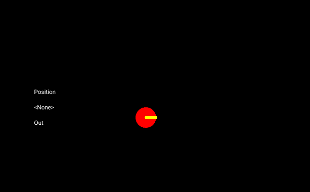
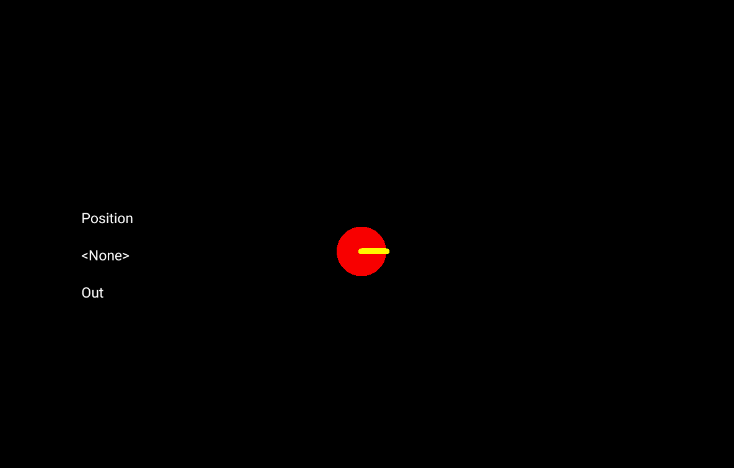
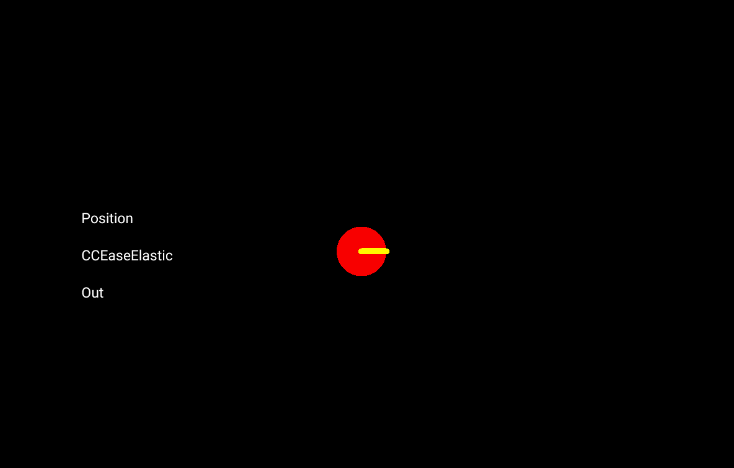
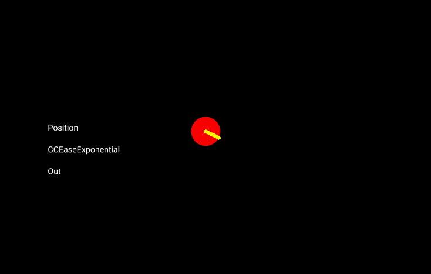
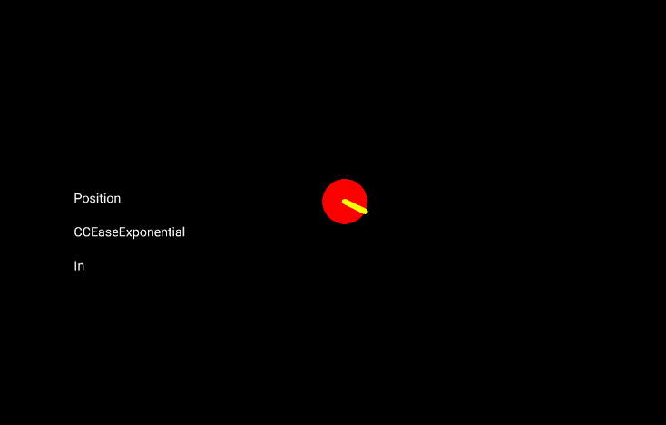
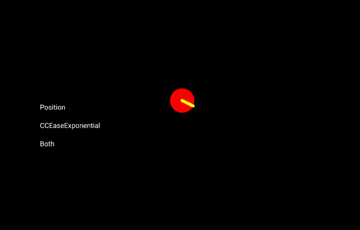

# Animating with CCAction

_The CCAction class simplifies adding animations to CocosSharp games. These animations can be used to implement functionality or to add polish._

`CCAction` is a base class which can be used to animate CocosSharp objects. This guide covers built-in `CCAction` implementations for common tasks such as positioning, scaling, and rotating. It also looks at how to create custom implementations by inheriting from `CCAction`.

This guide uses a project called **ActionProject** which [can be downloaded here](https://developer.xamarin.com/samples/mobile/CCAction). This guide uses the `CCDrawNode` class, which is covered in the [Drawing Geometry with CCDrawNode](~/graphics-games/cocossharp/ccdrawnode.md) guide.


## Running the ActionProject

**ActionProject** is a CocosSharp solution which can be built for iOS and Android. It serves both as a code sample for how to use the `CCAction` class and as a real-time demo of common `CCAction` implementations.

When running, ActionProject displays three `CCLabel` instances on the left of the screen and a visual object drawn by two `CCDrawNode` instances for viewing the various actions:



The labels on the left indicate which type of `CCAction` will be created when tapping on the screen. By default, the **Position** value is selected, resulting in a `CCMove` action being created and applied to the red circle:


Clicking the labels on the left changes which type of `CCAction` is performed on the circle. For example, clicking the **Position** label will cycle through the different values that can be changed:



## Common variable-changing CCAction classes

The **ActionProject** uses the following `CCAction`-inheriting classes, which are a part of CocosSharp:

 - `CCMoveTo` – Changes a `CCNode` instance’s `Position` property
 - `CCScaleTo` – Changes a `CCNode` instance’s `Scale` property
 - `CCRotateTo` – Changes a `CCNode` instance’s `Rotation` property

This guide refers to these actions as *variable-changing*, which means that they directly impact the variable of the `CCNode` that they are added to. Other types of actions are referred to as *easing* actions, which are covered later in this guide.

The **ActionProject** demonstrates that the purpose of these actions is to modify a variable over time. Specifically, these `CCActions` constructors take two arguments: length of time to take and the value to assign. The following piece of code shows how the three types of actions are created:


```csharp
switch (VariableOptions [currentVariableIndex])
{
    case "Position":
        coreAction = new CCMoveTo(timeToTake, touch.Location);

        break;
    case "Scale":
        var distance = CCPoint.Distance (touch.Location, drawNodeRoot.Position);
        var desiredScale = distance / DefaultCircleRadius;
        coreAction = new CCScaleTo(timeToTake, desiredScale);

        break;
    case "Rotation":
        float differenceY = touch.Location.Y - drawNodeRoot.PositionY;
        float differenceX = touch.Location.X - drawNodeRoot.PositionX;

        float angleInDegrees = -1 * CCMathHelper.ToDegrees(
            (float)System.Math.Atan2(differenceY, differenceX));

        coreAction = new CCRotateTo (timeToTake, angleInDegrees);

        break; 
...
}
```

Once the action is created, it is added to a CCNode as follows:


```csharp
nodeToAddTo.AddAction (coreAction); 
```

`AddAction` starts the `CCAction` instance’s behavior, and it will automatically perform its logic frame-after-frame until completion.

Each of the types listed above ends with the word *To* which means the `CCAction` will modify the `CCNode` so that the argument value represents the final state when the action has finished. For example, creating a `CCMoveTo` with a position of X = 100 and Y = 200 results in the `CCNode` instance’s `Position` being set to X = 100, Y = 200 at the end of the time specified, regardless of the `CCNode` instance’s starting location.

Each "To" class also has a "By" version, which will add the argument value to the current value on the `CCNode`. For example, creating a `CCMoveBy` with a position of X = 100 and Y = 200 will result in the `CCNode` instance being moved to the right 100 units and up 200 units from the position it was at when the action was started.


## Easing actions

By default, variable-changing actions will perform *linear interpolation* – the action will move towards the desired value at a constant rate. If interpolating *position* linearly, the moving object will immediately start and stop moving at the beginning and end of the action, and its speed will stay constant as the action executes. 

Non-linear interpolation is less jarring and adds an element of polish, so CocosSharp offers a variety of easing actions which can be used to modify variable-changing actions.

In the **ActionProject** sample, we can switch between these types of easing actions by clicking on the second label (which defaults to **<None>**):


Easing actions are especially powerful because they are not tied to any particular variable-setting action. This means that the same easing action can be used to assign position, rotation, scale, or custom actions (as will be shown later in this guide).

Easing actions wrap variable-setting actions (so long as the variable-setting action inherits from `CCFiniteTimeAction`) by accepting a variable-setting action as an argument in their constructors.

For example, if the labels are set to **Position**, **CCEaseElastic**, then the following code will execute when a touch is detected (note that code has been omitted to highlight the relevant lines):


```csharp
CCFiniteTimeAction coreAction = null; 
...
coreAction = new CCMoveTo(timeToTake, touch.Location); 
...
CCAction easing = null; 
...
easing = new CCEaseSineOut (coreAction); 
...
nodeToAddTo.AddAction (easing); 
```

As shown by the application, the exact same easing can be applied to other variable-setting actions such as `CCRotateTo`:




## Easing In, Out, and InOut

All easing actions have `In`, `Out`, or `InOut` appended to the easing type. These terms refer to when the easing is applied: `In` means easing will be applied at the beginning, `Out` means at the end, and `InOut` means both at the beginning and end.

An `In` easing action will impact the way a variable is applied throughout the entire interpolation (both at the beginning and at the end), but typically the most recognizable characteristics of the easing action will take place at the beginning. Similarly, `Out` easing actions are characterized by their behavior at the end of the interpolation. For example, `CCEaseBounceOut` will result in an object bouncing at the end of the action.


### Out

`Out` easing generally applies the most noticeable changes at the end of the interpolation. For example, `CCEaseExponentialOut` will slow the rate of change of the changing variable as it approaches the target value:




### In

`In` easing generally applies the most noticeable change at the beginning of the interpolation. For example, `CCEaseExponentialIn` will move more slowly at the beginning of the action:




### InOut

`InOut` generally applies the most noticeable changes both at the beginning and end. `InOut` easing is usually symmetric. For example, `CCEaseExponentialInOut` will move slowly at the beginning and end of the action:




## Implementing a custom CCAction

All of the classes we’ve discussed so far are included in CocosSharp to provide common functionality. Custom `CCAction` implementations can provide additional flexibility. For example, a `CCAction` which controls the filled ratio of an experience bar can be used so that the experience bar grows smoothly whenever the user earns experience.

`CCAction` implementations typically require two classes:

 - `CCFiniteTimeAction` implementation – The finite time action class is responsible for starting the action. It is the class which is instantiated and either added directly to a `CCNode` or to an easing action. It must instantiate and return a `CCFiniteTimeActionState`, which will perform updates.
 - `CCFiniteTimeActionState` implementation – The finite time action state class is responsible for updating the variables involved in the action. It must implement an Update function, which assigns the value on the target according to a time value. This class is not explicitly referenced outside of the `CCFiniteTimeAction` which creates it. It simply works "behind the scenes".

**ActionProject** provides a custom `CCFiniteTimeAction` implementation called `LineWidthAction,` which is used to adjust the width of the yellow line drawn on top of the red circle. Note that its only job is to instantiate and return a `LineWidthState` instance:


```csharp
public class LineWidthAction : CCFiniteTimeAction
{
    float endWidth;

    public LineWidthAction (float duration, float width) : base(duration)
    {
        endWidth = width;
    }

    public override CCFiniteTimeAction Reverse ()
    {
        throw new NotImplementedException ();
    }

    protected override CCActionState StartAction (CCNode target)
    {
        return new LineWidthState (this, target, endWidth);
    }
}
```

As mentioned above, the `LineWidthState` does the work of assigning the line’s `Width` property according to how much `time` has passed:


```csharp
public class LineWidthState : CCFiniteTimeActionState
{
    float deltaWidth;
    float startWidth;

    LineNode castedTarget;

    public LineWidthState(LineWidthAction action, CCNode target, float endWidth) : base(action, target)
    {
        castedTarget = target as LineNode;

        if (castedTarget == null)
        {
            throw new InvalidOperationException ("The argument target must be a LineNode");
        }

        startWidth = castedTarget.Width;
        deltaWidth = endWidth - startWidth;
    }

    public override void Update (float time)
    {
        castedTarget.Width = startWidth + deltaWidth * time;
    }
} 
```

The LineWidthAction can be combined with any easing action to change the line width in various ways, as shown in the following animation:


### Interpolation and the Update method

The only logic, aside from storing values in the classes above, lives in the `LineWidthState.Update` method. The `startWidth` variable stores the width of the target `LineNode` at the start of the action, and the `deltaWidth` variable stores how much the value will change over the course of the action.

By substituting the `time` variable with a value of 0, we can see that the target `LineNode` will be at its starting position:


```csharp
castedTarget.Width = startWidth + deltaWidth * 0; 
```

Similarly, we can see that the target `LineNode` will be at its destination by substituting the time variable with a value of 1:


```csharp
castedTarget.Width = startWidth + deltaWidth * 1; 
```

The `time` value will usually be between 0 and 1 - but not always - and `Update` implementations should not assume these bounds. Some easing methods (such as `CCEaseBackIn` and `CCEaseBackOut`) will provide a time value outside of the 0 to 1 range.


## Conclusion

Interpolation and easing are a critical part of creating a polished game, especially when creating user interfaces. This guide covers how to use `CCActions` to interpolate standard values such as position and rotation as well as custom values. The `LineWidthState` and `LineWidthAction` classes show how to implement a custom action.

## Related links

- [CCAction](https://developer.xamarin.com/api/type/CocosSharp.CCAction)
- [CCMoveTo](https://developer.xamarin.com/api/type/CocosSharp.CCMoveTo)
- [CCScaleTo](https://developer.xamarin.com/api/type/CocosSharp.CCScaleTo)
- [CCRotateTo](https://developer.xamarin.com/api/type/CocosSharp.CCRotateTo)
- [CCDrawNode](https://developer.xamarin.com/api/type/CocosSharp.CCDrawNode)
- [Full Sample](https://developer.xamarin.com/samples/mobile/CCAction/)
