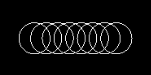
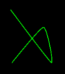
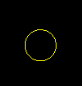
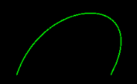
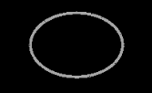
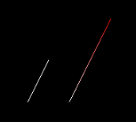
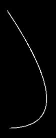
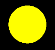

# Drawing geometry with CCDrawNode

_`CCDrawNode` provides methods for drawing primitive objects such as lines, circles, and triangles._

The `CCDrawNode` class in CocosSharp provides multiple methods for drawing common geometric shapes. It inherits from the `CCNode` class, and is usually added to `CCLayer` instances. This guide covers how to use `CCDrawNode` instances to perform custom rendering. It also provides a comprehensive list of available draw functions with screen shots and code examples.


## Creating a CCDrawNode

The `CCDrawNode` class can be used to draw geometric objects such as circles, rectangles, and lines. For example, the following code sample shows how to create a `CCDrawNode` instance which draws a circle in a `CCLayer` implementing class:


```csharp
public class GameLayer : CCLayer
{
    public GameLayer ()
    {
        var drawNode = new CCDrawNode ();
        this.AddChild (drawNode);
        // Origin is bottom-left of the screen. This moves
        // the drawNode 100 pixels to the right and 100 pixels up
        drawNode.PositionX = 100;
        drawNode.PositionY = 100;

        drawNode.DrawCircle (
            center: new CCPoint (0, 0),
            radius: 20,
            color: CCColor4B.White);

    }
} 
```

This code produces the following circle at runtime:


## Draw method details

Let’s take a look at a few details related to drawing with a `CCDrawNode`:


### Draw methods positions are relative to the CCDrawNode

All draw methods require at least one position value for drawing. This position value is relative to the `CCDrawNode` instance. This means that the `CCDrawNode` itself has a position, and all draw calls made on the `CCDrawNode` also take one or more position values. To help understand how these values combine, let’s look at a few examples.

First we’ll look at the `DrawCircle` example above:


```csharp
...
drawNode.PositionX = 100;
drawNode.PositionY = 100;

drawNode.DrawCircle (center: new CCPoint (0, 0),
...
```

In this case, the `CCDrawNode` is positioned at (100,100), and the drawn circle is at (0,0) relative to the `CCDrawNode`, resulting in the circle being centered 100 pixels up and to the right of the bottom-left corner of the game screen.

The `CCDrawNode` can also be positioned at the origin (bottom left of the screen), relying on the circle for offsets:


```csharp
...
drawNode.PositionX = 0;
drawNode.PositionY = 0;

drawNode.DrawCircle (center: new CCPoint (50, 60),
...
```

The code above results in the circle’s center at 50 units (`drawNode.PositionX` + the `CCPoint.X`) to the right of the left side of the screen, and 60 (`drawNode.PositionY` + the `CCPoint.Y`) units above the bottom of the screen.

Once a draw method has been called, the drawn object cannot be modified unless the `CCDrawNode.Clear` method is called, so any repositioning needs to be done on the `CCDrawNode` itself.

Objects drawn by `CCNodes` are also impacted by the `CCNode` instance’s `Rotation` and `Scale` properties.


### Draw methods do not need to be called every frame

Draw methods need to be called only once to create a persistent visual. In the example above, the call to `DrawCircle` in the constructor of the `GameLayer` – `DrawCircle` does not need to be called every-frame to re-draw the circle when the screen refreshes.

This differs from draw methods in MonoGame, which typically will render something to the screen for only one frame, and which must be called every-frame.

If draw methods are called every frame then objects will eventually accumulate inside the calling `CCDrawNode` instance, resulting in a drop in framerate as more objects are drawn.


### Each CCDrawNode supports multiple draw calls

`CCDrawNode` instances can be used to draw multiple shapes. This allows complex visual objects to be encased in a single object. For example, the following code can be used to render multiple circles with one `CCDrawNode`:


```csharp
for (int i = 0; i < 8; i++)
{
    drawNode.DrawCircle (
        center: new CCPoint (i*15, 0),
        radius: 20,
        color: CCColor4B.White);
} 
```

This results in the following graphic:




## Draw call examples

The following draw calls are available in `CCDrawNode`:

- [`DrawCatmullRom`](#drawcatmullrom)
- [`DrawCircle`](#drawcircle)
- [`DrawCubicBezier`](#drawcubicbezier)
- [`DrawEllipse`](#drawellipse)
- [`DrawLineList`](#drawlinelist)
- [`DrawPolygon`](#drawpolygon)
- [`DrawQuadBezier`](#drawquadbezier)
- [`DrawRect`](#drawrect)
- [`DrawSegment`](#drawsegment)
- [`DrawSolidArc`](#drawsolidarc)
- [`DrawSolidCircle`](#drawsolidcircle)
- [`DrawTriangleList`](#drawtrianglelist)


### DrawCardinalSpline

`DrawCardinalSpline` creates a curved line through a variable number of points. 

The `config` parameter defines which points the spline will pass through. The example below shows a spline which passes through four points.

The `tension` parameter controls how sharp or round the points on the spline appear. A `tension` value of 0 will result in a curved spline, and a `tension` value of 1 will result in a spline drawn by straight lines and hard edges.

Although splines are curved lines, CocosSharp draws splines with straight lines. The `segments` parameter controls how many segments to use to draw the spline. A larger number results in a smoothly curved spline at the cost of performance. 

Code example:


```csharp
var splinePoints = new List<CCPoint> ();
splinePoints.Add (new CCPoint (0, 0));
splinePoints.Add (new CCPoint (50, 70));
splinePoints.Add (new CCPoint (0, 140));
splinePoints.Add (new CCPoint (100, 210));

drawNode.DrawCardinalSpline (
    config: splinePoints,
    tension: 0,
    segments: 64,
    color:CCColor4B.Red); 
```


### DrawCatmullRom

`DrawCatmullRom` creates a curved line through a variable number of points, similar to `DrawCardinalLine`. This method does not include a tension parameter.

Code example:

```csharp
var splinePoints = new List<CCPoint> ();
splinePoints.Add (new CCPoint (0, 0));
splinePoints.Add (new CCPoint (80, 90));
splinePoints.Add (new CCPoint (100, 0));
splinePoints.Add (new CCPoint (0, 130)); 

drawNode.DrawCatmullRom (
    points: splinePoints,
    segments: 64); 
```




### DrawCircle

`DrawCircle` creates a perimeter of a circle of a given `radius`.

Code example:

```csharp
drawNode.DrawCircle (
    center:new CCPoint (0, 0),
    radius:20,
    color:CCColor4B.Yellow); 
```




### DrawCubicBezier

`DrawCubicBezier` draws a curved line between two points, using control points to set the path between the two points.

Code example:

```csharp
drawNode.DrawCubicBezier (
    origin: new CCPoint (0, 0),
    control1: new CCPoint (50, 150),
    control2: new CCPoint (250, 150),
    destination: new CCPoint (170, 0),
    segments: 64,
    lineWidth: 1,
    color: CCColor4B.Green); 
```

 


### DrawEllipse

`DrawEllipse` creates the outline of an *ellipse*, which is often referred to as an oval (although the two are not geometrically identical). The shape of the ellipse can be defined by a `CCRect` instance.

Code example:


```csharp
drawNode.DrawEllipse (
    rect: new CCRect (0, 0, 130, 90),
    lineWidth: 2,
    color: CCColor4B.Gray); 
```




### DrawLine

`DrawLine` connects to points with a line of a given width. This method is similar to `DrawSegment`, except it creates flat endpoints as opposed to round endpoints.

Code example:


```csharp
drawNode.DrawLine (
    from: new CCPoint (0, 0),
    to: new CCPoint (150, 30),
    lineWidth: 5,
    color:CCColor4B.Orange); 
```


### DrawLineList

`DrawLineList` creates multiple lines by connecting each pair of points specified by a `CCV3F_C4B` array. The `CCV3F_C4B` struct contains values for position and color. The `verts` parameter should always contain an even number of points, as each line is defined by two points.

Code example:


```csharp
CCV3F_C4B[] verts = new CCV3F_C4B[] {
    // First line:
    new CCV3F_C4B( new CCPoint(0,0), CCColor4B.White),
    new CCV3F_C4B( new CCPoint(30,60), CCColor4B.White),
    // second line, will blend from white to red:
    new CCV3F_C4B( new CCPoint(60,0), CCColor4B.White),
    new CCV3F_C4B( new CCPoint(120,120), CCColor4B.Red)
};

drawNode.DrawLineList (verts); 
```

 


### DrawPolygon

`DrawPolygon` creates a filled-in polygon with an outline of variable width and color.

Code example:


```csharp
CCPoint[] verts = new CCPoint[] {
    new CCPoint(0,0),
    new CCPoint(0, 100),
    new CCPoint(50, 150),
    new CCPoint(100, 100),
    new CCPoint(100, 0)
};

drawNode.DrawPolygon (verts,
    count: verts.Length,
    fillColor: CCColor4B.White,
    borderWidth: 5,
    borderColor: CCColor4B.Red,
    closePolygon: true); 
```


### DrawQuadBezier

`DrawQuadBezier` connects two points with a line. It behaves similarly to `DrawCubicBezier` but only supports a single control point.

Code example:


```csharp
drawNode.DrawQuadBezier (
    origin:new CCPoint (0, 0),
    control:new CCPoint (200, 0),
    destination:new CCPoint (0, 300),
    segments:64,
    lineWidth:1,
    color:CCColor4B.White);
```




### DrawRect

`DrawRect` creates a filled-in rectangle with an outline of variable width and color.

Code example: 


```csharp
var shape = new CCRect (
    0, 0, 100, 200);
drawNode.DrawRect(shape,
    fillColor:CCColor4B.Blue,
    borderWidth: 4,
    borderColor:CCColor4B.White); 
```


### DrawSegment

`DrawSegment` connects two points with a line of variable width and color. It is similar to `DrawLine`, except it creates round endpoints rather than flat endpoints.

Code example:


```csharp
drawNode.DrawSegment (from: new CCPoint (0, 0),
    to: new CCPoint (100, 200),
    radius: 5,
    color:new CCColor4F(1,1,1,1)); 
```


### DrawSolidArc

`DrawSolidArc` creates a filled-in wedge of a given color and radius.

Code example:


```csharp
drawNode.DrawSolidArc(
    pos:new CCPoint(100, 100),
    radius:200,
    startAngle:0,
    sweepAngle:CCMathHelper.Pi/2, // this is in radians, clockwise
    color:CCColor4B.White); 
```


### DrawSolidCircle

`DrawCircle` creates a filled-in circle of a given radius.

Code example:


```csharp
drawNode.DrawSolidCircle(
    pos: new CCPoint (100, 100),
    radius: 50,
    color: CCColor4B.Yellow); 
```




### DrawTriangleList

`DrawTriangleList` creates a list of triangles. Each triangle is defined by three `CCV3F_C4B` instances in an array. The number of vertices in the array passed to the `verts` parameter must be a multiple of three. Note that the only information contained in `CCV3F_C4B` is the position of the verts and their color – the `DrawTriangleList` method does not support drawing triangles with textures.

Code example:


```csharp
CCV3F_C4B[] verts = new CCV3F_C4B[] {
    // First triangle:
    new CCV3F_C4B( new CCPoint(0,0), CCColor4B.White),
    new CCV3F_C4B( new CCPoint(30,60), CCColor4B.White),
    new CCV3F_C4B( new CCPoint(60,0), CCColor4B.White),
    // second triangle, each point has different colors:
    new CCV3F_C4B( new CCPoint(90,0), CCColor4B.Yellow),
    new CCV3F_C4B( new CCPoint(120,60), CCColor4B.Red),
    new CCV3F_C4B( new CCPoint(150,0), CCColor4B.Blue)
};

drawNode.DrawTriangleList (verts); 
```


## Summary

This guide explains how to create a `CCDrawNode` and perform primitive-based rendering. It provides an example of each of the draw calls.

## Related links

- [CCDrawNode API](https://developer.xamarin.com/api/type/CocosSharp.CCDrawNode/)
- [Full Sample](https://developer.xamarin.com/samples/mobile/CCDrawNode/)
