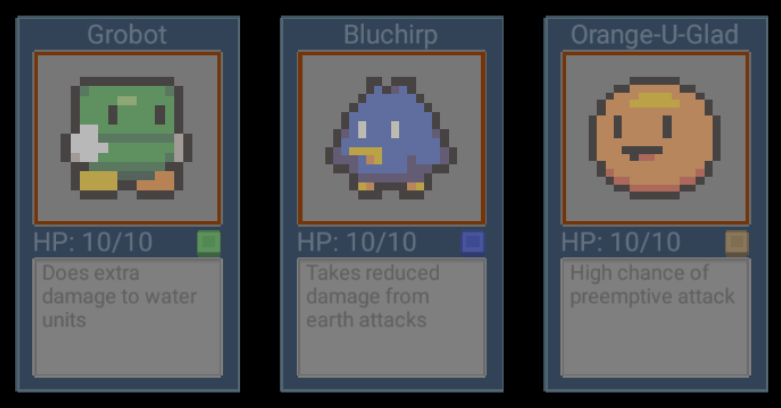
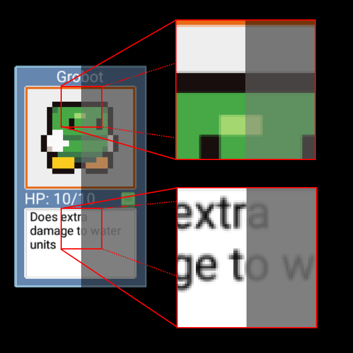
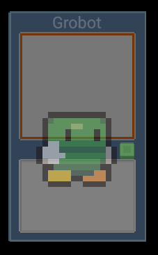
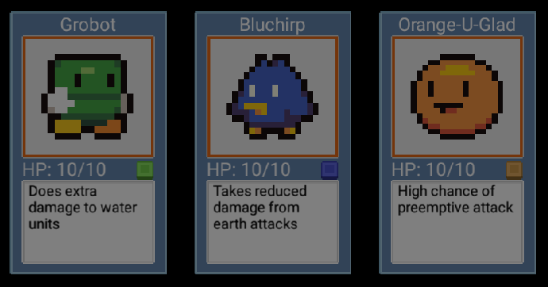
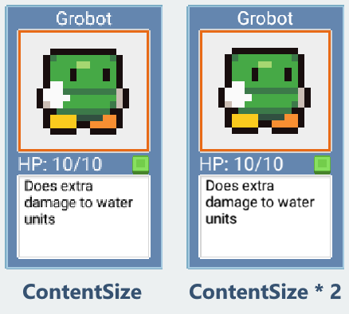

# Performance and visual effects with CCRenderTexture

_CCRenderTexture enables developers to improve the performance of their CocosSharp games by reducing draw calls, and can be used for creating visual effects. This guide accompanies the CCRenderTexture sample to provide a hands-on example of how to use this class effectively._

The `CCRenderTexture` class provides functionality for rendering multiple CocosSharp objects to a single texture. Once created, `CCRenderTexture` instances can be used to render graphics efficiently and to implement visual effects. `CCRenderTexture` allows multiple objects to be rendered to a single texture one time. Then, that texture can be reused every frame, reducing the total number of draw calls.

This guide examines how to use the `CCRenderTexture` object to improve the performance of rendering cards in a collectable card game (CCG). It also demonstrates how `CCRenderTexture` can be used to make an entire entity transparent. This guide references the `CCRenderTexture` [sample project](https://developer.xamarin.com/samples/mobile/CCRenderTexture/).


## Card – a typical entity

Before looking at how to use `CCRenderTexture` object, we’ll first familiarize ourselves with the `Card` entity that we’ll use throughout this project to explore the `CCRenderTexture` class. The `Card` class is a typical entity, following the entity pattern outlined in the [Entity guide](~/graphics-games/cocossharp/entities.md). The Card class has all of its visual components (instances of `CCSprite` and `CCLabel`) listed as fields:


```csharp
class Card : CCNode
{
    bool usesRenderTexture;
    List<CCNode> visualComponents = new List<CCNode>();
    CCSprite background;
    CCSprite colorIcon;
    CCSprite monsterSprite;
    CCLabel monsterNameDisplay;
    CCLabel hpDisplay;
    CCLabel descriptionDisplay;
```

Card instances can be rendered by using a `CCRenderTexture`, or by drawing each visual component individually. Although each component is an independent object, the `CCNode` parenting system used in entities makes the `Card` behave as a single object – at least for the most part. For example, if a `Card` entity is repositioned, resized, or rotated, then all the contained visual objects are impacted to make the card appear to be a single object. To see the cards behave as a single object, we can modify the `GameLayer.AddedToScene` method to set the `useRenderTextures` variable to `false`:

	
```csharp
protected override void AddedToScene ()
{
    base.AddedToScene();
    GameView.Stats.Enabled = true;
    const bool useRenderTextures = false;
    ...
}
```

The `GameLayer` code does not move each visual element independently, yet each visual element within the `Card` entity is positioned correctly:


The sample is coded to expose two problems that can occur when each visual component renders itself:

- Performance can suffer due to multiple draw calls
- Certain visual effects, such as transparency, cannot be implemented accurately, as we will explore later


### Card draw calls

Our code is a simplification of what might be found in a full *collectable card game* (CCG) such as "Magic: The Gathering" or "Hearthstone". Our game only displays three cards at once and has a small number of possible units (blue, green, and orange). By contrast, a full game may have over twenty cards on-screen at a given time, and players may have hundreds of cards to choose from when creating their decks. Even though our game does not currently suffer from performance problems, a full game with similar implementation might.

CocosSharp provides some insight into rendering performance by exposing the draw calls performed per-frame. Our `GameLayer.AddedToScene` method sets the `GameView.Stats.Enabled` to `true`, resulting in performance information shown at the bottom-left of the screen:


Notice that despite having three cards on screen, we have nineteen draw calls (each card results in six draw calls, the text displaying the performance information accounts for one more). Draw calls have a significant impact on a game’s performance, so CocosSharp provides a number of ways to reduce them. One technique is described in the [CCSpriteSheet guide](~/graphics-games/cocossharp/ccspritesheet.md). Another technique is to use the `CCRenderTexture` to reduce each entity down to one call, as we’ll examine in this guide.


### Card transparency

Our `Card` entity includes an `Opacity` property to control transparency as shown in the following code snippet:


```csharp
public override byte Opacity
{
    get
    {
        return base.Opacity;
    }
    set
    {
        base.Opacity = value;
        if (usesRenderTexture)
        {
            this.renderTexture.Sprite.Opacity = value;
        }
        else
        {
            foreach (var component in visualComponents)
            {
                component.Opacity = value;
            }
        }
    }
}
```

Notice that the setter supports using render textures or rendering each component individually. To see its effect, change the `opacity` value to `127` (roughly half opacity) in `GameLayer.AddedToScene` which will result in each component having an `Opacity` value of `127`:


```csharp
protected override void AddedToScene ()
{
    base.AddedToScene();
    GameView.Stats.Enabled = true;
    const bool useRenderTextures = false;
    const byte opacity = 127;
    ...
}
```

The game will now render the cards with some transparency, causing them to appear darker since the background is black:



At first glance it might look as if our cards have been properly made transparent. However, the screenshot displays a number of visual problems.

Since our background is black, we would expect that every part of our card would become darker due to the transparency. That is, the more transparent a card becomes, the darker it becomes. At opacity 0, a `Card` will be completely transparent (totally black). However, some parts of our card didn’t become darker when opacity was changed to `127`. Even worse, some parts of our card actually became brighter when they became more transparent. Let’s look at parts of our card which were black *before* they were transparent – specifically the detail text and the black outlines around the monster graphic. If we place these side by side, we can see the impact of applying transparency:



As mentioned above, all parts of the card should become darker when becoming more transparent, but in a number of areas this is not the case:

- The robot’s outline becomes lighter (goes from black to gray)
- The description text becomes lighter (goes from black to gray)
- The green part of the robot becomes less saturated, but doesn’t become darker

To help visualize why this occurs, we need to keep in mind that each visual component is drawn independently, each partly transparent. The first visual component drawn is the card’s background. Subsequent transparent elements will be drawn on top of the card and will be impacted by the card background. If we remove some text from our card and move the robot graphic down, we can see how the card background impacts the robot. Notice the orange line from the top box can be seen on the robot, and that the area of the robot which overlaps the blue stripe in the center of the card is drawn darker:



Using a `CCRenderTexture` allows us to make the entire card transparent without impacting the rendering of individual components within the card, as we will see later in this guide.


## Using CCRenderTexture

Now that we’ve identified the problems with rendering each component individually, we’ll turn on rendering to a `CCRenderTexture` and compare the behavior.

To enable rendering to a `CCRenderTexture`, change the `userRenderTextures` variable to `true` in `GameLayer.AddedToScene`:


```csharp
protected override void AddedToScene ()
{
    base.AddedToScene();
    GameView.Stats.Enabled = true;
    const bool useRenderTextures = true;
```


### Card draw calls

If we run the game now, we’ll see the draw calls reduced from nineteen to four (each card reduced from six to one):


As previously mentioned, this type of reduction can have a significant impact on games with more visual entities on screen.


### Card transparency

Once the `useRenderTextures` is set to `true`, transparent cards will render differently:



Let’s compare the transparent robot card using render textures (left) vs. without (right):

 vs without (right)")

The most obvious differences are in the details text (black instead of light gray) and the robot sprite (dark instead of light and desaturated).


## CCRenderTexture details

Now that we’ve seen the benefits of using `CCRenderTexture`, let’s take a look at how it is used in the `Card` entity.

The `CCRenderTexture` is a canvas that can be the target of rendering. It has two main differences when compared to the game screen:

1. The `CCRenderTexture` persists in-between frames. This means that a `CCRenderTexture` needs to only be rendered when changes occur. In our case, the `Card` entity never changes, so it is only rendered one time. If any `Card` components changed, then the Card would need to redraw itself to its `CCRenderTexture`. For example, if the HP value (health points) changed when attacked, then the card would need to render itself to reflect the new HP value.
1. The `CCRenderTexture` pixel dimensions are not tied to the screen. A `CCRenderTexture` can be larger or smaller than the resolution of the device. The `Card` code creates a `CCRenderTexture` using the size of its background sprite. 
The card contains a reference to a `CCRenderTexture` called `renderTexture`:


```csharp
CCRenderTexture renderTexture;
```

The `renderTexture` instance remains `null` until the `UseRenderTexture` property is assigned to true, which calls `SwitchToRenderTexture`:


```csharp
private void SwitchToRenderTexture()
{
    // The card needs to be moved to the origin (0,0) so it's rendered on the render target. 
    // After it's rendered to the CCRenderTexture, it will be moved back to its old position
    var oldPosition = this.Position;
    // Make sure visuals are part of the card so they get rendered
    bool areVisualComponentsAlreadyAdded = this.Children != null && this.Children.Contains(visualComponents[0]);
    if (!areVisualComponentsAlreadyAdded)
    {
        // Temporarily add them so we can render the object:
        foreach (var component in visualComponents)
        {
            this.AddChild(component);
        }
    }
    // Create the render texture if it hasn't yet been made:
    if (renderTexture == null)
    {
        // Even though the game is zoomed in to create a pixellated look, we are using
        // high-resolution textures. Therefore, we want to have our canvas be 2x as big as 
        // the background so fonts don't appear pixellated
        var pixelResolution = background.ContentSize * 2;
        var unitResolution = background.ContentSize;
        renderTexture = new CCRenderTexture(unitResolution, pixelResolution);
        //renderTexture.Sprite.Scale = .5f;
    }
    // We don't want the render target to be a child of this when we update it:
    if (this.Children != null && this.Children.Contains(renderTexture.Sprite))
    {
        this.Children.Remove(renderTexture.Sprite);
    }
    // Move this instance back to the origin so it is rendered inside the render texture:
    this.Position = CCPoint.Zero;
    // Clears the CCRenderTexture
    renderTexture.BeginWithClear(CCColor4B.Transparent);
    // Visit renders this object and all of its children
    this.Visit();
    // Ends the rendering, which means the CCRenderTexture's Sprite can be used
    renderTexture.End();
    // We no longer want the individual components to be drawn, so remove them:
    foreach (var component in visualComponents)
    {
        this.RemoveChild(component);
    }
    // Move this back to its original position:
    this.Position = oldPosition;
    // add the render texture sprite to this:
    renderTexture.Sprite.AnchorPoint = CCPoint.Zero;
    this.AddChild(renderTexture.Sprite);
}
```

The `SwitchToRenderTexture` method can be called whenever the texture needs to be refreshed. It can be called whether the card is already using its `CCRenderTexture` or is switching to the `CCRenderTexture` for the first time.

The following sections explore the `SwitchToRenderTexture` method. 


### CCRenderTexture size

The CCRenderTexture constructor requires two sets of dimensions. The first controls the size of the `CCRenderTexture` when it is drawn, and the second specifies the pixel width and height of its contents. The `Card` entity instantiates its `CCRenderTexture` using the background [ContentSize](https://developer.xamarin.com/api/property/CocosSharp.CCSprite.ContentSize/). Our game has a `DesignResolution` of 512 by 384, as shown in `ViewController.LoadGame` on iOS and `MainActivity.LoadGame` on Android:


```csharp
int width = 512;
int height = 384;
// Set world dimensions
gameView.DesignResolution = new CCSizeI(width, height);
```

The `CCRenderTexture` constructor is called with the `background.ContentSize` as the first parameter, indicating that the `CCRenderTexture` should be just as large as the background `CCSprite`. Since the card background `CCSprite` is 200 pixels tall, the card will occupy roughly half of the vertical height of the screen.

The second parameter passed to the `CCRenderTexture` constructor specifies the pixel resolution of the `CCRenderTexture`. As discussed in the [CocosSharp Resolution guide](~/graphics-games/cocossharp/resolutions.md), the width and height of the viewable area in game units is often not the same as the pixel resolution of the screen. Similarly, a CCRenderTexture might use a larger resolution than its size so visuals appear crisper on high-resolution devices.

The pixel resolution is twice the size of the CCRenderTexture to prevent text from looking pixelated:


```csharp
var unitResolution = background.ContentSize;
var pixelResolution = background.ContentSize * 2;
renderTexture = new CCRenderTexture(unitResolution, pixelResolution);
```

To compare, we can change the pixelResolution value to match the `background.ContentSize` (without being doubled) and compare the result: 


```csharp
var unitResolution = background.ContentSize;
var pixelResolution = background.ContentSize;
renderTexture = new CCRenderTexture(unitResolution, pixelResolution);
```




### Rendering to a CCRenderTexture

Typically, visual objects in CocosSharp are not explicitly rendered. Instead, visual objects are added to a `CCLayer` which is part of a `CCScene`. CocosSharp automatically renders the `CCScene` and its visual hierarchy in every frame without any rendering code being called. 

By contrast, the `CCRenderTexture` must be explicitly drawn to. This rendering can be broken up into three steps:

1. `CCRenderTexture.BeginWithClear` is called, indicating that all subsequent rendering will target the calling `CCRenderTexture`.
1. Objects inheriting from `CCNode` (like the `Card` entity) are rendered to the `CCRenderTexture` by calling `Visit`.
1. `CCRenderTexture.End` is called, indicating that rendering to the `CCRenderTexture` is complete.

Any number of objects can be rendered to a `CCRenderTexture` between its `Begin` and `End` calls. Before rendering, all necessary visible objects are added as children:


```csharp
bool areVisualComponentsAlreadyAdded = this.Children != null && this.Children.Contains(visualComponents[0]);
if (!areVisualComponentsAlreadyAdded)
{
    // Temporarily add them so we can render the object:
    foreach (var component in visualComponents)
    {
        this.AddChild(component);
    }
}
```

The `renderTexture` should not be part of the card when rendering, so it is removed:


```csharp
// We don't want the render texture to be a child of the card 
// when we call Visit
if (this.Children != null && this.Children.Contains(renderTexture.Sprite))
{
    this.RemoveChild(renderTexture.Sprite);
}
```

Now the `Card` instance can render itself to the `CCRenderTexture` instance:


```csharp
// Clears the CCRenderTexture
renderTexture.BeginWithClear(CCColor4B.Transparent);
// Visit renders this object and all of its children
this.Visit();
// Ends the rendering, which means the CCRenderTexture's Sprite can be used
renderTexture.End();
```

Once the rendering is finished, the individual components are removed and the `CCRenderTexture` is re-added.


```csharp
// We no longer want the individual components to be drawn, so remove them:
foreach (var component in visualComponents)
{
    this.RemoveChild(component);
}
// add the render target sprite to this:
this.AddChild(renderTexture.Sprite);
```

## Summary

This guide covered the `CCRenderTexture` class by using a `Card` entity which could be used in a collectible card game. It showed how to use the `CCRenderTexture` class to improve frame rate and properly implement entity-wide transparency.

Although this guide used a `CCRenderTexture` contained within an entity, this class can be used to render multiple entities, or even entire `CCLayer` instances for screen-wide effects and performance improvements.

## Related Links

- [CCRenderTexture API Reference](https://developer.xamarin.com/api/type/CocosSharp.CCRenderTexture/)
- [Full Project (sample)](https://developer.xamarin.com/samples/mobile/CCRenderTexture/)
