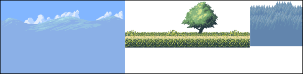
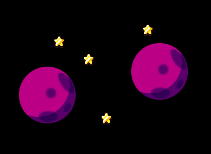
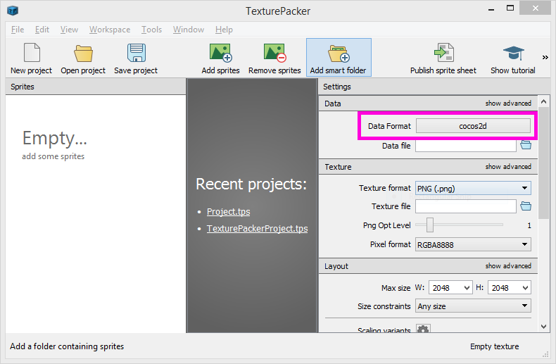
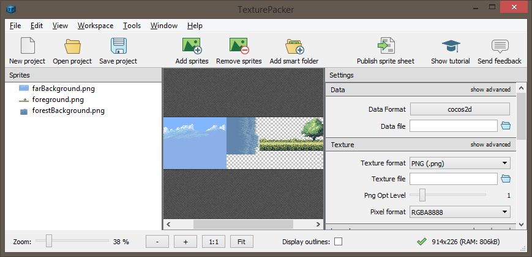
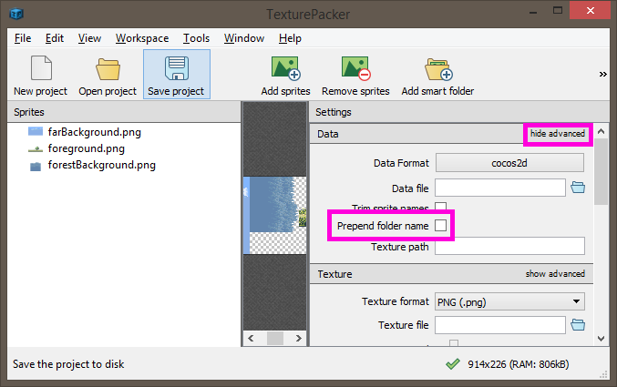

# Improving frame rate with CCSpriteSheet

_CCSpriteSheet provides functionality for combining and using many image files in one texture. Reducing texture count can improve a game’s load times and framerate._

Many games require optimization efforts to run smoothly and load quickly on mobile hardware. The `CCSpriteSheet` class can help address many common performance problems encountered by CocosSharp games. This guide covers common performance problems and how to address them using the `CCSpriteSheet` class.


## What is a sprite sheet?

A *sprite sheet*, which can also be referred to as a *texture atlas*, is an image which combines multiple images into one file. This can improve runtime performance as well as content load times.

For example, the following image is a simple sprite sheet created by three separate images. The individual images can be any size, and the resulting sprite sheet is not required to be completely filled:




### Render states

Visual CocosSharp objects (such as `CCSprite`) simplify rendering code over traditional  graphical API rendering code such as MonoGame or OpenGL, which require the creation of vertex buffers (as outlined in the [Drawing 3D Graphics with Vertices in MonoGame](~/graphics-games/monogame/3d/part2.md) guide). Despite its simplicity, CocosSharp does not eliminate the cost of setting *render states*, which are the number of times that the rendering code must switch textures or other rendering-related states.

CocosSharp’s internal code renders each visual element sequentially, by traversing the visual tree beginning with the current `CCScene`. For example, consider the following scene:


CocosSharp would render the four stars in sequence:


Since each `CCSprite` uses the same texture, CocosSharp can group all four stars together. This code requires only one render state assignment (assignment of the star texture) per frame. This scenario is very efficient.

Of course, very few games use only one image. The following scene introduces a planet graphic:



Ideally CocosSharp should draw all sprites using one image first (such as the stars), then the remainder of the sprites using the other image (the planet):


The ordering above requires two render states: one on the first star, one on the first planet.

If all `CCSprite` instances are children of the same `CCNode`, then CocosSharp will optimize the draw order to reduce render state changes. If, on the other hand, the `CCSprite` instances are organized such that CocosSharp is unable to optimize the rendering (such as if they are part of different entity `CCNode` instances), then the order may not be optimal. The following shows the worst possible draw order, resulting in five render states:


Render states can be difficult to optimize because the draw order must obey the visual tree of `CCNode` instances. This tree is often structured to be easy to work with (such as entities containing their visual children), or organized due to the desired visual layout as defined by an artist.

Of course, the ideal situation is to have a single render state, despite having multiple images. CocosSharp games can accomplish this by combining all images into a single file, then loading that one file (along with its accompanying **.plist** file) into a `CCSpriteSheet`. Using the `CCSpriteSheet` class becomes even more important for games which have a large number of images, or which have very complicated layouts. 

### Load times

Combining multiple images into one file also improves a game’s load times for a number of reasons:

 - Combining multiple images into a single file can reduce the overall number of pixels used through efficient packing
 - Loading fewer files means less per-file overhead, such as parsing .png headers
 - Loading fewer files requires less seek time, which is important for disk-based media such as DVDs and traditional computer hard drives

## Using CCSpriteSheet in code

To create a `CCSpriteSheet` instance, the code must supply an image and a file which defines the regions of the image to use for each frame. The image can be loaded as a **.png** or **.xnb** file (if using the [Content Pipeline](~/graphics-games/cocossharp/content-pipeline/index.md)). The file defining the frames is a **.plist** file which can be created by hand or *TexturePacker* (which we’ll discuss below).

The sample app, which [can be downloaded here](https://developer.xamarin.com/samples/mobile/SpriteSheetDemo/), creates the `CCSpriteSheet` from a **.png** and **.plist** file using the following code:

```csharp
CCSpriteSheet sheet = new CCSpriteSheet ("sheet.plist", "sheet.png"); 
```

Once loaded, the `CCSpriteSheet` contains a `List` of `CCSpriteFrame` instances – each instance corresponding to one of the source images used to create the entire sheet. In the case of the **SpriteSheetDemo** project, the `CCSpriteSheet` contains three images. The **.plist** file can be inspected in Visual Studio for Mac or in any text editor to see which images are available. If we view the **.plist** file in a text editor we can see the three frames (sections omitted to emphasize the key names):


```csharp
...
<dict>
	<key>frames</key>
	<dict>
		<key>farBackground.png</key>
		...
		<key>foreground.png</key>
		...
<key>forestBackground.png</key>
...
```

We can use the `Find` method to find frames by name, as follows (code omitted to emphasize `CCSpriteFrame` usage):


```csharp
CCSpriteFrame frame;
...
frame = sheet.Frames.Find(item=>item.TextureFilename == "farBackground.png"); 
CCSprite sprite = new CCSprite (frame); 
...
```

Since the `CCSprite` constructor can take a `CCSpriteFrame` parameter, the code never has to investigate the details of the `CCSpriteFrame`, such as which texture it uses, or the region of the image in the master sprite sheet.


## Creating a sprite sheet .plist

The .plist file is an xml-based file, which can be created and edited by hand. Similarly, image editing programs can be used to combine multiple files into one larger file. Since creating and maintaining sprite sheets can be very time consuming, we will look at the TexturePacker program which can export files in the CocosSharp format. TexturePacker offers a free and a "Pro" version, and is available for Windows and Mac OS. The remainder of this guide can be followed by using the free version. 

TexturePacker can be [downloaded from the TexturePacker website](https://www.codeandweb.com/texturepacker). When opened, TexturePacker does not have a project loaded. The starting screen allows you to add sprites, open recent projects (if other projects have been created), and select the format to use for the sprite sheet. CocosSharp uses the Cocos2D Data Format:



Image files (such as **.png**) can be added to TexturePacker by drag-dropping them from Windows Explorer on Windows or Finder on Mac. TexturePacker automatically updates the sprite sheet preview whenever a file is added:



To export a sprite sheet, click the **Publish sprite sheet** button and select a location for the sprite sheet. TexturePacker will save a .plist file and an image file.

To use the resulting files, add both the .png and .plist to a CocosSharp project. For information on adding files to CocosSharp projects, see the [BouncingGame guide](~/graphics-games/cocossharp/bouncing-game.md). Once the files are added, they can be loaded into a  `CCSpriteSheet` as was shown earlier in the code above:

```csharp
CCSpriteSheet sheet = new CCSpriteSheet ("sheet.plist", "sheet.png"); 
```

### Considerations for maintaining a TexturePacker sprite sheet

As games are developed, artists may add, remove, or modify art. Any change requires an updated sprite sheet. The following considerations can ease sprite sheet maintenance:

 - Keep the original files (the files used to create the sprite sheets) in a folder in your project, and make sure they are added to version control. These files will be needed to re-create the sprite sheet whenever a change is made.
 - Do not add the original files to Visual Studio for Mac/Visual Studio, or if they are added, set the **Build Action** to **None**. If the files are added and have the platform-specific **Build Action**, then they will needlessly increase the resulting app’s file size.
 - Consider using *smart folders* in TexturePacker. Smart folders automatically add any contained images to the sprite sheet. This feature can save a lot of time when developing games with a large number of images. 

	
 - Keep an eye on sprite sheet texture sizes. Some older phone hardware does not support texture sizes larger than 2048x2048. Also, a 32-bit image of 2048x2048 uses nearly 17 mbytes of RAM – a significant amount of memory.
 - TexturePacker does not include folders in sprite names by default, so name conflicts are possible. It’s best to decide whether to include folder names or not at the beginning of development. Larger games should consider using folder names to prevent conflicts. To include folder paths, click **show advanced** in the **Data** section and check **Prepend folder name**. 

	

## Summary

This guide covers how to create and use the `CCSpriteSheet` class. It also covers how to construct files which can be loaded into `CCSpriteSheet` instances using the TexturePacker program.

## Related links

- [CCSpriteSheet](https://developer.xamarin.com/api/type/CocosSharp.CCSpriteSheet/)
- [Full Demo (sample)](https://developer.xamarin.com/samples/mobile/SpriteSheetDemo/)
