# Coin Time game details

_This guide discusses implementation details in the Coin Time game, including working with tile maps, creating entities, animating sprites, and implementing efficient collision._

Coin Time is a full platformer game for iOS and Android. The goal of the game is to collect all of the coins in a level and then reach the exit door while avoiding enemies and obstacles.


This guide discusses implementation details in Coin Time, covering the following topics:

- [Working with tmx files](#working-with-tmx-files)
- [Level loading](#level-loading)
- [Adding new entities](#adding-new-entities)
- [Animated entities](#animated-entities)


## Content in Coin Time

Coin Time is a sample project that represents how a full CocosSharp project might be organized. Coin Time’s structure aims to simplify the addition and maintenance of content. It uses **.tmx** files created by [Tiled](http://www.mapeditor.org) for levels and XML files to define animations. Modifying or adding new content can be achieved with minimal effort. 

While this approach makes Coin Time an effective project for learning and experimentation, it also reflects how professional games are made. This guide explains some of the approaches taken to simplify adding and modifying content.


## Working with tmx files

Coin Time levels are defined using the .tmx file format, which is output by the [Tiled](http://www.mapeditor.org) tile map editor. For a detailed discussion of working with Tiled, see the [Using Tiled with Cocos Sharp guide](~/graphics-games/cocossharp/tiled.md). 

Each level is defined in its own .tmx file contained in the **CoinTime/Assets/Content/levels** folder. All Coin Time levels share one tileset file, which is defined in the **mastersheet.tsx** file. This file defines the custom properties for each tile, such as whether the tile has solid collision or whether the tile should be replaced by an entity instance. The mastersheet.tsx file allows properties to be defined only once and used across all levels. 


### Editing a tile map

To edit a tile map, open the .tmx file in Tiled by double-clicking the .tmx file or opening it through the File menu in Tiled. Coin Time level tile maps contain three layers: 

- **Entities** – this layer contains tiles which will be replaced with instances of entities at runtime. Examples include the player, coins, enemies, and the end-of-level door.
- **Terrain** – this layer contains tiles which typically have solid collision. Solid collision allows the player to walk on these tiles without falling through. Tiles with solid collision can also act as walls and ceilings.
- **Background** – the Background layer contains tiles that are used as the static background. This layer does not scroll when the camera moves throughout the level, creating the appearance of depth through parallax.

As we will explore later, the level-loading code expects these three layers in all Coin Time levels.

#### Editing terrain

Tiles can be placed by clicking in the **mastersheet** tileset and then clicking on the tile map. For example, to paint new terrain in a level:

1. Select the Terrain layer
1. Click on the tile to draw
1. Click or push and drag over the map to paint the tile

    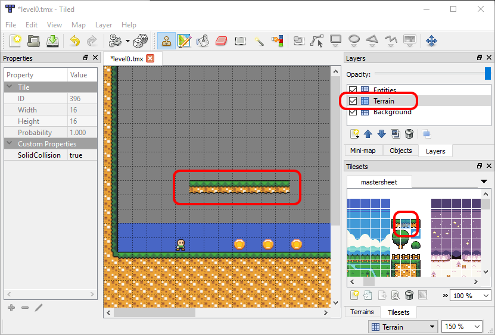

The top-left of the tileset contains all of the terrain in Coin Time. Terrain, which is solid, includes the **SolidCollision** property, as shown in the tile properties on the left of the screen:


#### Editing entities

Entities can be added or removed from a level – just like terrain. The **mastersheet** tileset has all entities placed about halfway horizontally, so they may not be visible without scrolling to the right:

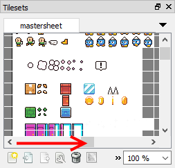

New entities should be placed on the **Entities** layer.

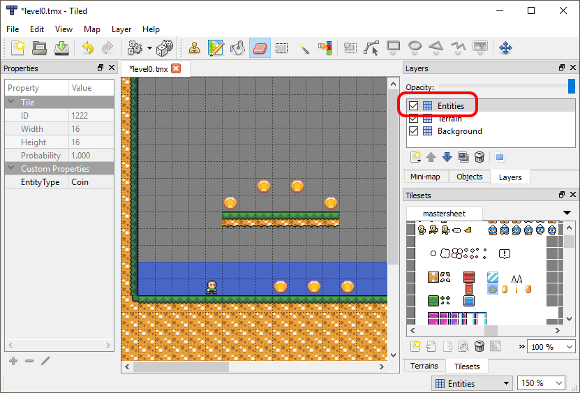

CoinTime code looks for the **EntityType**  when a level is loaded to identify tiles which should be replaced by entities: 

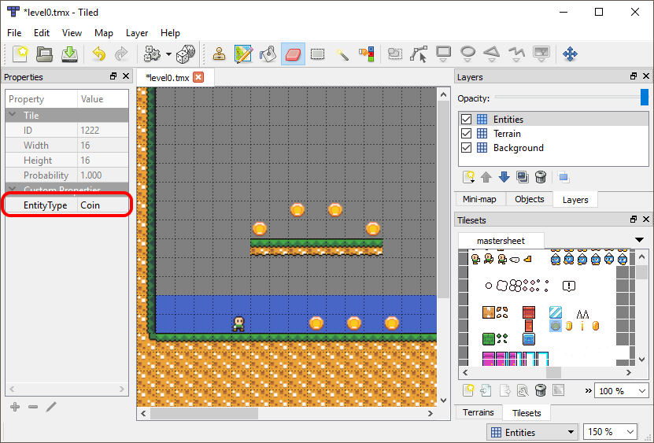

Once the file has been modified and saved, the changes will automatically show up if the project is built and run:

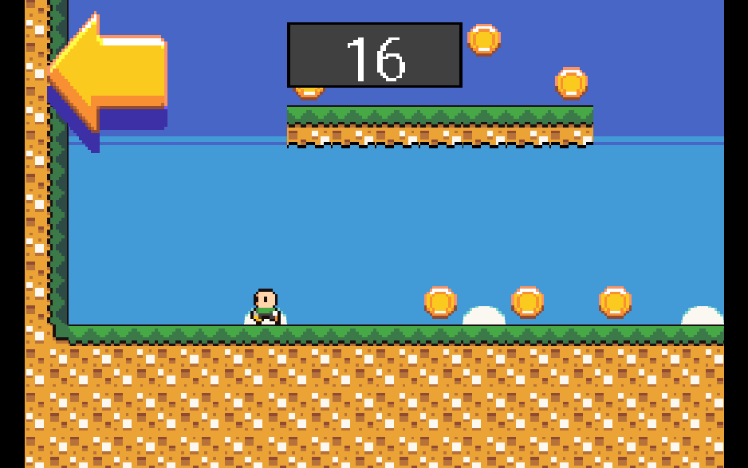


### Adding new levels

The process of adding levels to Coin Time requires no code changes, and only a few small changes to the project. To add a new level:

1. Open the level folder located at <**CoinTime Root>\CoinTime\Assets\Content\levels**
1. Copy and paste one of the levels, such as **level0.tmx**
1. Rename the new .tmx file so it continues the level number sequence with existing levels, such as **level8.tmx**
1. In Visual Studio or Visual Studio for Mac, add the new .tmx file to the Android levels folder. Verify that the file uses the **AndroidAsset** build action.

    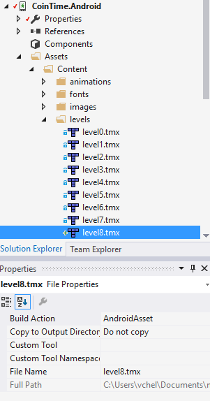

1. Add the new .tmx file to the iOS levels folder. Be sure to link the file from its original location and verify that it uses the **BundleResource** build action.

    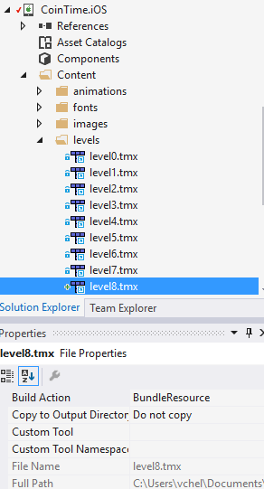

The new level should appear in the level select screen as level 9 (level file names start at 0, but the level buttons begin with the number 1):

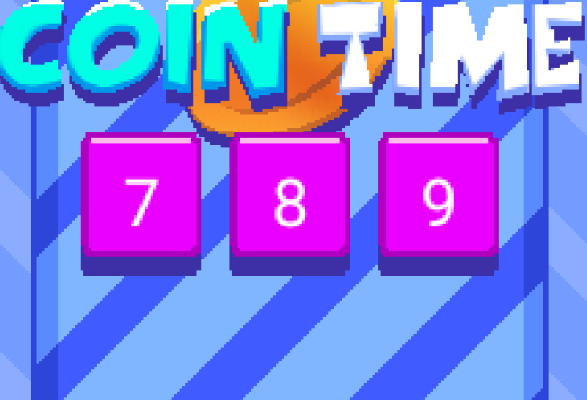


## Level loading

As shown earlier, new levels require no changes in code – the game automatically detects the levels if they are named correctly and added to the **levels** folder with the correct build action (**BundleResource** or **AndroidAsset**).

The logic for determining the number of levels is contained in the `LevelManager` class. When an instance of the `LevelManager` is constructed (using the singleton pattern), the `DetermineAvailbleLevels` method is called:


```csharp
private void DetermineAvailableLevels()
{
	// This game relies on levels being named "levelx.tmx" where x is an integer beginning with
	// 1. We have to rely on MonoGame's TitleContainer which doesn't give us a GetFiles method - we simply
	// have to check if a file exists, and if we get an exception on the call then we know the file doesn't
	// exist. 
	NumberOfLevels = 0;
	while (true)
	{
		bool fileExists = false;
		try
		{
			using(var stream = TitleContainer.OpenStream("Content/levels/level" + NumberOfLevels + ".tmx"))
			{
			}
			// if we got here then the file exists!
			fileExists = true;
		}
		catch
		{
			// do nothing, fileExists will remain false
		}
		if (!fileExists)
		{
			break;
		}
		else
		{
			NumberOfLevels++;
		}
	}
}
```

CocosSharp does not provide a cross-platform approach for detecting if files are present, so we have to rely on the `TitleContainer` class to attempt to open a stream. If the code for opening a stream throws an exception, then the file does not exist and the while loop breaks. Once the loop finishes, the `NumberOfLevels` property reports how many valid levels are part of the project.

The `LevelSelectScene` class uses the `LevelManager.NumberOfLevels` to determine how many buttons to create in the `CreateLevelButtons` method:


```csharp
private void CreateLevelButtons()
{
	const int buttonsPerPage = 6;
	int levelIndex0Based = buttonsPerPage * pageNumber;
	int maxLevelExclusive = System.Math.Min (levelIndex0Based + 6, LevelManager.Self.NumberOfLevels);
	int buttonIndex = 0;
	float centerX = this.ContentSize.Center.X;
	const float topRowOffsetFromCenter = 16;
	float topRowY = this.ContentSize.Center.Y + topRowOffsetFromCenter;
	for (int i = levelIndex0Based; i < maxLevelExclusive; i++)
	{
		...
	}
}
```

The `NumberOflevels` property is used to determine which buttons should be created. This code considers which page the user is currently viewing and only creates a maximum of six buttons per page. When clicked, the button instances call the `HandleButtonClicked` method:


```csharp
private void HandleButtonClicked(object sender, EventArgs args)
{
	// levelNumber is 1-based, so subtract 1:
	var levelIndex = (sender as Button).LevelNumber - 1;
	LevelManager.Self.CurrentLevel = levelIndex;
	CoinTime.GameAppDelegate.GoToGameScene ();
}
```

This method assigns the `CurrentLevel` property which is used by the `GameScene` when loading a level. After setting the `CurrentLevel`, the `GoToGameScene` method is raised, switching the scene from `LevelSelectScene` to `GameScene`.

The `GameScene` constructor calls `GoToLevel`, which performs the level-loading logic:


```csharp
private void GoToLevel(int levelNumber)
{
	LoadLevel (levelNumber);
	CreateCollision();
	ProcessTileProperties ();
	touchScreen = new TouchScreenInput(gameplayLayer);
	secondsLeft = secondsPerLevel;
}
```

Next we’ll take a look at methods called in `GoToLevel`.


### LoadLevel

The `LoadLevel` method is responsible for loading the .tmx file and adding it to the `GameScene`. This method does not create any interactive objects such as collision or entities – it simply creates the visuals for the level, also referred to as the *environment*.


```csharp
private void LoadLevel(int levelNumber)
{
	currentLevel = new CCTileMap ("level" + levelNumber + ".tmx");
	currentLevel.Antialiased = false;
	backgroundLayer = currentLevel.LayerNamed ("Background");
	// CCTileMap is a CCLayer, so we'll just add it under all entities
	this.AddChild (currentLevel);
	// put the game layer after
	this.RemoveChild(gameplayLayer);
	this.AddChild(gameplayLayer);
	this.RemoveChild (hudLayer);
	this.AddChild (hudLayer);
}
```

The `CCTileMap` constructor takes a file name, which is created using the level number passed in to `LoadLevel`. For more information on creating and working with `CCTileMap` instances, see the [Using Tiled with CocosSharp guide](~/graphics-games/cocossharp/tiled.md).

Currently, CocosSharp does not allow reordering of layers without removing and re-adding them to their parent `CCScene` (which is the `GameScene` in this case), so the last few lines of the method are required to reorder the layers.


### CreateCollision

The `CreateCollision` method constructs a `LevelCollision` instance which is used to perform *solid collision* between the player and environment.


```csharp
private void CreateCollision()
{
    levelCollision = new LevelCollision();
    levelCollision.PopulateFrom(currentLevel);
}
```

Without this collision, the player would fall through the level and the game would be unplayable. Solid collision lets the player walk on the ground and prevents the player from walking through walls or jumping up through ceilings.

Collision in Coin Time can be added with no additional code – only modifications to tiled files. 


### ProcessTileProperties

Once a level is loaded and the collision is created, `ProcessTileProperties` is called to perform logic based on tile properties. Coin Time includes a `PropertyLocation` struct for defining properties and the coordinates of the tile with these properties:


```csharp
public struct PropertyLocation
{
	public CCTileMapLayer Layer;
	public CCTileMapCoordinates TileCoordinates;
	public float WorldX;
	public float WorldY;
	public Dictionary<string, string> Properties;
}
```

This struct is used to construct create entity instances and remove unnecessary tiles in the `ProcessTileProperties` method:


```csharp
private void ProcessTileProperties()
{
	TileMapPropertyFinder finder = new TileMapPropertyFinder (currentLevel);
	foreach (var propertyLocation in finder.GetPropertyLocations())
	{
		var properties = propertyLocation.Properties;
		if (properties.ContainsKey ("EntityType"))
		{
			float worldX = propertyLocation.WorldX;
			float worldY = propertyLocation.WorldY;
			if (properties.ContainsKey ("YOffset"))
			{
				string yOffsetAsString = properties ["YOffset"];
				float yOffset = 0;
				float.TryParse (yOffsetAsString, out yOffset);
				worldY += yOffset;
			}
			bool created = TryCreateEntity (properties ["EntityType"], worldX, worldY);
			if (created)
			{
				propertyLocation.Layer.RemoveTile (propertyLocation.TileCoordinates);
			}
		}
		else if (properties.ContainsKey ("RemoveMe"))
		{
			propertyLocation.Layer.RemoveTile (propertyLocation.TileCoordinates);
		}
	}
}
```

The foreach loop evaluates each tile property, checking if the key is either `EntityType` or `RemoveMe`. `EntityType` indicates that an entity instance should be created. `RemoveMe` indicates that the tile should be completely removed at runtime.

If a property with the `EntityType` key is found, then `TryCreateEntity` is called, which attempts to create an entity using the property matching the `EntityType` key:


```csharp
private bool TryCreateEntity(string entityType, float worldX, float worldY)
{
	CCNode entityAsNode = null;
	switch (entityType)
	{
	case "Player":
		player = new Player ();
		entityAsNode = player;
		break;
	case "Coin":
		Coin coin = new Coin ();
		entityAsNode = coin;
		coins.Add (coin);
		break;
	case "Door":
		door = new Door ();
		entityAsNode = door;
		break;
	case "Spikes":
		var spikes = new Spikes ();
		this.damageDealers.Add (spikes);
		entityAsNode = spikes;
		break;
	case "Enemy":
		var enemy = new Enemy ();
		this.damageDealers.Add (enemy);
		this.enemies.Add (enemy);
		entityAsNode = enemy;
		break;
	}
	if(entityAsNode != null)
	{
		entityAsNode.PositionX = worldX;
		entityAsNode.PositionY = worldY;
		gameplayLayer.AddChild (entityAsNode);
	}
	return entityAsNode != null;
}
```


## Adding new entities

Coin Time uses the entity pattern for its game objects (which is covered in the [Entities in CocosSharp guide](~/graphics-games/cocossharp/entities.md)). All entities inherit from `CCNode`, which means they can be added as children of the `gameplayLayer`.

Each entity type is also referenced directly through a list or single instance. For example, the `Player` is referenced by the `player` field, and all `Coin` instances are referenced in a `coins` list. Keeping direct references to entities (as opposed to referencing them through the `gameLayer.Children` list) makes code which accesses these entities easier to read and eliminates potentially expensive type casting.

The existing code provides a number of entity types as examples of how to create new entities. The following steps can be used to create a new entity:


### 1 - Define a new class using the entity pattern

The only requirement for creating an entity is to create a class which inherits from `CCNode`. Most entities have some visual, such as a `CCSprite`, which should be added as a child of the entity in its constructor.

CoinTime provides the `AnimatedSpriteEntity` class which simplifies the creation of animated entities. Animations will be covered in more detail in the [Animated Entities section](#animated-entities).


### 2 – Add a new entry to the TryCreateEntity switch statement

Instances of the new entity should be instantiated in the `TryCreateEntity`. If the entity requires every-frame logic like collision, AI, or reading input, then the `GameScene` needs to keep a reference to the object. If multiple instances are needed (such as `Coin` or `Enemy` instances), then a new `List` should be added to the `GameScene` class.


### 3 – Modify tile properties for the new entity

Once the code supports the creation of the new entity, the new entity needs to be added to the tileset. The tileset can be edited by opening any level `.tmx` file. 

The tileset is stored separate from the .tmx in the **mastersheet.tsx** file, so it must be imported before it can be edited:

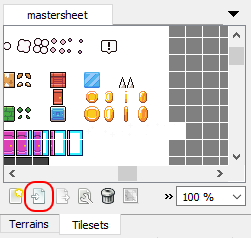

Once imported, properties on selected tiles are editable, and the EntityType can be added:

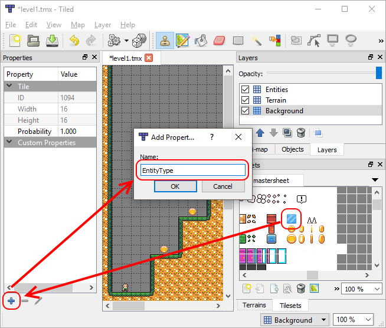

After the property is created, its value can be set to match the new `case` in `TryCreateEntity`:

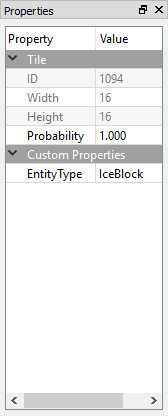

After the tileset has been changed, it must be exported – this makes the changes available for all other levels:

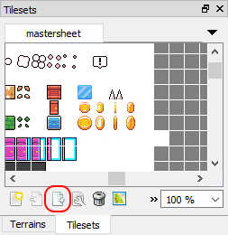

The tileset should overwrite the existing **mastersheet.tsx** tileset:

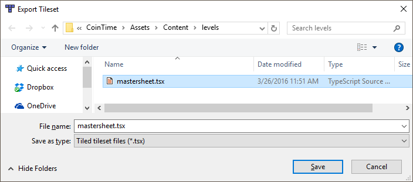


## Entity tile removal

When a tile map is loaded into a game, the individual tiles are static objects. Since entities require custom behavior such as movement, Coin Time code removes tiles when entities are created.

`ProcessTileProperties` includes logic to remove tiles which create entities using the `RemoveTile` method:


```csharp
private void ProcessTileProperties()
{
	TileMapPropertyFinder finder = new TileMapPropertyFinder (currentLevel);
	foreach (var propertyLocation in finder.GetPropertyLocations())
	{
		var properties = propertyLocation.Properties;
		if (properties.ContainsKey ("EntityType"))
		{
			...
			bool created = TryCreateEntity (properties ["EntityType"], worldX, worldY);
			if (created)
			{
				propertyLocation.Layer.RemoveTile (propertyLocation.TileCoordinates);
			}
		}
		...
	}
}
```

This automatic removal of tiles is sufficient for entities which occupy only one tile in the tileset, such as coins and enemies. Larger entities require additional logic and properties.

The Door requires two tiles to be drawn completely:

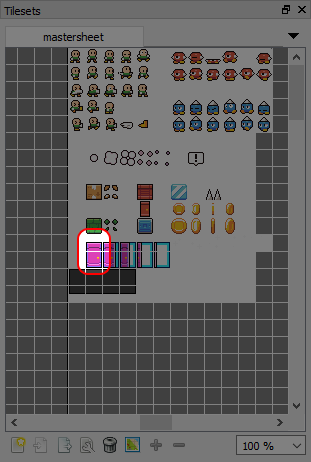

The bottom tile in the door contains the properties for creating an entity (**EntityType** set to **Door**):

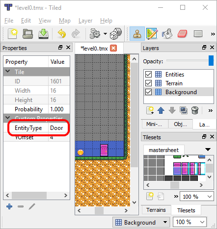

Since only the bottom tile in the door is removed when the Door instance is created, additional logic is needed to remove the top tile at runtime. The top tile has a **RemoveMe** property set to **true**:

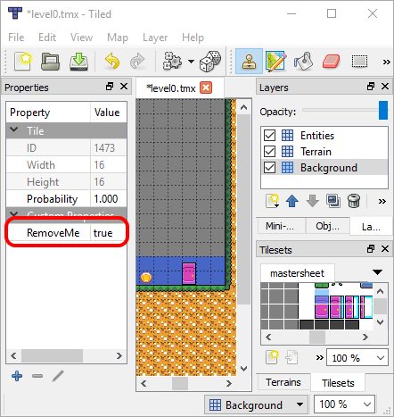


This property is used to remove tiles in `ProcessTileProperties`:


```csharp
private void ProcessTileProperties()
{
	TileMapPropertyFinder finder = new TileMapPropertyFinder (currentLevel);
	foreach (var propertyLocation in finder.GetPropertyLocations())
	{
		var properties = propertyLocation.Properties;
		...
		else if (properties.ContainsKey ("RemoveMe"))
		{
			propertyLocation.Layer.RemoveTile (propertyLocation.TileCoordinates);
		}
	}
}
```


## Entity offsets

Entities created from tiles are positioned by aligning the center of the entity with the center of the tile. Larger entities, like `Door`, use additional properties and logic to be placed correctly. 

The bottom door tile, which defines the `Door` entity placement, specifies a **YOffset** value of 4. Without this property, the `Door` instance is placed at the center of the tile:

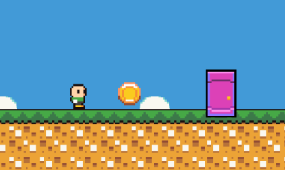

 

This is corrected by applying the **YOffset** value in `ProcessTileProperties`:


```csharp
private void ProcessTileProperties()
{
	TileMapPropertyFinder finder = new TileMapPropertyFinder (currentLevel);
	foreach (var propertyLocation in finder.GetPropertyLocations())
	{
		var properties = propertyLocation.Properties;
		if (properties.ContainsKey ("EntityType"))
		{
			float worldX = propertyLocation.WorldX;
			float worldY = propertyLocation.WorldY;
			if (properties.ContainsKey ("YOffset"))
			{
				string yOffsetAsString = properties ["YOffset"];
				float yOffset = 0;
				float.TryParse (yOffsetAsString, out yOffset);
				worldY += yOffset;
			}
			bool created = TryCreateEntity (properties ["EntityType"], worldX, worldY);
			...
		}
...
	}
}
```


## Animated entities

Coin Time includes several animated entities. The `Player` and `Enemy` entities play walk animations and the `Door` entity plays an opening animation once all coins have been collected.


### .achx files

Coin Time animations are defined in .achx files. Each animation is defined between `AnimationChain` tags, as shown in the following animation defined in **propanimations.achx**:


```xml
<AnimationChain>
  <Name>Spikes</Name>
  <ColorKey>0</ColorKey>
  <Frame>
    <FlipHorizontal>false</FlipHorizontal>
    <FlipVertical>false</FlipVertical>
    <TextureName>..\images\mastersheet.png</TextureName>
    <FrameLength>0.1</FrameLength>
    <LeftCoordinate>1152</LeftCoordinate>
    <RightCoordinate>1168</RightCoordinate>
    <TopCoordinate>128</TopCoordinate>
    <BottomCoordinate>144</BottomCoordinate>
    <RelativeX>0</RelativeX>
    <RelativeY>0</RelativeY>
  </Frame>
</AnimationChain> 
```

This animation only contains a single frame, resulting in the Spike entity displaying a static image. Entities can use .achx files whether they display single or multi-frame animations. Additional frames can be added to .achx files without requiring any changes in code. 

Frames define which image to display in the `TextureName` parameter, and the coordinates of the display in the `LeftCoordinate`, `RightCoordinate`, `TopCoordinate`, and `BottomCoordinate` tags. These represent the pixel coordinates of the frame of animation in the image which is being used – **mastersheet.png** in this case.

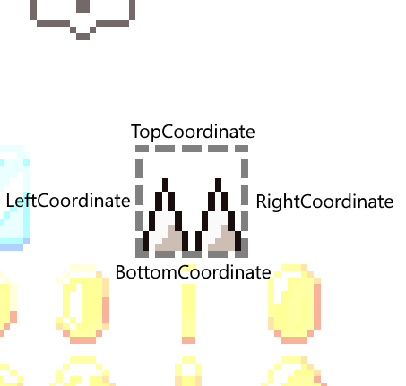

The `FrameLength` property defines the number of seconds that a frame in an animation should be displayed. Single-frame animations ignore this value.

All other AnimationChain properties in the .achx file are ignored by Coin Time.


### AnimatedSpriteEntity

Animation logic is contained in the `AnimatedSpriteEntity` class, which serves as the base class for most entities used in the `GameScene`. It provides the following functionality:

 - Loading of `.achx` files
 - Animation cache of loaded animations
 - CCSprite instance for displaying the animation
 - Logic for changing the current frame

The Spikes constructor provides a simple example of how to load and use animations:


```csharp
public Spikes ()
{
	LoadAnimations ("Content/animations/propanimations.achx");
	CurrentAnimation = animations [0];
}
```

The **propAnimations.achx** only contains one animation, so the constructor accesses this animation by index. If a .achx file contains multiple animations, then animations can be referenced by name, as shown in the `Enemy` constructor:


```csharp
walkLeftAnimation = animations.Find (item => item.Name == "WalkLeft");
walkRightAnimation = animations.Find (item => item.Name == "WalkRight");
```


## Summary

This guide covers the implementation details of coin time. Coin Time is created to be a complete game, but is also a project which can be easily modified and expanded. Readers are encouraged to spend time making modifications to levels, adding new levels, and creating new entities to further understand how Coin Time is implemented.

## Related links

- [Game Project (sample)](https://developer.xamarin.com/samples/mobile/CoinTime/)
