# Using the MonoGame Pipeline Tool

_The MonoGame Pipeline Tool is used to create and manage MonoGame content projects. The files in content projects are processed by the MonoGame Pipeline tool and outputted as .xnb files for use in CocosSharp and MonoGame applications._

The MonoGame Pipeline Tool provides an easy-to-use environment for converting content files into **.xnb** files for use in CocosSharp and MonoGame applications. For information on content pipelines and why they are useful in game development, see [this introduction on content pipelines](~/graphics-games/cocossharp/content-pipeline/introduction.md)

This walkthrough will cover the following:

 - Installing the MonoGame Pipeline Tool
 - Creating a CocosSharp project
 - Creating a content project
 - Processing files in the MonoGame Pipeline Tool
 - Using files at runtime

This walkthrough uses a CocosSharp project to demonstrate how **.xnb** files can be loaded and used in an application. Users of MonoGame will also be able to reference this walkthrough as CocosSharp and MonoGame both use the same **.xnb** content files.

The finished app will display a single sprite displaying a texture from a **.xnb** file and a single label displaying a sprite font from an **.xnb** file:

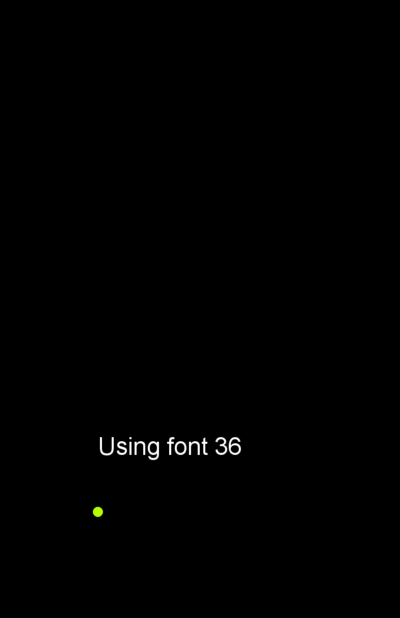


## MonoGame Pipeline Tool discussion

The MonoGame Pipeline Tool is available on Windows, OS X, and Linux. This walkthrough will run the tool on Windows, but it can be followed along on Mac and Linux as well. For information on getting the tool set up on Max or Linux, see [this page](http://www.monogame.net/2015/01/09/monogame-pipeline-tool-available-for-macos-and-linux/).

The MonoGame Pipeline Tool is able to create content for iOS applications even when run on Windows, so developers using [Xamarin Mac Agent](~/ios/get-started/installation/windows/connecting-to-mac/index.md) will be able to continue developing on Windows.


## Installing the MonoGame Pipeline Tool

We will begin by installing the MonoGame, which includes the MonoGame Content Pipeline. Note that the MonoGame Content Pipeline is a separate download for Mac. All MonoGame installers can be found on the [MonoGame Downloads page](http://www.monogame.net/downloads/). We’ll download MonoGame for Visual Studio, but once installed the developer can use MonoGame in Visual Studio for Mac too:

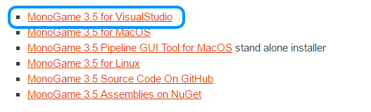

Once downloaded, we’ll run through the installer and accept the defaults options. After the installer finishes, the MonoGame Pipeline Tool is installed, and can be found in the Start menu search:


Launch the MonoGame Pipeline Tool:

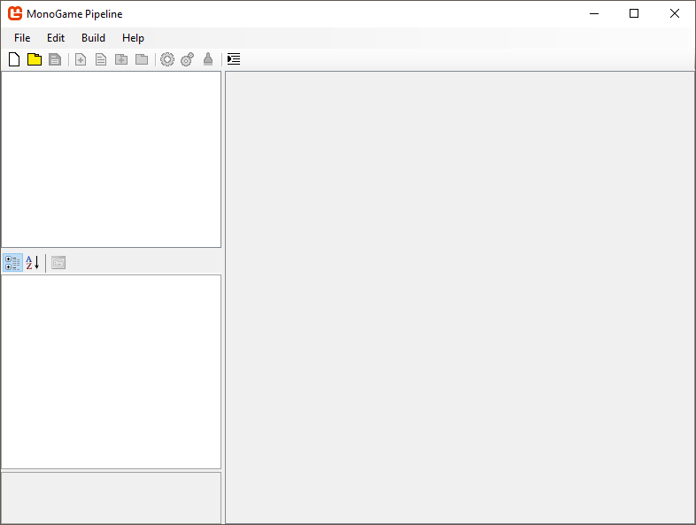

Once the MonoGame Pipeline Tool is running, we can start to make our game and content projects.


## Creating an empty CocosSharp project

The next step is to create a CocosSharp project. It’s important that we create the CocosSharp project first so that we can save our content project in the folder structure created by the CocosSharp project. To understand the structure of a CocosSharp project, take a look at the [BouncingGame](~/graphics-games/cocossharp/bouncing-game.md), which will be using in this guide. However, if you have an existing CocosSharp project that you’d like to add content to, feel free to use that project instead of BouncingGame.

Once the project has been created, we'll run it to verify that it builds and that we have everything set up properly:

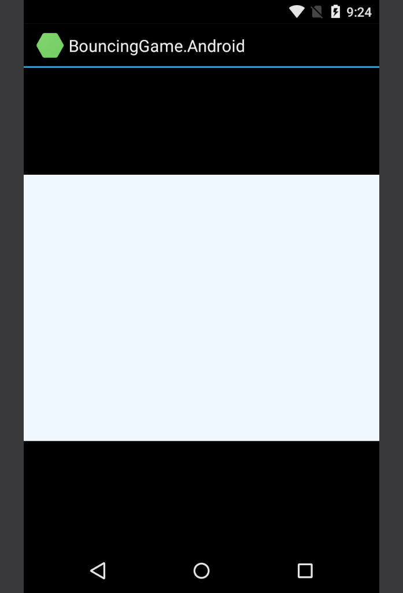


## Creating a content project

Now that we have a game project, we can create a MonoGame Pipeline project. To do this, in the MonoGame Pipeline Tool select **File>New...** and navigate to your project's Content folder. For Android, the folder is located at **[project root]\BouncingGame.Android\Assets\Content\\**. For iOS, the folder is located at **[project root]\BouncingGame.iOS\Content\\**.

Change the **File name** to **ContentProject** and click the **Save** button:

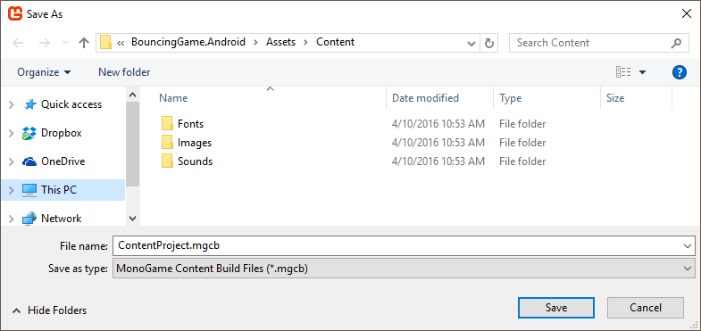

Once the project is created, the MonoGame Pipeline Tool will display information about the project when the root **ContentProject** item is selected:

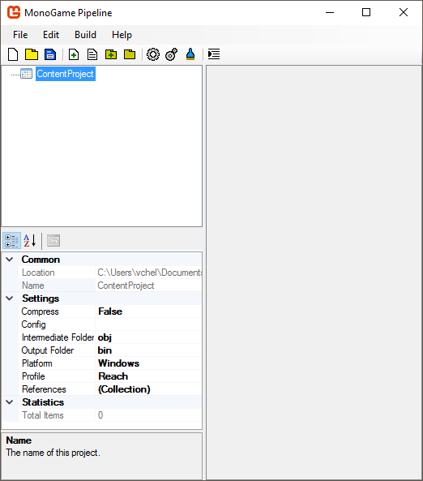

Let’s look at some of the most important options for the content project.


### Output folder

This is the folder (relative to the content project itself) where the output **.xnb** files will be saved. To keep things simple, we’ll use the same folder to hold our input and output files. In other words we’ll change the **Output Folder** to be **.\\** :

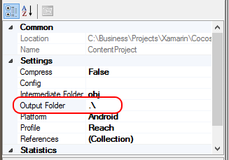


### Platform

This defines the target platform for the content. Notice that this is **Windows** by default, so we’ll want to change this to our target platform which is **Android** (or iOS if following along with an iOS project).

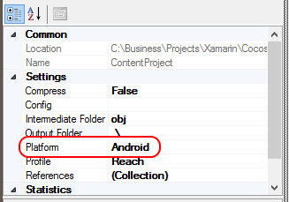


## Processing files in the MonoGame Pipeline Tool

Next, we’ll be adding content to our **ContentProject**. For this project, we’ll be adding files to the root of the project, but larger projects will typically organize their content in folders.

We’ll add two files to our project:

 - A **.png** file which will be used to draw a sprite. This file can [downloaded here](https://github.com/xamarin/mobile-samples/blob/master/BouncingGame/Resources/ball.png?raw=true).
 - A **.spritefont** file which will be used to draw text on screen. The Content Pipeline Tool supports creating new .spritefont files, so there is no file to download.


### Adding a .png file

To add a **.png** file to the project, we’ll first copy it to the same directory as the pipeline project, which has the **.mgcb** extension.

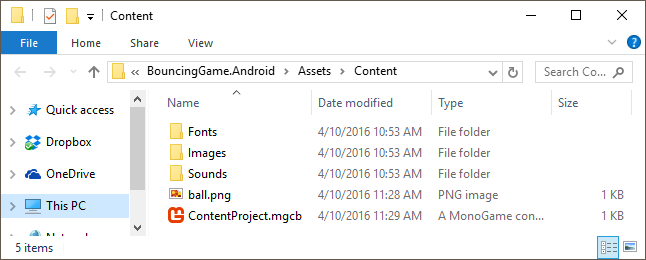

Next, we’ll add the file to the pipeline project. To do this in the MonoGame Pipeline Tool, select **Edit>Add Item...**, select the **ball.png** file and click **Open**. The file will now be part of the content project and, when selected, will display its properties:

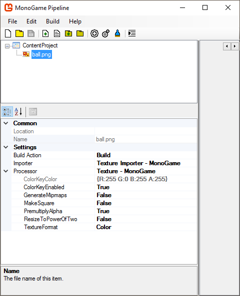

We’ll being leaving all the values at their defaults as no changes are required to load the .xnb file in CocosSharp. We can build the file by selecting the **Build>Build** menu option, which will start a build and display output about the build. We can verify that the build worked correctly by checking the **Content** folder for a new **ball.xnb** file:

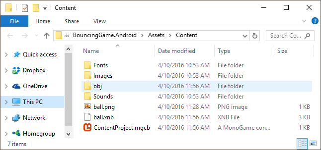


### Adding a .spritefont file

We can create .spritefont file through the MonoGame Pipeline Tool. CocosSharp requires fonts to be in a **Fonts** folder, and CocosSharp templates automatically create a Fonts folder automatically. We can add this folder to the MonoGame Pipeline Tool by selecting **Edit>Add>Existing Folder...**. Browse to the **Content** folder and select the **Fonts** folder and click **OK**:

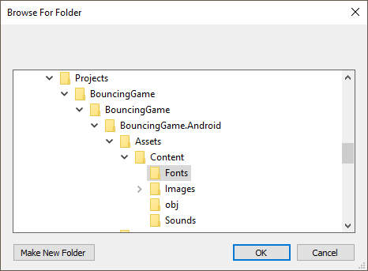

To add a new .sprintefont file, right-click on the Fonts folder and select **Add>New Item...**, select the **SpriteFont Description** option, enter the name **arial-36**, and click **Ok**. CocosSharp requires very specific naming of font files – they must be in the format of [FontType]-[FontSize]. If a font does not match this naming format it will not be loaded by CocosSharp at runtime.

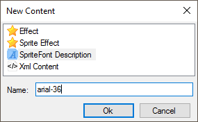

The .spritefont file is actually an XML file which can be edited in any text editor, including Visual Studio for Mac. The most common variables edited in a .spritefont file are the `FontName` and `Size` property:


```xml
    <!-- Modify this string to change the font that will be imported. -->
    <FontName>Arial</FontName>

    <!-- Size is a float value, measured in points. 
    Modify this value to change the size of the font. -->
    <Size>12</Size> 
```

We’ll open the file in any text editor. As our **arial-36.spritefont** name suggests, we’ll leave the `FontName` as `Arial` but change the `Size` value to `36`:


```xml
    <!-- Modify this string to change the font that will be imported. -->
    <FontName>Arial</FontName>   
  
    <!-- Size is a float value, measured in points. 
    Modify this value to change the size of the font. -->4/10/2016 12:57:28 PM 
    <Size>36</Size>
```
 
## Using files at runtime

The .xnb files are now built and ready to be used in our project. We’ll be adding the files to Visual Studio for Mac then we’ll add code to our `GameScene.cs` file to load these files and display them.


### Adding .xnb files to Visual Studio for Mac

First we’ll add the files to our project. In Visual Studio for Mac, we’ll expand the **BouncingGame.Android** project, expand the **Assets** folder, right-click on the **Content** folder, and select **Add>Add Files....** First, we’ll select the **ball.xnb** we built earlier and click **Open**. Then repeat the above steps, but add the **arial-36.xnb** file. We’ll select the **Keep the file in its current subdirectory** option if Visual Studio for Mac asks how to add the file. Once finished both files should be part of our project:

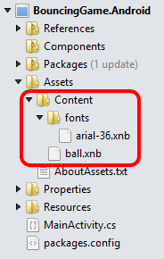


### Adding **GameScene.cs**

We’ll create a class called `GameScene,` which will contain our sprite and text objects. To do this, right-click on the **BouncingGame** (not BouncingGame.Android) project and select **Add>New File...**. Select the **General** category, select the **Empty Class** option, and then enter the name **GameScene**.

Once created, we’ll modify the `GameScene.cs` file to contain the following code:


```csharp
using System;
using CocosSharp;

namespace BouncingGame
{
    public class GameScene : CCScene
    {
        // All visual elements must be added to a CCLayer:
        CCLayer mainLayer;

        // The CCSprite is used to display the "ball" texture
        CCSprite sprite;
        // The CCLabelTtf is used to display the Arial36 sprite font
        CCLabelTtf label;

        public GameScene(CCWindow mainWindow) : base(mainWindow)
        {
            // Instantiate the CCLayer first:
            mainLayer = new CCLayer ();
            AddChild (mainLayer);

            // Now we can create the Sprite using the ball.xnb file:
            sprite = new CCSprite ("ball");
            sprite.PositionX = 200;
            sprite.PositionY = 200;
            mainLayer.AddChild (sprite);

            // The font name (arial) and size (36) need to match 
            // the .spritefont definition and file name.  
            label = new CCLabelTtf ("Using font 36", "arial", 36);
            label.PositionX = 200;
            label.PositionY = 300;
            mainLayer.AddChild (label);
        }
    }
} 
```

We won’t be discussing the code above since working with CocosSharp visual objects like CCSprite and CCLabelTtf is covered in the [BouncingGame guide](~/graphics-games/cocossharp/bouncing-game.md).

We also need to add code to load our newly-created `GameScene`. To do this we’ll open the `GameAppDelegate.cs` file (which is located in the **BouncingGame** PCL) and modify the `ApplicationDidFinishLaunching` method so it looks like:


```csharp
public override void ApplicationDidFinishLaunching (CCApplication application, CCWindow mainWindow)
{
    application.PreferMultiSampling = false;
    application.ContentRootDirectory = "Content";

    // New code:
    GameScene gameScene = new GameScene (mainWindow);
    mainWindow.RunWithScene (gameScene);
} 
```

When running, our game will look like:


## Summary

This walkthrough showed how to use the MonoGame Pipeline Tool to create .xnb files from an input .png file as well as how to create a new .xnb file from a newly-created .sprintefont file. It also discussed how to structure CocosSharp projects to use .xnb files and how to load these files at runtime.

## Related links

- [MonoGame Downloads](http://www.monogame.net/downloads/)
- [MonoGame Pipeline Documentation](http://www.monogame.net/documentation/?page=Pipeline)
- [Starting BouncingGame Project for Android (sample)](https://developer.xamarin.com/samples/monodroid/BouncingGameCompleteAndroid/)
- [ball.png Graphic (sample)](https://github.com/xamarin/mobile-samples/blob/master/BouncingGame/Resources/ball.png?raw=true)
