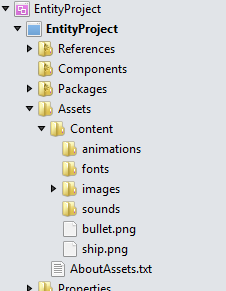
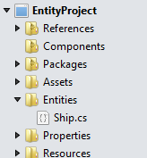
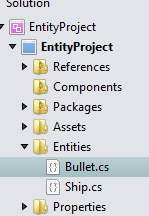
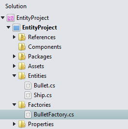

# Entities in CocosSharp

_The entity pattern is a powerful way to organize game code. It improves readability, makes code easier to maintain, and leverages built-in parent/child functionality._

The entity pattern can improve a developer’s efforts with CocosSharp through improved code organization. This walkthrough will be a hands-on example showing how to create two entities – a Ship entity and a Bullet entity. These entities will be self-contained objects, which means that once instantiated they will automatically be rendered and will perform movement logic as appropriate for their type. 

This guide covers the following topics:

 - Introduction to game entities
 - General vs. specific entity types
 - Project setup
 - Creating entity classes
 - Adding entity instances to the `GameLayer`
 - Reacting to entity logic in the `GameLayer`

The finished game will look like this:


## Introduction to game entities

Game entities are classes that define objects needing rendering, collision, physics, or artificial intelligence logic. Fortunately, the entities present in a game’s code base often match the conceptual objects in a game. When this is true, identifying the entities needed in a game can be more easily accomplished. 

For example, a space themed [shoot ‘em up game](https://en.wikipedia.org/wiki/Shoot_%27em_up) may include the following entities:

 - `PlayerShip`
 - `EnemyShip`
 - `PlayerBullet`
 - `EnemyBullet`
 - `CollectableItem`
 - `HUD`
 - `Environment`

These entities would be their own classes in the game, and each instance would require little or no setup beyond instantiation.


## General vs. specific entity types

One of the first questions faced by game developers using an entity system is how much to generalize their entities. The most specific of implementations would define classes for every type of entity, even if they differ by few characteristics. More general systems will combine groups of entities into one class, and allow instances to be customized.

For example we can imagine a space game that defines the following classes:

 - `PlayerDogfighter`
 - `PlayerBomber`
 - `EnemyMissileShip`
 - `EnemyLaserShip`

A more-generalized approach would be to create a single class for player ships and a single class for enemy ships, which could be configured to support different ship types. Customization may include which image to load, which type of bullet entities to create when shooting, movement coefficients, and AI logic for the enemy ships. In this case the list of entities may be reduced to:

 - `PlayerShip`
 - `EnemyShip`

Of course, these entity types can be further generalized by allowing per-instance customization for controlling movement. Player ship instances would read from input while enemy ship instances may perform AI logic. This means that the entities could be generalized even further into a single class:

 - `Ship`

The generalization can continue even further – a game may use a single base class for all entities. This single class, which may be called `GameEntity`, would be the class used for every entity instance in the entire game, including entities that are not ships such as bullets and collectible items (power-ups).

This most general of systems is often referred to as a *component system*. In such a system, game entities can have individual components such as physics, AI, or rendering components added to customize behavior and appearance. Pure component-based systems enable ultimate flexibility and can avoid issues caused by the use of inheritance such as complex inheritance chains. As with other generalizations, effective component systems can be difficult to set up and can reduce the expressiveness of code.

The level of generalization used depends on many considerations, including:

 - Game size – smaller games can afford to create specific classes, while larger games may be difficult to manage with a large number of classes.
 - Data driven development – games that rely on data (images, 3D models, and data files such as JSON or XML) may benefit from having generalized entity types, and configuring the specifics based on data. This is especially import for games that expect to add new content during development or after the game has been released.
 - Game engine patterns – some game engines strongly encourage the usage of component systems while others allow developers to decide how to organize entities. CocosSharp does not require the usage of a component system, so developers are free to implement any type of entity. 

For the sake of simplicity, we’ll be using a specific class-based approach with a single ship and bullet entity for this tutorial.


## Project setup

Before we begin implementing our entities, we need to create a project. We’ll be using the CocosSharp project templates to simplify project creation. [Check this post](http://forums.xamarin.com/discussion/26822/cocossharp-project-templates-for-xamarin-studio) for information on creating a CocosSharp project from the Visual Studio for Mac templates. The remainder of this guide will use the project name **EntityProject**.

Once our project is created we’ll set the resolution of our game to run at 480x320. To do this, call `CCScene.SetDefaultDesignResolution` in the `GameAppDelegate.ApplicationDidFinishLaunching` method as follows:


```csharp
public override void ApplicationDidFinishLaunching (CCApplication application, CCWindow mainWindow)
{
    ...

    // New code for resolution setting:
    CCScene.SetDefaultDesignResolution(480, 320, CCSceneResolutionPolicy.ShowAll);
    
    CCScene scene = new CCScene (mainWindow);
    GameLayer gameLayer = new GameLayer ();

    scene.AddChild (gameLayer);
    mainWindow.RunWithScene (scene);
} 
```

For more information on dealing with CocosSharp resolutions, see our [guide on Handling Multiple Resolutions in CocosSharp](~/graphics-games/cocossharp/resolutions.md).


## Adding content to the project

Once our project has been created, we will add the files contained in [this content zip file](https://github.com/xamarin/mobile-samples/blob/master/BouncingGame/Resources/Entities.zip?raw=true). To do this, download the zip file and unzip it. Add both **ship.png** and **bullet.png** to the **Content** folder. The **Content** folder will be inside the **Assets** folder on Android, and will be at the root of the project on iOS. Once added, we should see both files in the **Content** folder:




## Creating the ship entity

The `Ship` class will be our game’s first entity. To add a `Ship` class, first create a folder called **Entities** at the root level of the project. Add a new class in the **Entities** folder called `Ship`:



The first change we’ll make to our `Ship` class is to let it inherit from the `CCNode` class. `CCNode` serves as the base class for common CocosSharp classes like `CCSprite` and `CCLayer`, and gives us the following functionality:

 - `Position` property for moving the ship around the screen.
 - `Children` property for adding a `CCSprite.`
 - `Parent` property, which can be used to attach `Ship` instances to other `CCNodes`. We won’t be using this feature in this tutorial; larger games often take advantage of attaching entities to other `CCNodes`. 
 - `AddEventListener` method for responding to input for moving the ship.
 - `Schedule` method for shooting bullets.

We’ll also add a `CCSprite` instance so that our ship can be seen on screen:


```csharp
using System;
using CocosSharp;

namespace EntityProject
{
    public class Ship : CCNode
    {
        CCSprite sprite;

        public Ship () : base()
        {
            sprite = new CCSprite ("ship.png");
            // Center the Sprite in this entity to simplify
            // centering the Ship when it is instantiated
            sprite.AnchorPoint = CCPoint.AnchorMiddle;
            this.AddChild(sprite);
        }
    }
}
```

Next, We’ll add the ship to our `GameLayer` to see it show up in our game:


```csharp
public class GameLayer : CCLayer
{
    Ship ship;

    public GameLayer ()
    {
        ship = new Ship ();
        ship.PositionX = 240;
        ship.PositionY = 50;
        this.AddChild (ship);
    } 
 	...
```

If we run our game we will now see our Ship entity:


### Why inherit from CCNode instead of CCSprite?

At this point our `Ship` class is a simple wrapper for a `CCSprite` instance. Since `CCSprite` also inherits from `CCNode`, we could have inherited directly from `CCSprite`, which would have reduced the code in `Ship.cs`. Furthermore, inheriting directly from `CCSprite` reduces the number of in-memory objects and can improve performance by making the dependency tree smaller.

Despite these benefits, we inherited from `CCNode` to hide some of the `CCSprite` properties from each instance. For example, the `Texture` property should not be modified outside of the `Ship` class, and inheriting from `CCNode` allows us to hide this property. The public members of our entities become especially important as a game grows larger and as additional developers are added to a team.


## Adding input to the ship

Now that our ship is visible on screen we will be adding input. Our approach will be similar to the approach taken in the [BouncingGame guide](~/graphics-games/cocossharp/bouncing-game.md), except that we will be placing the code for movement in the `Ship` class rather than in the containing `CCLayer` or `CCScene`.

Add the code to `Ship` to support moving it to wherever the user is touching the screen:


```csharp
public class Ship : CCNode
{
    CCSprite sprite;

    CCEventListenerTouchAllAtOnce touchListener;

    public Ship () : base()
    {
        sprite = new CCSprite ("ship.png");
        // Center the Sprite in this entity to simplify
        // centering the Ship on screen
        sprite.AnchorPoint = CCPoint.AnchorMiddle;
        this.AddChild(sprite);

        touchListener = new CCEventListenerTouchAllAtOnce();
        touchListener.OnTouchesMoved = HandleInput;
        AddEventListener(touchListener, this);

    }

    private void HandleInput(System.Collections.Generic.List<CCTouch> touches, CCEvent touchEvent)
    {
        if(touches.Count > 0)
        {
            CCTouch firstTouch = touches[0];

            this.PositionX = firstTouch.Location.X;
            this.PositionY = firstTouch.Location.Y;
        } 
    }
} 
```

Many shoot ‘em up games implement a maximum velocity, mimicking traditional controller-based movement. That said, we’ll simply implement immediate movement to keep our code shorter.


## Creating the bullet entity

The second entity in our simple game is an entity for displaying bullets. Just like the `Ship` entity, the `Bullet` entity will contain a `CCSprite` so that it appears on screen. The logic for movement differs in that it does not depend on user input for movement; rather, `Bullet` instances will move in a straight line using velocity properties.

First we’ll add a new class file to our **Entities** folder and call it **Bullet**:



Once added we’ll modify the `Bullet.cs` code as follows:


```csharp
using System;
using CocosSharp;

namespace EntityProject
{
    public class Bullet : CCNode
    {
        CCSprite sprite;

        public float VelocityX
        {
            get;
            set;
        }

        public float VelocityY
        {
            get;
            set;
        }

        public Bullet () : base()
        {
            sprite = new CCSprite ("bullet.png");
            // Making the Sprite be centered makes
            // positioning easier.
            sprite.AnchorPoint = CCPoint.AnchorMiddle;
            this.AddChild(sprite);

            this.Schedule (ApplyVelocity);
        }

        void ApplyVelocity(float time)
        {
            PositionX += VelocityX * time;
            PositionY += VelocityY * time;
        }
    }
} 
```

Aside from changing the file used for the `CCSprite` to `bullet.png`, the code in `ApplyVelocity` includes movement logic which is based on two coefficients: `VelocityX` and `VelocityY`.

The `Schedule` method allows adding delegates to be called every-frame. In this case we’re adding the `ApplyVelocity` method so that our bullet moves according to its velocity values. The `Schedule` method takes an `Action<float>`, where the float parameter specifies the amount of time (in seconds) since the last frame, which we use to implement time-based movement. Since the time value is measured in seconds, then our velocity values represent movement in *pixels per second*.


## Adding bullets to GameLayer

Before we add any `Bullet` instances to our game we will make a container, specifically a `List<Bullet>`. Modify the `GameLayer` so it includes a list of Bullets:


```csharp
    public class GameLayer : CCLayer
    {
        Ship ship;
        List<Bullet> bullets;

        public GameLayer ()
        {
            ship = new Ship ();
            ship.PositionX = 240;
            ship.PositionY = 50;
            this.AddChild (ship);

            bullets = new List<Bullet> ();
        }
        ... 
```

Next we’ll need to populate the `Bullet` list. The logic for when to create a `Bullet` should be contained in the `Ship` entity, but the `GameLayer` is responsible for storing the list of Bullets. We will use the factory pattern to allow the `Ship` entity to create `Bullet` instances. This factory will expose an event that the `GameLayer` can handle. 

To do this first, we’ll add a folder to our project called **Factories**, and then add a new class called `BulletFactory`:



Next, we’ll implement the `BulletFactory` singleton class:


```csharp
using System;

namespace EntityProject
{
    public class BulletFactory
    {
        static Lazy<BulletFactory> self = 
            new Lazy<BulletFactory>(()=>new BulletFactory());

        // simple singleton implementation
        public static BulletFactory Self
        {
            get
            {
                return self.Value;
            }
        }

        public event Action<Bullet> BulletCreated;

        private BulletFactory()
        {

        }

        public Bullet CreateNew()
        {
            Bullet newBullet = new Bullet ();

            if (BulletCreated != null)
            {
                BulletCreated (newBullet);
            }

            return newBullet;
        }
    }
} 
```

The `Ship` entity will handle creating `Bullet` instances – specifically, it will handle how frequently `Bullet` instances should be created (i.e. how often the bullet is fired), their position, and their velocity.

Modify the `Ship` entity’s constructor to add a new `Schedule` call, and then implement this method as follows:


```csharp
...
public Ship () : base()
{
    sprite = new CCSprite ("ship.png");
    // Center the Sprite in this entity to simplify
    // centering the Ship on screen
    sprite.AnchorPoint = CCPoint.AnchorMiddle;
    this.AddChild(sprite);

    touchListener = new CCEventListenerTouchAllAtOnce();
    touchListener.OnTouchesMoved = HandleInput;
    AddEventListener(touchListener, this);

    Schedule (FireBullet, interval: 0.5f);

}

void FireBullet(float unusedValue)
{
    Bullet newBullet = BulletFactory.Self.CreateNew ();
    newBullet.Position = this.Position;
    newBullet.VelocityY = 100;
} 
...
```

The last step is to handle the creation of new `Bullet` instances in the `GameLayer` code. Add an event handler to the `BulletCreated` event that adds the newly created `Bullet` to the appropriate lists:


```csharp
...
public GameLayer ()
{
    ship = new Ship ();
    ship.PositionX = 240;
    ship.PositionY = 50;
    this.AddChild (ship);

    bullets = new List<Bullet> ();
    BulletFactory.Self.BulletCreated += HandleBulletCreated;
}

void HandleBulletCreated(Bullet newBullet)
{
    AddChild (newBullet);
    bullets.Add (newBullet);
}
... 
```

Now we can run the game and see the `Ship` shooting `Bullet` instances:


## Why GameLayer has ship and bullets members

Our `GameLayer` class defines two fields to hold references to our entity instances (`ship` and `bullets`), but does nothing with them. Furthermore, entities are responsible for their own behavior such as movement and shooting. So why did we add `ship` and `bullets` fields to `GameLayer`?

The reason we added these members is because a full game implementation would require logic in the `GameLayer` for interaction between the different entities. For example, this game may be further developed to include enemies that can be destroyed by the player. These enemies would be contained in a `List` in the `GameLayer`, and logic to test whether `Bullet` instances collide with the enemies would be performed in the `GameLayer` as well. In other words, the `GameLayer` is the root *owner* of all entity instances, and it is responsible for interactions between entity instances.


## Bullet destruction considerations

Our game currently lacks code for destroying `Bullet` instances. Each `Bullet` instance has logic for moving on screen, but we haven’t added any code to destroy any off-screen `Bullet` instances.

Furthermore, the destruction of `Bullet` instances may not belong in `GameLayer`. For example, rather than being destroyed when off-screen, the `Bullet` entity may have logic to destroy itself after a certain amount of time. In this case, the `Bullet` needs a way to communicate that it should be destroyed to the `GameLayer`, much like the `Ship` entity communicated to the `GameLayer` that a new `Bullet` was created through the `BulletFactory`.

The simplest solution is to expand the responsibility of the factory class to  support destruction. Then the factory can be notified of an entity instance being destroyed, which can be handled by other objects, such as the `GameLayer` removing the entity instance from its lists. 

## Summary

This guide shows how to create CocosSharp entities by inheriting from the `CCNode` class. These entities are self-contained objects, handling creation of their own visuals and custom logic. This guide designates code that belongs inside an entity (movement and creation of other entities) from code that belongs in the root entity container (collision and other entity interaction logic).

## Related links

- [CocosSharp API Documentation](https://developer.xamarin.com/api/namespace/CocosSharp/)
- [Content zip](https://github.com/xamarin/mobile-samples/blob/master/BouncingGame/Resources/Entities.zip?raw=true)
