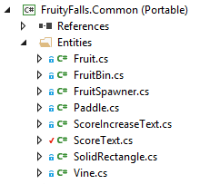
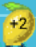
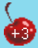
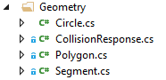
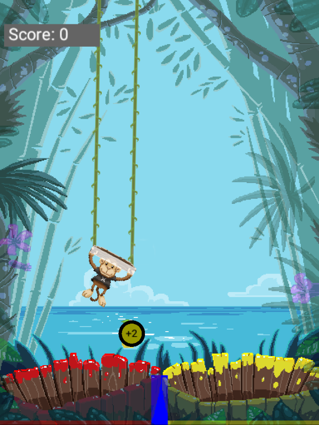
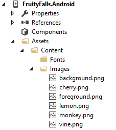
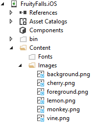
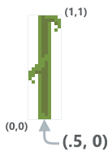
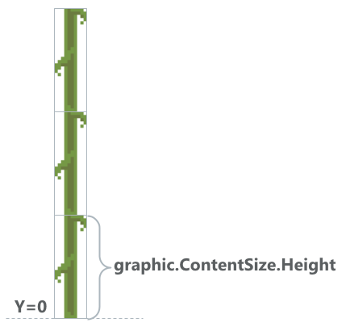
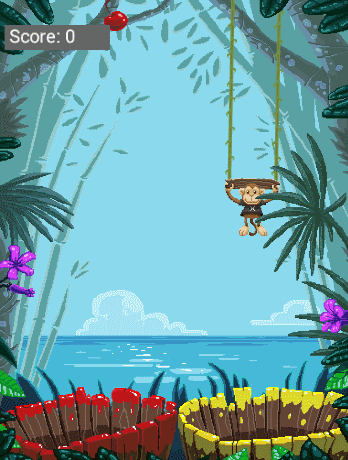

# Fruity Falls game details

_This guide reviews the Fruity Falls game, covering common CocosSharp and game development concepts such as physics, content management, game state, and game design._

Fruity Falls is a simple, physics-based game in which the player sorts red and yellow fruit into colored buckets to earn points. The goal of the game is to earn as many points as possible without letting a fruit drop into the wrong bin, ending the game.


Fruity Falls extends the concepts introduced in the [BouncingGame guide](~/graphics-games/cocossharp/bouncing-game.md) by adding the following:

 - Content in the form of PNGs
 - Advanced physics
 - Game state (transition between scenes)
 - Ability to tune the game coefficients through variables contained in a single class
 - Built-in visual debugging support
 - Code organization using game entities
 - Game design focused on fun and replay value

While the [BouncingGame guide](~/graphics-games/cocossharp/bouncing-game.md) focused on introducing core CocosSharp concepts, Fruity Falls shows how to bring it all together into a finished game product. Since this guide references the BouncingGame, readers should first familiarize themselves with the [BouncingGame guide](~/graphics-games/cocossharp/bouncing-game.md) prior to reading this guide.

This guide covers the implementation and design of Fruity Falls to provide insights to help you make your own game. It covers the following topics:


- [GameController class](#gamecontroller-class)
- [Game entities](#game-entities)
- [Fruit graphics](#fruit-graphics)
- [Physics](#physics)
- [Game content](#game-content)
- [GameCoefficients](#gamecoefficients)


## GameController class

The Fruity Falls PCL project includes a `GameController` class which is responsible for instantiating the game and moving between scenes. This class is used by both the iOS and Android projects to eliminate duplicate code.

The code contained within the `Initialize` method is similar to the code in the`Initialize` method in an unchanged CocosSharp template, but it contains a number of modifications.

By default, the `GameView.ContentManager.SearchPaths` depend on the device’s resolution. As explained below in more detail, Fruity Falls uses the same content regardless of device resolution, so the `Initialize` method adds the `Images` path (with no subfolders) to the `SearchPaths`:


```csharp
contentSearchPaths.Add ("Images");
```

New CocosSharp templates include a class inheriting from `CCLayer`, implying that game visuals and logic should be added to this class. Instead, Fruity Falls uses multiple `CCLayer` instances to control draw order. These `CCLayer` instances are contained within the `GameView` class, which inherits from `CCScene`. Fruity Falls also includes multiple scenes, the first being the `TitleScene`. Therefore, the `Initialize` method instantiates a `TitleScene` instance which is passed to `RunWithScene`:


```csharp
var scene = new TitleScene (GameView);
GameView.Director.RunWithScene (scene);
```

The content for Fruity Falls was created as low-resolution pixel art for aesthetic reasons. The `GameView.DesignResolution` is set so that the game is only 384 units wide and 512 tall:


```csharp
// We use a lower-resolution display to get a pixellated appearance
int width = 384;
int height = 512;
GameView.DesignResolution = new CCSizeI (width, height); 
```

Finally, the `GameController` class provides a static method which can be called by any `CCGameScene` to transition to a different `CCScene`. This method is used to move between the `TitleScene` and the `GameScene`.


## Game entities

Fruity Falls makes use of the entity pattern for most of the game objects. A detailed explanation of this pattern can be found in the [Entities in CocosSharp guide](~/graphics-games/cocossharp/entities.md).

The entity-implementing game objects can be found in the Entities folder in the **FruityFalls.Common** project:



Entities are objects which inherit from `CCNode`, and may have visuals, collision, and every-frame behavior.

The `Fruit` object represents a typical CocosSharp Entity: it contains a visual object, collision, and every-frame logic. Its constructor is responsible for initializing the Fruit:


```csharp
public Fruit ()
{
	CreateFruitGraphic ();
	if (GameCoefficients.ShowCollisionAreas)
	{
		CreateDebugGraphic ();
	}
	CreateCollision ();
	CreateExtraPointsLabel ();
	Acceleration.Y = GameCoefficients.FruitGravity;
}
```


### Fruit graphics

The `CreateFruitGraphic` method creates a `CCSprite` instance and adds it to the `Fruit`. The `IsAntialiased` property is set to false to give the game a pixelated look. This value is set to false on all `CCSprite` and `CCLabel` instances throughout the game:


```csharp
private void CreateFruitGraphic()
{
	graphic = new CCSprite ("cherry.png");
    graphic.IsAntialiased = false;
	this.AddChild (graphic);
}
```

Whenever the player touches a `Fruit` instance with the `Paddle`, the point value of that fruit increases by one. This provides an extra challenge to experienced players to juggle fruit for extra points. The point value of the fruit is displayed using the `extraPointsLabel` instance.

The `CreateExtraPointsLabel` method creates a `CCLabel` instance and adds it to the `Fruit`:


```csharp
private void CreateExtraPointsLabel()
{
	extraPointsLabel = new CCLabel("", "Arial", 12, CCLabelFormat.SystemFont);
	extraPointsLabel.IsAntialiased = false;
	extraPointsLabel.Color = CCColor3B.Black;
	this.AddChild(extraPointsLabel);
}
```

Fruity Falls includes two different types of fruit – cherries and lemons. The `CreateFruitGraphic` assigns a default visual, but the fruit visuals can be changed through the `FruitColor` property, which in turn calls `UpdateGraphics`:


```csharp
private void UpdateGraphics()
{
if (GameCoefficients.ShowCollisionAreas)
	{
		debugGrahic.Clear ();
		const float borderWidth = 4;
		debugGrahic.DrawSolidCircle (
			CCPoint.Zero,
			GameCoefficients.FruitRadius,
			CCColor4B.Black);
		debugGrahic.DrawSolidCircle (
			CCPoint.Zero,
			GameCoefficients.FruitRadius - borderWidth,
			fruitColor.ToCCColor ());
	}
	if (this.FruitColor == FruitColor.Yellow)
	{
		graphic.Texture = CCTextureCache.SharedTextureCache.AddImage ("lemon.png");
		extraPointsLabel.Color = CCColor3B.Black;
		extraPointsLabel.PositionY = 0;
	}
	else
	{
		graphic.Texture = CCTextureCache.SharedTextureCache.AddImage ("cherry.png");
		extraPointsLabel.Color = CCColor3B.White;
		extraPointsLabel.PositionY = -8;
	}
}
```

The first if-statement in `UpdateGraphics` updates the debug graphics, which are used to visualize collision areas. These visuals are turned off before a final release of the game is made, but can be kept on during development for debugging physics. The second part changes the `graphic.Texture` property by calling `CCTextureCache.SharedTextureCache.AddImage`. This method provides access to a texture by file name. More information on this method can be found in the [Texture Caching guide](~/graphics-games/cocossharp/texture-cache.md).

The `extraPointsLabel` color is adjusted to keep contrast with the fruit image, and its `PositionY` value is adjusted to center the `CCLabel` on the fruit’s `CCSprite`:






### Collision

Fruity Falls implements a custom collision solution using objects in the Geometry folder:



Collision in Fruity Falls is implemented using either the `Circle` or `Polygon` object, usually with one of these two types being added as a child of an entity. For example, the `Fruit` object has a `Circle` called `Collision` which it initializes in its `CreateCollision` method:


```csharp
private void CreateCollision()
{
	Collision = new Circle ();
	Collision.Radius = GameCoefficients.FruitRadius;
	this.AddChild (Collision);
}
```

Note that the `Circle` class inherits from the `CCNode` class, so it can be added as a child to our game’s entities:


```csharp
public class Circle : CCNode
{
	...
}
```

`Polygon` creation is similar to `Circle` creation, as shown in the `Paddle` class:


```csharp
private void CreateCollision()
{
    Polygon = Polygon.CreateRectangle(width, height);
	this.AddChild (Polygon);
}
```

Collision logic is covered [later in this guide](#collision).


## Physics

The physics in Fruity Falls can be separated into two categories: movement and collision. 


### Movement using velocity and acceleration

Fruity Falls uses `Velocity` and `Acceleration` values to control the movement of its entities, similar to the [BouncingGame](~/graphics-games/cocossharp/bouncing-game.md). Entities implement their movement logic in a method named `Activity`, which is called once per frame. For example, we can see the implementation of movement in the `Fruit` class’ `Activity` method:

```csharp
public void Activity(float frameTimeInSeconds)
{
    timeUntilExtraPointsCanBeAdded -= frameTimeInSeconds;
	
	// linear approximation:
	this.Velocity += Acceleration * frameTimeInSeconds;

    // This is a linear approximation to drag. It's used to
    // keep the object from falling too fast, and eventually
    // to slow its horizontal movement. This makes the game easier
    this.Velocity -= Velocity * GameCoefficients.FruitDrag * frameTimeInSeconds;
	
	this.Position += Velocity * frameTimeInSeconds;
}
```
The `Fruit` object is unique in its implementation of drag – a value which slows the velocity in relation to how fast the Fruit is moving. This implementation of drag provides a *terminal velocity*, which is the maximum speed that a Fruit instance can fall. Drag also slows down the horizontal movement of fruit, which makes the game slightly easier to play.

The `Paddle` object also applies `Velocity` in its `Activity` method, but its `Velocity` is calculated using a `desiredLocation` value:


```csharp
public void Activity(float frameTimeInSeconds)
{
	// This code will cause the cursor to lag behind the touch point
	// Increasing this value reduces how far the paddle lags
    // behind the player’s finger. 
	const float velocityCoefficient = 4;
	// Get the velocity from current location and touch location
	Velocity = (desiredLocation - this.Position) * velocityCoefficient;
	this.Position += Velocity * frameTimeInSeconds;
	...
}
```

Typically, games which use `Velocity` to control the position of their objects do not directly set entity positions, at least not after initialization. Rather than directly setting the `Paddle` position, the `Paddle.HandleInput` method assigns the `desiredLocation` value:

```csharp
public void HandleInput(CCPoint touchPoint)
{
    desiredLocation = touchPoint;
}
```

### Collision

Fruity Falls implements semi-realistic collision between the fruit and other collidable objects such as the `Paddle` and `GameScene.Splitter`. To help debug collision, Fruity Falls collision areas can be made visible by changing the `GameCoefficients.ShowDebugInfo` in the `GameCoefficients.cs` file:


```csharp
public static class GameCoefficients
{
    ... 
    public const bool ShowCollisionAreas = true;
	...
}
```

Setting this value to `true` enables the rendering of collision areas:	



Collision logic begins in the `GameScene.Activity` method:


```csharp
private void Activity(float frameTimeInSeconds)
{
    if (hasGameEnded == false)
    {
        paddle.Activity(frameTimeInSeconds);
        foreach (var fruit in fruitList)
        {
            fruit.Activity(frameTimeInSeconds);
        }
        spawner.Activity(frameTimeInSeconds);
        DebugActivity();
        PerformCollision();
    }
}
```

`PerformCollision` handles colliding all `Fruit` instances with other objects: 


```csharp
private void PerformCollision()
{
    // reverse for loop since fruit may be destroyed:
    for(int i = fruitList.Count - 1; i > -1; i--)
    {
        var fruit = fruitList[i];
        FruitVsPaddle(fruit);
        FruitPolygonCollision(fruit, splitter.Polygon, CCPoint.Zero);
        FruitVsBorders(fruit);
        FruitVsBins(fruit);
    }
}
```

#### FruitVsBorders

`FruitVsBorders` collision performs its own logic for collision rather than relying on logic contained in a different class. This difference exists because the collision between fruit and the screen’s borders is not perfectly solid – it is possible for fruit to be pushed off the edge of the screen by careful paddle movement. Fruit will bounce off of the screen when hit with the paddle, but if the player slowly pushes fruit it will  move past the edge and off the screen:


```csharp
private void FruitVsBorders(Fruit fruit)
{
    if(fruit.PositionX - fruit.Radius < 0 && fruit.Velocity.X < 0)
    {
        fruit.Velocity.X *= -1 * GameCoefficients.FruitCollisionElasticity;
    }
    if(fruit.PositionX + fruit.Radius > gameplayLayer.ContentSize.Width && fruit.Velocity.X > 0)
    {
        fruit.Velocity.X *= -1 * GameCoefficients.FruitCollisionElasticity;
    }
    if(fruit.PositionY + fruit.Radius > gameplayLayer.ContentSize.Height && fruit.Velocity.Y > 0)
    {
        fruit.Velocity.Y *= -1 * GameCoefficients.FruitCollisionElasticity;
    }
}
```

#### FruitVsBins

The `FruitVsBins` method is responsible for checking if any fruit has fallen into one of the two bins. If so, then the player is awarded points (if the fruit/bin colors match) or the game ends (if the colors do not match):


```csharp
private void FruitVsBins(Fruit fruit)
{
    foreach(var bin in fruitBins)
    {
        if(bin.Polygon.CollideAgainst(fruit.Collision))
        {
            if(bin.FruitColor == fruit.FruitColor)
            {
                // award points:
                score += 1 + fruit.ExtraPointValue;
                scoreText.Score = score;
                Destroy(fruit);
            }
            else
            {
                EndGame();
            }
            break;
        }
    }
}
```

#### FruitVsPaddle and FruitPolygonCollision

Fruit vs. paddle and fruit vs. splitter (the area separating the two bins) collision both rely on the `FruitPolygonCollision` method. This method has three parts:

1. Test whether the objects collide
1. Move the objects (just the Fruit in Fruity Falls) so that they no longer overlap
1. Adjust the velocity of the objects (just the Fruit in Fruity Falls) to simulate a bounce
The following code demonstrates the points made above:


```csharp
private static bool FruitPolygonCollision(Fruit fruit, Polygon polygon, CCPoint polygonVelocity)
{
    // Test whether the fruit collides
    bool didCollide = polygon.CollideAgainst(fruit.Collision);
    if (didCollide)
    {
        var circle = fruit.Collision;
        // Get the separation vector to reposition the fruit so it doesn't overlap the polygon
        var separation = CollisionResponse.GetSeparationVector(circle, polygon);
        fruit.Position += separation;
        // Adjust the fruit's Velocity to make it bounce:
        var normal = separation;
        normal.Normalize();
        fruit.Velocity = CollisionResponse.ApplyBounce(
            fruit.Velocity, 
            polygonVelocity, 
            normal, 
            GameCoefficients.FruitCollisionElasticity);
    }
    return didCollide;
}
```

Fruity Falls collision response is one-sided – only the fruit’s velocity and position are adjusted. It’s worth noting that other games may have collision which impacts both objects involved, such as a character pushing a boulder or two cars crashing into each other.

The math behind the collision logic contained in the `Polygon` and `CollisionResponse` classes is beyond the scope of this guide, but as-written, these methods can be used for many types of games. The Polygon and `CollisionResponse` classes even support non-rectangular and convex polygons, so this code can be used for many types of games.

 


## Game content

The art in Fruity Falls immediately distinguishes the game from the BouncingGame. While the game designs are similar, players will immediately see a difference in how the two games look. Gamers often decide whether to try a game by its visuals. Therefore, it is vitally important that developers invest resources in making a visually appealing game.

The art for Fruity Falls was created with the following goals:

 - Consistent theme
 - Emphasis on just one character – the Xamarin monkey
 - Bright colors to create a relaxing, enjoyable experience
 - Contrast between the background and foreground so gameplay objects are easy to track visually
 - Ability to create simple visual effects without resource-heavy animations


### Content location

Fruity Falls includes all of its content in the Images folder in the Android project:



These same files are linked in the iOS project to avoid duplication, and so changes to the files impact both projects:



It’s worth noting that the content is not contained within the **Ld** or **Hd** folders, which are part of the default CocosSharp template. The **Ld** and **Hd** folders are intended to be used for games which provide two sets of content – one for lower-resolution devices, such as phones, and one for higher-resolution devices, such as tablets. The Fruity Falls art is intentionally created with a pixelated aesthetic, so it does not need to provide content for different screen sizes. Therefore, the **Ld** and **Hd** folders have been completely removed from the project.


### GameScene layering

As mentioned earlier in this guide, the `GameScene` is responsible for all game object instantiation, positioning, and inter-object logic (such as collision). All objects are added to one of four `CCLayer` instances:


```csharp
CCLayer backgroundLayer;
CCLayer gameplayLayer;
CCLayer foregroundLayer;
CCLayer hudLayer;
```

These four layers are created in the `CreateLayers` method. Note that they are added to the `GameScene` in order of back-to-front:


```csharp
private void CreateLayers()
{
    backgroundLayer = new CCLayer();
    this.AddLayer(backgroundLayer);
    gameplayLayer = new CCLayer();
    this.AddLayer(gameplayLayer);
    foregroundLayer = new CCLayer();
    this.AddLayer(foregroundLayer);
    hudLayer = new CCLayer();
    this.AddLayer(hudLayer);
}
```

Once the layers are created, all visual objects are added to the layers using the `AddChild` method, as shown in the `CreateBackground` method:


```csharp
private void CreateBackground()
{
    var background = new CCSprite("background.png");
    background.AnchorPoint = new CCPoint(0, 0);
    background.IsAntialiased = false;
    backgroundLayer.AddChild(background);
}
```


### Vine entity

The `Vine` entity is uniquely used for content – it has no impact on gameplay. It is composed of twenty `CCSprite` instances, a number selected by trial and error to make sure the vine always reaches the top of the screen:


```csharp
public Vine ()
{
	const int numberOfVinesToAdd = 20;
	for (int i = 0; i < numberOfVinesToAdd; i++)
	{
		var graphic = new CCSprite ("vine.png");
        graphic.AnchorPoint = new CCPoint(.5f, 0);
		graphic.PositionY = i * graphic.ContentSize.Height;
		this.AddChild (graphic);
	}
}
```

The first `CCSprite` is positioned so its bottom edge matches the position of the vine. This is accomplished by setting the AnchorPoint to `new CCPoint(.5f, 0)`. The `AnchorPoint` property uses *normalized coordinates* which range between 0 and 1 regardless of the size of the `CCSprite`:



Subsequent vine sprites are positioned using the `graphic.ContentSize.Height` value, which returns the height of the image in pixels. The following diagram shows how the vine graphic tiles upward:



Since the origin of the `Vine` entity is at the bottom of the vine, then positioning it is straightforward, as is shown in the `Paddle.CreateVines` method:


```csharp
private void CreateVines()
{
    // Increasing this value moves the vines closer to the 
    // center of the paddle.
    const int vineDistanceFromEdge = 4;
    leftVine = new Vine ();
    var leftEdge = -width / 2.0f;
    leftVine.PositionX = leftEdge + vineDistanceFromEdge;
    this.AddChild (leftVine);
    rightVine = new Vine ();
    var rightEdge = width / 2.0f;
    rightVine.PositionX = rightEdge - vineDistanceFromEdge;
    this.AddChild (rightVine);
}
```

The Vine instances in the `Paddle` entity also have interesting rotation behavior. Since the `Paddle` entity as a whole rotates according to player input (which this guide covers in more detail below), the `Vine` instances are also impacted by this rotation. However, rotating the `Vine` instances along with the `Paddle` produces an undesirable visual effect as shown in the following animation:



To counteract the `Paddle` rotation, the `leftVine` and `rightVine` instances are rotated the opposite direction of the paddle, as shown in the `Paddle.Activity` method:


```csharp
public void Activity(float frameTimeInSeconds)
{
	...
	// This value adds a slight amount of rotation
   	// to the vine. Having a small amount of tilt looks nice.
	float vineAngle = this.Velocity.X / 100.0f;
	leftVine.Rotation = -this.Rotation + vineAngle;
	rightVine.Rotation = -this.Rotation + vineAngle;
}
```

Notice that a small amount of rotation is added back to the vine through the `vineAngle` coefficient. This value can be changed to adjust how much the vines rotate.


## GameCoefficients

Every good game is the product of iteration, so Fruity Falls includes a class called `GameCoefficients` which controls how the game is played. This class contains expressive variables which are used throughout the game to control physics, layout, spawning, and scoring.

For example, the Fruit physics are controlled by the following variables:


```csharp
public static class GameCoefficients
{
    ...
    
    // The strength of the gravity. Making this a 
    // smaller (bigger negative) number will make the
    // fruit fall faster. A larger (smaller negative) number
    // will make the fruit more floaty.
    public const float FruitGravity = -60;
    // The impact of "air drag" on the fruit, which gives
    // the fruit terminal velocity (max falling speed) and slows
    // the fruit's horizontal movement (makes the game easier)
    public const float FruitDrag = .1f;
    // Controls fruit collision bouncyness. A value of 1
    // means no momentum is lost. A value of 0 means all
    // momentum is lost. Values greater than 1 create a spring-like effect
    public const float FruitCollisionElasticity = .5f;
    
    ...
}
```

As the names imply, these variables can be used to adjust how fast fruit falls, how horizontal movement slows down over time, and paddle bounciness.

Game coefficients stored in code or data files (such as XML) can be especially valuable for teams with game designers who are not also programmers.

The `GameCoefficients` class also includes values for turning on debug information such as spawning information or collision areas:


```csharp
public static class GameCoefficients
{
    ...
    // This controls whether debug information is displayed on screen.
    public const bool ShowDebugInfo = false;
    public const bool ShowCollisionAreas = false;
    ...
}
```


## Conclusion

This guide explored the Fruity Falls game. It covered concepts including content, physics, and game state management.

## Related links

- [CocosSharp API Documentation](https://developer.xamarin.com/api/namespace/CocosSharp/)
- [Completed project (sample)](https://developer.xamarin.com/samples/mobile/FruityFalls/)
