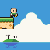
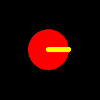
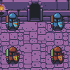
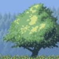
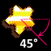
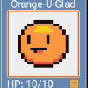

# CocosSharp 2D Game Engine

_CocosSharp is a library for building 2D games using C# and F#. It is
a .NET port of the popular Cocos2D engine._

## Introduction to CocosSharp

The CocosSharp 2D game engine provides technology for making
cross-platform games. For a full list of supported platforms see the
[CocosSharp wiki on GitHub](https://github.com/mono/CocosSharp/wiki).
These guides use C# for code samples, although CocosSharp is fully
functional with F# as well.

The core of CocosSharp is provided by the [MonoGame
framework](http://www.monogame.net/), which is itself a cross-platform,
hardware accelerated API providing graphics, audio, game state
management, input, and a content pipeline for importing assets.
CocosSharp is an efficient abstraction layer well suited for 2D games.
Furthermore, larger games can perform their own optimizations outside of
their core libraries as games grows in complexity. In other words,
CocosSharp provides a mix of ease of use and performance, enabling
developers to get started quickly without limiting game size or
complexity.

This hands-on video shows how to create a simple cross-platform
CocosSharp game:

> [!Video https://channel9.msdn.com/Shows/Visual-Studio-Toolbox/Developing-Cross-platform-2D-Games-in-C-and-CocosSharp/player]

## [BouncingGame](~/graphics-games/cocossharp/bouncing-game.md)

This guide describes BouncingGame, including how to work with game
content, the various visual elements used to build a game, adding game
logic, and more.

## [Fruity Falls game](~/graphics-games/cocossharp/fruity-falls.md)

This guide describes the Fruity Falls game, covering common CocosSharp and game development concepts such as physics, content management, game state, and game design.  

## [Coin Time game](~/graphics-games/cocossharp/cointime.md)

Coin Time is a full platformer game for iOS and Android. The goal of the game is to collect all of the coins in a level and then reach the exit door while avoiding enemies and obstacles.

## [Drawing geometry with CCDrawNode](~/graphics-games/cocossharp/ccdrawnode.md)

CCDrawNode provides methods for drawing primitive objects such as lines, circles, and triangles.

## [Animating with CCAction](~/graphics-games/cocossharp/ccaction.md)

`CCAction` is a base class that can be used to animate CocosSharp objects. This guide covers built-in `CCAction` implementations for common tasks such as positioning, scaling, and rotating. It also looks at how to create custom implementations by inheriting from `CCAction`.

## [Using Tiled with CocosSharp](~/graphics-games/cocossharp/tiled.md)

Tiled is a powerful, flexible, and mature application for creating orthogonal and isometric tile maps for games. CocosSharp provides built-in integration for Tiled’s native file format.

## [Entities in CocosSharp](~/graphics-games/cocossharp/entities.md)

The entity pattern is a powerful way to organize game code. It improves readability, makes code easier to maintain, and leverages built-in parent/child functionality.

## [Handling multiple resolutions in CocosSharp](~/graphics-games/cocossharp/resolutions.md)

This guide shows how to work with CocosSharp to develop games that display properly on devices of varying resolutions.

## [CocosSharp Content Pipeline](~/graphics-games/cocossharp/content-pipeline/index.md)

Content pipelines are often used in game development to optimize content and format it such that it can be loaded on certain hardware or with certain game development frameworks.

## [Improving frame rate with CCSpriteSheet](~/graphics-games/cocossharp/ccspritesheet.md)

`CCSpriteSheet` provides functionality for combining and using many image files in one texture. Reducing texture count can improve a game’s load times and framerate.

## [Texture caching using CCTextureCache](~/graphics-games/cocossharp/texture-cache.md)

CocosSharp’s `CCTextureCache` class provides a standard way to organize, cache, and unload content. 

## [2D math with CocosSharp](~/graphics-games/cocossharp/math.md)

This guide covers 2D mathematics for game development. It uses CocosSharp to show how to perform common game development tasks and explains the math behind these tasks.

## [Performance and visual effects with CCRenderTexture](~/graphics-games/cocossharp/ccrendertexture.md)

The `CCRenderTexture` class provides functionality for rendering multiple CocosSharp objects to a single texture. Once created, `CCRenderTexture` instances can be used to render graphics efficiently and to implement visual effects.
