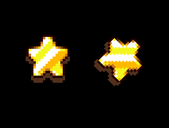
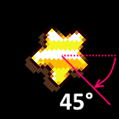
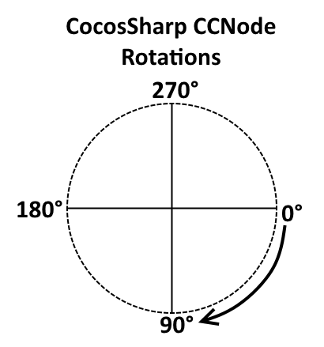
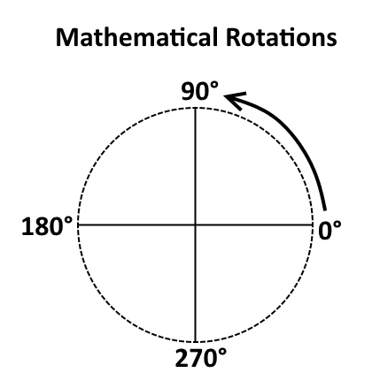
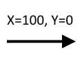
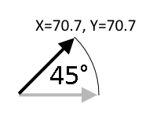
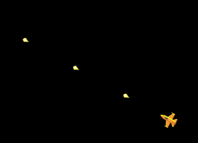

# 2D math with CocosSharp

_This guide covers 2D mathematics for game development. It uses CocosSharp to show how to perform common game development tasks and explains the math behind these tasks._

To position and move objects with code is a core part of developing games of all sizes. Positioning and moving require the use of math, whether a game requires moving an object along a straight line, or the use of trigonometry for rotation. This document will cover the following topics:

 - Velocity
 - Acceleration
 - Rotating CocosSharp objects
 - Using rotation with velocity

Developers who do not have a strong math background, or who have long-forgotten these topics from school, do not need to worry – this document will break concepts down into bite-sized pieces, and will accompany theoretical explanations with practical examples. In short, this article will answer the age-old math student question: "When will I actually need to use this stuff?"


## Requirements

Although this document focuses primarily on the mathematical side of CocosSharp, code samples assume working with objects inheriting form `CCNode`. Furthermore, since `CCNode` does not include values for velocity and acceleration, the code assumes working with Entities which provide values such as VelocityX, VelocityY, AccelerationX, and AccelerationY. For more information on entities, see our walkthrough on [Entities in CocosSharp](~/graphics-games/cocossharp/entities.md).


## Velocity

Game developers use the term *velocity* to describe how an object is moving – specifically how fast something is moving and the direction that it is moving. 

Velocity is defined using two types of units: a position unit and a time unit. For example, a car’s speed is defined as miles per hour or kilometers per hour. Game developers often use pixels per second to define how fast an object moves. For example, a bullet may move at a speed of 300 pixels per second. That is, if a bullet is moving at 300 pixels per second, then it will have moved 600 units in two seconds, and 900 units in three seconds, and so on. More generally, the velocity value *adds* to the position of an object (as we’ll see below).

Although we used speed to explain the units of velocity, the term speed typically refers to a value independent of direction, while the term velocity refers to both speed and direction. Therefore, the assignment of a bullet’s velocity (assuming bullet is a class which includes the necessary properties) may look like this:


```csharp
// This bullet is not moving horizontally, so set VelocityX to 0:
bulletInstance.VelocityX = 0;
// Positive Y is "up" so move the bullet up 300 units per second:
bulletInstance.VelocityY = 300;
```


### Implementing velocity

CocosSharp does not implement velocity, so objects requiring movement will need to implement their own movement logic. New game developers implementing velocity often make the mistake of making their velocity dependent on frame rate. That is, the following *incorrect implementation* will seem to provide correct results, but will be based on the game’s frame rate:

```csharp
// VelocityX and VelocityY will be added every time this code executes
this.PositionX += this.VelocityX;
this.PositionY += this.VelocityY;
```

If the game runs at a higher frame rate (such as 60 frames per second instead of 30 frames per second), then the object will appear to move faster than if running at a slower frame rate. Similarly, if the game is unable to process frames at as high of a frame rate (which may be caused by background processes using the device’s resources), the game will appear to slow down.

To account for this, velocity is often implemented using a time value. For example, if the `seconds` variable represents the number (or fraction) of seconds since the last time velocity was applied, then the following code would result in the object having consistent movement regardless of frame rate:

```csharp
// VelocityX and VelocityY will be added every time this code executes
this.PositionX += this.VelocityX * seconds;
this.PositionY += this.VelocityY * seconds;
```

Consider that a game which runs at a lower frame rate will update the position of its objects less frequently. Therefore, each update will result in the objects moving further than they would if the game were updating more frequently. The `seconds` value accounts for this, by reporting how much time has passed since the last update.

For an example of how to add time-based movement, see [this recipe covering time based movement](https://github.com/xamarin/recipes/tree/master/Recipes/cross-platform/game_development/time_based_movement).


### Calculating positions using velocity

Velocity can be used to make predictions about where an object will be after some amount of time passes, or to help tune objects’ behavior without needing to run the game. For example, a developer who is implementing the movement of a fired bullet needs to set the bullet’s velocity after it is instantiated. The screen size can be used to provide a basis for setting velocity. That is, if the developer knows that the bullet should move the height of the screen in 2 seconds, then the velocity should be set to the height of the screen divided by 2. If the screen is 800 pixels tall, then the bullet’s speed would be set to 400 (which is 800/2).

Similarly, in-game logic may need to calculate how long an object will take to reach a destination given its velocity. This can be calculated by dividing the distance to travel by the travelling object’s velocity. For example, the following code shows how to assign text to a label which displays how long until a missile reaches its target:


```csharp
// We'll assume only the X axis for this example
float distanceX = target.PositionX - missile.PositionX;

float secondsToReachTarget = distanceX / missile.VelocityX;

label.Text = secondsToReachTarget + " seconds to reach target"; 
```


## Acceleration

*Acceleration* is a common concept in game development, and it shares many similarities with velocity. Acceleration quantifies whether an object is speeding up or slowing down (how the velocity value changes over time). Acceleration *adds* to velocity, just like velocity adds to position. Common applications of acceleration include gravity, a car speeding up, and a space ship firing its thrusters. 

Similar to velocity, acceleration is defined in a position and time unit; however, acceleration’s time unit is referred to as a *squared* unit, which reflects how acceleration is defined mathematically. That is, game acceleration is often measured in *pixels per second squared*.

If an object has an X acceleration of 10 units per second squared, then that means that its velocity will increase by 10 every second. If starting from a standstill, after one second it will be moving at 10 units per second, after two seconds 20 units per second, and so on.

Acceleration in two dimensions requires an X and Y component, so it may be assigned as follows:


```csharp
// No horizontal acceleration:
icicle.AccelerationX = 0;
// Simulate gravity with Y acceleration. Negative Y is down, so assign a negative value:
icicle.AccelerationY = -50; 
```


### Acceleration vs. deceleration

Although acceleration and deceleration are sometimes differentiated in every-day speech, there is no technical difference between the two. Gravity is a force which results in acceleration. If an object is thrown upward then gravity will slow it down (decelerating), but once the object has stopped climbing and is falling in the same direction as gravity then gravity is speeding it up (accelerating). As shown below, the application of an acceleration is the same whether it is being applied in the same direction or opposite direction of movement. 


### Implementing acceleration

Acceleration is similar to velocity when implementing – it is not automatically implemented by CocosSharp, and time-based acceleration is the desired implementation (as opposed to frame-based acceleration). Therefore a simple acceleration (along with velocity) implementation may look like:

```csharp
this.VelocityX += this.AccelerationX * seconds;
this.VelocityY += this.AccelerationY * seconds;
this.PositionX += this.VelocityX * seconds;
this.PositionY += this.VelocityY * seconds;
```

The code above is what is referred to as a *linear approximation* for acceleration implementation. Effectively, it implements acceleration with a fairly close degree of accuracy, but it is not a perfectly accurate model of acceleration. It is included above to help explain the concept of how acceleration is implemented.

The following implementation is a mathematically accurate application of acceleration and velocity:


```csharp
float halfSecondsSquared = (seconds * seconds) / 2.0f;

this.PositionX += 
    this.Velocity.X * seconds + this.AccelerationX * halfSecondsSquared;
this.PositionY += 
    this.Velocity.Y * seconds + this.AccelerationY * halfSecondsSquared;

this.VelocityX += this.AccelerationX * seconds;
this.VelocityY += this.AccelerationY * seconds; 
```

The most obvious difference to the code above is the `halfSecondsSquared` variable and its usage to apply acceleration to position. The mathematical reason for this is beyond the scope of this tutorial, but developers interested in the math behind this can find more information in [this discussion about integrating acceleration.](http://www.cliffsnotes.com/math/calculus/calculus/integration/distance-velocity-and-acceleration)

The practical impact of `halfSecondSquare` is that acceleration will behave mathematically accurately and predictably regardless of frame rate. The linear approximation of acceleration is subject to frame rate – the lower the framerate drops the less accurate the approximation becomes. Using `halfSecondsSquared` guarantees that code will behave the same regardless of framerate.


## Angles and rotation

Visual objects such as `CCSprite` support rotation through a `Rotation` variable. This can be assigned to a value to set its rotation in degrees. For example, the following code shows how to rotate a `CCSprite` instance:


```csharp
CCSprite unrotatedSprite = new CCSprite("star.png");
unrotatedSprite.IsAntialiased = false;
unrotatedSprite.PositionX = 100;
unrotatedSprite.PositionY = 100;
this.AddChild (unrotatedSprite);

CCSprite rotatedSprite = new CCSprite("star.png");
rotatedSprite.IsAntialiased = false;
// This sprite is moved to the right so it doesn’t overlap the first
rotatedSprite.PositionX = 130;
rotatedSprite.PositionY = 100;
rotatedSprite.Rotation = 45;
this.AddChild (rotatedSprite); 
```

This results in the following:



Notice that the rotation is 45 degrees clockwise (which for historical reasons is the opposite of how rotation is applied mathematically):



In general rotation for CocosSharp and regular mathematics can be visualized as follows:





This distinction is important because the `System.Math` class uses counterclockwise rotation, so developers familiar with this class need to invert angles when working with `CCNode` instances.

We should note that the above diagrams display rotation in degrees; however, some mathematical functions (such as the functions in the `System.Math` namespace) expect and return values in *radians* rather than degrees. We’ll look at how to convert between the two unit types a little later in this guide.


### Rotating to face a direction

As shown above, `CCSprite` can be rotated using the `Rotation` property. The `Rotation` property is provided by `CCNode` (the base class for `CCSprite`), which means rotation can be applied to entities which inherit from `CCNode` as well. 

Some games require objects to be rotated so they face a target. Examples include a computer-controlled enemy shooting at a player target, or a space ship flying towards the point where the user is touching the screen. However, a rotation value must first be calculated based on the location of the entity being rotated and the location of the target to face.

This process requires a number of steps:

 - Identifying the *offset* of the target. Offset refers to the X and Y distance between the rotating entity and the target entity.
 - Calculating the angle from the offset by using the arctangent trigonometry function (explained in detail below).
 - Adjusting for a difference between 0 degrees pointing towards the right and the direction that the rotating entity points when un-rotated.
 - Adjusting for the difference between mathematical rotation (counterclockwise) and CocosSharp rotation (clockwise).

The following function (assumed to be written in an entity) rotates the entity to face a target:


```csharp
// This function assumes that it is contained in a CCNode-inheriting object
public void FacePoint(float targetX, float targetY)
{
    // Calculate the offset - the target's position relative to "this"
    float xOffset = targetX - this.PositionX;
    float yOffset = targetY - this.PositionY;

    // Make sure the target isn't the same point as "this". If so,
    // then rotation cannot be calculated.
    if (targetX != this.PositionX || targetY != this.Position.Y)
    {

        // Call Atan2 to get the radians representing the angle from 
        // "this" to the target
        float radiansToTarget = (float)System.Math.Atan2 (yOffset, xOffset);

        // Since CCNode uses degrees for its rotation, we need to convert
        // from radians
        float degreesToTarget = CCMathHelper.ToDegrees (radiansToTarget);

        // The direction that the entity faces when unrotated. In this case
        // the entity is facing "up", which is 90 degrees 
        const float forwardAngle = 90;

        // Adjust the angle we want to rotate by subtracting the
        // forward angle.
        float adjustedForDirecitonFacing = degreesToTarget - forwardAngle;

        // Invert the angle since CocosSharp uses clockwise rotation
        float cocosSharpAngle = adjustedForDirecitonFacing * -1;

        // Finally assign the rotation
        this.Rotation = rotation = cocosSharpAngle;
    }
} 
```

The code above could be used to rotate an entity so it faces the point where the user is touching the screen, as follows:


```csharp
private void HandleInput(System.Collections.Generic.List<CCTouch> touches, CCEvent touchEvent)
{
    if(touches.Count > 0)
    {
        CCTouch firstTouch = touches[0];
        FacePoint (firstTouch.Location.X, firstTouch.Location.Y);
    }
} 
```

This code results in the following behavior:


#### Using Atan2 to convert offsets to angles

`System.Math.Atan2` can be used to convert an offset to an angle. The function name `Atan2` comes from the trigonometric function arctangent. The "2" suffix differentiates this function from the standard `Atan` function, which strictly matches the mathematical behavior of arctangent. Arctangent is a function which returns a value between -90 and +90 degrees (or the equivalent in radians). Many applications, including computer games, often require a full 360 degrees of values, so the `Math` class includes `Atan2` to satisfy this need.

Notice that the code above passes the Y parameter first, then the X parameter, when calling the `Atan2` method. This is backwards from the usual X, Y ordering of position coordinates. For more information [see the Atan2 docs](https://msdn.microsoft.com/library/system.math.atan2(v=vs.110).aspx).

It’s also worth noting that the return value from `Atan2` is in radians, which is another unit used to measure angles. This guide doesn’t cover the details of radians, but keep in mind that all trigonometric functions in the `System.Math` namespace use radians, so any values must be converted to degrees before being used on CocosSharp objects. More information on radians can be found [in the radian Wikipedia page](https://en.wikipedia.org/wiki/Radian).

#### Forward angle

Once the `FacePoint` method converts the angle to radians, it defines a `forwardAngle` value. This value represents the angle in which the entity is facing when its Rotation value equals 0. In this example, we assume that the entity is facing upward, which is 90 degrees when using a mathematical rotation (as opposed to CocosSharp rotation). We use the mathematical rotation here since we haven’t yet inverted the rotation for CocosSharp.

The following shows what an entity with a `forwardAngle` of 90 degrees might look like:


### Angled velocity

So far we’ve looked at how to convert an offset into an angle. This section goes the other way – takes an angle and converts it into X and Y values. Common examples include a car moving in the direction that it is facing, or a space ship shooting a bullet which moves in the direction that the ship is facing. 

Conceptually, velocity can be calculated by first defining the desired velocity when un-rotated, then rotating that velocity to the angle that an entity is facing. To help explain this concept, velocity (and acceleration) can be visualized as a 2-dimensional *vector* (which is typically drawn as an arrow). A vector for a velocity value with X = 100 and Y = 0 can be visualized as follows:



This vector can be rotated to result in a new velocity. For example, rotating the vector by 45 degrees (using counter-clockwise rotation) results in the following:



Fortunately, velocity, acceleration, and even position can all be rotated with the same code regardless of how the values are applied. The following general-purpose function can be used to rotate a vector by a CocosSharp Rotation value:


```csharp
// Rotates the argument vector by degrees specified by
// cocosSharpDegrees. In other words, the rotation
// value is expected to be clockwise.
// The vector parameter is modified, so it is both an in and out value
void RotateVector(ref CCVector2 vector, float cocosSharpDegrees)
{
    // Invert the rotation to get degrees as is normally
    // used in math (counterclockwise)
    float mathDegrees = -cocosSharpDegrees;

    // Convert the degrees to radians, as the System.Math
    // object expects arguments in radians
    float radians = CCMathHelper.ToRadians (mathDegrees);

    // Calculate the "up" and "right" vectors. This is essentially
    // a 2x2 matrix that we'll use to rotate the vector
    float xAxisXComponent = (float)System.Math.Cos (radians);
    float xAxisYComponent = (float)System.Math.Sin (radians);
    float yAxisXComponent = (float)System.Math.Cos (radians + CCMathHelper.Pi / 2.0f);
    float yAxisYComponent = (float)System.Math.Sin (radians + CCMathHelper.Pi / 2.0f);

    // Store the original vector values which will be used
    // below to perform the final operation of rotation.
    float originalX = vector.X;
    float originalY = vector.Y;

    // Use the axis values calculated above (the matrix values)
    // to rotate and assign the vector.
    vector.X = originalX * xAxisXComponent + originalY * yAxisXComponent;
    vector.Y = originalX * xAxisYComponent + originalY * yAxisYComponent;
} 
```

A full understanding of the `RotateVector` method requires being familiar with the cosine and sine trigonometric functions along with some linear algebra, which is beyond the scope of this article. However, once implemented the `RotateVector` method can be used to rotate any vector, including a velocity vector. For example, the following code may fire a bullet in a direction specified by the `rotation` value:


```csharp
// Create a Bullet instance
Bullet newBullet = new Bullet();

// Define the velocity of the bullet when 
// rotation is 0
CCVector2 velocity = new CCVector2 (0, 100);

// Modify the velocity according to rotation
RotateVector (ref velocity, rotation);

// Assign the newBullet's velocity using the
// rotated vector
newBullet.VelocityX = velocity.X;
newBullet.VelocityY = velocity.Y;

// Set the bullet's rotation so it faces
// the direction that it's flying
newBullet.Rotation = rotation; 
```

This code may produce something like:




## Summary

This guide covers common mathematical concepts in 2D game development. It shows how to assign and implement velocity and acceleration, and covers how to rotate objects and vectors for movement in any direction.
