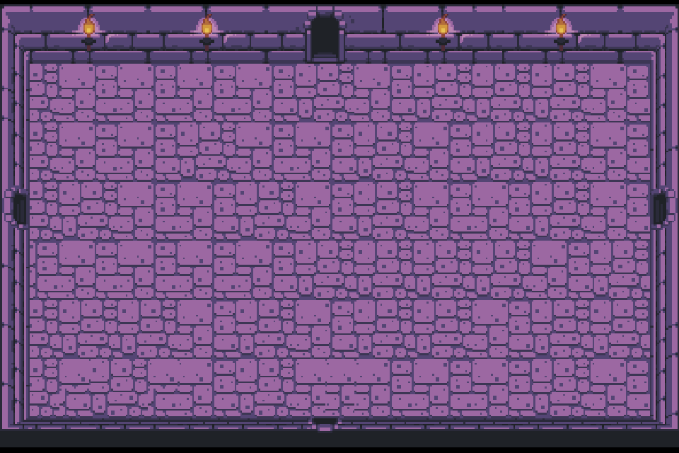
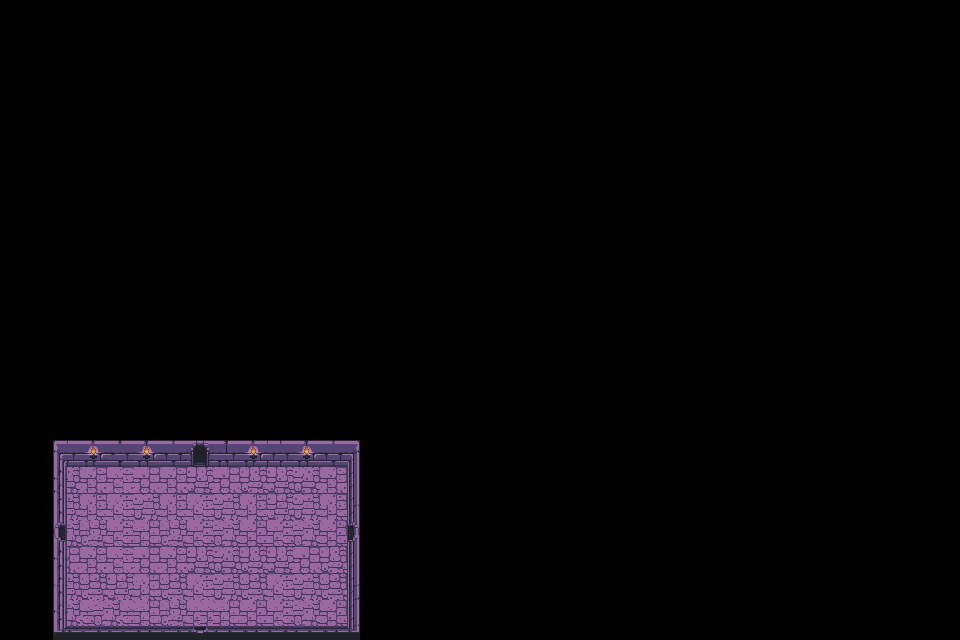
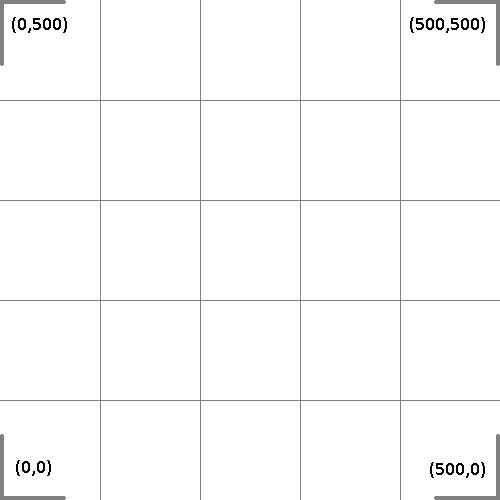
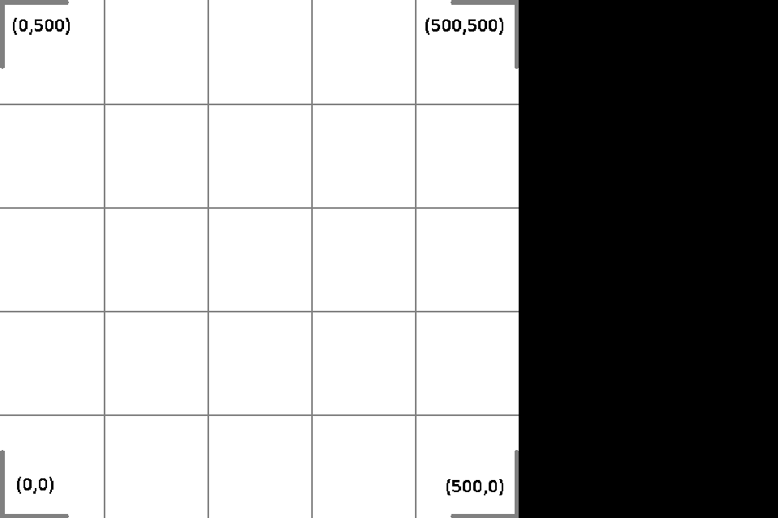
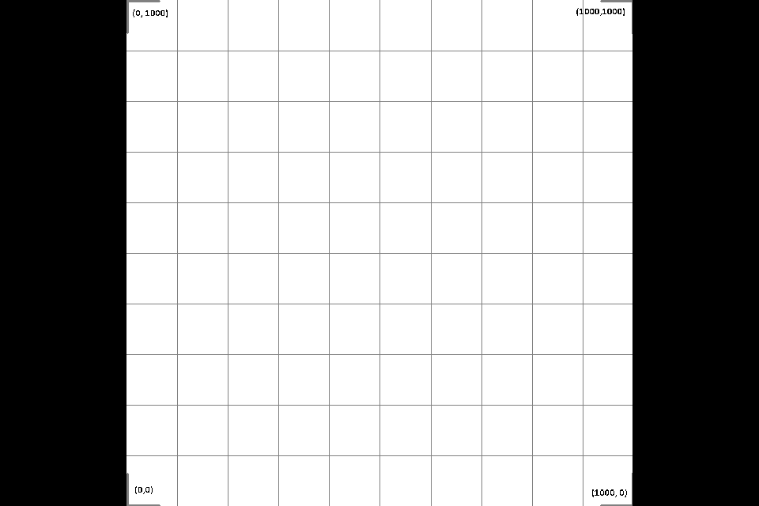
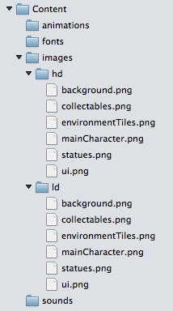

# Handling multiple resolutions in CocosSharp

_This guide shows how to work with CocosSharp to develop games that display properly on devices of varying resolutions._

CocosSharp provides methods for standardizing object dimensions in your game regardless of the physical number of pixels on a device’s display. Traditionally, games developed for PCs and gaming consoles could target a single resolution. Modern games – and especially games for mobile devices – must be built to accommodate a wide variety of devices. This guide shows how to standardize CocosSharp games regardless of the resolution characteristics of the physical display.

The default resolution behavior of CocosSharp is to match physical pixels with in-game coordinates. The following table shows how various devices would render a background environment sprite with width and height of 368x240. The first row is technically not an actual device, but rather the expected rendering of the sprite, regardless of device resolution:


| **Device** | **Display Resolution** | **Example Screenshot** |
|--- | --- |--- |
|Desired Display|368x240 (with black bars for aspect ratio)|  |
|iPhone 4s|960x640|  |
|iPhone 6 Plus|1920x1080|  |

This document covers how to use CocosSharp to fix the problem shown in the table above. That is, we’ll cover how to make any device render as shown in the first row – regardless of screen resolution.


## Working with SetDesignResolutionSize

The `CCScene` class is typically used as the root container for all visual objects, but it also provides a static method called `SetDesignResolutionSize` for specifying the default size for all scenes. In other words `SetDesignResolutionSize` method allows developers to develop games which will display correctly on a variety of hardware resolutions. The CocosSharp project templates use this method to set the default project size to 1024x768, as is shown in the following code:


```csharp
public override void ApplicationDidFinishLaunching (CCApplication application, CCWindow mainWindow)
{
	application.PreferMultiSampling = false;
	application.ContentRootDirectory = "Content";
	application.ContentSearchPaths.Add ("animations");
	application.ContentSearchPaths.Add ("fonts");
	application.ContentSearchPaths.Add ("sounds");
	CCSize windowSize = mainWindow.WindowSizeInPixels;
	float desiredWidth = 1024.0f;
	float desiredHeight = 768.0f;
    
	// This will set the world bounds to (0,0, w, h)
	// CCSceneResolutionPolicy.ShowAll will ensure that the aspect ratio is preserved
	CCScene.SetDesignResolutionSize (desiredWidth, desiredHeight, CCSceneResolutionPolicy.ShowAll);
	...
```

You can change the `desiredWidth` and `desiredHeight` variables above to modify the display to match the desired resolution of your game. For example, the above code could be modified as follows to display the 368x240 background as full-screen:


```csharp
public override void ApplicationDidFinishLaunching (CCApplication application, CCWindow mainWindow)
{
	application.PreferMultiSampling = false;
	application.ContentRootDirectory = "Content";
	application.ContentSearchPaths.Add ("animations");
	application.ContentSearchPaths.Add ("fonts");
	application.ContentSearchPaths.Add ("sounds");
	CCSize windowSize = mainWindow.WindowSizeInPixels;
	float desiredWidth = 368.0f;
	float desiredHeight = 240.0f;
    
	// This will set the world bounds to(0,0, w, h)
	// CCSceneResolutionPolicy.ShowAll will ensure that the aspect ratio is preserved
	CCScene.SetDesignResolutionSize (desiredWidth, desiredHeight, CCSceneResolutionPolicy.ShowAll);
	...
```


## CCSceneResolutionPolicy

`SetDesignResolutionSize` allows us to specify how the game window adjusts to the desired resolution. The following sections demonstrate how a 500x500 image is displayed with different `CCSceneResolutonPolicy` values passed to the `SetDesignResolutionSize` method. The following values are provided by the `CCSceneResolutionPolicy` enum:

 - `ShowAll` – Displays the entire requested resolution, maintaining aspect ratio.
 - `ExactFit` – Displays the entire requested resolution, but does not maintain aspect ratio.
 - `FixedWidth` – Displays the entire requested width, maintaining aspect ratio.
 - `FixedHeight` – Displays the entire requested height, maintaining aspect ratio.
 - `NoBorder` – Displays either the entire height or entire width, maintaining the aspect ratio. If the aspect ratio of the device is greater than the aspect ratio of the desired resolution, then the entire width is shown. If the aspect ratio of the device is less than the aspect ratio of the desired resolution, then the entire height is shown.
 - `Custom` – The display depends on the `Viewport` property of the current `CCScene`.

All screenshots are produced at iPhone 4s resolution (960x640) in landscape orientation and use this image:




### CCSceneResolutionPolicy.ShowAll

`ShowAll` specifies that the entire game resolution will be visible on-screen, but may display *letterboxing* (black bars) to adjust for different aspect ratios. This policy is commonly used as it guarantees the entire game view will be displayed on-screen without any distortion.

Code example:


```csharp
CCScene.SetDesignResolutionSize (500.0f, 500.0f, CCSceneResolutionPolicy.ShowAll);
```

Letterboxing is visible to the left and right of the image to account for the physical aspect ratio being wider than the desired resolution:


### CCSceneResolutionPolicy.ExactFit

`ExactFit` specifies that the entire game resolution will be visible on-screen with no letterboxing. The viewable area may be distorted (aspect ratio may not be maintained) according to hardware aspect ratio.

Code example:


```csharp
CCScene.SetDesignResolutionSize (500.0f, 500.0f, CCSceneResolutionPolicy.ExactFit);
```

No letterboxing is visible, but since the device resolution is rectangular the game view is distorted:


### CCSceneResolutionPolicy.FixedWidth

`FixedWidth` specifies that the width of the view will match the width value passed to `SetDesignResolutionSize`, but the viewable height is subject to the aspect ratio of the physical device. The height value passed to `SetDesignResolutionSize` is ignored since it will be calculated at runtime based on the physical device’s aspect ratio. This means that the calculated height may be smaller than the desired height (which results in parts of the game view being off-screen), or the calculated height may be larger than the desired height (which results in more of the game view being displayed). Since this may result in more of the game being displayed, then it may appear as if letterboxing has occurred; however, the extra space will not necessarily be black if any visual object appears there. 

Code example:


```csharp
CCScene.SetDesignResolutionSize (500.0f, 500.0f, CCSceneResolutionPolicy.FixedWidth);
```

The iPhone 4s has an aspect ratio of 3:2, so the calculated height is approximately 333 units:


### CCSceneResolutionPolicy.FixedHeight

Conceptually, `FixedHeight` behaves similarly to `FixedWidth` – the game will obey the height value passed to `SetDesignResolutionSize,` but will calculate the width at runtime based off of the physical resolution. As mentioned above, this means that the displayed width be smaller or larger than the desired width, resulting in part of the game being off screen or more of the game being displayed, respectively.

Code example:


```csharp
CCScene.SetDesignResolutionSize (500.0f, 500.0f, CCSceneResolutionPolicy.FixedHeight);
```

Since the following screenshot was created with the app running in landscape mode, the calculated width is larger than 500 – specifically 750. This policy keeps the X value of 0 left-aligned, so the extra resolution is viewable on the right side of the screen.




### CCSceneResolutionPolicy.NoBorder

`NoBorder` attempts to display the application with no letterboxing while maintaining the original aspect ratio (no distortion). If the requested resolution’s aspect ratio matches the device’s physical aspect ratio, then no clipping will occur. If aspect ratios do not match, then clipping will occur.

Code example:


```csharp
CCScene.SetDesignResolutionSize (500.0f, 500.0f, CCSceneResolutionPolicy.FixedHeight);
```

The following screen shot displays the top and bottom parts of the display clipped, while all 500 pixels of the display width are displayed:


### CCSceneResolutionPolicy.Custom

`Custom` enables each `CCScene` to specify its own custom viewport relative to the resolution specified in `SetDesignResolutionSize`.

Scenes define their `Viewport` property by constructing a `CCViewport`, which in turn is constructed with a `CCRect`. For more information on `CCViewport` and `CCRect` see the [CocosSharp API Documentation](https://developer.xamarin.com/api/namespace/CocosSharp/). In the context of creating a `CCViewport` the `CCRect` constructor’s parameters specify (in order):

 - x – The amount to horizontally offset the viewport, where each unit represents one entire screen width. For example, using a value of .5f results in the scene shifted to the right by half of the screen width.
 - y – The amount to vertically offset the viewport, where each unit represents one entire screen height. For example, using a value of .5f results in the scene shifted down by half of the screen height.
 - width – The horizontal portion that the scene should occupy. For example, using a value of 1/3.0f results in the scene horizontally occupying one-third of the screen.
 - height – The vertical portion that the scene should occupy. For example, using a value of 1/3.0f results in the scene vertically occupying one-third of the screen.

Code example:


```csharp
CCScene.SetDesignResolutionSize (500.0f, 500.0f, CCSceneResolutionPolicy.Custom);
...
float horizontalDisplayPortion = 2 / 3.0f;
float verticalDisplayPortion = 1 / 2.0f;
float displayOffsetInScreenWidths = 0;
float displayOffsetInScreenHeights = .5f;
var rectangle = new CCRect (
	displayOffsetInScreenWidths, 
	displayOffsetInScreenHeights, 
	horizontalDisplayPortion, 
	verticalDisplayPortion);
scene.Viewport = new CCViewport (rectangle);
```

The code above results in the following:


## DefaultTexelToContentSizeRatio

The `DefaultTexelToContentSizeRatio` simplifies using higher-resolution textures on devices with higher resolution screens. Specifically, this property allows games to use higher-resolution assets without needing to change the size or positioning of visual elements. 

For example, a game may include an art asset for a game character which is 200 pixels tall, and the game screen (as specified by `SetDesignResolutionSize`) may be 400 pixels tall. In this case, the character will occupy half of the screen. However, if a 400 pixel-tall asset were used for the character for higher-resolution devices, the character would occupy the entire height of the display. If the intent is to keep the character the same size to take advantage of higher resolution devices, then some extra code is necessary to keep the character sprite at half the height of the screen.

The simple example presented above represents a common problem in game development – adding larger-sized assets without requiring the developer to perform resizing on each visual element according to device resolution. `DefaultTexelToContentSizeRatio` is a global property used for resizing visual elements. This value resizes all visual elements of a certain type by the assigned value.

This property is present in the following classes: 

 - `CCApplication`
 - `CCSprite`
 - `CCLabelTtf`
 - `CCLabelBMFont`
 - `CCTMXLayer`

The CocosSharp Visual Studio for Mac templates set `CCSprite.DefaultTexelToContentSizeRatio` according to the width of the device as an example of how it can be used. The following code is contained in `CCApplicationDelegate.ApplicationDidFinishLaunching`:


```csharp
public override void ApplicationDidFinishLaunching (CCApplication application, CCWindow mainWindow)
{
	...
	float desiredWidth = 1024.0f;
	float desiredHeight = 768.0f;
           
	...
	if (desiredWidth < windowSize.Width)
	{
		application.ContentSearchPaths.Add ("images/hd");
		CCSprite.DefaultTexelToContentSizeRatio = 2.0f;
	}
	else
	{
		application.ContentSearchPaths.Add ("images/ld");
		CCSprite.DefaultTexelToContentSizeRatio = 1.0f;
	}
	...           
}
```


### DefaultTexelToContentSizeRatio example

To see how `DefaultTexelToContentSizeRatio` impacts the size of visual elements, consider the code presented above:


```csharp
CCScene.SetDesignResolutionSize (500.0f, 500.0f, CCSceneResolutionPolicy.ShowAll);
```

Which will result in the following image using a 500x500 texture:


The iPad Retina runs at a physical resolution of 2048x1536. This means that the game as displayed above would stretch 500 pixels over 1536 physical pixels. Games can take advantage of this extra resolution by creating what are typically referred to as *hd* assets – assets which are designed to run on higher resolution screens. For example, this game could use an hd version of this texture sized at 1000x1000. However, using the larger image would result in the `CCSprite` having a width and height of 1000 units. Since our game will always display 500 units (due to the `SetDesignResolutioSize` call), then our 1000x1000 sprite would be too big (only the bottom left portion of it displays):


We can set `CCSprite.DefaultTexelToContentSizeRatio` to account for the 1000x1000 texture being twice as wide and tall as the original 500x500 texture:


```csharp
CCSprite.DefaultTexelToContentSizeRatio = 2;
```

Now if we run the game the 1000x1000 texture will be fully visible:




### DefaultTexelToContentSizeRatio details

The `DefaultTexelToContentSizeRatio` property is `static,` which means all sprites in the application will share the same value. The typical approach for games with assets made for different resolutions is to contain a complete set of assets for each resolution category. By default the CocosSharp Visual Studio for Mac templates provide **ld** and **hd** folders for assets, which would be useful for games supporting two sets of textures. An example content folder with content may look like:



Notice that the default template also includes code to conditionally add to the application’s `ContentSearchPaths`:


```csharp
public override void ApplicationDidFinishLaunching (CCApplication application, CCWindow mainWindow)
{
	...
	if (desiredWidth < windowSize.Width)
	{
		application.ContentSearchPaths.Add ("images/hd");
		CCSprite.DefaultTexelToContentSizeRatio = 2.0f;
	}
	else
	{
		application.ContentSearchPaths.Add ("images/ld");
		CCSprite.DefaultTexelToContentSizeRatio = 1.0f;
	}
	...           
}
```

This means that the application will search for files in paths according to whether it is running in high resolution or regular resolution mode. For example, if the **hd** and **ld** folders contain a file called **background.png** then the following code would run and select the correct file for the resolution:


```csharp
backgroundSprite  = new CCSprite ("background");
```


## Summary

This article covers how to create games which display correctly regardless of device resolution. It shows examples of using different `CCSceneResolutionPolicy` values for resizing the game according to the device resolution. It also provides an example of how `DefaultTexelToContentSizeRatio` can be used to accommodate multiple sets of content without requiring visual elements to be resized individually.

## Related links

- [CocosSharp Introduction](~/graphics-games/cocossharp/index.md)
- [CocosSharp API Documentation](https://developer.xamarin.com/api/namespace/CocosSharp/)
