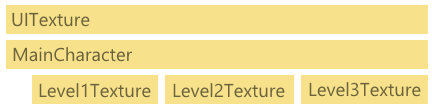

# Texture caching using CCTextureCache

_CocosSharp’s CCTextureCache class provides a standard way to organize, cache, and unload content. It is especially useful for large games which may not fit entirely into RAM, simplifying the process of grouping and disposing of textures._

The `CCTextureCache` class is an essential part of CocosSharp game development. Most CocosSharp games use the `CCTextureCache` object, even if not explicitly, as many CocosSharp methods internally use a *shared* texture cache.

This guide covers the `CCTextureCache` and why it is important for game development. Specifically it covers:

 - Why texture caching matters
 - Texture lifespan
 - Using SharedTextureCache
 - Lazy loading vs. pre-loading with AddImage
 - Disposing textures


## Why texture caching matters

Texture caching is an important consideration in game development as texture loading is a time-consuming operation and textures require a significant amount of RAM at runtime.

As with any file operation, loading textures from disk can be a costly operation. Texture loading can take extra time if the file being loaded requires processing, such as being decompressed (as is the case for png and jpg images). Texture caching can reduce the number of times that the application must load files from disk.

As mentioned above, textures also occupy a large amount of runtime memory. For example a background image sized to the resolution of an iPhone 6 (1344x750) would occupy 4 megabytes of RAM – even if the PNG file is only few kilobytes in size. Texture caching provides a way to share texture references within an app and also an easy way to unload all content when transitioning between different game states.


## Texture lifespan

CocosSharp textures may be kept in memory for the entire length of an app’s execution, or they may be short lived. To minimize memory usage an app should dispose of textures when no longer needed. Of course, this means that textures may be disposed and re-loaded at a later time, which can increase load times or hurt performance during loads. 

Texture loading often requires a tradeoff between memory usage and load times/runtime performance. Games which use a small amount of texture memory can keep all textures in memory as needed, but larger games may need to unload textures to free up space.

The following diagram shows a simple game which loads textures as needed and keeps them in memory for the entire length of execution:


The first two bars represent textures which are needed immediately upon the game’s execution. The following three bars represent textures for each level, loaded as needed.

If the game was large enough it would eventually load enough textures to fill all RAM provided by the device and OS. To solve this, a game may unload texture data when it is no longer needed. For example, the following diagram shows a game which unloads Level1Texture when it is no longer needed, then loads Level2Texture for the next level. The end result is that only three textures are held in memory at any given time: 




The diagram shown above indicates that texture memory usage can be reduced by unloading, but this may require additional loading times if a player decides to replay a level. It’s also worth noting that the UITexture and MainCharacter textures are loaded and never unloaded. This implies that these textures are needed in all levels, so they are always kept in memory. 


## Using SharedTextureCache

CocosSharp automatically caches textures when loading them through the `CCSprite` constructor. For example the following code only creates one texture instance:


```csharp
for (int i = 0; i < 100; i++)
{
    CCSprite starSprite = new CCSprite ("star.png");
    starSprite.PositionX = i * 32;
    this.AddChild (starSprite);
} 
```

CocosSharp automatically caches the `star.png` texture to avoid the expensive alternative of creating numerous identical `CCTexture2D` instances. This is accomplished by `AddImage` being called on a shared `CCTextureCache` instance, specifically `CCTextureCache.SharedTextureCache.Shared`. To understand how the `SharedTextureCache` is used we can look at the following code which is functionally identical to calling the `CCSprite` constructor with a string parameter:


```

CCSprite starSprite = new CCSprite ();
 starSprite.Texture = CCTextureCache.SharedTextureCache.AddImage ("star.png");
```

`AddImage` checks if the argument file (in this case `star.png`) has already been loaded. If so, then the cached instance is returned. If not then it is loaded from the file system, and a reference to the texture is stored internally for subsequent `AddImage` calls. In other words the `star.png` image is only loaded once, and subsequent calls require no additional disk access or additional texture memory.


## Lazy loading vs. pre-loading with AddImage

`AddImage` allows code to be written the same whether the requested texture is already loaded or not. This means that content will not be loaded until it is needed; however, this can also cause performance problems at runtime due to unpredictable content loading.

For example consider a game where the player’s weapon can be upgraded. When upgraded, the weapon and projectiles will visibly change, resulting in new textures being used. If the content is lazy-loaded then the textures associated with upgraded weapons will not be loaded initially, but rather at a later time when the player acquires the upgrades. 

This mid-gameplay loading can cause the game to *pop*, which is a short but noticeable freeze in execution. To prevent this, the code can predict which textures may be needed up front and pre-load them. For example, the following may be used to pre-load textures:


```csharp
void PreLoadImages()
{
    var cache = CCTextureCache.SharedTextureCache;

    cache.AddImage ("powerup1.png");
    cache.AddImage ("powerup2.png");
    cache.AddImage ("powerup3.png");

    cache.AddImage ("enemy1.png");
    cache.AddImage ("enemy2.png");
    cache.AddImage ("enemy3.png");

    // pre-load any additional content here to 
    // prevent pops at runtime
} 
```

This pre-loading can result in wasted memory and can increase startup time. For example, the player may never actually obtain a power-up represented by the `powerup3.png` texture, so it will be unnecessarily loaded. Of course this may be a necessary cost to pay to avoid a potential pop in gameplay, so it’s usually best to preload content if it will fit in RAM.


## Disposing textures

If a game does not require more texture memory than is available on the minimum spec device then textures do not need to be disposed. On the other hand, larger games may need to free up texture memory to make room for new content. For example a game may use a large amount of memory storing textures for an environment. If the environment is only used in a specific level then it should be unloaded when the level ends.


### Disposing a single texture

Removing a single texture first requires calling the `Dispose` method, then manual removal from the `CCTextureCache`.

The following shows how to completely remove a background sprite along with its texture:


```csharp
void DisposeBackground()
{
    // Assuming this is called from a CCLayer:
    this.RemoveChild (backgroundSprite);

    CCTextureCache.SharedTextureCache.RemoveTexture (backgroundsprite.Texture);

    backgroundSprite.Texture.Dispose ();
} 
```

Directly disposing textures can be effective when dealing with a small number of textures but this can become error-prone when dealing with larger texture sets.

Textures can be grouped into custom (non-shared) `CCTextureCache` instances to simplify texture cleanup.

For example, consider an example where content is preloaded using a level-specific `CCTextureCache` instance. The `CCTextureCache` instance may be defined in the class defining the level (which may be a `CCLayer` or `CCScene`):


```csharp
CCTextureCache levelTextures; 
```

The `levelTextures` instance can then be used to preload the level-specific textures: 


```

void PreloadLevelTextures(CCApplication application)
{
    levelTextures = new CCTextureCache (application);

    levelTextures.AddImage ("Background.png");
    levelTextures.AddImage ("Foreground.png");
    levelTextures.AddImage ("Enemy1.png");
    levelTextures.AddImage ("Enemy2.png");
    levelTextures.AddImage ("Enemy3.png");

    levelTextures.AddImage ("Powerups.png");
    levelTextures.AddImage ("Particles.png");
} 
```

Finally when the level ends, the textures can be all disposed at once through the `CCTextureCache`:


```csharp
void EndLevel()
{
    levelTextures.Dispose ();
    // Perform any other end-level cleanup
} 
```

The Dispose method will dispose all internal textures, clearing out the memory used by these textures. Combining `CCTextureCache.Shared` with a level or game mode-specific `CCTextureCache` instance results in some textures persisting through the entire game, and some being unloaded as levels end, similar to the diagram presented at the beginning of this guide: 


## Summary

This guide shows how to use the `CCTextureCache` class to balance memory usage and runtime performance. `CCTexturCache.SharedTextureCache` can be explicitly or implicitly used to load and cache textures for the life of the application, while `CCTextureCache` instances can be used to unload textures to reduce memory usage.

## Related links

- [https://github.com/mono/CocosSharp](https://github.com/mono/CocosSharp)
- [/api/type/CocosSharp.CCTextureCache/](https://developer.xamarin.com/api/type/CocosSharp.CCTextureCache/)
