# Using Tiled with CocosSharp

_Tiled is a powerful, flexible, and mature application for creating orthogonal and isometric tile maps for games. CocosSharp provides built-in integration for Tiled’s native file format._

The *Tiled* application is a standard for creating *tile maps* for use in game development. This guide will walk through how to take an existing .tmx file (file created by Tiled) and use it in a CocosSharp game. Specifically this guide will cover:

 - The purpose of tile maps
 - Working with .tmx files
 - Considerations for rendering pixel art
 - Using Tile properties at runtime

When finished we will have the following demo:

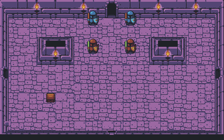


## The purpose of tile maps

Tile maps have existed in game development for decades, but are still commonly used in 2D games for their efficiency and esthetics. Tile maps are able to achieve a very high level of efficiency through their use of tile sets – the source image used by tile maps. A tile set is a collection of images combined into one file. Although tile sets refer to images used in tile maps, files that contain multiple smaller images are also called sprite sheets or sprite maps in game development. We can visualize how tile sets are used by adding a grid to the tile set that we’ll be using in our demo:

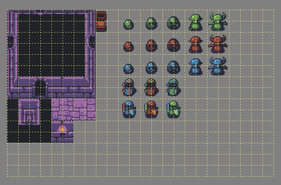

Tile maps arrange the individual tiles from tile sets. We should note that each tile map does not need to store its own copy of the tile set – rather, multiple tile maps can reference the same tile set. This means that aside from the tile set, tile maps require very little memory. This enables the creation of a large number of tile maps, even when they are used to create a large game play area, such as a [scrolling platformer](https://en.wikipedia.org/wiki/Platform_game) environment. The following shows possible arrangements using the same tile set:

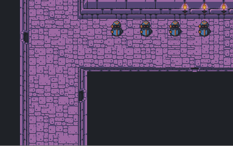

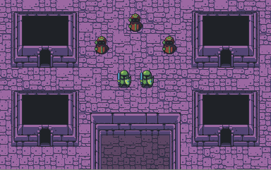


## Working with .tmx files

The .tmx file format is an XML file created by the Tiled application, which can be [downloaded for free on the Tiled website](http://www.mapeditor.org/). The .tmx file format stores the information for tile maps. Typically a game will have one .tmx file for each level or separate area.

This guide focuses on how to use existing .tmx files in CocosSharp; however, additional tutorials can be found online, including [this introduction to the Tiled map editor](http://gamedevelopment.tutsplus.com/tutorials/introduction-to-tiled-map-editor--gamedev-2838).

You’ll need to unzip the [content zip file](https://github.com/xamarin/mobile-samples/blob/master/BouncingGame/Resources/Tiled.zip?raw=true) to use it in our game. The first thing to note is that tile maps use both the .tmx file (dungeon.tmx) as well as one or more image files which define the tile set data (dungeon_1.png). The game needs to include both of these files to load the .tmx at runtime, so add both to the project’s **Content** folder (which is contained in the **Assets** folder in Android projects). Specifically, add the files to a folder called **tilemaps** inside the **Content** folder:

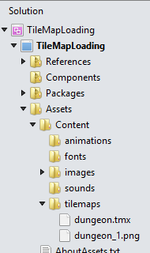

The **dungeon.tmx** file can now be loaded at runtime into a `CCTileMap` object. Next, modify the `GameLayer` (or equivalent root container object) to contain a `CCTileMap` instance and to add it as a child:


```csharp
public class GameLayer : CCLayer
{
    CCTileMap tileMap;

    public GameLayer ()
    {
    }

    protected override void AddedToScene ()
    {
        base.AddedToScene ();

        tileMap = new CCTileMap ("tilemaps/dungeon.tmx");
        this.AddChild (tileMap);
    }
} 
```

If we run the game we will see the tile map appear in the bottom-left corner of the screen:

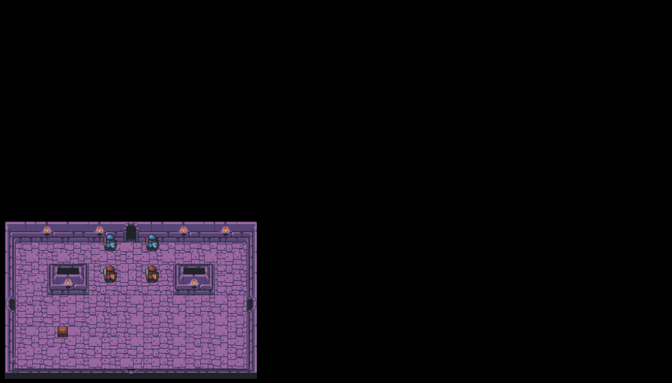


## Considerations for rendering pixel art

Pixel art, in the context of video game development, refers to 2D visual art which is typically created by-hand, and is often low resolution. Pixel art can be restrictively time intensive to create, so pixel art tile sets often include low-resolution tiles, such as 16 or 32 pixel width and height. If not scaled at runtime, pixel art is often too small for most modern phones and tablets.

We can adjust displayed dimensions in our game’s GameAppDelegate.cs file, where we’ll add a call to `CCScene.SetDefaultDesignResolution`:


```csharp
 public override void ApplicationDidFinishLaunching (CCApplication application, CCWindow mainWindow)
{
    application.PreferMultiSampling = false;
    application.ContentRootDirectory = "Content";
    application.ContentSearchPaths.Add ("animations");
    application.ContentSearchPaths.Add ("fonts");
    application.ContentSearchPaths.Add ("sounds");

    CCSize windowSize = mainWindow.WindowSizeInPixels;

    float desiredWidth = 1024.0f;
    float desiredHeight = 768.0f;
    
    // This will set the world bounds to be (0,0, w, h)
    // CCSceneResolutionPolicy.ShowAll will ensure that the aspect ratio is preserved
    CCScene.SetDefaultDesignResolution (desiredWidth, desiredHeight, CCSceneResolutionPolicy.ShowAll);
    
    // Determine whether to use the high or low def versions of our images
    // Make sure the default texel to content size ratio is set correctly
    // Of course you're free to have a finer set of image resolutions e.g (ld, hd, super-hd)
    if (desiredWidth < windowSize.Width)
    {
        application.ContentSearchPaths.Add ("images/hd");
        CCSprite.DefaultTexelToContentSizeRatio = 2.0f;
    }
    else
    {
        application.ContentSearchPaths.Add ("images/ld");
        CCSprite.DefaultTexelToContentSizeRatio = 1.0f;
    }

    // New code:
    CCScene.SetDefaultDesignResolution (380, 240, CCSceneResolutionPolicy.ShowAll);

    CCScene scene = new CCScene (mainWindow);
    GameLayer gameLayer = new GameLayer ();

    scene.AddChild (gameLayer);

    mainWindow.RunWithScene (scene);
} 
```

For more information on `CCSceneResolutionPolicy`, see our guide on [handling resolutions in CocosSharp](~/graphics-games/cocossharp/resolutions.md).

If we run the game now, we’ll see the game take up the full screen of our device:

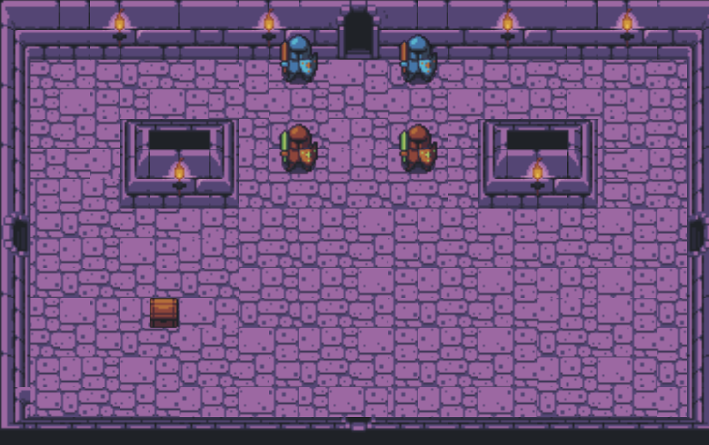

Finally we’ll want to disable antialiasing on our tile map. The `Antialiased` property applies a blurring effect when rendering objects which are zoomed in. Antialiasing can be useful for reducing the pixelated look of graphical objects, but may also introduce its own rendering artifacts. Specifically, antialiasing blurs the contents of each tile. However, the edges of each tile are not blurred, which makes the individual tiles stand out rather than blending in with adjacent tiles. We should also note that pixel art games often preserve their pixelated look to maintain a *retro* feel.

Set `Antialiased` to `false` after constructing the `tileMap`:


```csharp
protected override void AddedToScene ()
{
    base.AddedToScene ();

    tileMap = new CCTileMap ("tilemaps/dungeon.tmx");

    // new code:
    tileMap.Antialiased = false;

    this.AddChild (tileMap);
} 
```

Now our tile map will not appear blurry:

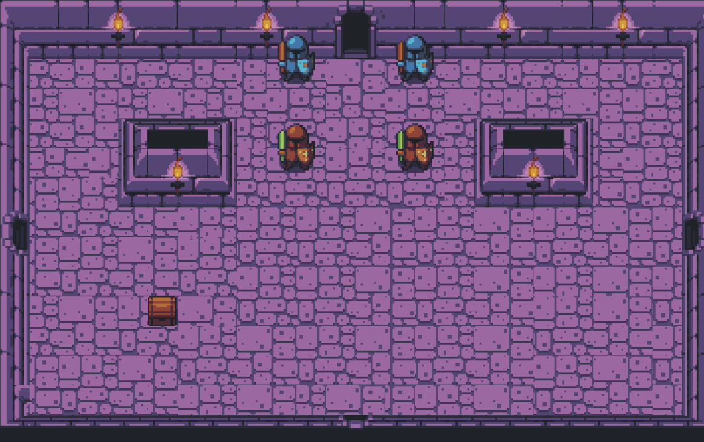


## Using tile properties at runtime

So far we have a `CCTileMap` loading a .tmx file and displaying it, but we have no way to interact with it. Specifically, certain tiles (such as our treasure chest) need to have custom logic. We’ll step through how to detect custom tile properties, and various ways to react to these properties once identified at runtime.

Before we write any code, we’ll need to add properties to our tile map through Tiled. To do this, open the dungeon.tmx file in the Tiled program. Be sure to open the file which is being used in the game project.

Once open, select the treasure chest in the tile set to view its properties:

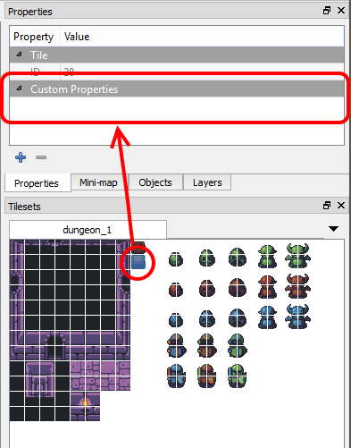

If the treasure chest properties do not appear, right-click on the treasure chest and select **Tile Properties**:

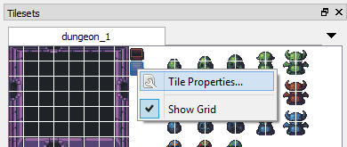

Tiled properties are implemented with a name and a value. To add a property, click the **+** button, enter the name **IsTreasure**, click **OK**, then enter the value **true**: 

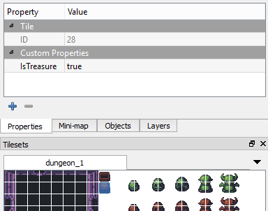

Don’t forget to save the .tmx file after modifying properties.

Finally, we’ll add code to look for our newly-added property. We will loop through each `CCTileMapLayer` (our map has 2 layers), then through each row and column to look for any tiles which have the `IsTreasure` property:


```csharp
public class GameLayer : CCLayer
{
    CCTileMap tileMap;

    public GameLayer ()
    {
    }

    protected override void AddedToScene ()
    {
        base.AddedToScene ();

        tileMap = new CCTileMap ("tilemaps/dungeon.tmx");

        // new code:
        tileMap.Antialiased = false;

        this.AddChild (tileMap);

        HandleCustomTileProperties (tileMap);
    }

    void HandleCustomTileProperties(CCTileMap tileMap)
    {
        // Width and Height are equal so we can use either
        int tileDimension = (int)tileMap.TileTexelSize.Width;

        // Find out how many rows and columns are in our tile map
        int numberOfColumns = (int)tileMap.MapDimensions.Size.Width;
        int numberOfRows = (int)tileMap.MapDimensions.Size.Height;

        // Tile maps can have multiple layers, so let's loop through all of them:
        foreach (CCTileMapLayer layer in tileMap.TileLayersContainer.Children)
        {
            // Loop through the columns and rows to find all tiles
            for (int column = 0; column < numberOfColumns; column++)
            {
                // We're going to add tileDimension / 2 to get the position
                // of the center of the tile - this will help us in 
                // positioning entities, and will eliminate the possibility
                // of floating point error when calculating the nearest tile:
                int worldX = tileDimension * column + tileDimension / 2;
                for (int row = 0; row < numberOfRows; row++)
                {
                    // See above on why we add tileDimension / 2
                    int worldY = tileDimension * row + tileDimension / 2;

                    HandleCustomTilePropertyAt (worldX, worldY, layer);
                }
            }
        }
    }

    void HandleCustomTilePropertyAt(int worldX, int worldY, CCTileMapLayer layer)
    {
        CCTileMapCoordinates tileAtXy = layer.ClosestTileCoordAtNodePosition (new CCPoint (worldX, worldY));

        CCTileGidAndFlags info = layer.TileGIDAndFlags (tileAtXy.Column, tileAtXy.Row);

        if (info != null)
        {
            Dictionary<string, string> properties = null;

            try
            {
                properties = tileMap.TilePropertiesForGID (info.Gid);
            }
            catch
            {
                // CocosSharp 
            }

            if (properties != null && properties.ContainsKey ("IsTreasure") && properties["IsTreasure"] == "true" )
            {
                layer.RemoveTile (tileAtXy);

                // todo: Create a treasure chest entity
            }
        }
    }
} 
```

Most of the code is self-explanatory, but we should discuss the handling of treasure tiles. In this case we are removing any tiles which are identified as treasure chests. This is because treasure chests will likely need custom code at runtime to effect collision, and to award the player the contents of the treasure when opened. Furthermore, the treasure may need to react to being opened (changing its visual appearance) and may have logic for only appearing when all on-screen enemies have been defeated.

In other words, the treasure chest will benefit from being an entity rather than being a simple tile in the `CCTileMap`. For more information on game entities, see the [Entities in CocosSharp guide](~/graphics-games/cocossharp/entities.md).


## Summary

This walkthrough covers how to load .tmx files created by Tiled into a CocosSharp application. It shows how to modify the app resolution to account for lower-resolution pixel art, and how to find tiles by their properties to perform custom logic, like creating entity instances.

## Related links

- [Tiled Website](http://www.mapeditor.org/)
- [Content zip](https://github.com/xamarin/mobile-samples/blob/master/BouncingGame/Resources/Tiled.zip?raw=true)
