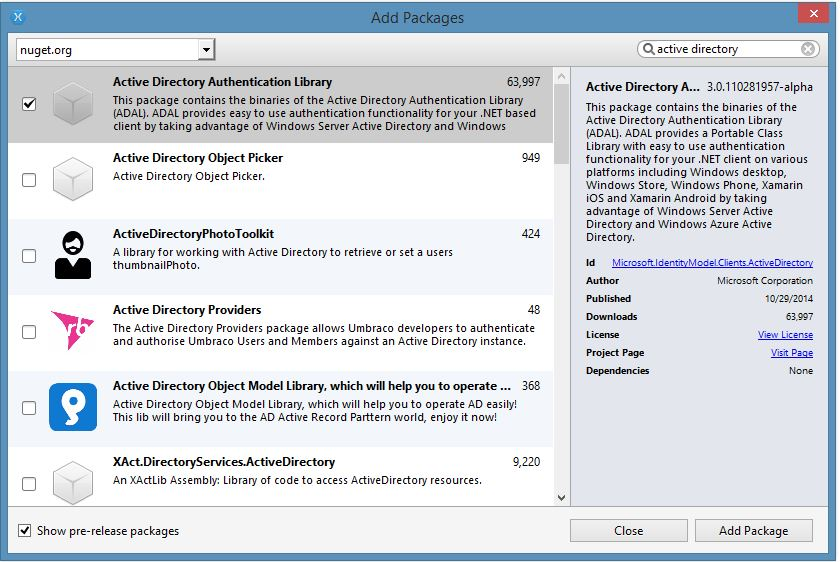
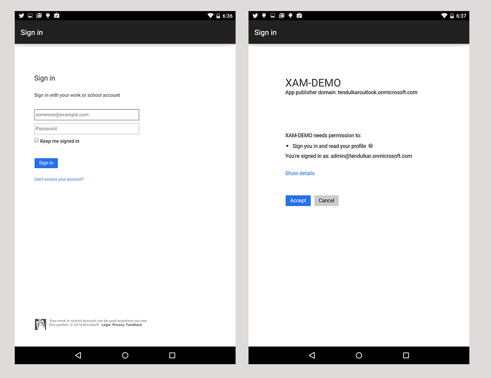
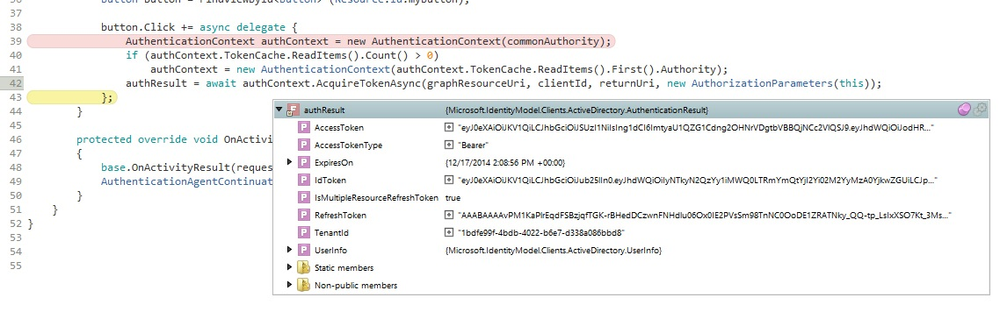

# Accessing the Graph API

Follow these steps to use the Graph API from within
  a Xamarin application:

1. [Registering with Azure Active Directory](~/cross-platform/data-cloud/active-directory/get-started/register.md) on the *windowsazure.com* portal, then
2. [Configure services](~/cross-platform/data-cloud/active-directory/get-started/configure.md).

## Step 3. Adding Active Directory authentication to an app

In your application, add a reference to **Azure Active Directory
  Authentication Library (Azure ADAL)** using the
  NuGet Package Manager in Visual Studio or Visual Studio for Mac.
  Make sure you select **Show pre-release packages** to include
  this package, as it is still in preview.

> [!IMPORTANT]
> Note: Azure ADAL 3.0 is currently a preview
and there may be breaking changes before the final version
is released. 



In your application, you will now need to add the following
  class level variables that are required for the authentication flow.

```csharp
//Client ID
public static string clientId = "25927d3c-.....-63f2304b90de";
public static string commonAuthority = "https://login.windows.net/common"
//Redirect URI
public static Uri returnUri = new Uri("http://xam-demo-redirect");
//Graph URI if you've given permission to Azure Active Directory
const string graphResourceUri = "https://graph.windows.net";
public static string graphApiVersion = "2013-11-08";
//AuthenticationResult will hold the result after authentication completes
AuthenticationResult authResult = null;
```

One thing to note here is `commonAuthority`. When the
  authentication endpoint is `common`, your app becomes
  **multi-tenant**, which means any user can use login
  with their Active Directory credentials. After
  authentication, that user will work on the context
  of their own Active Directory – i.e. they will see
  details related to his Active Directory.

### Write method to acquire Access Token

The following code (for Android) will start the
  authentication and upon completion assign the
  result in `authResult`. The iOS and Windows Phone
  implementations differ slightly: the second parameter
  (`Activity`) is different on iOS and absent on Windows Phone.

```csharp
public static async Task<AuthenticationResult> GetAccessToken
            (string serviceResourceId, Activity activity)
{
    authContext = new AuthenticationContext(Authority);
    if (authContext.TokenCache.ReadItems().Count() > 0)
        authContext = new AuthenticationContext(authContext.TokenCache.ReadItems().First().Authority);
    var authResult = await authContext.AcquireTokenAsync(serviceResourceId, clientId, returnUri, new AuthorizationParameters(activity));
    return authResult;
}  
```

In the above code, the `AuthenticationContext` is responsible
  for the authentication with commonAuthority. It has an
  `AcquireTokenAsync` method, which take parameters as a
  resource which needs to be accessed, in this case `graphResourceUri`,
  `clientId`, and `returnUri`. The app will return to the
  `returnUri` when authentication completes. This code will
  remain the same for all platforms, however, the last parameter,
  `AuthorizationParameters`, will be different on different
  platforms and is responsible for governing the authentication flow.

In the case of Android or iOS, we pass `this` parameter
  to `AuthorizationParameters(this)` to share the context,
  whereas in Windows it is passed without any parameter
  as new `AuthorizationParameters()`.

### Handle continuation for Android

After authentication is complete, the flow should return
  to the app. In the case of
  Android it is handled by following code, which should
  be added to **MainActivity.cs**:

```csharp
protected override void OnActivityResult(int requestCode, Result resultCode, Intent data)
{
  base.OnActivityResult(requestCode, resultCode, data);
  AuthenticationAgentContinuationHelper.SetAuthenticationAgentContinuationEventArgs(requestCode, resultCode, data);
}
```

### Handle continuation for Windows Phone

For Windows Phone modify the `OnActivated` method in the
  **App.xaml.cs** file with the below code:

```csharp
protected override void OnActivated(IActivatedEventArgs args)
{
#if WINDOWS_PHONE_APP
  if (args is IWebAuthenticationBrokerContinuationEventArgs)
  {
     WebAuthenticationBrokerContinuationHelper.SetWebAuthenticationBrokerContinuationEventArgs(args as IWebAuthenticationBrokerContinuationEventArgs);
  }
#endif
  base.OnActivated(args);
}
```

Now if you run the application, you should see an authentication dialog.
  Upon successful authentication, it will ask your permissions to
  access the resources (in our case Graph API):



If authentication is successful and you’ve authorized the
  app to access the resources, you should get an `AccessToken`
  and `RefreshToken` combo in `authResult`. These tokens are
  required for further API calls and for authorization
  with Azure Active Directory behind the scenes.



For example, the code below allows you to get a user list from Active Directory. You can replace the Web API URL with your Web API which is protected by Azure AD.

```csharp
var client = new HttpClient();
var request = new HttpRequestMessage(HttpMethod.Get,
    "https://graph.windows.net/tendulkar.onmicrosoft.com/users?api-version=2013-04-05");
request.Headers.Authorization =
  new AuthenticationHeaderValue("Bearer", authResult.AccessToken);
var response = await client.SendAsync(request);
var content = await response.Content.ReadAsStringAsync();
```
