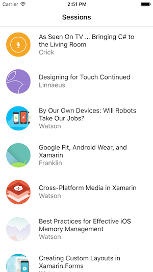

# Getting Started with DataPages

[ Download the sample](https://github.com/xamarin/xamarin-forms-samples/tree/master/Pages/DataPagesDemo)


> [!IMPORTANT]
> DataPages requires a Xamarin.Forms Theme reference to render. This involves installing the [Xamarin.Forms.Theme.Base](https://www.nuget.org/packages/Xamarin.Forms.Theme.Base/) NuGet package into your project, followed by either the [Xamarin.Forms.Theme.Light](https://www.nuget.org/packages/Xamarin.Forms.Theme.Light/) or [Xamarin.Forms.Theme.Dark](https://www.nuget.org/packages/Xamarin.Forms.Theme.Dark/) NuGet packages.

To get started building a simple data-driven page using the DataPages Preview,
follow the steps below. This demo uses a hardcoded style ("Events") in
the Preview builds that only works with the specific JSON format
in the code.

[](get-started-images/demo.png#lightbox "DataPages Sample Application")

## 1. Add NuGet Packages

Add these NuGet packages to your Xamarin.Forms .NET Standard library and application projects:

- Xamarin.Forms.Pages
- Xamarin.Forms.Theme.Base
- A theme implementation NuGet (eg. Xamarin.Forms.Theme.Light)

## 2. Add Theme Reference

In the **App.xaml** file, add a custom `xmlns:mytheme` for the theme
and ensure the theme is merged into the application's resource dictionary:

```xaml
<Application xmlns="http://xamarin.com/schemas/2014/forms"
  xmlns:x="http://schemas.microsoft.com/winfx/2009/xaml"
  xmlns:mytheme="clr-namespace:Xamarin.Forms.Themes;assembly=Xamarin.Forms.Theme.Light"
  x:Class="DataPagesDemo.App">
    <Application.Resources>
        <ResourceDictionary MergedWith="mytheme:LightThemeResources" />
    </Application.Resources>
</Application>
```

> [!IMPORTANT]
> You should also follow the steps to [load theme assemblies (below)](#troubleshooting)
> by adding some boilerplate code to the iOS `AppDelegate` and Android `MainActivity`. This will
> be improved in a future preview release.

## 3. Add a XAML Page

Add a new XAML page to the Xamarin.Forms application, and *change the base class*
from `ContentPage` to `Xamarin.Forms.Pages.ListDataPage`. This has to be done in
both the C# and the XAML:

**C# file**

```csharp
public partial class SessionDataPage : Xamarin.Forms.Pages.ListDataPage // was ContentPage
{
  public SessionDataPage ()
  {
    InitializeComponent ();
  }
}
```

**XAML file**

In addition to changing the root element to `<p:ListDataPage>` the custom
namespace for `xmlns:p` must also be added:

```xaml
<?xml version="1.0" encoding="UTF-8"?>
<p:ListDataPage xmlns="http://xamarin.com/schemas/2014/forms"
             xmlns:x="http://schemas.microsoft.com/winfx/2009/xaml"
             xmlns:p="clr-namespace:Xamarin.Forms.Pages;assembly=Xamarin.Forms.Pages"
             x:Class="DataPagesDemo.SessionDataPage">

    <ContentPage.Content></ContentPage.Content>

</p:ListDataPage>
```

**Application subclass**

Change the `App` class constructor so that the `MainPage` is set to a `NavigationPage`
containing the new `SessionDataPage`. A navigation page *must* be used.

```csharp
MainPage = new NavigationPage (new SessionDataPage ());
```

## 3. Add the DataSource

Delete the `Content` element and replace it with a `p:ListDataPage.DataSource`
to populate the page with data. In the example below a remote Json data
file is being loaded from a URL.

> [!NOTE]
> The preview *requires* a `StyleClass` attribute to
> provide rendering hints for the data source. The `StyleClass="Events"`
> refers to a layout that is predefined in the preview and contains styles
> *hardcoded* to match the JSON data source being used.

```xaml
<?xml version="1.0" encoding="UTF-8"?>
<p:ListDataPage xmlns="http://xamarin.com/schemas/2014/forms"
             xmlns:x="http://schemas.microsoft.com/winfx/2009/xaml"
             xmlns:p="clr-namespace:Xamarin.Forms.Pages;assembly=Xamarin.Forms.Pages"
             x:Class="DataPagesDemo.SessionDataPage"
             Title="Sessions" StyleClass="Events">

    <p:ListDataPage.DataSource>
        <p:JsonDataSource Source="http://demo3143189.mockable.io/sessions" />
    </p:ListDataPage.DataSource>

</p:ListDataPage>
```

**JSON data**

An example of the JSON data from the demo source is shown below:

```json
[{
  "end": "2016-04-27T18:00:00Z",
  "start": "2016-04-27T17:15:00Z",
  "abstract": "The new Apple TV has been released, and YOU can be one of the first developers to write apps for it. To make things even better, you can build these apps in C#! This session will introduce the basics of how to create a tvOS app with Xamarin, including: differences between tvOS and iOS APIs, TV user interface best practices, responding to user input, as well as the capabilities and limitations of building apps for a television. Grab some popcorn—this is going to be good!",
  "title": "As Seen On TV … Bringing C# to the Living Room",
  "presenter": "Matthew Soucoup",
  "biography": "Matthew is a Xamarin MVP and Certified Xamarin Developer from Madison, WI. He founded his company Code Mill Technologies and started the Madison Mobile .Net Developers Group.  Matt regularly speaks on .Net and Xamarin development at user groups, code camps and conferences throughout the Midwest. Matt gardens hot peppers, rides bikes, and loves Wisconsin micro-brews and cheese.",
  "image": "http://i.imgur.com/ASj60DP.jpg",
  "avatar": "http://i.imgur.com/ASj60DP.jpg",
  "room": "Crick"
}]
```

## 4. Run!

The above steps should result in a working data page:

[](get-started-images/demo.png#lightbox "DataPages Sample Application")

This works because the pre-built style **"Events"** exists in the Light Theme NuGet package
and has styles defined that match the data source (eg. "title", "image", "presenter").

The "Events" `StyleClass` is built to display the `ListDataPage` control
with a custom `CardView` control that is defined in Xamarin.Forms.Pages. The `CardView`
control has three properties: `ImageSource`, `Text`, and `Detail`. The theme
is hardcoded to bind the datasource's three fields (from the JSON file) to
these properties for display.

## 5. Customize

The inherited style can be overridden by specifying a
template and using data source bindings. The XAML below declares
a custom template for each row using the new `ListItemControl`
and `{p:DataSourceBinding}`
syntax which is included in the **Xamarin.Forms.Pages** NuGet:

```xaml
<p:ListDataPage.DefaultItemTemplate>
    <DataTemplate>
        <ViewCell>
            <p:ListItemControl
                Title="{p:DataSourceBinding title}"
                Detail="{p:DataSourceBinding room}"
                ImageSource="{p:DataSourceBinding image}"
                DataSource="{Binding Value}"
                HeightRequest="90"
            >
            </p:ListItemControl>
        </ViewCell>
    </DataTemplate>
</p:ListDataPage.DefaultItemTemplate>
```

By providing a `DataTemplate` this code overrides the `StyleClass`
and instead uses the default layout for a `ListItemControl`.

[](get-started-images/custom.png#lightbox "DataPages Sample Application")

Developers that prefer C# to XAML can create data source bindings too
(remember to include a `using Xamarin.Forms.Pages;` statement):

```csharp
SetBinding (TitleProperty, new DataSourceBinding ("title"));
```

It's a little more work to create themes from scratch but future preview releases will make this easier to do.

## Troubleshooting

## Could not load file or assembly 'Xamarin.Forms.Theme.Light' or one of its dependencies

In the preview release, themes may not be able to load at runtime. Add the code
shown below into the relevant projects to fix this error.

**iOS**

In the **AppDelegate.cs** add the following lines after `LoadApplication`

```csharp
var x = typeof(Xamarin.Forms.Themes.DarkThemeResources);
x = typeof(Xamarin.Forms.Themes.LightThemeResources);
x = typeof(Xamarin.Forms.Themes.iOS.UnderlineEffect);
```

**Android**

In the **MainActivity.cs** add the following lines after `LoadApplication`

```csharp
var x = typeof(Xamarin.Forms.Themes.DarkThemeResources);
x = typeof(Xamarin.Forms.Themes.LightThemeResources);
x = typeof(Xamarin.Forms.Themes.Android.UnderlineEffect);
```

## Related Links

- [DataPagesDemo sample](https://github.com/xamarin/xamarin-forms-samples/tree/master/Pages/DataPagesDemo)
