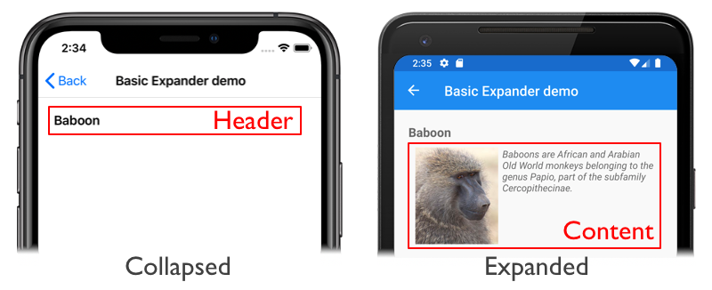

# Xamarin.Forms Expander

[ Download the sample](https://docs.microsoft.com/samples/xamarin/xamarin-forms-samples/userinterface-expanderdemos/)

The Xamarin.Forms `Expander` control provides an expandable container to host any content. The control has a header and content, and the content is shown or hidden by tapping the `Expander` header. When only the `Expander` header is shown, the `Expander` is *collapsed*. When the `Expander` content is visible the `Expander` is *expanded*.

The following screenshots show an `Expander` in its collapsed and expanded states, with red boxes indicating the header and the content:



> [!IMPORTANT]
> `Expander` is currently experimental and can only be used by setting the `Expander_Experimental` flag. For more information, see [Experimental Flags](~/xamarin-forms/internals/experimental-flags.md).
>
> In addition, the `Expander` control is fully implemented in the `Xamarin.Forms` namespace. Therefore, it's available on all platforms supported by Xamarin.Forms.

The `Expander` control defines the following properties:

- `CollapseAnimationEasing`, of type [`Easing`](xref:Xamarin.Forms.Easing), which represents the easing function to be applied to the `Expander` content when it's collapsing.
- `CollapseAnimationLength`, of type `uint`, which defines the duration of the animation when the `Expander` is collapsing. The default value of this property is 250ms.
- `Command`, of type `ICommand`, which is executed when the `Expander` header is tapped.
- `CommandParameter`, of type `object`, which is the parameter that's passed to the `Command`.
- `Content`, of type [`View`](xref:Xamarin.Forms.View), which defines the content to be displayed when the `Expander` expands.
- `ContentTemplate`, of type [`DataTemplate`](xref:Xamarin.Forms.DataTemplate), which is the template used to dynamically inflate the content of the `Expander`.
- `ExpandAnimationEasing`, of type [`Easing`](xref:Xamarin.Forms.Easing), which represents the easing function to be applied to the `Expander` content during expansion.
- `ExpandAnimationLength`, of type `uint`, which defines the duration of the animation when the `Expander` expands. The default value of this property is 250ms.
- `ForceUpdateSizeCommand`, of type `ICommand`, which defines the command that's executed when the size of the `Expander` is force updated. This property uses the `OneWayToSource` binding mode.
- `Header`, of type [`View`](xref:Xamarin.Forms.View), which defines the header content.
- `IsExpanded`, of type `bool`, which determines if the `Expander` is expanded . This property uses the `TwoWay` binding mode, and has a default value of `false`.
- `State`, of type `ExpanderState`, which represents the state of the `Expander`. This property uses the `OneWayToSource` binding mode.

These properties are backed by [`BindableProperty`](xref:Xamarin.Forms.BindableProperty) objects, which means that they can be targets of data bindings, and styled.

> [!NOTE]
> The `Content` property is the content property of the `Expander` class, and therefore does not need to be explicitly set from XAML.

The `ExpanderState` enumeration defines the following members:

- `Expanding` indicates that the `Expander` is expanding.
- `Expanded` indicates that the `Expander` is expanded.
- `Collapsing` indicates that the `Expander` is collapsing.
- `Collapsed` indicates that the `Expander` is collapsed.

The `Expander` control also defines a `Tapped` event that's fired when the `Expander` header is tapped. In addition, `Expander` includes a `ForceUpdateSize` method that can be called to programmatically resize the `Expander` at runtime.

## Create an Expander

The following example shows how to instantiate an `Expander` in XAML:

```xaml
<Expander>
    <Expander.Header>
        <Label Text="Baboon"
               FontAttributes="Bold"
               FontSize="Medium" />
    </Expander.Header>
    <Grid Padding="10">
        <Grid.ColumnDefinitions>
            <ColumnDefinition Width="Auto" />
            <ColumnDefinition Width="Auto" />
        </Grid.ColumnDefinitions>
        <Image Source="http://upload.wikimedia.org/wikipedia/commons/thumb/f/fc/Papio_anubis_%28Serengeti%2C_2009%29.jpg/200px-Papio_anubis_%28Serengeti%2C_2009%29.jpg"
               Aspect="AspectFill"
               HeightRequest="120"
               WidthRequest="120" />
        <Label Grid.Column="1"
               Text="Baboons are African and Arabian Old World monkeys belonging to the genus Papio, part of the subfamily Cercopithecinae."
               FontAttributes="Italic" />
    </Grid>
</Expander>
```

In this example, the `Expander` is collapsed by default and displays a [`Label`](xref:Xamarin.Forms.Label) as its header. Tapping on the header results in the `Expander` expanding to reveal its content, which is a [`Grid`](xref:Xamarin.Forms.Grid) containing child controls. When the `Expander` is expanded, tapping its header collapses the `Expander`.

> [!IMPORTANT]
> When setting the `Expander.Content` property, either implicitly or explicitly, the `Expander` content is created when the page containing it is navigated to, even if the `Expander` is collapsed. However, the `Expander.ContentTemplate` property can be set to content that only gets inflated when the `Expander` expands for the first time. For more information, see [Create Expander content on demand](#create-expander-content-on-demand).

Alternatively, an `Expander` can be created in code:

```csharp
Expander expander = new Expander
{
    Header = new Label
    {
        Text = "Baboon",
        FontAttributes = FontAttributes.Bold,
        FontSize = Device.GetNamedSize(NamedSize.Medium, typeof(Label))
    }
};

Grid grid = new Grid
{
    Padding = new Thickness(10),
    ColumnDefinitions =
    {
        new ColumnDefinition { Width = GridLength.Auto },
        new ColumnDefinition { Width = GridLength.Auto }
    }
};

grid.Children.Add(new Image
{
    Source = "http://upload.wikimedia.org/wikipedia/commons/thumb/f/fc/Papio_anubis_%28Serengeti%2C_2009%29.jpg/200px-Papio_anubis_%28Serengeti%2C_2009%29.jpg",
    Aspect = Aspect.AspectFill,
    HeightRequest = 120,
    WidthRequest = 120
});

grid.Children.Add(new Label
{
    Text = "Baboons are African and Arabian Old World monkeys belonging to the genus Papio, part of the subfamily Cercopithecinae.",
    FontAttributes = FontAttributes.Italic
}, 1, 0);

expander.Content = grid;
```

## Create Expander content on demand

`Expander` content can be created on demand, in response to the `Expander` expanding. This can be accomplished by setting the `Expander.ContentTemplate` property to a [`DataTemplate`](xref:Xamarin.Forms.DataTemplate) that contains the content:

```xaml
<Expander>
    <Expander.Header>
        <Label Text="{Binding Name}"
               FontAttributes="Bold"
               FontSize="Medium" />
    </Expander.Header>
    <Expander.ContentTemplate>
        <DataTemplate>
            <Grid Padding="10">
                <Grid.ColumnDefinitions>
                    <ColumnDefinition Width="Auto" />
                    <ColumnDefinition Width="Auto" />
                </Grid.ColumnDefinitions>
                <Image Source="{Binding ImageUrl}"
                       Aspect="AspectFill"
                       HeightRequest="120"
                       WidthRequest="120" />
                <Label Grid.Column="1"
                       Text="{Binding Details}"
                       FontAttributes="Italic" />
            </Grid>
        </DataTemplate>
    </Expander.ContentTemplate>
</Expander>
```

In this example, the `Expander` content is only inflated when the `Expander` expands for the first time.

The advantage of this approach is that when a page contains multiple `Expander` objects, the content for an `Expander` is only created when expanded for the first time by the user.

## Add an expansion indicator

An [`Image`](xref:Xamarin.Forms.Image) can be added to an `Expander` header, to provide a visual indication of expansion state. A [`DataTrigger`](xref:Xamarin.Forms.DataTrigger) can be attached to the `Image`, that changes the `Source` property based on the value of the `Expander.IsExpanded` property:

```xaml
<Expander>
    <Expander.Header>
        <Grid>
            <Label Text="{Binding Name}"
                   FontAttributes="Bold"
                   FontSize="Medium" />
            <Image Source="expand.png"
                   HorizontalOptions="End"
                   VerticalOptions="Start">
                <Image.Triggers>
                    <DataTrigger TargetType="Image"
                                 Binding="{Binding Source={RelativeSource AncestorType={x:Type Expander}}, Path=IsExpanded}"
                                 Value="True">
                        <Setter Property="Source"
                                Value="collapse.png" />
                    </DataTrigger>
                </Image.Triggers>
            </Image>
        </Grid>
    </Expander.Header>
    <Expander.ContentTemplate>
        <DataTemplate>
            <Grid Padding="10">
                <Grid.ColumnDefinitions>
                    <ColumnDefinition Width="Auto" />
                    <ColumnDefinition Width="Auto" />
                </Grid.ColumnDefinitions>
                <Image Source="{Binding ImageUrl}"
                       Aspect="AspectFill"
                       HeightRequest="120"
                       WidthRequest="120" />
                <Label Grid.Column="1"
                       Text="{Binding Details}"
                       FontAttributes="Italic" />
            </Grid>
        </DataTemplate>
    </Expander.ContentTemplate>
</Expander>
```

In this example, the [`Image`](xref:Xamarin.Forms.Image) displays the `expand` icon by default:


The `IsExpanded` property becomes `true` when the `Expander` header is tapped, which results in the `collapse` icon being displayed:


For more information about triggers, see [Xamarin.Forms Triggers](~/xamarin-forms/app-fundamentals/triggers.md).

## Embed an Expander in an Expander

The content of an `Expander` can be set to another `Expander` control, to enable multiple levels of expansion. The following XAML shows an `Expander` whose content is another `Expander` object:

```xaml
<Expander>
    <Expander.Header>
        <Label Text="{Binding Name}"
               FontAttributes="Bold"
               FontSize="Medium" />
    </Expander.Header>
    <Expander Padding="10">
        <Expander.Header>
            <Label Text="{Binding Location}"
                   FontSize="Medium" />
        </Expander.Header>
            <Expander.ContentTemplate>
                <DataTemplate>
                    <Grid>
                        <Grid.ColumnDefinitions>
                            <ColumnDefinition Width="Auto" />
                            <ColumnDefinition Width="Auto" />
                        </Grid.ColumnDefinitions>
                        <Image Source="{Binding ImageUrl}"
                               Aspect="AspectFill"
                               HeightRequest="120"
                               WidthRequest="120" />
                        <Label Grid.Column="1"
                               Text="{Binding Details}"
                               FontAttributes="Italic" />
                    </Grid>
                </DataTemplate>
            </Expander.ContentTemplate>
    </Expander>
</Expander>
```

In this example, tapping the root `Expander` header reveals the header for the child `Expander`:


Tapping the child `Expander` header results in its content being inflated and displayed:


## Define the expand and collapse animation

The animation that occurs when an `Expander` expands or collapses can be defined by setting the `ExpandAnimationEasing` and `CollapseAnimationEasing` properties to any of the easing functions included in Xamarin.Forms, or custom easing functions. By default, the expand and collapse animations occur over 250ms. However, these durations can be changed by setting the `ExpandAnimationLength` and `CollapseAnimationLength` properties to `uint` values.

The following XAML shows an example of defining the animation that occurs when the `Expander` is expanded or collapsed by the user:

```xaml
<Expander ExpandAnimationEasing="{x:Static Easing.CubicIn}"
          ExpandAnimationLength="500"
          CollapseAnimationEasing="{x:Static Easing.CubicOut}"
          CollapseAnimationLength="500">
    <Expander.Header>
        <Label Text="{Binding Name}"
               FontAttributes="Bold"
               FontSize="Medium" />
    </Expander.Header>
    <Expander.ContentTemplate>
        <DataTemplate>
            <Grid Padding="10">
                <Grid.ColumnDefinitions>
                    <ColumnDefinition Width="Auto" />
                    <ColumnDefinition Width="Auto" />
                </Grid.ColumnDefinitions>
                <Image Source="{Binding ImageUrl}"
                       Aspect="AspectFill"
                       HeightRequest="120"
                       WidthRequest="120" />
                <Label Grid.Column="1"
                       Text="{Binding Details}"
                       FontAttributes="Italic" />
            </Grid>
        </DataTemplate>
    </Expander.ContentTemplate>
</Expander>
```

In this example, the `CubicIn` easing function slowly accelerates the expand animation over 500ms, and the `CubicOut` easing function quickly decelerates the collapse animation over 500ms.

For more information about easing functions, see [Xamarin.Forms Easing Functions](~/xamarin-forms/user-interface/animation/easing.md).

## Resize an Expander at runtime

An `Expander` can be programmatically resized at runtime with the `ForceUpdateSize` method.

Given an `Expander` named `expander`, whose content includes a [`Label`](xref:Xamarin.Forms.Label) that has a `TapGestureRecognizer` attached to it, the following code example shows calling the `ForceUpdateSize` method:

```csharp
void OnLabelTapped(object sender, EventArgs e)
{
    Label label = sender as Label;
    Expander expander = label.Parent.Parent.Parent as Expander;

    if (label.FontSize == Device.GetNamedSize(NamedSize.Default, label))
    {
        label.FontSize = Device.GetNamedSize(NamedSize.Large, label);
    }
    else
    {
        label.FontSize = Device.GetNamedSize(NamedSize.Default, label);
    }
    expander.ForceUpdateSize();
}
```

In this example, the `FontSize` of a [`Label`](xref:Xamarin.Forms.Label) changes when the `Label` is tapped. Due to the size of the font changing, it's necessary to update the size of the `Expander` by calling its `ForceUpdateSize` method.

## Disable an Expander

An application may enter a state where expanding an `Expander` is not a valid operation. In such cases, the `Expander` can be disabled by setting its `IsEnabled` property to false. This will prevent users from expanding or collapsing the `Expander`.

## Related links

- [Expander Demos (sample)](https://docs.microsoft.com/samples/xamarin/xamarin-forms-samples/userinterface-expanderdemos/)
- [Xamarin.Forms Easing Functions](~/xamarin-forms/user-interface/animation/easing.md)
- [Xamarin.Forms Triggers](~/xamarin-forms/app-fundamentals/triggers.md)
- [Xamarin.Forms Bindable Layouts](~/xamarin-forms/user-interface/layouts/bindable-layouts.md)
