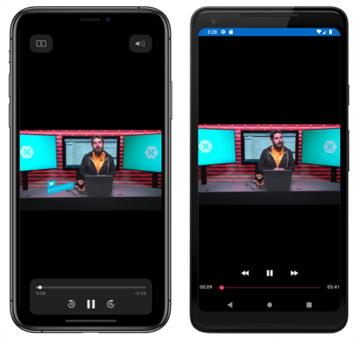
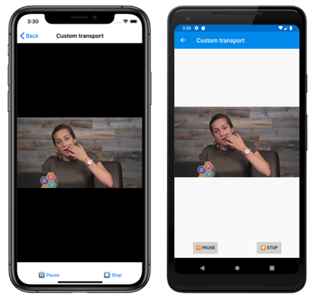
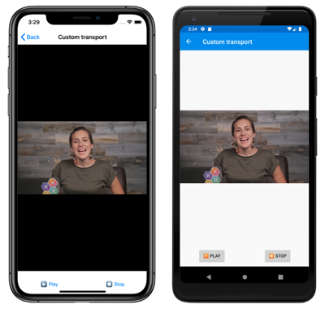
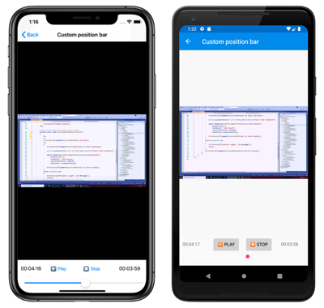

# Xamarin.Forms MediaElement


[ Download the sample](https://docs.microsoft.com/samples/xamarin/xamarin-forms-samples/userinterface-mediaelementdemos/)

[`MediaElement`](xref:Xamarin.Forms.MediaElement) is a view for playing video and audio. Media that's supported by the underlying platform can be played from the following sources:

- The web, using a URI (HTTP or HTTPS).
- A resource embedded in the platform application, using the `ms-appx:///` URI scheme.
- Files that come from the app's local and temporary data folders, using the `ms-appdata:///` URI scheme.
- The device's library.

[`MediaElement`](xref:Xamarin.Forms.MediaElement) can use the platform playback controls, which are referred to as transport controls. However, they are disabled by default and can be replaced with your own transport controls. The following screenshots show `MediaElement` playing a video with the platform transport controls:

[](mediaelement-images/playback-controls-large.png#lightbox "MediaElement playing a video")

[`MediaElement`](xref:Xamarin.Forms.MediaElement) is available in Xamarin.Forms 4.5. However, it's currently experimental and can only be used by adding the following line of code to your *App.xaml.cs* file:

```csharp
Device.SetFlags(new string[]{ "MediaElement_Experimental" });
```

> [!NOTE]
> [`MediaElement`](xref:Xamarin.Forms.MediaElement) is available on iOS, Android, the Universal Windows Platform (UWP), macOS, Windows Presentation Foundation, and Tizen.

[`MediaElement`](xref:Xamarin.Forms.MediaElement) defines the following properties:

- [`Aspect`](xref:Xamarin.Forms.MediaElement.Aspect), of type [`Aspect`](xref:Xamarin.Forms.Aspect), determines how the media will be scaled to fit the display area. The default value of this property is `AspectFit`.
- [`AutoPlay`](xref:Xamarin.Forms.MediaElement.AutoPlay), of type `bool`, indicates whether media playback will begin automatically when the [`Source`](xref:Xamarin.Forms.MediaElement.Source) property is set. The default value of this property is `true`.
- [`BufferingProgress`](xref:Xamarin.Forms.MediaElement.BufferingProgress), of type `double`, indicates the current buffering progress. The default value of this property is 0.0.
- [`CanSeek`](xref:Xamarin.Forms.MediaElement.CanSeek), of type `bool`, indicates whether media can be repositioned by setting the value of the [`Position`](xref:Xamarin.Forms.MediaElement.Position) property. This is a read-only property.
- [`CurrentState`](xref:Xamarin.Forms.MediaElement.CurrentState), of type [`MediaElementState`](xref:Xamarin.Forms.MediaElementState), indicates the current status of the control. This is a read-only property, whose default value is `MediaElementState.Closed`.
- [`Duration`](xref:Xamarin.Forms.MediaElement.Duration), of type `TimeSpan?`, indicates the duration of the currently opened media. This is a read-only property whose default value is `null`.
- [`IsLooping`](xref:Xamarin.Forms.MediaElement.IsLooping), of type `bool`, describes whether the currently loaded media source should resume playback from the start after reaching its end. The default value of this property is `false`.
- [`KeepScreenOn`](xref:Xamarin.Forms.MediaElement.KeepScreenOn), of type `bool`, determines whether the device screen should stay on during media playback. The default value of this property is `false`.
- [`Position`](xref:Xamarin.Forms.MediaElement.Position), of type `TimeSpan`, describes the current progress through the media's playback time. The default value of this property is `TimeSpan.Zero`.
- [`ShowsPlaybackControls`](xref:Xamarin.Forms.MediaElement.ShowsPlaybackControls), of type `bool`, determines whether the platforms playback controls are displayed. The default value of this property is `false`.
- [`Source`](xref:Xamarin.Forms.MediaElement.Source), of type [`MediaSource`](xref:Xamarin.Forms.MediaSource), indicates the source of the media loaded into the control.
- [`VideoHeight`](xref:Xamarin.Forms.MediaElement.VideoHeight), of type `int`, indicates the height of the control. This is a read-only property.
- [`VideoWidth`](xref:Xamarin.Forms.MediaElement.VideoWidth), of type `int`, indicates the width of the control. This is a read-only property.
- [`Volume`](xref:Xamarin.Forms.MediaElement.Volume), of type `double`, determines the media's volume, which is represented on a linear scale between 0 and 1. This property uses a `TwoWay` binding, and its default value is 1.

These properties, with the exception of the `CanSeek` property, are backed by [`BindableProperty`](xref:Xamarin.Forms.BindableProperty) objects, which means that they can be targets of data bindings, and styled.

The [`MediaElement`](xref:Xamarin.Forms.MediaElement) class also defines four events:

- [`MediaOpened`](xref:Xamarin.Forms.MediaElement.MediaOpened) is fired when the media stream has been validated and opened.
- [`MediaEnded`](xref:Xamarin.Forms.MediaElement.MediaEnded) is fired when the `MediaElement` finishes playing its media.
- [`MediaFailed`](xref:Xamarin.Forms.MediaElement.MediaFailed) is fired when there's an error associated with the media source.
- [`SeekCompleted`](xref:Xamarin.Forms.MediaElement.SeekCompleted) is fired when the seek point of a requested seek operation is ready for playback.

In addition, [`MediaElement`](xref:Xamarin.Forms.MediaElement) includes [`Play`](xref:Xamarin.Forms.MediaElement.Play), [`Pause`](xref:Xamarin.Forms.MediaElement.Pause), and [`Stop`](xref:Xamarin.Forms.MediaElement.Stop) methods.

For information about supported media formats on Android, see [Supported media formats](https://developer.android.com/guide/topics/media/media-formats) on developer.android.com. For information about supported media formats on the Universal Windows Platform (UWP), see [Supported codecs](/windows/uwp/audio-video-camera/supported-codecs).

## Play remote media

A [`MediaElement`](xref:Xamarin.Forms.MediaElement) can play remote media files using the HTTP and HTTPS URI schemes. This is accomplished by setting the [`Source`](xref:Xamarin.Forms.MediaElement.Source) property to the URI of the media file:

```xaml
<MediaElement Source="https://sec.ch9.ms/ch9/5d93/a1eab4bf-3288-4faf-81c4-294402a85d93/XamarinShow_mid.mp4"
              ShowsPlaybackControls="True" />
```

By default, the media that is defined by the [`Source`](xref:Xamarin.Forms.MediaElement.Source) property plays immediately after the media is opened. To suppress automatic media playback, set the [`AutoPlay`](xref:Xamarin.Forms.MediaElement.AutoPlay) property to `false`.

Media playback controls are disabled by default, and are enabled by setting the [`ShowsPlaybackControls`](xref:Xamarin.Forms.MediaElement.ShowsPlaybackControls) property to `true`. [`MediaElement`](xref:Xamarin.Forms.MediaElement) will then use the platform playback controls.

## Play local media

Local media can be played from the following sources:

- A resource embedded in the platform application, using the `ms-appx:///` URI scheme.
- Files that come from the app's local and temporary data folders, using the `ms-appdata:///` URI scheme.
- The device's library.

For more information about these URI schemes, see [URI schemes](/windows/uwp/app-resources/uri-schemes).

### Play media embedded in the app package

A [`MediaElement`](xref:Xamarin.Forms.MediaElement) can play media files that are embedded in the app package, using the `ms-appx:///` URI scheme. Media files are embedded in the app package by placing them in the platform project.

Storing a media file in the platform project is different for each platform:

- On iOS, media files must be stored in the **Resources** folder, or a subfolder of the **Resources** folder. The media file must have a `Build Action` of `BundleResource`.
- On Android, media files must be stored in a subfolder of **Resources** named **raw**. The **raw** folder cannot contain subfolders. The media file must have a `Build Action` of `AndroidResource`.
- On UWP, media files can be stored in any folder in the project. The media file must have a `BuildAction` of `Content`.

Media files that meet these criteria can then be played back using the `ms-appx:///` URI scheme:

```xaml
<MediaElement Source="ms-appx:///XamarinForms101UsingEmbeddedImages.mp4"
              ShowsPlaybackControls="True" />
```

When using data binding, a value converter can be used to apply this URI scheme:

```csharp
public class VideoSourceConverter : IValueConverter
{
    public object Convert(object value, Type targetType, object parameter, CultureInfo culture)
    {
        if (value == null)
            return null;

        if (string.IsNullOrWhiteSpace(value.ToString()))
            return null;

        if (Device.RuntimePlatform == Device.UWP)
            return new Uri($"ms-appx:///Assets/{value}");
        else
            return new Uri($"ms-appx:///{value}");
    }
    // ...
}
```

An instance of the `VideoSourceConverter` can then be used to apply the `ms-appx:///` URI scheme to an embedded media file:

```xaml
<MediaElement Source="{Binding MediaSource, Converter={StaticResource VideoSourceConverter}}"
              ShowsPlaybackControls="True" />
```

For more information about the ms-appx URI scheme, see [ms-appx and ms-appx-web](/windows/uwp/app-resources/uri-schemes#ms-appx-and-ms-appx-web).

### Play media from the app's local and temporary folders

A [`MediaElement`](xref:Xamarin.Forms.MediaElement) can play media files that are copied into the app's local or temporary data folders, using the `ms-appdata:///` URI scheme.

The following example shows the [`Source`](xref:Xamarin.Forms.MediaElement.Source) property set to a media file that's stored in the app's local data folder:

```xaml
<MediaElement Source="ms-appdata:///local/XamarinVideo.mp4"
              ShowsPlaybackControls="True" />
```

The following example shows the [`Source`](xref:Xamarin.Forms.MediaElement.Source) property to a media file that's stored in the app's temporary data folder:

```xaml
<MediaElement Source="ms-appdata:///temp/XamarinVideo.mp4"
              ShowsPlaybackControls="True" />
```

> [!IMPORTANT]
> In addition to playing media files that are stored in the app's local or temporary data folders, UWP can also play media files that are located in the app's roaming folder. This can be achieved by prefixing the media file with `ms-appdata:///roaming/`.

When using data binding, a value converter can be used to apply this URI scheme:

```csharp
public class VideoSourceConverter : IValueConverter
{
    public object Convert(object value, Type targetType, object parameter, CultureInfo culture)
    {
        if (value == null)
            return null;

        if (string.IsNullOrWhiteSpace(value.ToString()))
            return null;

        return new Uri($"ms-appdata:///{value}");
    }
    // ...
}
```

An instance of the `VideoSourceConverter` can then be used to apply the `ms-appdata:///` URI scheme to a media file in the app's local or temporary data folder:

```xaml
<MediaElement Source="{Binding MediaSource, Converter={StaticResource VideoSourceConverter}}"
              ShowsPlaybackControls="True" />
```

For more information about the ms-appdata URI scheme, see [ms-appdata](/windows/uwp/app-resources/uri-schemes#ms-appdata).

#### Copying a media file to the app's local or temporary data folder

Playing a media file stored in the app's local or temporary data folder requires the media file to be copied there by the app. This can be accomplished, for example, by copying a media file from the app package:

```csharp
// This method copies the video from the app package to the app data
// directory for your app. To copy the video to the temp directory
// for your app, comment out the first line of code, and uncomment
// the second line of code.
public static async Task CopyVideoIfNotExists(string filename)
{
    string folder = FileSystem.AppDataDirectory;
    //string folder = Path.GetTempPath();
    string videoFile = Path.Combine(folder, "XamarinVideo.mp4");

    if (!File.Exists(videoFile))
    {
        using (Stream inputStream = await FileSystem.OpenAppPackageFileAsync(filename))
        {
            using (FileStream outputStream = File.Create(videoFile))
            {
                await inputStream.CopyToAsync(outputStream);
            }
        }
    }
}
```

> [!NOTE]
> The code example above uses the `FileSystem` class included in Xamarin.Essentials. For more information, see [Xamarin.Essentials: File System Helpers](~/essentials/file-system-helpers.md?context=xamarin%2Fxamarin-forms&tabs=android).

### Play media from the device library

Most modern mobile devices and desktop computers have the ability to record videos and audio using the device's camera and microphone. The media that's created are then stored as files on the device. These files can be retrieved from the library and played by the [`MediaElement`](xref:Xamarin.Forms.MediaElement).

Each of the platforms includes a facility that allows the user to select media from the device's library. In Xamarin.Forms, platform projects can invoke this functionality, and it can be called by the [`DependencyService`](xref:Xamarin.Forms.DependencyService) class.

The video picking dependency service used in the sample application is very similar to one defined in [Picking a Photo from the Picture Library](~/xamarin-forms/app-fundamentals/dependency-service/photo-picker.md), except that the picker returns a filename rather than a `Stream` object. The shared code project defines an interface named `IVideoPicker`, that defines a single method named `GetVideoFileAsync`. Each platform then implements this interface in a `VideoPicker` class.

The following code example shows how to retrieve a media file from the device library:

```csharp
string filename = await DependencyService.Get<IVideoPicker>().GetVideoFileAsync();
if (!string.IsNullOrWhiteSpace(filename))
{
    mediaElement.Source = new FileMediaSource
    {
        File = filename
    };
}
```

The video picking dependency service is invoked by calling the `DependencyService.Get` method to obtain the implementation of an `IVideoPicker` interface in the platform project. The `GetVideoFileAsync` method is then called on that instance, and the returned filename is used to create a [`FileMediaSource`](xref:Xamarin.Forms.FileMediaSource) object and to set it to the [`Source`](xref:Xamarin.Forms.MediaElement.Source) property of the [`MediaElement`](xref:Xamarin.Forms.MediaElement).

## Change video aspect ratio

The [`Aspect`](xref:Xamarin.Forms.MediaElement.Aspect) property determines how video media will be scaled to fit the display area. By default, this property is set to the `AspectFit` enumeration member, but it can be set to any of the [`Aspect`](xref:Xamarin.Forms.Aspect) enumeration members:

- `AspectFit` indicates that the video will be letterboxed, if required, to fit into the display area, while preserving the aspect ratio.
- `AspectFill` indicates that the video will be clipped so that it fills the display area, while preserving the aspect ratio.
- `Fill` indicates that the video will be stretched to fill the display area.

## Poll for Position data

The property change notification for the [`Position`](xref:Xamarin.Forms.MediaElement.Position) bindable property only fires at key moments such as playback beginning and ending, and pause occurring. Therefore, data binding to the `Position` property will not yield accurate position data. Instead, you must setup a timer and poll the property.

A good place to do this is in the `OnAppearing` override for the page that requires the position data as media is played:

```csharp
bool polling = true;

protected override void OnAppearing()
{
    base.OnAppearing();

    Device.StartTimer(TimeSpan.FromMilliseconds(1000), () =>
    {
        Device.BeginInvokeOnMainThread(() =>
        {
            positionLabel.Text = mediaElement.Position.ToString("hh\\:mm\\:ss");
        });
        return polling;
    });
}

protected override void OnDisappearing()
{
    base.OnDisappearing();
    polling = false;
}
```

In this example, the `OnAppearing` override starts a timer that updates `positionLabel` with the `Position` value every second. The timer callback is invoked every second, until the callback returns `false`. When page navigation occurs the `OnDisappearing` override is executed, which stops the timer callback being invoked.

## Understand MediaSource types

A [`MediaElement`](xref:Xamarin.Forms.MediaElement) can play media by setting its [`Source`](xref:Xamarin.Forms.MediaElement.Source) property to a remote or local media file. The `Source` property is of type [`MediaSource`](xref:Xamarin.Forms.MediaSource), and this class defines two static methods:

- [`FromFile`](xref:Xamarin.Forms.MediaSource.FromFile*), returns a [`MediaSource`](xref:Xamarin.Forms.MediaSource) instance from a `string` argument.
- [`FromUri`](xref:Xamarin.Forms.MediaSource.FromUri*), returns a [`MediaSource`](xref:Xamarin.Forms.MediaSource) instance from a `Uri` argument.

In addition, the [`MediaSource`](xref:Xamarin.Forms.MediaSource) class also has implicit operators that return `MediaSource` instances from `string` and `Uri` arguments.

> [!NOTE]
> When the [`Source`](xref:Xamarin.Forms.MediaElement.Source) property is set in XAML, a type converter is invoked to return a [`MediaSource`](xref:Xamarin.Forms.MediaSource) instance from a `string` or `Uri`.

The [`MediaSource`](xref:Xamarin.Forms.MediaSource) class also has two derived classes:

- [`UriMediaSource`](xref:Xamarin.Forms.UriMediaSource), which is used to specify a remote media file from a URI. This class has a [`Uri`](xref:Xamarin.Forms.UriMediaSource.Uri) property that can be set to a `Uri`.
- [`FileMediaSource`](xref:Xamarin.Forms.FileMediaSource), which is used to specify a local media file from a `string`. This class has a [`File`](xref:Xamarin.Forms.FileMediaSource.File) property that can be set to a `string`. In addition, this class has implicit operators to convert a `string` to a `FileMediaSource` object, and a `FileMediaSource` object to a `string`.

> [!NOTE]
> When a [`FileMediaSource`](xref:Xamarin.Forms.FileMediaSource) object is created in XAML, a type converter is invoked to return a [`FileMediaSource`](xref:Xamarin.Forms.FileMediaSource) instance from a `string`.

## Determine MediaElement status

The [`MediaElement`](xref:Xamarin.Forms.MediaElement) class defines a read-only bindable property named [`CurrentState`](xref:Xamarin.Forms.MediaElement.CurrentState), of type [`MediaElementState`](xref:Xamarin.Forms.MediaElementState). This property indicates the current status of the control, such as whether the media is playing or paused, or if it's not yet ready to play the media.

The [`MediaElementState`](xref:Xamarin.Forms.MediaElementState) enumeration defines the following members:

- `Closed` indicates that the `MediaElement` contains no media.
- `Opening` indicates that the `MediaElement` is validating and attempting to load the specified source.
- `Buffering` indicates that the `MediaElement` is loading the media for playback. Its [`Position`](xref:Xamarin.Forms.MediaElement.Position) property does not advance during this state. If the `MediaElement` was playing video, it continues to display the last displayed frame.
- `Playing` indicates that the `MediaElement` is playing the media source.
- `Paused` indicates that the `MediaElement` does not advance its [`Position`](xref:Xamarin.Forms.MediaElement.Position) property. If the `MediaElement` was playing video, it continues to display the current frame.
- `Stopped` indicates that the `MediaElement` contains media but it is not being played or paused. Its [`Position`](xref:Xamarin.Forms.MediaElement.Position) property is 0 and does not advance. If the loaded media is video, the `MediaElement` displays the first frame.

It's generally not necessary to examine the [`CurrentState`](xref:Xamarin.Forms.MediaElement.CurrentState) property when using the [`MediaElement`](xref:Xamarin.Forms.MediaElement) transport controls. However, this property becomes important when implementing your own transport controls.

## Implement custom transport controls

The transport controls of a media player include the buttons that perform the functions **Play**, **Pause**, and **Stop**. These buttons are generally identified with familiar icons rather than text, and the **Play** and **Pause** functions are generally combined into one button.

By default, the [`MediaElement`](xref:Xamarin.Forms.MediaElement) playback controls are disabled. This enables you to control the `MediaElement` programmatically, or by supplying your own transport controls. In support of this, `MediaElement` includes [`Play`](xref:Xamarin.Forms.MediaElement.Play), [`Pause`](xref:Xamarin.Forms.MediaElement.Pause), and [`Stop`](xref:Xamarin.Forms.MediaElement.Stop) methods.

The following XAML example shows a page that contains a [`MediaElement`](xref:Xamarin.Forms.MediaElement) and custom transport controls:

```xaml
<ContentPage xmlns="http://xamarin.com/schemas/2014/forms"
             xmlns:x="http://schemas.microsoft.com/winfx/2009/xaml"
             x:Class="MediaElementDemos.CustomTransportPage"
             Title="Custom transport">
    <Grid>
        ...
        <MediaElement x:Name="mediaElement"
                      AutoPlay="False"
                      ... />
        <StackLayout BindingContext="{x:Reference mediaElement}"
                     ...>
            <Button Text="&#x25B6;&#xFE0F; Play"
                    HorizontalOptions="CenterAndExpand"
                    Clicked="OnPlayPauseButtonClicked">
                <Button.Triggers>
                    <DataTrigger TargetType="Button"
                                 Binding="{Binding CurrentState}"
                                 Value="{x:Static MediaElementState.Playing}">
                        <Setter Property="Text"
                                Value="&#x23F8; Pause" />
                    </DataTrigger>
                    <DataTrigger TargetType="Button"
                                 Binding="{Binding CurrentState}"
                                 Value="{x:Static MediaElementState.Buffering}">
                        <Setter Property="IsEnabled"
                                Value="False" />
                    </DataTrigger>
                </Button.Triggers>
            </Button>
            <Button Text="&#x23F9; Stop"
                    HorizontalOptions="CenterAndExpand"
                    Clicked="OnStopButtonClicked">
                <Button.Triggers>
                    <DataTrigger TargetType="Button"
                                 Binding="{Binding CurrentState}"
                                 Value="{x:Static MediaElementState.Stopped}">
                        <Setter Property="IsEnabled"
                                Value="False" />
                    </DataTrigger>
                </Button.Triggers>
            </Button>
        </StackLayout>
    </Grid>
</ContentPage>
```

In this example, the custom transport controls are defined as [`Button`](xref:Xamarin.Forms.Button) objects. However, there are only two `Button` objects, with the first `Button` representing **Play** and **Pause**, and the second `Button` representing **Stop**. [`DataTrigger`](xref:Xamarin.Forms.DataTrigger) objects are used to enable and disable the buttons, and to switch the first button between **Play** and **Pause**. For more information about data triggers, see [Xamarin.Forms Triggers](~/xamarin-forms/app-fundamentals/triggers.md).

The code-behind file has the handlers for the [`Clicked`](xref:Xamarin.Forms.Button.Clicked) events:

```csharp
void OnPlayPauseButtonClicked(object sender, EventArgs args)
{
    if (mediaElement.CurrentState == MediaElementState.Stopped ||
        mediaElement.CurrentState == MediaElementState.Paused)
    {
        mediaElement.Play();
    }
    else if (mediaElement.CurrentState == MediaElementState.Playing)
    {
        mediaElement.Pause();
    }
}

void OnStopButtonClicked(object sender, EventArgs args)
{
    mediaElement.Stop();
}
```

The **Play** button can be pressed, once it becomes enabled, to begin playback:

[](mediaelement-images/custom-transport-playback-large.png#lightbox "MediaElement playing a video")

Pressing the **Pause** button results in playback pausing:

[](mediaelement-images/custom-transport-paused-large.png#lightbox "MediaElement with a paused video")

Pressing the **Stop** button stops playback and returns the position of the media file to the beginning.

## Implement a custom position bar

The transport controls implemented by each platform include a position bar. This bar resembles a slider and shows the current location of the media within its total duration. In addition, you can manipulate the position bar to move forwards or backwards to a new position in the video.

Implementing a custom position bar requires knowing the duration of the media, and the current playback position. This data is available in the [`Duration`](xref:Xamarin.Forms.MediaElement.Duration) and [`Position`](xref:Xamarin.Forms.MediaElement.Position) properties.

> [!IMPORTANT]
> The [`Position`](xref:Xamarin.Forms.MediaElement.Position) must be polled to obtain accurate position data. For more information, see [Poll for Position data](#poll-for-position-data).

A custom position bar can be implemented using a [`Slider`](xref:Xamarin.Forms.Slider), as shown in the following example:

```csharp
public class PositionSlider : Slider
{
    public static readonly BindableProperty DurationProperty =
        BindableProperty.Create(nameof(Duration), typeof(TimeSpan), typeof(PositionSlider), new TimeSpan(1),
                                propertyChanged: (bindable, oldValue, newValue) =>
                                {
                                    ((PositionSlider)bindable).SetTimeToEnd();
                                    double seconds = ((TimeSpan)newValue).TotalSeconds;
                                    ((Slider)bindable).Maximum = seconds <= 0 ? 1 : seconds;
                                });

    public TimeSpan Duration
    {
        get { return (TimeSpan)GetValue(DurationProperty); }
        set { SetValue(DurationProperty, value); }
    }

    public static readonly BindableProperty PositionProperty =
        BindableProperty.Create(nameof(Position), typeof(TimeSpan), typeof(PositionSlider), new TimeSpan(0),
                                propertyChanged: (bindable, oldValue, newValue) => ((PositionSlider)bindable).SetTimeToEnd());

    public TimeSpan Position
    {
        get { return (TimeSpan)GetValue(PositionProperty); }
        set { SetValue(PositionProperty, value); }
    }

    static readonly BindablePropertyKey TimeToEndPropertyKey =
        BindableProperty.CreateReadOnly(nameof(TimeToEnd), typeof(TimeSpan), typeof(PositionSlider), new TimeSpan());

    public static readonly BindableProperty TimeToEndProperty = TimeToEndPropertyKey.BindableProperty;

    public TimeSpan TimeToEnd
    {
        get { return (TimeSpan)GetValue(TimeToEndProperty); }
        private set { SetValue(TimeToEndPropertyKey, value); }
    }

    public PositionSlider()
    {
        PropertyChanged += (sender, args) =>
        {
            if (args.PropertyName == "Value")
            {
                TimeSpan newPosition = TimeSpan.FromSeconds(Value);
                if (Math.Abs(newPosition.TotalSeconds - Position.TotalSeconds) / Duration.TotalSeconds > 0.01)
                {
                    Position = newPosition;
                }
            }
        };
    }

    void SetTimeToEnd()
    {
        TimeToEnd = Duration - Position;
    }
}
```

The `PositionSlider` class defines its own `Duration` and `Position` bindable properties, and a `TimeToEnd` bindable property. All three properties are of type `TimeSpan`. The property-changed handler for the `Duration` property sets the `Maximum` property of the [`Slider`](xref:Xamarin.Forms.Slider) to the `TotalSeconds` property of the `TimeSpan` value. The `TimeToEnd` property is calculated based on changes to the `Duration` and `Position` properties, and begins at the media's duration and decreases down to zero as playback proceeds.

The `PositionSlider` is updated from the underlying [`Slider`](xref:Xamarin.Forms.Slider) when the `Slider` is moved to indicate that the media should be advanced or reversed to a new position. This is detected in the `PropertyChanged` handler in the `PositionSlider` constructor. The handler checks for a change in the `Value` property, and if it's different from the `Position` property, then the `Position` property is set from the `Value` property. For more information about using a [`Slider`](xref:Xamarin.Forms.Slider) see, [Xamarin.Forms Slider](~/xamarin-forms/user-interface/slider.md)

> [!NOTE]
> On Android, the [`Slider`](xref:Xamarin.Forms.Slider) only has 1000 discrete steps, regardless of the `Minimum` and `Maximum` settings. If the media length is greater than 1000 seconds, then two different `Position` values would correspond to the same `Value` of the `Slider`. This is why the code above checks that the new position and existing position are greater than one-hundredth of the overall duration.

The following example shows the `PositionSlider` being consumed on a page:

```xaml
<controls:PositionSlider x:Name="positionSlider"
                         BindingContext="{x:Reference mediaElement}"
                         Duration="{Binding Duration}"
                         ValueChanged="OnPositionSliderValueChanged">
    <controls:PositionSlider.Triggers>
        <DataTrigger TargetType="controls:PositionSlider"
                     Binding="{Binding CurrentState}"
                     Value="{x:Static MediaElementState.Buffering}">
            <Setter Property="IsEnabled" Value="False" />
        </DataTrigger>
    </controls:PositionSlider.Triggers>
</controls:PositionSlider>
```

In this example, the `Duration` property of the `PositionSlider` is data-bound to the [`Duration`](xref:Xamarin.Forms.MediaElement.Duration) property of the [`MediaElement`](xref:Xamarin.Forms.MediaElement). When the [`Value`](xref:Xamarin.Forms.Slider.Value) property of the [`Slider`](xref:Xamarin.Forms.Slider) changes, the `ValueChanged` event fires and the `OnPositionSliderValueChanged` handler is executed. This handler sets the [`MediaElement.Position`](xref:Xamarin.Forms.MediaElement.Position) property to the value of the `PositionSlider.Position` property. Therefore, dragging the `Slider` results in the media playback position changing:

[](mediaelement-images/custom-position-bar-large.png#lightbox "MediaElement with a custom position bar")

In addition, a [`DataTrigger`](xref:Xamarin.Forms.DataTrigger) object is used to disable the `PositionSlider` when the media is buffering. For more information about data triggers, see [Xamarin.Forms Triggers](~/xamarin-forms/app-fundamentals/triggers.md).

## Implement a custom volume control

Media playback controls implemented by each platform include a volume bar. This bar resembles a slider and shows the volume of the media. In addition, you can manipulate the volume bar to increase or decrease the volume.

A custom volume bar can be implemented using a [`Slider`](xref:Xamarin.Forms.Slider), as shown in the following example:

```xaml
<StackLayout>
    <MediaElement AutoPlay="False"
                  Source="{StaticResource AdvancedAsync}" />
    <Slider Maximum="1.0"
            Minimum="0.0"
            Value="{Binding Volume}"
            Rotation="270"
            WidthRequest="100" />
</StackLayout>
```

In this example, the [`Slider`](xref:Xamarin.Forms.Slider) data binds its `Value` property to the [`Volume`](xref:Xamarin.Forms.MediaElement.Volume) property of the [`MediaElement`](xref:Xamarin.Forms.MediaElement). This is possible because the `Volume` property uses a `TwoWay` binding. Therefore, changing the `Value` property will result in the `Volume` property changing.

> [!NOTE]
> The [`Volume`](xref:Xamarin.Forms.MediaElement.Volume) property has a vlidation callback that ensures that its value is greater than or equal to 0.0, and less than or equal to 1.0.

For more information about using a [`Slider`](xref:Xamarin.Forms.Slider) see, [Xamarin.Forms Slider](~/xamarin-forms/user-interface/slider.md)

## Related links

- [MediaElementDemos (sample)](https://docs.microsoft.com/samples/xamarin/xamarin-forms-samples/userinterface-mediaelementdemos/)
- [URI schemes](/windows/uwp/app-resources/uri-schemes)
- [Xamarin.Forms Triggers](~/xamarin-forms/app-fundamentals/triggers.md)
- [Xamarin.Forms Slider](~/xamarin-forms/user-interface/slider.md)
- [Android: Supported media formats](https://developer.android.com/guide/topics/media/media-formats)
- [UWP: Supported codecs](/windows/uwp/audio-video-camera/supported-codecs)
