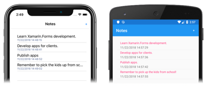
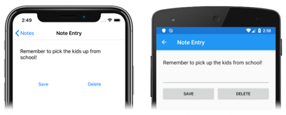
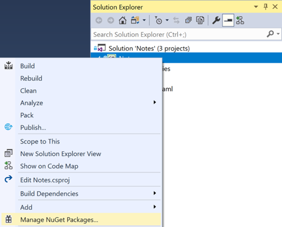
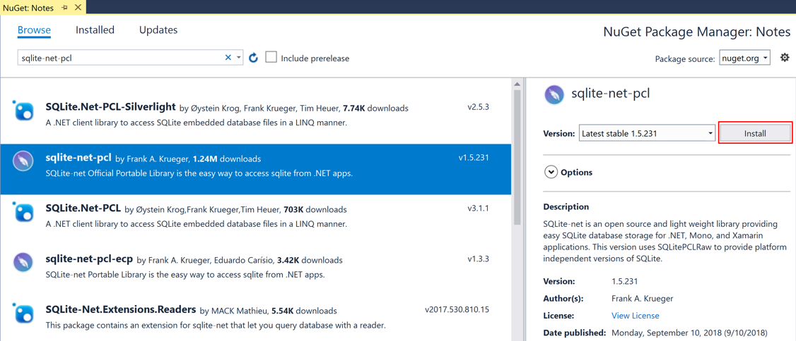
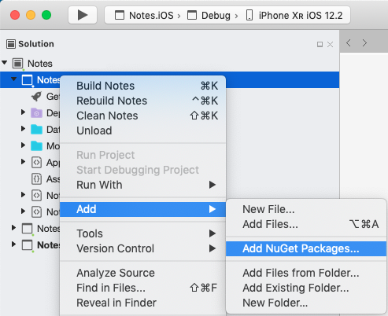
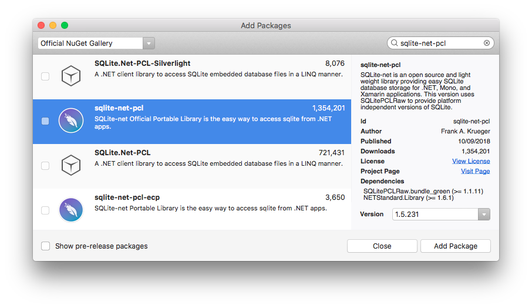

# Store Data in a Local SQLite.NET Database

[ Download the sample](/samples/xamarin/xamarin-forms-samples/getstarted-notes-database/)

In this quickstart, you will learn how to:

- Use the NuGet Package Manager to add a NuGet package to a project.
- Store data locally in a SQLite.NET database.

The quickstart walks through how to store data in a local SQLite.NET database. The final application is shown below:

[](database-images/screenshots1.png#lightbox "Notes Page")
[](database-images/screenshots2.png#lightbox "Note Entry Page")

## Prerequisites

You should successfully complete the [previous quickstart](multi-page.md) before attempting this quickstart. Alternatively, download the [previous quickstart sample](/samples/xamarin/xamarin-forms-samples/getstarted-notes-multipage/) and use it as the starting point for this quickstart.

::: zone pivot="windows"

## Update the app with Visual Studio

1. Launch Visual Studio and open the Notes solution.

2. In **Solution Explorer**, select the **Notes** project, right-click and select **Manage NuGet Packages...**:

        

3. In the **NuGet Package Manager**, select the **Browse** tab, search for the **sqlite-net-pcl** NuGet package, select it, and click the **Install** button to add it to the project:

    

    > [!NOTE]
    > There are a number of NuGet packages with similar names. The correct package has these attributes:
    > - **Owners:** praeclarum
    > - **Authors:** SQLite-net
    > - **NuGet link:** [sqlite-net-pcl](https://www.nuget.org/packages/sqlite-net-pcl/)  
    >
    > Despite the package name, this NuGet package can be used in .NET Standard projects.

    This package will be used to incorporate database operations into the application.

4. In **Solution Explorer**, in the **Notes** project, open **Note.cs** in the **Models** folder and replace the existing code with the following code:

    ```csharp
    using System;
    using SQLite;

    namespace Notes.Models
    {
        public class Note
        {
            [PrimaryKey, AutoIncrement]
            public int ID { get; set; }
            public string Text { get; set; }
            public DateTime Date { get; set; }
        }
    }
    ```

    This class defines a `Note` model that will store data about each note in the application. The `ID` property is marked with `PrimaryKey` and `AutoIncrement` attributes to ensure that each `Note` instance in the SQLite.NET database will have a unique id provided by SQLite.NET.

    Save the changes to **Note.cs** by pressing **CTRL+S**.

    > [!WARNING]
    > The application will not currently build due to errors that will be fixed in subsequent steps.

5. In **Solution Explorer**, add a new folder named **Data** to the **Notes** project.

6. In **Solution Explorer**, in the **Notes** project, add a new class named **NoteDatabase** to the **Data** folder.

7. In **NoteDatabase.cs**, replace the existing code with the following code:

    ```csharp
    using System.Collections.Generic;
    using System.Threading.Tasks;
    using SQLite;
    using Notes.Models;

    namespace Notes.Data
    {
        public class NoteDatabase
        {
            readonly SQLiteAsyncConnection _database;

            public NoteDatabase(string dbPath)
            {
                _database = new SQLiteAsyncConnection(dbPath);
                _database.CreateTableAsync<Note>().Wait();
            }

            public Task<List<Note>> GetNotesAsync()
            {
                return _database.Table<Note>().ToListAsync();
            }

            public Task<Note> GetNoteAsync(int id)
            {
                return _database.Table<Note>()
                                .Where(i => i.ID == id)
                                .FirstOrDefaultAsync();
            }

            public Task<int> SaveNoteAsync(Note note)
            {
                if (note.ID != 0)
                {
                    return _database.UpdateAsync(note);
                }
                else
                {
                    return _database.InsertAsync(note);
                }
            }

            public Task<int> DeleteNoteAsync(Note note)
            {
                return _database.DeleteAsync(note);
            }
        }
    }
    ```

    This class contains code to create the database, read data from it, write data to it, and delete data from it. The code uses asynchronous SQLite.NET APIs that move database operations to background threads. In addition, the `NoteDatabase` constructor takes the path of the database file as an argument. This path will be provided by the `App` class in the next step.

    Save the changes to **NoteDatabase.cs** by pressing **CTRL+S**.

    > [!WARNING]
    > The application will not currently build due to errors that will be fixed in subsequent steps.

8. In **Solution Explorer**, in the **Notes** project, double-click **App.xaml.cs** to open it. Then replace the existing code with the following code:

    ```csharp
    using System;
    using System.IO;
    using Xamarin.Forms;
    using Notes.Data;

    namespace Notes
    {
        public partial class App : Application
        {
            static NoteDatabase database;

            public static NoteDatabase Database
            {
                get
                {
                    if (database == null)
                    {
                        database = new NoteDatabase(Path.Combine(Environment.GetFolderPath(Environment.SpecialFolder.LocalApplicationData), "Notes.db3"));
                    }
                    return database;
                }
            }

            public App()
            {
                InitializeComponent();
                MainPage = new NavigationPage(new NotesPage());
            }

            protected override void OnStart()
            {
                // Handle when your app starts
            }

            protected override void OnSleep()
            {
                // Handle when your app sleeps
            }

            protected override void OnResume()
            {
                // Handle when your app resumes
            }
        }
    }
    ```

    This code defines a `Database` property that creates a new `NoteDatabase` instance as a singleton, passing in the filename of the database as the argument to the `NoteDatabase` constructor. The advantage of exposing the database as a singleton is that a single database connection is created that's kept open while the application runs, therefore avoiding the expense of opening and closing the database file each time a database operation is performed.

    Save the changes to **App.xaml.cs** by pressing **CTRL+S**.

    > [!WARNING]
    > The application will not currently build due to errors that will be fixed in subsequent steps.

9. In **Solution Explorer**, in the **Notes** project, double-click **NotesPage.xaml.cs** to open it. Then replace the `OnAppearing` method with the following code:

    ```csharp
    protected override async void OnAppearing()
    {
        base.OnAppearing();

        listView.ItemsSource = await App.Database.GetNotesAsync();
    }
    ```    

    This code populates the [`ListView`](xref:Xamarin.Forms.ListView) with any notes stored in the database.

    Save the changes to **NotesPage.xaml.cs** by pressing **CTRL+S**.

    > [!WARNING]
    > The application will not currently build due to errors that will be fixed in subsequent steps.

10. In **Solution Explorer**, double-click **NoteEntryPage.xaml.cs** to open it. Then replace the `OnSaveButtonClicked` and `OnDeleteButtonClicked` methods with the following code:

      ```csharp
      async void OnSaveButtonClicked(object sender, EventArgs e)
      {
          var note = (Note)BindingContext;
          note.Date = DateTime.UtcNow;
          await App.Database.SaveNoteAsync(note);
          await Navigation.PopAsync();
      }

      async void OnDeleteButtonClicked(object sender, EventArgs e)
      {
          var note = (Note)BindingContext;
          await App.Database.DeleteNoteAsync(note);
          await Navigation.PopAsync();
      }
      ```    

      The `NoteEntryPage` stores a `Note` instance, which represents a single note, in the [`BindingContext`](xref:Xamarin.Forms.BindableObject.BindingContext) of the page. When the `OnSaveButtonClicked` event handler is executed, the `Note` instance is saved to the database and the application navigates back to the previous page. When the `OnDeleteButtonClicked` event handler is executed, the `Note` instance is deleted from the database and the application navigates back to the previous page.

      Save the changes to **NoteEntryPage.xaml.cs** by pressing **CTRL+S**.

11. Build and run the project on each platform. For more information, see [Building the quickstart](single-page.md#building-the-quickstart).

    On the **NotesPage** press the **+** button to navigate to the **NoteEntryPage** and enter a note. After saving the note the application will navigate back to the **NotesPage**.

    Enter a number of notes, of varying length, to observe the application behavior.

::: zone-end
::: zone pivot="macos"

## Update the app with Visual Studio for Mac

1. Launch Visual Studio for Mac and open the Notes project.

2. In the **Solution Pad**, select the **Notes** project, right-click and select **Add > Add NuGet Packages...**:

        

3. In the **Add Packages** window, search for the **sqlite-net-pcl** NuGet package, select it, and click the **Add Package** button to add it to the project:

    

    > [!NOTE]
    > There are a number of NuGet packages with similar names. The correct package has these attributes:
    > - **Owners:** praeclarum
    > - **Authors:** SQLite-net
    > - **NuGet link:** [sqlite-net-pcl](https://www.nuget.org/packages/sqlite-net-pcl/)  
    >
    > Despite the package name, this NuGet package can be used in .NET Standard projects.

    This package will be used to incorporate database operations into the application.

4. In the **Solution Pad**, in the **Notes** project, open **Note.cs** in the **Models** folder and replace the existing code with the following code:

    ```csharp
    using System;
    using SQLite;

    namespace Notes.Models
    {
        public class Note
        {
            [PrimaryKey, AutoIncrement]
            public int ID { get; set; }
            public string Text { get; set; }
            public DateTime Date { get; set; }
        }
    }
    ```

    This class defines a `Note` model that will store data about each note in the application. The `ID` property is marked with `PrimaryKey` and `AutoIncrement` attributes to ensure that each `Note` instance in the SQLite.NET database will have a unique id provided by SQLite.NET.

    Save the changes to **Note.cs** by choosing **File > Save** (or by pressing **&#8984; + S**).

    > [!WARNING]
    > The application will not currently build due to errors that will be fixed in subsequent steps.

5. In the **Solution Pad**, add a new folder named **Data** to the **Notes** project.

6. In the **Solution Pad**, in the **Notes** project, add a new class named **NoteDatabase** to the **Data** folder.

7. In **NoteDatabase.cs**, replace the existing code with the following code:

    ```csharp
    using System.Collections.Generic;
    using System.Threading.Tasks;
    using SQLite;
    using Notes.Models;

    namespace Notes.Data
    {
        public class NoteDatabase
        {
            readonly SQLiteAsyncConnection _database;

            public NoteDatabase(string dbPath)
            {
                _database = new SQLiteAsyncConnection(dbPath);
                _database.CreateTableAsync<Note>().Wait();
            }

            public Task<List<Note>> GetNotesAsync()
            {
                return _database.Table<Note>().ToListAsync();
            }

            public Task<Note> GetNoteAsync(int id)
            {
                return _database.Table<Note>()
                                .Where(i => i.ID == id)
                                .FirstOrDefaultAsync();
            }

            public Task<int> SaveNoteAsync(Note note)
            {
                if (note.ID != 0)
                {
                    return _database.UpdateAsync(note);
                }
                else
                {
                    return _database.InsertAsync(note);
                }
            }

            public Task<int> DeleteNoteAsync(Note note)
            {
                return _database.DeleteAsync(note);
            }
        }
    }
    ```

    This class contains code to create the database, read data from it, write data to it, and delete data from it. The code uses asynchronous SQLite.NET APIs that move database operations to background threads. In addition, the `NoteDatabase` constructor takes the path of the database file as an argument. This path will be provided by the `App` class in the next step.

    Save the changes to **NoteDatabase.cs** by choosing **File > Save** (or by pressing **&#8984; + S**).

    > [!WARNING]
    > The application will not currently build due to errors that will be fixed in subsequent steps.

8. In the **Solution Pad**, in the **Notes** project, double-click **App.xaml.cs** to open it. Then replace the existing code with the following code:

    ```csharp
    using System;
    using System.IO;
    using Xamarin.Forms;
    using Notes.Data;

    namespace Notes
    {
        public partial class App : Application
        {
            static NoteDatabase database;

            public static NoteDatabase Database
            {
                get
                {
                    if (database == null)
                    {
                        database = new NoteDatabase(Path.Combine(Environment.GetFolderPath(Environment.SpecialFolder.LocalApplicationData), "Notes.db3"));
                    }
                    return database;
                }
            }

            public App()
            {
                InitializeComponent();
                MainPage = new NavigationPage(new NotesPage());
            }

            protected override void OnStart()
            {
                // Handle when your app starts
            }

            protected override void OnSleep()
            {
                // Handle when your app sleeps
            }

            protected override void OnResume()
            {
                // Handle when your app resumes
            }
        }
    }
    ```

    This code defines a `Database` property that creates a new `NoteDatabase` instance as a singleton, passing in the filename of the database as the argument to the `NoteDatabase` constructor. The advantage of exposing the database as a singleton is that a single database connection is created that's kept open while the application runs, therefore avoiding the expense of opening and closing the database file each time a database operation is performed.

    Save the changes to **App.xaml.cs** by choosing **File > Save** (or by pressing **&#8984; + S**).

    > [!WARNING]
    > The application will not currently build due to errors that will be fixed in subsequent steps.

9. In the **Solution Pad**, in the **Notes** project, double-click **NotesPage.xaml.cs** to open it. Then replace the `OnAppearing` method with the following code:

    ```csharp
    protected override async void OnAppearing()
    {
        base.OnAppearing();

        listView.ItemsSource = await App.Database.GetNotesAsync();
    }
    ```    

    This code populates the [`ListView`](xref:Xamarin.Forms.ListView) with any notes stored in the database.

    Save the changes to **NotesPage.xaml.cs** by choosing **File > Save** (or by pressing **&#8984; + S**).

    > [!WARNING]
    > The application will not currently build due to errors that will be fixed in subsequent steps.

10. In the **Solution Pad**, double-click **NoteEntryPage.xaml.cs** to open it. Then replace the `OnSaveButtonClicked` and `OnDeleteButtonClicked` methods with the following code:

      ```csharp
      async void OnSaveButtonClicked(object sender, EventArgs e)
      {
          var note = (Note)BindingContext;
          note.Date = DateTime.UtcNow;
          await App.Database.SaveNoteAsync(note);
          await Navigation.PopAsync();
      }

      async void OnDeleteButtonClicked(object sender, EventArgs e)
      {
          var note = (Note)BindingContext;
          await App.Database.DeleteNoteAsync(note);
          await Navigation.PopAsync();
      }
      ```    

      The `NoteEntryPage` stores a `Note` instance, which represents a single note, in the [`BindingContext`](xref:Xamarin.Forms.BindableObject.BindingContext) of the page. When the `OnSaveButtonClicked` event handler is executed, the `Note` instance is saved to the database and the application navigates back to the previous page. When the `OnDeleteButtonClicked` event handler is executed, the `Note` instance is deleted from the database and the application navigates back to the previous page.

      Save the changes to **NoteEntryPage.xaml.cs** by choosing **File > Save** (or by pressing **&#8984; + S**).

11. Build and run the project on each platform. For more information, see [Building the quickstart](single-page.md#building-the-quickstart).

    On the **NotesPage** press the **+** button to navigate to the **NoteEntryPage** and enter a note. After saving the note the application will navigate back to the **NotesPage**.

    Enter a number of notes, of varying length, to observe the application behavior.

::: zone-end

## Next steps

In this quickstart, you learned how to:

- Use the NuGet Package Manager to add a NuGet package to a project.
- Store data locally in a SQLite.NET database.

To style the application with XAML styles, continue to the next quickstart.

> [!div class="nextstepaction"]
> [Next](styling.md)

## Related links

- [Notes (sample)](/samples/xamarin/xamarin-forms-samples/getstarted-notes-database/)
- [Xamarin.Forms Quickstart Deep Dive](deepdive.md)