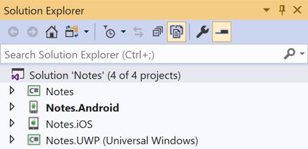
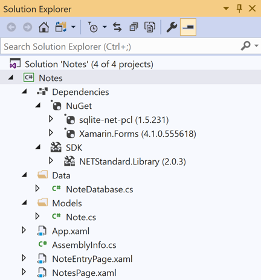
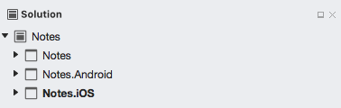
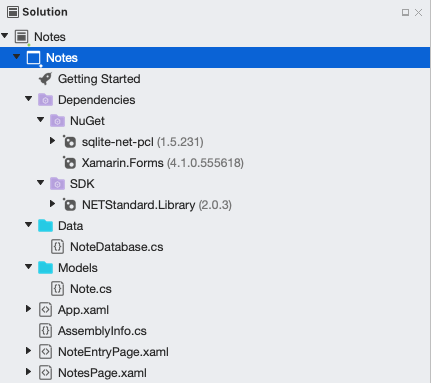
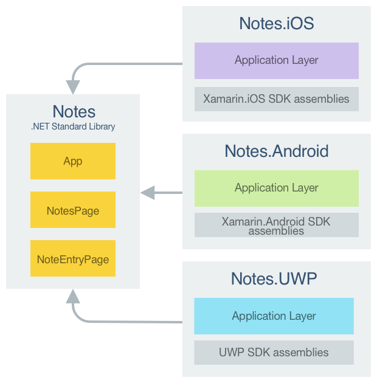
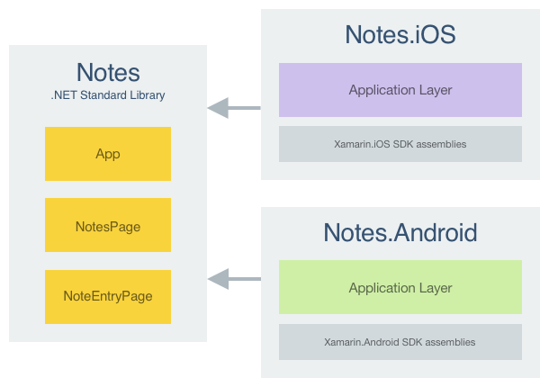

# Xamarin.Forms Quickstart Deep Dive

In the [Xamarin.Forms Quickstart](~/get-started/index.yml), the Notes application was built. This article reviews what has been built to gain an understanding of the fundamentals of how Xamarin.Forms applications work.

::: zone pivot="windows"

## Introduction to Visual Studio

Visual Studio organizes code into *Solutions* and *Projects*. A solution is a container that can hold one or more projects. A project can be an application, a supporting library, a test application, and more. The Notes application consists of one solution containing four projects, as shown in the following screenshot:



The projects are:

- Notes – This project is the .NET Standard library project that holds all of the shared code and shared UI.
- Notes.Android – This project holds Android-specific code and is the entry point for the Android application.
- Notes.iOS – This project holds iOS-specific code and is the entry point for the iOS application.
- Notes.UWP – This project holds Universal Windows Platform (UWP) specific code and is the entry point for the UWP application.

## Anatomy of a Xamarin.Forms application

The following screenshot shows the contents of the Notes .NET Standard library project in Visual Studio:



The project has a **Dependencies** node that contains **NuGet** and **SDK** nodes:

- **NuGet** &ndash; the Xamarin.Forms and sqlite-net-pcl NuGet packages that have been added to the project.
- **SDK** &ndash; the `NETStandard.Library` metapackage that references the complete set of NuGet packages that define .NET Standard.

::: zone-end
::: zone pivot="macos"

## Introduction to Visual Studio for Mac

[Visual Studio for Mac](/visualstudio/mac/) follows the Visual Studio practice of organizing code into *Solutions* and *Projects*. A solution is a container that can hold one or more projects. A project can be an application, a supporting library, a test application, and more. The Notes application consists of one solution containing three projects, as shown in the following screenshot:



The projects are:

- Notes – This project is the .NET Standard library project that holds all of the shared code and shared UI.
- Notes.Android – This project holds Android-specific code and is the entry point for Android applications.
- Notes.iOS – This project holds iOS specific-code and is the entry point for iOS applications.

## Anatomy of a Xamarin.Forms application

The following screenshot shows the contents of the Notes .NET Standard library project in Visual Studio for Mac:



The project has a **Dependencies** node that contains **NuGet** and **SDK** nodes:

- **NuGet** &ndash; the Xamarin.Forms and sqlite-net-pcl NuGet packages that have been added to the project.
- **SDK** &ndash; the `NETStandard.Library` metapackage that references the complete set of NuGet packages that define .NET Standard.

::: zone-end

The project also consists of a number of files:

- **Data\NoteDatabase.cs** – This class contains code to create the database, read data from it, write data to it, and delete data from it.
- **Models\Note.cs** – This class defines a `Note` model whose instances store data about each note in the application.
- **App.xaml** – The XAML markup for the `App` class, which defines a resource dictionary for the application.
- **App.xaml.cs** – The code-behind for the `App` class, which is responsible for instantiating the first page that will be displayed by the application on each platform, and for handling application lifecycle events.
- **AssemblyInfo.cs** – This file contains an application attribute about the project, that is applied at the assembly level.
- **NotesPage.xaml** – The XAML markup for the `NotesPage` class, which defines the UI for the page shown when the application launches.
- **NotesPage.xaml.cs** – The code-behind for the `NotesPage` class, which contains the business logic that is executed when the user interacts with the page.
- **NoteEntryPage.xaml** – The XAML markup for the `NoteEntryPage` class, which defines the UI for the page shown when the user enters a note.
- **NoteEntryPage.xaml.cs** – The code-behind for the `NoteEntryPage` class, which contains the business logic that is executed when the user interacts with the page.

For more information about the anatomy of a Xamarin.iOS application, see [Anatomy of a Xamarin.iOS Application](~/ios/get-started/hello-ios/hello-ios-deepdive.md#anatomy-of-a-xamarinios-application). For more information about the anatomy of a Xamarin.Android application, see [Anatomy of a Xamarin.Android Application](~/android/get-started/hello-android/hello-android-deepdive.md#anatomy).

## Architecture and application fundamentals

A Xamarin.Forms application is architected in the same way as a traditional cross-platform application. Shared code is typically placed in a .NET Standard library, and platform-specific applications consume the shared code. The following diagram shows an overview of this relationship for the Notes application:

::: zone pivot="windows"



::: zone-end
::: zone pivot="macos"



::: zone-end

To maximize the reuse of startup code, Xamarin.Forms applications have a single class named `App` that is responsible for instantiating the first page that will be displayed by the application on each platform, as shown in the following code example:

```csharp
using Xamarin.Forms;

namespace Notes
{
    public partial class App : Application
    {
        public App()
        {
            InitializeComponent();
            MainPage = new NavigationPage(new NotesPage());
        }
        ...
    }
}
```

This code sets the `MainPage` property of the `App` class to a [`NavigationPage`](xref:Xamarin.Forms.NavigationPage) instance whose content is a `NotesPage` instance.

In addition, the **AssemblyInfo.cs** file contains a single application attribute, that is applied at the assembly level:

```csharp
using Xamarin.Forms.Xaml;

[assembly: XamlCompilation(XamlCompilationOptions.Compile)]
```

The [`XamlCompilation`](xref:Xamarin.Forms.Xaml.XamlCompilationAttribute) attribute turns on the XAML compiler, so that XAML is compiled directly into intermediate language. For more information, see [XAML Compilation](~/xamarin-forms/xaml/xamlc.md).

## Launching the application on each platform

### iOS

To launch the initial Xamarin.Forms page in iOS, the Notes.iOS project defines the `AppDelegate` class that inherits from the `FormsApplicationDelegate` class:

```csharp
namespace Notes.iOS
{
    [Register("AppDelegate")]
    public partial class AppDelegate : global::Xamarin.Forms.Platform.iOS.FormsApplicationDelegate
    {
        public override bool FinishedLaunching(UIApplication app, NSDictionary options)
        {
            global::Xamarin.Forms.Forms.Init();
            LoadApplication(new App());
            return base.FinishedLaunching(app, options);
        }
    }
}
```

The `FinishedLaunching` override initializes the Xamarin.Forms framework by calling the `Init` method. This causes the iOS-specific implementation of Xamarin.Forms to be loaded in the application before the root view controller is set by the call to the `LoadApplication` method.

### Android

To launch the initial Xamarin.Forms page in Android, the Notes.Android project includes code that creates an `Activity` with the `MainLauncher` attribute, with the activity inheriting from the `FormsAppCompatActivity` class:

```csharp
namespace Notes.Droid
{
    [Activity(Label = "Notes",
              Icon = "@mipmap/icon",
              Theme = "@style/MainTheme",
              MainLauncher = true,
              ConfigurationChanges = ConfigChanges.ScreenSize | ConfigChanges.Orientation)]
    public class MainActivity : global::Xamarin.Forms.Platform.Android.FormsAppCompatActivity
    {
        protected override void OnCreate(Bundle savedInstanceState)
        {
            TabLayoutResource = Resource.Layout.Tabbar;
            ToolbarResource = Resource.Layout.Toolbar;

            base.OnCreate(savedInstanceState);
            global::Xamarin.Forms.Forms.Init(this, savedInstanceState);
            LoadApplication(new App());
        }
    }
}
```

The `OnCreate` override initializes the Xamarin.Forms framework by calling the `Init` method. This causes the Android-specific implementation of Xamarin.Forms to be loaded in the application before the Xamarin.Forms application is loaded.

::: zone pivot="windows"

### Universal Windows Platform

In Universal Windows Platform (UWP) applications, the `Init` method that initializes the Xamarin.Forms framework is invoked from the `App` class:

```csharp
Xamarin.Forms.Forms.Init (e);

if (e.PreviousExecutionState == ApplicationExecutionState.Terminated)
{
  ...
}
```

This causes the UWP-specific implementation of Xamarin.Forms to be loaded in the application. The initial Xamarin.Forms page is launched by the `MainPage` class:

```csharp
namespace Notes.UWP
{
    public sealed partial class MainPage
    {
        public MainPage()
        {
            this.InitializeComponent();
            this.LoadApplication(new Notes.App());
        }
    }
}
```

The Xamarin.Forms application is loaded with the `LoadApplication` method.

> [!NOTE]
> Universal Windows Platform apps can be built with Xamarin.Forms, but only using Visual Studio on Windows.

::: zone-end

## User interface

There are four main control groups used to create the user interface of a Xamarin.Forms application:

1. **Pages** – Xamarin.Forms pages represent cross-platform mobile application screens. The Notes application uses the [`ContentPage`](xref:Xamarin.Forms.ContentPage) class to display single screens. For more information about pages, see [Xamarin.Forms Pages](~/xamarin-forms/user-interface/controls/pages.md).
1. **Views** – Xamarin.Forms views are the controls displayed on the user interface, such as labels, buttons, and text entry boxes. The finished Notes application uses the [`ListView`](xref:Xamarin.Forms.ListView), [`Editor`](xref:Xamarin.Forms.Editor), and [`Button`](xref:Xamarin.Forms.Button) views. For more information about views, see [Xamarin.Forms Views](~/xamarin-forms/user-interface/controls/views.md).
1. **Layouts** – Xamarin.Forms layouts are containers used to compose views into logical structures. The Notes application uses the [`StackLayout`](xref:Xamarin.Forms.StackLayout) class to arrange views in a vertical stack, and the [`Grid`](xref:Xamarin.Forms.Grid) class to arrange buttons horizontally. For more information about layouts, see [Xamarin.Forms Layouts](~/xamarin-forms/user-interface/controls/layouts.md).
1. **Cells** – Xamarin.Forms cells are specialized elements used for items in a list, and describe how each item in a list should be drawn. The Notes application uses the [`TextCell`](xref:Xamarin.Forms.TextCell) to display two items for each row in the list. For more information about cells, see [Xamarin.Forms Cells](~/xamarin-forms/user-interface/controls/cells.md).

At runtime, each control will be mapped to its native equivalent, which is what will be rendered.

### Layout

The Notes application uses the [`StackLayout`](xref:Xamarin.Forms.StackLayout) to simplify cross-platform application development by automatically arranging views on the screen regardless of the screen size. Each child element is positioned one after the other, either horizontally or vertically in the order they were added. How much space the `StackLayout` will use depends on how the [`HorizontalOptions`](xref:Xamarin.Forms.View.HorizontalOptions) and [`VerticalOptions`](xref:Xamarin.Forms.View.HorizontalOptions) properties are set, but by default the `StackLayout` will try to use the entire screen.

The following XAML code shows an example of using a [`StackLayout`](xref:Xamarin.Forms.StackLayout) to layout the `NoteEntryPage`:

```xaml
<?xml version="1.0" encoding="UTF-8"?>
<ContentPage xmlns="http://xamarin.com/schemas/2014/forms"
             xmlns:x="http://schemas.microsoft.com/winfx/2009/xaml"
             x:Class="Notes.NoteEntryPage"
             Title="Note Entry">
    ...    
    <StackLayout Margin="{StaticResource PageMargin}">
        <Editor Placeholder="Enter your note"
                Text="{Binding Text}"
                HeightRequest="100" />
        <Grid>
            ...
        </Grid>
    </StackLayout>    
</ContentPage>
```

By default the [`StackLayout`](xref:Xamarin.Forms.StackLayout) assumes a vertical orientation. However, it can be changed to a horizontal orientation by setting the [`StackLayout.Orientation`](xref:Xamarin.Forms.StackLayout.Orientation) property to the [`StackOrientation.Horizontal`](xref:Xamarin.Forms.StackOrientation.Horizontal) enumeration member.

> [!NOTE]
> The size of views can be set through the `HeightRequest` and `WidthRequest` properties.

For more information about the [`StackLayout`](xref:Xamarin.Forms.StackLayout) class, see [StackLayout](~/xamarin-forms/user-interface/layouts/stacklayout.md).

### Responding to user interaction

An object defined in XAML can fire an event that is handled in the code-behind file. The following code example shows the `OnSaveButtonClicked` method in the code-behind for the `NoteEntryPage` class, which is executed in response to the [`Clicked`](xref:Xamarin.Forms.Button.Clicked) event firing on the *Save* button.

```csharp
async void OnSaveButtonClicked(object sender, EventArgs e)
{
    var note = (Note)BindingContext;
    note.Date = DateTime.UtcNow;
    await App.Database.SaveNoteAsync(note);
    await Navigation.PopAsync();
}
```

The `OnSaveButtonClicked` method saves the note in the database, and navigates back to the previous page.

> [!NOTE]
> The code-behind file for a XAML class can access an object defined in XAML using the name assigned to it with the `x:Name` attribute. The value assigned to this attribute has the same rules as C# variables, in that it must begin with a letter or underscore and contain no embedded spaces.

The wiring of the save button to the `OnSaveButtonClicked` method occurs in the XAML markup for the `NoteEntryPage` class:

```xaml
<Button Text="Save"
        Clicked="OnSaveButtonClicked" />
```

### Lists

The [`ListView`](xref:Xamarin.Forms.ListView) is responsible for displaying a collection of items vertically in a list. Each item in the `ListView` will be contained in a single cell.

The following code example shows the [`ListView`](xref:Xamarin.Forms.ListView) from the `NotesPage`:

```xaml
<ListView x:Name="listView"
          Margin="{StaticResource PageMargin}"
          ItemSelected="OnListViewItemSelected">
    <ListView.ItemTemplate>
        <DataTemplate>
            <TextCell Text="{Binding Text}"
                      Detail="{Binding Date}" />
        </DataTemplate>
    </ListView.ItemTemplate>
</ListView>
```

The layout of each row in the [`ListView`](xref:Xamarin.Forms.ListView) is defined within the [`ListView.ItemTemplate`](xref:Xamarin.Forms.ItemsView`1.ItemTemplate) element, and uses data binding to display any notes that are retrieved by the application. The [`ListView.ItemsSource`](xref:Xamarin.Forms.ItemsView`1.ItemsSource) property is set to the data source, in `NotesPage.xaml.cs`:

```csharp
protected override async void OnAppearing()
{
    base.OnAppearing();

    listView.ItemsSource = await App.Database.GetNotesAsync();
}
```    

This code populates the [`ListView`](xref:Xamarin.Forms.ListView) with any notes stored in the database.

When a row is selected in the [`ListView`](xref:Xamarin.Forms.ListView), the [`ItemSelected`](xref:Xamarin.Forms.ListView.ItemSelected) event fires. An event handler, named `OnListViewItemSelected`, is executed when the event fires:

```csharp
async void OnListViewItemSelected(object sender, SelectedItemChangedEventArgs e)
{
    if (e.SelectedItem != null)
    {
        ...
    }
}
```

The [`ItemSelected`](xref:Xamarin.Forms.ListView.ItemSelected) event can access the object that was associated with the cell through the [`e.SelectedItem`](xref:Xamarin.Forms.SelectedItemChangedEventArgs.SelectedItem) property.

For more information about the [`ListView`](xref:Xamarin.Forms.ListView) class, see [ListView](~/xamarin-forms/user-interface/listview/index.md).

## Navigation

Xamarin.Forms provides a number of different page navigation experiences, depending upon the [`Page`](xref:Xamarin.Forms.Page) type being used. For [`ContentPage`](xref:Xamarin.Forms.ContentPage) instances navigation can be hierarchical, or modal. For information about modal navigation, see [Xamarin.Forms Modal Pages](~/xamarin-forms/app-fundamentals/navigation/modal.md).

> [!NOTE]
> The [`CarouselPage`](xref:Xamarin.Forms.CarouselPage), [`MasterDetailPage`](xref:Xamarin.Forms.MasterDetailPage) and [`TabbedPage`](xref:Xamarin.Forms.TabbedPage) classes provide alternative navigation experiences. For more information, see [Navigation](~/xamarin-forms/app-fundamentals/navigation/index.md).

In hierarchical navigation, the [`NavigationPage`](xref:Xamarin.Forms.NavigationPage) class is used to navigate through a stack of [`ContentPage`](xref:Xamarin.Forms.ContentPage) objects, forwards and backwards, as desired. The class implements navigation as a last-in, first-out (LIFO) stack of [`Page`](xref:Xamarin.Forms.Page) objects. To move from one page to another, an application will push a new page onto the navigation stack, where it will become the active page. To return back to the previous page, the application will pop the current page from the navigation stack, and the new topmost page becomes the active page.

The `NavigationPage` class will also add a navigation bar to the top of the page that displays a title and a platform-appropriate **Back** button that will return to the previous page.

The first page added to a navigation stack is referred to as the *root* page of the application, and the following code example shows how this is accomplished in the Notes application:

```csharp
public App ()
{
    ...
    MainPage = new NavigationPage (new NotesPage ());
}
```

All [`ContentPage`](xref:Xamarin.Forms.ContentPage) instances have a [`Navigation`](xref:Xamarin.Forms.NavigableElement.Navigation) property that exposes methods to modify the page stack. These methods should only be invoked if the application includes a [`NavigationPage`](xref:Xamarin.Forms.NavigationPage). To navigate to the `NoteEntryPage`, it is necessary to invoke the [`PushAsync`](xref:Xamarin.Forms.NavigationPage.PushAsync(Xamarin.Forms.Page)) method as demonstrated in the code example below:

```csharp
await Navigation.PushAsync(new NoteEntryPage());
```

This causes the new `NoteEntryPage` object to be pushed onto the navigation stack, where it becomes the active page.

The active page can be popped from the navigation stack by pressing the *Back* button on the device, regardless of whether this is a physical button on the device or an on-screen button. To programmatically return back to the original page, the `NoteEntryPage` object must invoke the [`PopAsync`](xref:Xamarin.Forms.NavigationPage.PopAsync) method, as demonstrated in the code example below:

```csharp
await Navigation.PopAsync();
```

For more information about hierarchical navigation, see [Hierarchical Navigation](~/xamarin-forms/app-fundamentals/navigation/hierarchical.md).

## Data binding

Data binding is used to simplify how a Xamarin.Forms application displays and interacts with its data. It establishes a connection between the user interface and the underlying application. The [`BindableObject`](xref:Xamarin.Forms.BindableObject) class contains much of the infrastructure to support data binding.

Data binding connects two objects, called the *source* and the *target*. The *source* object provides the data. The *target* object will consume (and often display) data from the source object. For example, an [`Editor`](xref:Xamarin.Forms.Editor) (*target* object) will commonly bind its [`Text`](xref:Xamarin.Forms.InputView.Text) property to a public `string` property in a *source* object. The following diagram illustrates the binding relationship:


The main benefit of data binding is that you no longer have to worry about synchronizing data between your views and data source. Changes in the *source* object are automatically pushed to the *target* object behind-the-scenes by the binding framework, and changes in the target object can be optionally pushed back to the *source* object.

Establishing data binding is a two-step process:

- The [`BindingContext`](xref:Xamarin.Forms.BindableObject.BindingContext) property of the *target* object must be set to the *source*.
- A binding must be established between the *target* and the *source*. In XAML, this is achieved by using the [`Binding`](xref:Xamarin.Forms.Xaml.BindingExtension) markup extension.

In the Notes application, the binding target is the [`Editor`](xref:Xamarin.Forms.Editor) that displays a note, while the `Note` instance set as the [`BindingContext`](xref:Xamarin.Forms.BindableObject.BindingContext) of `NoteEntryPage` is the binding source.

The `BindingContext` of the `NoteEntryPage` is set during page navigation, as shown in the following code example:

```csharp
async void OnNoteAddedClicked(object sender, EventArgs e)
{
    await Navigation.PushAsync(new NoteEntryPage
    {
        BindingContext = new Note()
    });
}

async void OnListViewItemSelected(object sender, SelectedItemChangedEventArgs e)
{
    if (e.SelectedItem != null)
    {
        await Navigation.PushAsync(new NoteEntryPage
        {
            BindingContext = e.SelectedItem as Note
        });
    }
}
```

In the `OnNoteAddedClicked` method, which is executed when a new note is added to the application, the [`BindingContext`](xref:Xamarin.Forms.BindableObject.BindingContext) of `NoteEntryPage` is set to a new `Note` instance. In the `OnListViewItemSelected` method, which is executed when an existing note is selected in the [`ListView`](xref:Xamarin.Forms.ListView), the `BindingContext` of the `NoteEntryPage` is set to the selected `Note` instance, which is accessed through the [`e.SelectedItem`](xref:Xamarin.Forms.SelectedItemChangedEventArgs.SelectedItem) property.

> [!IMPORTANT]
> While the [`BindingContext`](xref:Xamarin.Forms.BindableObject.BindingContext) property of each *target* object can be individually set, this isn’t necessary. `BindingContext` is a special property that’s inherited by all its children. Therefore, when the `BindingContext` on the [`ContentPage`](xref:Xamarin.Forms.ContentPage) is set to a `Note` instance, all of the children of the `ContentPage` have the same `BindingContext`, and can bind to public properties of the `Note` object.

The [`Editor`](xref:Xamarin.Forms.Editor) in `NoteEntryPage` then binds to the `Text` property of the `Note` object:

```xaml
<Editor Placeholder="Enter your note"
        Text="{Binding Text}"
        ... />
```

A binding between the [`Editor.Text`](xref:Xamarin.Forms.InputView.Text) property and the `Text` property of the *source* object is established. Changes made in the `Editor` will automatically be propagated to the `Note` object. Similarly, if changes are made to the `Note.Text` property, the Xamarin.Forms binding engine will also update the contents of the `Editor`. This is known as a *two-way binding*.

For more information about data binding, see [Xamarin.Forms Data Binding](~/xamarin-forms/app-fundamentals/data-binding/index.md).

## Styling

Xamarin.Forms applications often contain multiple visual elements that have an identical appearance. Setting the appearance of each visual element can be repetitive and error prone. Instead, styles can be created that define the appearance, and then applied to the required visual elements.

The [`Style`](xref:Xamarin.Forms.Style) class groups a collection of property values into one object that can then be applied to multiple visual element instances. Styles are stored in a [`ResourceDictionary`](xref:Xamarin.Forms.ResourceDictionary), either at the application level, the page level, or the view level. Choosing where to define a `Style` impacts where it can be used:

- [`Style`](xref:Xamarin.Forms.Style) instances defined at the application level can be applied throughout the application.
- [`Style`](xref:Xamarin.Forms.Style) instances defined at the page level can be applied to the page and to its children.
- [`Style`](xref:Xamarin.Forms.Style) instances defined at the view level can be applied to the view and to its children.

> [!IMPORTANT]
> Any styles that are used throughout the application are stored in the application's resource dictionary to avoid duplication. However, XAML that's specific to a page shouldn't be included in the application's resource dictionary, as the resources will then be parsed at application startup instead of when required by a page.

Each [`Style`](xref:Xamarin.Forms.Style) instance contains a collection of one or more [`Setter`](xref:Xamarin.Forms.Setter) objects, with each `Setter` having a [`Property`](xref:Xamarin.Forms.Setter.Property) and a [`Value`](xref:Xamarin.Forms.Setter.Value). The `Property` is the name of the bindable property of the element the style is applied to, and the `Value` is the value that is applied to the property. The following code example shows a style from `NoteEntryPage`:

```xaml
<ContentPage xmlns="http://xamarin.com/schemas/2014/forms"
             xmlns:x="http://schemas.microsoft.com/winfx/2009/xaml"
             x:Class="Notes.NoteEntryPage"
             Title="Note Entry">
    <ContentPage.Resources>
        <!-- Implicit styles -->
        <Style TargetType="{x:Type Editor}">
            <Setter Property="BackgroundColor"
                    Value="{StaticResource AppBackgroundColor}" />
        </Style>
        ...
    </ContentPage.Resources>
    ...
</ContentPage>
```

This style is applied to any [`Editor`](xref:Xamarin.Forms.Editor) instances on the page.

When creating a [`Style`](xref:Xamarin.Forms.Style), the [`TargetType`](xref:Xamarin.Forms.Style.TargetType) property is always required.

> [!NOTE]
> Styling a Xamarin.Forms application is traditionally accomplished by using XAML styles. However, Xamarin.Forms also supports styling visual elements using Cascading Style Sheets (CSS). For more information, see [Styling Xamarin.Forms apps using Cascading Style Sheets (CSS)](~/xamarin-forms/user-interface/styles/css/index.md).

For more information about XAML styles, see [Styling Xamarin.Forms Apps using XAML Styles](~/xamarin-forms/user-interface/styles/xaml/index.md).

### Providing platform-specific styles

The `OnPlatform` markup extensions allow you to customize UI appearance on a per-platform basis:

```xaml
<Application xmlns="http://xamarin.com/schemas/2014/forms"
             xmlns:x="http://schemas.microsoft.com/winfx/2009/xaml"
             x:Class="Notes.App">
    <Application.Resources>
        ...
        <Color x:Key="iOSNavigationBarColor">WhiteSmoke</Color>
        <Color x:Key="AndroidNavigationBarColor">#2196F3</Color>
        <Color x:Key="iOSNavigationBarTextColor">Black</Color>
        <Color x:Key="AndroidNavigationBarTextColor">White</Color>

        <Style TargetType="{x:Type NavigationPage}">
            <Setter Property="BarBackgroundColor"
                    Value="{OnPlatform iOS={StaticResource iOSNavigationBarColor},
                                       Android={StaticResource AndroidNavigationBarColor}}" />
             <Setter Property="BarTextColor"
                    Value="{OnPlatform iOS={StaticResource iOSNavigationBarTextColor},
                                       Android={StaticResource AndroidNavigationBarTextColor}}" />           
        </Style>
        ...
    </Application.Resources>
</Application>
```

This [`Style`](xref:Xamarin.Forms.Style) sets different [`Color`](xref:Xamarin.Forms.Color) values for the [`BarBackgroundColor`](xref:Xamarin.Forms.NavigationPage.BarBackgroundColor) and [`BarTextColor`](xref:Xamarin.Forms.NavigationPage.BarTextColor) properties of [`NavigationPage`](xref:Xamarin.Forms.NavigationPage), depending on the platform being used.

For more information about XAML markup extensions, see [XAML Markup Extensions](~/xamarin-forms/xaml/markup-extensions/index.md). For information about the `OnPlatform` markup extension, see [OnPlatform Markup Extension](~/xamarin-forms/xaml/markup-extensions/consuming.md#onplatform-markup-extension).

## Testing and deployment

Visual Studio for Mac and Visual Studio both provide many options for testing and deploying an application. Debugging applications is a common part of the application development lifecycle and helps to diagnose code issues. For more information, see [Set a Breakpoint](https://github.com/xamarin/recipes/tree/master/Recipes/cross-platform/ide/debugging/set_a_breakpoint), [Step Through Code](https://github.com/xamarin/recipes/tree/master/Recipes/cross-platform/ide/debugging/step_through_code), and [Output Information to the Log Window](https://github.com/xamarin/recipes/tree/master/Recipes/cross-platform/ide/debugging/output_information_to_log_window).

Simulators are a good place to start deploying and testing an application, and feature useful functionality for testing applications. However, users will not consume the final application in a simulator, so applications should be tested on real devices early and often. For more information about iOS device provisioning, see [Device Provisioning](~/ios/get-started/installation/device-provisioning/index.md). For more information about Android device provisioning, see [Set Up Device for Development](~/android/get-started/installation/set-up-device-for-development.md).

## Next steps

This deep dive has examined the fundamentals of application development using Xamarin.Forms. Suggested next steps include reading about the following functionality:

- There are four main control groups used to create the user interface of a Xamarin.Forms application. For more information, see [Controls Reference](~/xamarin-forms/user-interface/controls/index.md).
- Data binding is a technique for linking properties of two objects so that changes in one property are automatically reflected in the other property. For more information, see [Data Binding](~/xamarin-forms/app-fundamentals/data-binding/index.md).
- Xamarin.Forms provides a number of different page navigation experiences, depending upon the page type being used. For more information, see [Navigation](~/xamarin-forms/app-fundamentals/navigation/index.md).
- Styles help to reduce repetitive markup, and allow an applications appearance to be more easily changed. For more information, see [Styling Xamarin.Forms Apps](~/xamarin-forms/user-interface/styles/index.md).
- XAML markup extensions extend the power and flexibility of XAML by allowing element attributes to be set from sources other than literal text strings. For more information, see [XAML Markup Extensions](~/xamarin-forms/xaml/markup-extensions/index.md).
- Data templates provide the ability to define the presentation of data on supported views. For more information, see [Data Templates](~/xamarin-forms/app-fundamentals/templates/data-templates/index.md).
- Each page, layout, and view is rendered differently on each platform using a `Renderer` class that in turn creates a native control, arranges it on the screen, and adds the behavior specified in the shared code. Developers can implement their own custom `Renderer` classes to customize the appearance and/or behavior of a control. For more information, see [Custom Renderers](~/xamarin-forms/app-fundamentals/custom-renderer/index.md).
- Effects also allow the native controls on each platform to be customized. Effects are created in platform-specific projects by subclassing the [`PlatformEffect`](xref:Xamarin.Forms.PlatformEffect`2) class, and are consumed by attaching them to an appropriate Xamarin.Forms control. For more information, see [Effects](~/xamarin-forms/app-fundamentals/effects/index.md).
- Shared code can access native functionality through the [`DependencyService`](xref:Xamarin.Forms.DependencyService) class. For more information, see [Accessing Native Features with DependencyService](~/xamarin-forms/app-fundamentals/dependency-service/index.md).

Alternatively, [_Creating Mobile Apps with Xamarin.Forms_](~/xamarin-forms/creating-mobile-apps-xamarin-forms/index.md), a book by Charles Petzold, is a good place to learn more about Xamarin.Forms. The book is available as a PDF or in a variety of ebook formats.

## Related links

- [eXtensible Application Markup Language (XAML)](~/xamarin-forms/xaml/index.yml)
- [Data Binding](~/xamarin-forms/app-fundamentals/data-binding/index.md)
- [Controls Reference](~/xamarin-forms/user-interface/controls/index.md)
- [XAML Markup Extensions](~/xamarin-forms/xaml/markup-extensions/index.md)
- [Xamarin.Forms Samples](/samples/browse/?products=xamarin&term=Xamarin.Forms)
- [Getting Started Samples](/samples/browse/?products=xamarin&term=Xamarin.Forms%2bget%2bstarted)
- [Xamarin.Forms API reference](xref:Xamarin.Forms)
- [Free Self-Guided Learning (video)](https://university.xamarin.com/self-guided/)

## Related video

> [!Video https://channel9.msdn.com/Series/Xamarin-101/Xamarin-Solution-Architecture-4-of-11/player]

[!include[](~/essentials/includes/xamarin-show-essentials.md)]