# Create a Single Page Xamarin.Forms Application

[ Download the sample](/samples/xamarin/xamarin-forms-samples/getstarted-notes-singlepage/)

In this quickstart, you will learn how to:

- Create a cross-platform Xamarin.Forms application.
- Define the user interface for a page using eXtensible Application Markup Language (XAML).
- Interact with XAML user interface elements from code.

The quickstart walks through how to create a cross-platform Xamarin.Forms application, which enables you to enter a note and persist it to device storage. The final application is shown below:

[](single-page-images/screenshots.png#lightbox "Notes Application")

::: zone pivot="windows"

### Prerequisites

- Visual Studio 2019 (latest release), with the **Mobile development with .NET** workload installed.
- Knowledge of C#.
- (optional) A paired Mac to build the application on iOS.

For more information about these prerequisites, see [Installing Xamarin](~/get-started/installation/index.md). For information about connecting Visual Studio 2019 to a Mac build host, see [Pair to Mac for Xamarin.iOS development](~/ios/get-started/installation/windows/connecting-to-mac/index.md).

## Get started with Visual Studio 2019

1. Launch Visual Studio 2019, and in the start window click **Create a new project** to create a new project:

    

2. In the **Create a new project** window, select **Mobile** in the **Project type** drop down, select the **Mobile App (Xamarin.Forms)** template, and click the **Next** button:

    

3. In the **Configure your new project** window, set the **Project name** to **Notes**, choose a suitable location for the project, and click the **Create** button:

    

    > [!IMPORTANT]
    > The C# and XAML snippets in this quickstart requires that the solution is named **Notes**. Using a different name will result in build errors when you copy code from this quickstart into the solution.

4. In the **New Cross Platform App** dialog, click **Blank App**, and click the **OK** button:

    

    For more information about the .NET Standard library that gets created, see [Anatomy of a Xamarin.Forms application](deepdive.md#anatomy-of-a-xamarinforms-application) in the [Xamarin.Forms Quickstart Deep Dive](deepdive.md).

5. In **Solution Explorer**, in the **Notes** project, double-click **MainPage.xaml** to open it:

    

6. In **MainPage.xaml**, remove all of the template code and replace it with the following code:

    ```xaml
    <?xml version="1.0" encoding="utf-8"?>
    <ContentPage xmlns="http://xamarin.com/schemas/2014/forms"
                 xmlns:x="http://schemas.microsoft.com/winfx/2009/xaml"
                 x:Class="Notes.MainPage">
        <StackLayout Margin="10,35,10,10">
            <Label Text="Notes"
                   HorizontalOptions="Center"
                   FontAttributes="Bold" />
            <Editor x:Name="editor"
                    Placeholder="Enter your note"
                    HeightRequest="100" />
            <Grid>
                <Grid.ColumnDefinitions>
                    <ColumnDefinition Width="*" />
                    <ColumnDefinition Width="*" />
                </Grid.ColumnDefinitions>
                <Button Text="Save"
                        Clicked="OnSaveButtonClicked" />
                <Button Grid.Column="1"
                        Text="Delete"
                        Clicked="OnDeleteButtonClicked"/>
            </Grid>
        </StackLayout>
    </ContentPage>
    ```

    This code declaratively defines the user interface for the page, which consists of a [`Label`](xref:Xamarin.Forms.Label) to display text, an [`Editor`](xref:Xamarin.Forms.Editor) for text input, and two [`Button`](xref:Xamarin.Forms.Button) instances that direct the application to save or delete a file. The two `Button` instances are horizontally laid out in a [`Grid`](xref:Xamarin.Forms.Grid), with the `Label`, `Editor`, and `Grid` being vertically laid out in a [`StackLayout`](xref:Xamarin.Forms.StackLayout). For more information about creating the user interface, see [User interface](deepdive.md#user-interface) in the [Xamarin.Forms Quickstart Deep Dive](deepdive.md).

    Save the changes to **MainPage.xaml** by pressing **CTRL+S**.

7. In **Solution Explorer**, in the **Notes** project, expand **MainPage.xaml** and double-click **MainPage.xaml.cs** to open it:

    

8. In **MainPage.xaml.cs**, remove all of the template code and replace it with the following code:

    ```csharp
    using System;
    using System.IO;
    using Xamarin.Forms;

    namespace Notes
    {
        public partial class MainPage : ContentPage
        {
            string _fileName = Path.Combine(Environment.GetFolderPath(Environment.SpecialFolder.LocalApplicationData), "notes.txt");

            public MainPage()
            {
                InitializeComponent();

                if (File.Exists(_fileName))
                {
                    editor.Text = File.ReadAllText(_fileName);
                }
            }

            void OnSaveButtonClicked(object sender, EventArgs e)
            {
                File.WriteAllText(_fileName, editor.Text);
            }

            void OnDeleteButtonClicked(object sender, EventArgs e)
            {
                if (File.Exists(_fileName))
                {
                    File.Delete(_fileName);
                }
                editor.Text = string.Empty;
            }
        }
    }
    ```

    This code defines a `_fileName` field, which references a file named `notes.txt` that will store note data in the local application data folder for the application. When the page constructor is executed the file is read, if it exists, and displayed in the [`Editor`](xref:Xamarin.Forms.Editor). When the **Save** [`Button`](xref:Xamarin.Forms.Button) is pressed the `OnSaveButtonClicked` event handler is executed, which saves the content of the `Editor` to the file. When the **Delete** `Button` is pressed the `OnDeleteButtonClicked` event handler is executed, which deletes the file, provided that it exists, and removes any text from the `Editor`. For more information about user interaction, see [Responding to user interaction](deepdive.md#responding-to-user-interaction) in the [Xamarin.Forms Quickstart Deep Dive](deepdive.md).

    Save the changes to **MainPage.xaml.cs** by pressing **CTRL+S**.

### Building the quickstart

1. In Visual Studio, select the **Build > Build Solution** menu item (or press F6). The solution will build and a success message will appear in the Visual Studio status bar:

      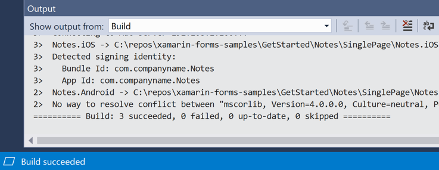

    If there are errors, repeat the previous steps and correct any mistakes until the solution builds successfully.

2. In the Visual Studio toolbar, press the **Start** button (the triangular button that resembles a Play button) to launch the application in your chosen Android emulator:

    

    [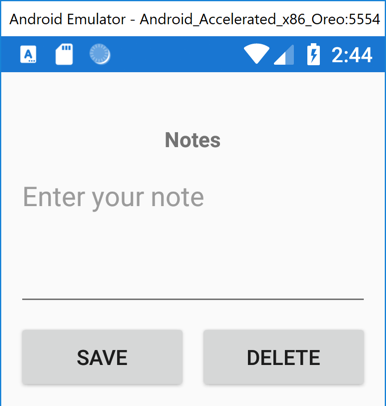](single-page-images/vs/notes-android-large.png#lightbox "Notes in the Android Simulator")

    Enter a note and press the **Save** button.

    For more information about how the application is launched on each platform, see [Launching the application on each platform](deepdive.md#launching-the-application-on-each-platform) in the [Xamarin.Forms Quickstart Deep Dive](deepdive.md).

    > [!NOTE]
    > The following steps should only be carried out if you have a [paired Mac](~/ios/get-started/installation/windows/connecting-to-mac/index.md) that meets the system requirements for Xamarin.Forms development.

3. In the Visual Studio toolbar, right-click on the **Notes.iOS** project, and select **Set as StartUp Project**.

      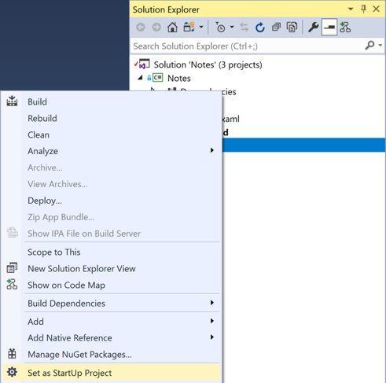

4. In the Visual Studio toolbar, press the **Start** button (the triangular button that resembles a Play button) to launch the application in your chosen [iOS remote simulator](~/tools/ios-simulator/index.md):

    

    [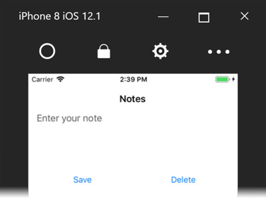](single-page-images/vs/notes-ios-large.png#lightbox "Notes in the iOS Simulator")

    Enter a note and press the **Save** button.

    For more information about how the application is launched on each platform, see [Launching the application on each platform](deepdive.md#launching-the-application-on-each-platform) in the [Xamarin.Forms Quickstart Deep Dive](deepdive.md).

::: zone-end
::: zone pivot="win-vs2017"

### Prerequisites

- Visual Studio 2017, with the **Mobile development with .NET** workload installed.
- Knowledge of C#.
- (optional) A paired Mac to build the application on iOS.

For more information about these prerequisites, see [Installing Xamarin](~/get-started/installation/index.md). For information about connecting Visual Studio 2019 to a Mac build host, see [Pair to Mac for Xamarin.iOS development](~/ios/get-started/installation/windows/connecting-to-mac/index.md).

## Get started with Visual Studio 2017

1. Launch Visual Studio 2017, and on the start page click **Create new project...** to create a new project:

    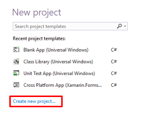

2. In the **New Project** dialog, click **Cross-Platform**, select the **Mobile App (Xamarin.Forms)** template, set the Name to **Notes**, choose a suitable location for the project and click the **OK** button:

    

    > [!IMPORTANT]
    > The C# and XAML snippets in this quickstart requires that the solution is named **Notes**. Using a different name will result in build errors when you copy code from this quickstart into the solution.

3. In the **New Cross Platform App** dialog, click **Blank App**, select **.NET Standard** as the Code Sharing Strategy, and click the **OK** button:

    

    For more information about the .NET Standard library that gets created, see [Anatomy of a Xamarin.Forms application](deepdive.md#anatomy-of-a-xamarinforms-application) in the [Xamarin.Forms Quickstart Deep Dive](deepdive.md).

4. In **Solution Explorer**, in the **Notes** project, double-click **MainPage.xaml** to open it:

    

5. In **MainPage.xaml**, remove all of the template code and replace it with the following code:

    ```xaml
    <?xml version="1.0" encoding="utf-8"?>
    <ContentPage xmlns="http://xamarin.com/schemas/2014/forms"
                 xmlns:x="http://schemas.microsoft.com/winfx/2009/xaml"
                 x:Class="Notes.MainPage">
        <StackLayout Margin="10,35,10,10">
            <Label Text="Notes"
                   HorizontalOptions="Center"
                   FontAttributes="Bold" />
            <Editor x:Name="editor"
                    Placeholder="Enter your note"
                    HeightRequest="100" />
            <Grid>
                <Grid.ColumnDefinitions>
                    <ColumnDefinition Width="*" />
                    <ColumnDefinition Width="*" />
                </Grid.ColumnDefinitions>
                <Button Text="Save"
                        Clicked="OnSaveButtonClicked" />
                <Button Grid.Column="1"
                        Text="Delete"
                        Clicked="OnDeleteButtonClicked"/>
            </Grid>
        </StackLayout>
    </ContentPage>
    ```

    This code declaratively defines the user interface for the page, which consists of a [`Label`](xref:Xamarin.Forms.Label) to display text, an [`Editor`](xref:Xamarin.Forms.Editor) for text input, and two [`Button`](xref:Xamarin.Forms.Button) instances that direct the application to save or delete a file. The two `Button` instances are horizontally laid out in a [`Grid`](xref:Xamarin.Forms.Grid), with the `Label`, `Editor`, and `Grid` being vertically laid out in a [`StackLayout`](xref:Xamarin.Forms.StackLayout). For more information about creating the user interface, see [User interface](deepdive.md#user-interface) in the [Xamarin.Forms Quickstart Deep Dive](deepdive.md).

    Save the changes to **MainPage.xaml** by pressing **CTRL+S**.

6. In **Solution Explorer**, in the **Notes** project, expand **MainPage.xaml** and double-click **MainPage.xaml.cs** to open it:

    

7. In **MainPage.xaml.cs**, remove all of the template code and replace it with the following code:

    ```csharp
    using System;
    using System.IO;
    using Xamarin.Forms;

    namespace Notes
    {
        public partial class MainPage : ContentPage
        {
            string _fileName = Path.Combine(Environment.GetFolderPath(Environment.SpecialFolder.LocalApplicationData), "notes.txt");

            public MainPage()
            {
                InitializeComponent();

                if (File.Exists(_fileName))
                {
                    editor.Text = File.ReadAllText(_fileName);
                }
            }

            void OnSaveButtonClicked(object sender, EventArgs e)
            {
                File.WriteAllText(_fileName, editor.Text);
            }

            void OnDeleteButtonClicked(object sender, EventArgs e)
            {
                if (File.Exists(_fileName))
                {
                    File.Delete(_fileName);
                }
                editor.Text = string.Empty;
            }
        }
    }
    ```

    This code defines a `_fileName` field, which references a file named `notes.txt` that will store note data in the local application data folder for the application. When the page constructor is executed the file is read, if it exists, and displayed in the [`Editor`](xref:Xamarin.Forms.Editor). When the **Save** [`Button`](xref:Xamarin.Forms.Button) is pressed the `OnSaveButtonClicked` event handler is executed, which saves the content of the `Editor` to the file. When the **Delete** `Button` is pressed the `OnDeleteButtonClicked` event handler is executed, which deletes the file, provided that it exists, and removes any text from the `Editor`. For more information about user interaction, see [Responding to user interaction](deepdive.md#responding-to-user-interaction) in the [Xamarin.Forms Quickstart Deep Dive](deepdive.md).

    Save the changes to **MainPage.xaml.cs** by pressing **CTRL+S**.

### Building the quickstart

1. In Visual Studio, select the **Build > Build Solution** menu item (or press F6). The solution will build and a success message will appear in the Visual Studio status bar:

      

    If there are errors, repeat the previous steps and correct any mistakes until the solution builds successfully.

2. In the Visual Studio toolbar, press the **Start** button (the triangular button that resembles a Play button) to launch the application in your chosen Android emulator:

    

    [](single-page-images/vs/notes-android-large.png#lightbox "Notes in the Android Simulator")

    Enter a note and press the **Save** button.

    For more information about how the application is launched on each platform, see [Launching the application on each platform](deepdive.md#launching-the-application-on-each-platform) in the [Xamarin.Forms Quickstart Deep Dive](deepdive.md).

    > [!NOTE]
    > The following steps should only be carried out if you have a [paired Mac](~/ios/get-started/installation/windows/connecting-to-mac/index.md) that meets the system requirements for Xamarin.Forms development.

3. In the Visual Studio toolbar, right-click on the **Notes.iOS** project, and select **Set as StartUp Project**.

      

4. In the Visual Studio toolbar, press the **Start** button (the triangular button that resembles a Play button) to launch the application in your chosen [iOS remote simulator](~/tools/ios-simulator/index.md):

    

    [](single-page-images/vs/notes-ios-large.png#lightbox "Notes in the iOS Simulator")

    Enter a note and press the **Save** button.

    For more information about how the application is launched on each platform, see [Launching the application on each platform](deepdive.md#launching-the-application-on-each-platform) in the [Xamarin.Forms Quickstart Deep Dive](deepdive.md).

::: zone-end
::: zone pivot="macos"

### Prerequisites

- Visual Studio for Mac (latest release), with iOS and Android platform support installed.
- Xcode (latest release).
- Knowledge of C#.

For more information about these prerequisites, see [Installing Xamarin](~/get-started/installation/index.md).

## Get started with Visual Studio for Mac

1. Launch Visual Studio for Mac, and in the start window click **New** to create a new project:

    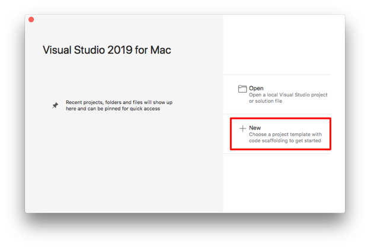

2. In the **Choose a template for your new project** dialog, click **Multiplatform > App**, select the **Blank Forms App** template, and click the **Next** button:

    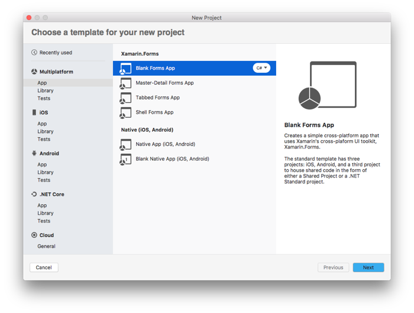

3. In the **Configure your Blank Forms app** dialog, name the new app **Notes**, ensure that the **Use .NET Standard** radio button is selected, and click the **Next** button:    

    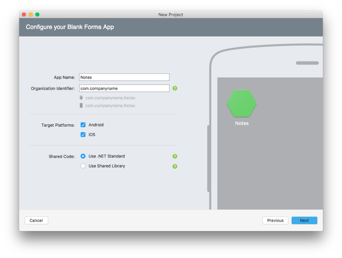

4. In the **Configure your new Blank Forms app** dialog, leave the Solution and Project names set to **Notes**, choose a suitable location for the project, and click the **Create** button to create the project:

    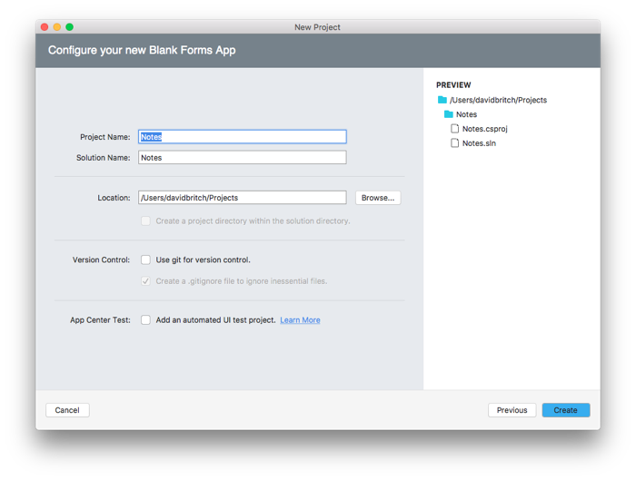

    > [!IMPORTANT]
    > The C# and XAML snippets in this quickstart requires that the solution and project are both named **Notes**. Using a different name will result in build errors when you copy code from this quickstart into the project.

    For more information about the .NET Standard library that gets created, see [Anatomy of a Xamarin.Forms application](deepdive.md#anatomy-of-a-xamarinforms-application) in the [Xamarin.Forms Quickstart Deep Dive](deepdive.md).

5. In the **Solution Pad**, in the **Notes** project, double-click **MainPage.xaml** to open it:

    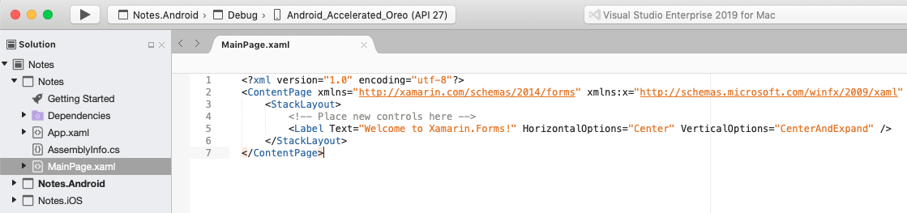

6. In **MainPage.xaml**, remove all of the template code and replace it with the following code:

    ```xaml
    <?xml version="1.0" encoding="utf-8"?>
    <ContentPage xmlns="http://xamarin.com/schemas/2014/forms"
                 xmlns:x="http://schemas.microsoft.com/winfx/2009/xaml"
                 x:Class="Notes.MainPage">
        <StackLayout Margin="10,35,10,10">
            <Label Text="Notes"
                   HorizontalOptions="Center"
                   FontAttributes="Bold" />
            <Editor x:Name="editor"
                    Placeholder="Enter your note"
                    HeightRequest="100" />
            <Grid>
                <Grid.ColumnDefinitions>
                    <ColumnDefinition Width="*" />
                    <ColumnDefinition Width="*" />
                </Grid.ColumnDefinitions>
                <Button Text="Save"
                        Clicked="OnSaveButtonClicked" />
                <Button Grid.Column="1"
                        Text="Delete"
                        Clicked="OnDeleteButtonClicked"/>
            </Grid>
        </StackLayout>
    </ContentPage>
    ```

    This code declaratively defines the user interface for the page, which consists of a [`Label`](xref:Xamarin.Forms.Label) to display text, an [`Editor`](xref:Xamarin.Forms.Editor) for text input, and two [`Button`](xref:Xamarin.Forms.Button) instances that direct the application to save or delete a file. The two `Button` instances are horizontally laid out in a [`Grid`](xref:Xamarin.Forms.Grid), with the `Label`, `Editor`, and `Grid` being vertically laid out in a [`StackLayout`](xref:Xamarin.Forms.StackLayout). For more information about creating the user interface, see [User interface](deepdive.md#user-interface) in the [Xamarin.Forms Quickstart Deep Dive](deepdive.md).

    Save the changes to **MainPage.xaml** by choosing **File > Save** (or by pressing **&#8984; + S**).

7. In the **Solution Pad**, in the **Notes** project, expand **MainPage.xaml** and double-click **MainPage.xaml.cs** to open it:

    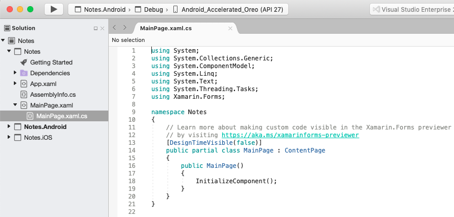

8. In **MainPage.xaml.cs**, remove all of the template code and replace it with the following code:

    ```csharp
    using System;
    using System.IO;
    using Xamarin.Forms;

    namespace Notes
    {
        public partial class MainPage : ContentPage
        {
            string _fileName = Path.Combine(Environment.GetFolderPath(Environment.SpecialFolder.LocalApplicationData), "notes.txt");

            public MainPage()
            {
                InitializeComponent();

                if (File.Exists(_fileName))
                {
                    editor.Text = File.ReadAllText(_fileName);
                }
            }

            void OnSaveButtonClicked(object sender, EventArgs e)
            {
                File.WriteAllText(_fileName, editor.Text);
            }

            void OnDeleteButtonClicked(object sender, EventArgs e)
            {
                if (File.Exists(_fileName))
                {
                    File.Delete(_fileName);
                }
                editor.Text = string.Empty;
            }
        }
    }
    ```

    This code defines a `_fileName` field, which references a file named `notes.txt` that will store note data in the local application data folder for the application. When the page constructor is executed the file is read, if it exists, and displayed in the [`Editor`](xref:Xamarin.Forms.Editor). When the **Save** [`Button`](xref:Xamarin.Forms.Button) is pressed the `OnSaveButtonClicked` event handler is executed, which saves the content of the `Editor` to the file. When the **Delete** `Button` is pressed the `OnDeleteButtonClicked` event handler is executed, which deletes the file, provided that it exists, and removes any text from the `Editor`. For more information about user interaction, see [Responding to user interaction](deepdive.md#responding-to-user-interaction) in the [Xamarin.Forms Quickstart Deep Dive](deepdive.md).

    Save the changes to **MainPage.xaml.cs** by choosing **File > Save** (or by pressing **&#8984; + S**).

### Building the quickstart

1. In Visual Studio for Mac, select the **Build > Build All** menu item (or press **&#8984; + B**). The projects will build and a success message will appear in the Visual Studio for Mac toolbar.

      

    If there are errors, repeat the previous steps and correct any mistakes until the projects build successfully.

2. In the **Solution Pad**, select the **Notes.iOS** project, right-click, and select **Set As Startup Project**:

      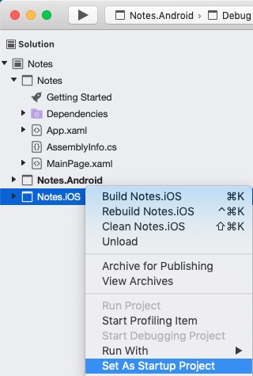

3. In the Visual Studio for Mac toolbar, press the **Start** button (the triangular button that resembles a Play button) to launch the application inside your chosen iOS Simulator:

      

      [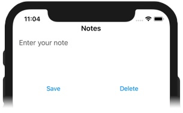](single-page-images/vsmac/notes-ios-large.png#lightbox "Notes in the iOS Simulator")

    Enter a note and press the **Save** button.

    For more information about how the application is launched on each platform, see [Launching the application on each platform](deepdive.md#launching-the-application-on-each-platform) in the [Xamarin.Forms Quickstart Deep Dive](deepdive.md).

4. In the **Solution Pad**, select the **Notes.Droid** project, right-click, and select **Set As Startup Project**:

      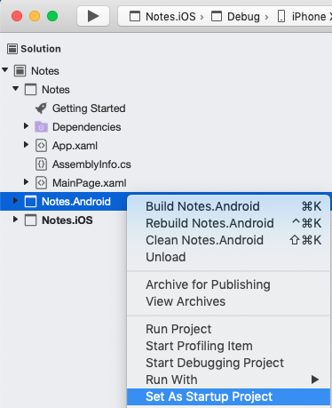

5. In the Visual Studio for Mac toolbar, press the **Start** button (the triangular button that resembles a Play button) to launch the application inside your chosen Android emulator:

      [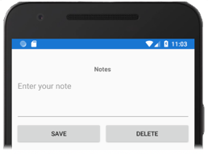](single-page-images/vsmac/notes-android-large.png#lightbox "Notes in the Android Simulator")

    Enter a note and press the **Save** button.

    For more information about how the application is launched on each platform, see [Launching the application on each platform](deepdive.md#launching-the-application-on-each-platform) in the [Xamarin.Forms Quickstart Deep Dive](deepdive.md).

::: zone-end

## Next steps

In this quickstart, you learned how to:

- Create a cross-platform Xamarin.Forms application.
- Define the user interface for a page using eXtensible Application Markup Language (XAML).
- Interact with XAML user interface elements from code.

To turn this single page application into a multi-page application, continue to the next quickstart.

> [!div class="nextstepaction"]
> [Next](multi-page.md)

## Related links

- [Notes (sample)](/samples/xamarin/xamarin-forms-samples/getstarted-notes-singlepage/)
- [Xamarin.Forms Quickstart Deep Dive](deepdive.md)