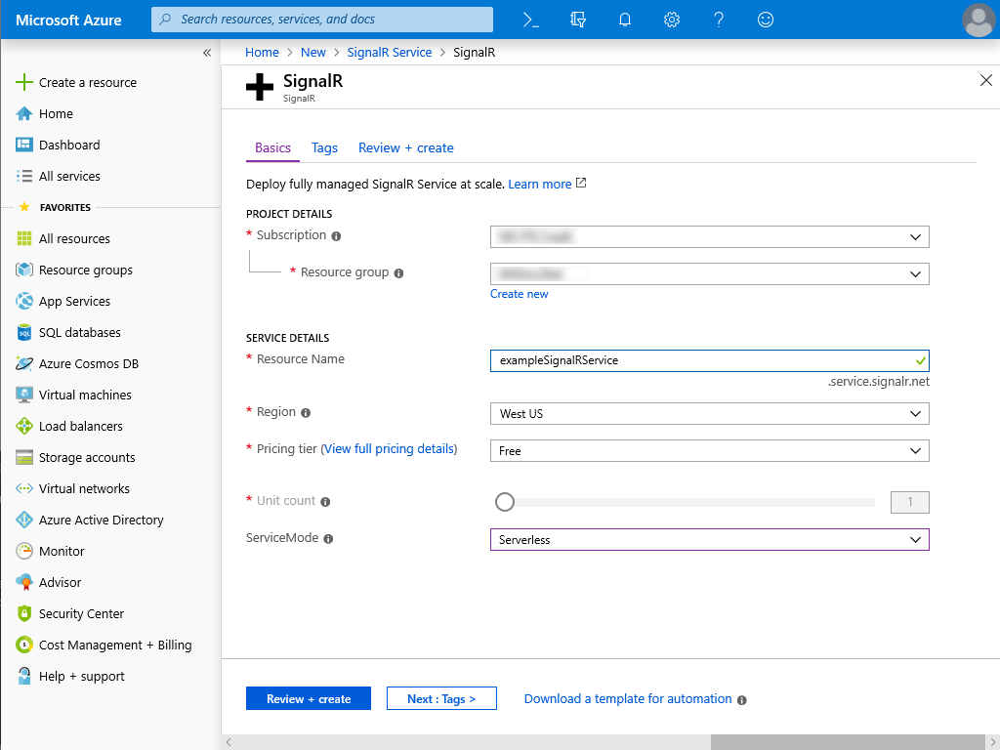
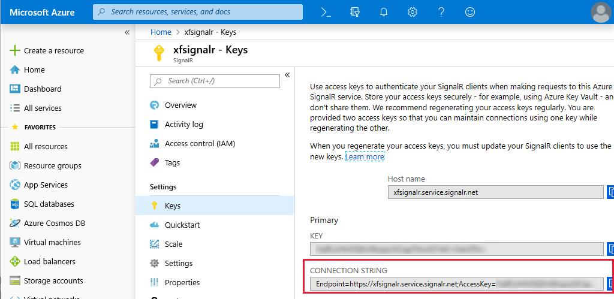
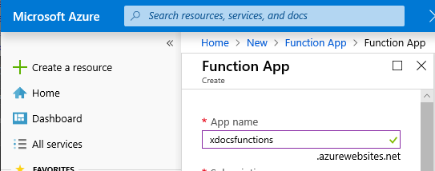
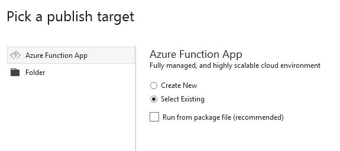
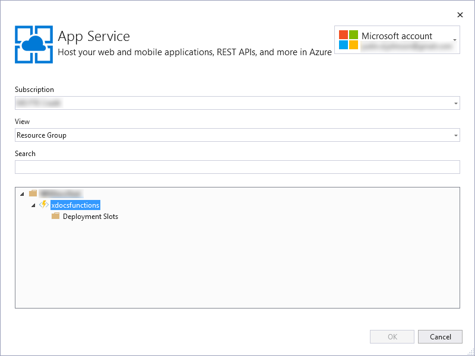
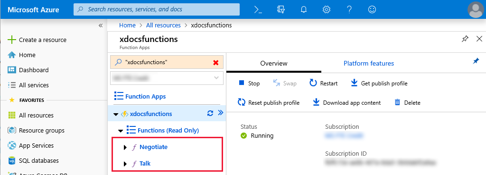

# Azure SignalR Service with Xamarin.Forms

[ Download the sample](/samples/xamarin/xamarin-forms-samples/webservices-azuresignalr/)

ASP.NET Core SignalR is an application model that simplifies the process of adding real-time communication to applications. Azure SignalR Service allows rapid development and deployment of scalable SignalR applications. Azure Functions are short-lived, serverless code methods that can be combined to form event-driven, scalable applications.

This article and sample show how to combine Azure SignalR Service and Azure Functions with Xamarin.Forms, to deliver real-time messages to connected clients.

> [!NOTE]
> If you don't have an [Azure subscription](/azure/guides/developer/azure-developer-guide#understanding-accounts-subscriptions-and-billing), create a [free account](https://aka.ms/azfree-docs-mobileapps) before you begin.

## Create an Azure SignalR Service and Azure Functions App

The sample application comprises three key components: an Azure SignalR Service hub, an Azure Functions instance with two functions, and a mobile application that can send and receive messages. These components interact as follows:

1. The mobile application invokes a **Negotiate** Azure Function to obtain information about the SignalR hub.
1. The mobile application uses the negotiation information to register itself with the SignalR hub, and forms a connection.
1. After registration, the mobile application posts messages to the **Talk** Azure Function.
1. The **Talk** function passes the incoming message to the SignalR hub.
1. The SignalR hub broadcasts the message to all connected mobile application instances, including the original sender.

> [!IMPORTANT]
> The **Negotiate** and **Talk** functions in the sample application can be run locally using Visual Studio 2019 and the Azure runtime tools. However, the Azure SignalR Service cannot be emulated locally and it's difficult to expose locally-hosted Azure Functions to physical or virtual devices for testing. It's recommended that you deploy the Azure Functions to an Azure Functions App instance as this allows cross-platform testing. For deployment details, see [Deploy Azure Functions with Visual Studio 2019](#deploy-azure-functions-with-visual-studio-2019).

### Create an Azure SignalR Service

An Azure SignalR Service can be created by choosing **Create a resource** in the upper left-hand corner of the Azure portal and searching for **SignalR**. The Azure SignalR Service can be created at the free tier. The Azure SignalR Service must be in **serverless** service mode. If you accidentally choose the default or classic service mode, you can change it later in the Azure SignalR Service properties.

The following screenshot shows the creation of a new Azure SignalR Service:



Once created, the **Keys** section of an Azure SignalR Service contains a **Connection String**, which is used to connect the Azure Functions App to the SignalR hub. The following screenshot shows where to find the connection string in the Azure SignalR Service:



This connection string is used to [Deploy Azure Functions with Visual Studio 2019](#deploy-azure-functions-with-visual-studio-2019).

### Create an Azure Functions App

To test the sample application, you should create a new Azure Functions App in the Azure portal. Make a note of the **App name** as this URL is used in the sample application **Constants.cs** file. The following screenshot shows the creation of a new Azure Functions App called "xdocsfunctions":

[](azure-signalr-images/azure-functions-app-full.png#lightbox)

Azure functions can be deployed to an Azure Functions App instance from Visual Studio 2019. The following sections describe deployment of two functions in the sample application to an Azure Functions App instance.

### Build Azure Functions in Visual Studio 2019

The sample application contains a class library called **ChatServer**, which includes two serverless Azure Functions in files called **Negotiate.cs** and **Talk.cs**.

The `Negotiate` function responds to web requests with a `SignalRConnectionInfo` object that contains an `AccessToken` property and a `Url` property. The mobile application uses these values to register itself with the SignalR hub. The following code shows the `Negotiate` function:

```csharp
[FunctionName("Negotiate")]
public static SignalRConnectionInfo GetSignalRInfo(
    [HttpTrigger(AuthorizationLevel.Anonymous,"get",Route = "negotiate")]
    HttpRequest req,
    [SignalRConnectionInfo(HubName = "simplechat")]
    SignalRConnectionInfo connectionInfo)
{
    return connectionInfo;
}
```

The `Talk` function responds to HTTP POST requests that provide a message object in POST body. The POST body is transformed into a `SignalRMessage` and forwarded to the SignalR hub. The following code shows the `Talk` function:

```csharp
[FunctionName("Talk")]
public static async Task<IActionResult> Run(
    [HttpTrigger(
        AuthorizationLevel.Anonymous,
        "post",
        Route = "talk")]
    HttpRequest req,
    [SignalR(HubName = "simplechat")]
    IAsyncCollector<SignalRMessage> questionR,
    ILogger log)
{
    log.LogInformation("C# HTTP trigger function processed a request.");

    try
    {
        string json = await new StreamReader(req.Body).ReadToEndAsync();
        dynamic obj = JsonConvert.DeserializeObject(json);

        var name = obj.name.ToString();
        var text = obj.text.ToString();

        var jObject = new JObject(obj);

        await questionR.AddAsync(
            new SignalRMessage
            {
                Target = "newMessage",
                Arguments = new[] { jObject }
            });

        return new OkObjectResult($"Hello {name}, your message was '{text}'");
    }
    catch (Exception ex)
    {
        return new BadRequestObjectResult("There was an error: " + ex.Message);
    }
}
```

To learn more about Azure functions and Azure Functions Apps, see [Azure Functions documentation](/azure/azure-functions/).

### Deploy Azure Functions with Visual Studio 2019

Visual Studio 2019 allows you to deploy functions to an Azure Functions App. Azure-hosted functions ease cross-platform testing by providing an accessible testing endpoint for all devices.

Right-clicking the sample functions app and choosing **Publish** launches the dialog to publish functions to your Azure Functions App. If you followed the previous steps to set up an Azure Function App, you can choose **Select Existing** to publish the sample applications to your Azure Functions App. The following screenshot shows the publish dialog options in Visual Studio 2019:



Once you have signed in to your Microsoft account, you can locate and choose your Azure Functions App as the publishing target. The following screenshot shows an example Azure Functions App in the Visual Studio 2019 publishing dialog:



After selecting an Azure Functions App instance, the Site URL, configuration, and other information about the target Azure Functions App are displayed. Choose **Edit Azure App Service Settings** and enter your connection string in the **Remote** field. The connection string is used by the **Negotiate** and **Talk** functions to connect to the Azure SignalR Service and is available in the **Keys** section of the Azure SignalR Service in your Azure portal. For more information about the connection string, see [Create an Azure SignalR Service](#create-an-azure-signalr-service).

Once you have entered the connection string, you can click **Publish** to deploy your functions to the Azure Functions App. Once complete, the functions will be listed in the Azure Functions App in the Azure portal. The following screenshot shows the published functions in the Azure portal:



## Integrate Azure SignalR Service with Xamarin.Forms

The integration between Azure SignalR Service and the Xamarin.Forms application is a SignalR service class that is instantiated in the `MainPage` class with event handlers assigned to three events. For more information about these event handlers, see [Use the SignalR service class in Xamarin.Forms](#use-the-signalr-service-class-in-xamarinforms).

The sample application includes a **Constants.cs** class that must be customized with the URL endpoint of your Azure Functions App. Set the value of the `HostName` property to your Azure Functions App address. The following code shows the **Constants.cs** properties with an example `HostName` value:

```csharp
public static class Constants
{
    public static string HostName { get; set; } = "https://example-functions-app.azurewebsites.net/";

    // Used to differentiate message types sent via SignalR. This
    // sample only uses a single message type.
    public static string MessageName { get; set; } = "newMessage";

    public static string Username
    {
        get
        {
            return $"{Device.RuntimePlatform} User";
        }
    }
}
```

> [!NOTE]
> The `Username` property in the sample application **Constants.cs** file uses the device's `RuntimePlatform` value as the username. This makes it easy to test devices cross-platform and identify which device is sending the message. In a real-world application, this value would likely be a unique username, collected during a sign up or sign in process.

### The SignalR service class

The `SignalRService` class in the **ChatClient** project in the sample application shows an implementation that invokes functions in an Azure Functions App to connect to an Azure SignalR Service.

The `SendMessageAsync` method in the `SignalRService` class is used to send messages to clients connected to the Azure SignalR Service. This method performs an HTTP POST request to the **Talk** function hosted in the Azure Functions App, including a JSON-serialized `Message` object as the POST payload. The **Talk** function passes the message to the Azure SignalR Service for broadcast to all connected clients. The following code shows the `SendMessageAsync` method:

```csharp
public async Task SendMessageAsync(string username, string message)
{
    IsBusy = true;

    var newMessage = new Message
    {
        Name = username,
        Text = message
    };

    var json = JsonConvert.SerializeObject(newMessage);
    var content = new StringContent(json, Encoding.UTF8, "application/json");
    var result = await client.PostAsync($"{Constants.HostName}/api/talk", content);

    IsBusy = false;
}
```

The `ConnectAsync` method in the `SignalRService` class performs an HTTP GET request to the **Negotiate** function hosted in the Azure Functions App. The **Negotiate** function returns JSON that is deserialized into an instance of the `NegotiateInfo` class. Once the `NegotiateInfo` object is retrieved, it's used to register directly with the Azure SignalR Service using an instance of the `HubConnection` class.

ASP.NET Core SignalR translates incoming data from the open connection into messages, and allows developers to define message types and bind event handlers to incoming messages by type. The `ConnectAsync` method registers an event handler for the message name defined in the sample application's **Constants.cs** file, which is "newMessage" by default.

The following code shows the `ConnectAsync` method:

```csharp
public async Task ConnectAsync()
{
    try
    {
        IsBusy = true;

        string negotiateJson = await client.GetStringAsync($"{Constants.HostName}/api/negotiate");
        NegotiateInfo negotiate = JsonConvert.DeserializeObject<NegotiateInfo>(negotiateJson);
        HubConnection connection = new HubConnectionBuilder()
            .AddNewtonsoftJsonProtocol()
            .WithUrl(negotiate.Url, options =>
            {
                options.AccessTokenProvider = async () => negotiate.AccessToken;
            })
            .Build();

        connection.On<JObject>(Constants.MessageName, AddNewMessage);
        await connection.StartAsync();

        IsConnected = true;
        IsBusy = false;

        Connected?.Invoke(this, true, "Connection successful.");
    }
    catch (Exception ex)
    {
        ConnectionFailed?.Invoke(this, false, ex.Message);
    }
}
```

> [!NOTE]
> The SignalR service uses `System.Text.Json` to serialize and deserialize JSON by default. Data serialized with other libraries, such as Newtonsoft, may fail to be deserialized by the SignalR service. The `HubConnection` instance in the sample project includes a call to `AddNewtonsoftJsonProtocol` to specify the JSON serializer. This method is defined in a special NuGet package called **Microsoft.AspNetCore.SignalR.Protocols.NewtonsoftJson** that must be included in the project. If you are using `System.Text.Json` to serialize/deserialize JSON data, this method and NuGet package should not be used.

The `AddNewMessage` method is bound as the event handler in the `ConnectAsync` message as shown in the previous code. When a message is received, the `AddNewMessage` method is called with the message data provided as a `JObject`. The `AddNewMessage` method converts the `JObject` to an instance of the `Message` class and then invokes the handler for `NewMessageReceived` if one has been bound. The following code shows the `AddNewMessage` method:

```csharp
public void AddNewMessage(JObject message)
{
    Message messageModel = new Message
    {
        Name = message.GetValue("name").ToString(),
        Text = message.GetValue("text").ToString(),
        TimeReceived = DateTime.Now
    };

    NewMessageReceived?.Invoke(this, messageModel);
}
```

### Use the SignalR service class in Xamarin.Forms

Utilizing the SignalR service class in Xamarin.Forms is accomplished by binding the `SignalRService` class events in the `MainPage` code-behind class.

The `Connected` event in the `SignalRService` class is fired when a SignalR connection is completed successfully. The `ConnectionFailed` event in the `SignalRService` class is fired when a SignalR connection fails. The `SignalR_ConnectionChanged` event handler method is bound to both events in the `MainPage` constructor. This event handler updates the connect and send button states based on the connection `success` argument, and adds the message provided by the event to the chat queue using the `AddMessage` method. The following code shows the `SignalR_ConnectionChanged` event handler method:

```csharp
void SignalR_ConnectionChanged(object sender, bool success, string message)
{
    connectButton.Text = "Connect";
    connectButton.IsEnabled = !success;
    sendButton.IsEnabled = success;

    AddMessage($"Server connection changed: {message}");
}
```

The `NewMessageReceived` event in the `SignalRService` class is fired when a new message is received from the Azure SignalR Service. The `SignalR_NewMessageReceived` event handler method is bound to the `NewMessageReceived` event in the `MainPage` constructor. This event handler converts the incoming `Message` object into a string and adds it to the chat queue using the `AddMessage` method. The following code shows the `SignalR_NewMessageReceived` event handler method:

```csharp
void SignalR_NewMessageReceived(object sender, Model.Message message)
{
    string msg = $"{message.Name} ({message.TimeReceived}) - {message.Text}";
    AddMessage(msg);
}
```

The `AddMessage` method adds a new message as a `Label` object to the chat queue. The `AddMessage` method is often called by event handlers from outside of the main UI thread, so it forces the UI updates to occur on the main thread to prevent exceptions. The following code shows the `AddMessage` method:

```csharp
void AddMessage(string message)
{
    Device.BeginInvokeOnMainThread(() =>
    {
        Label label = new Label
        {
            Text = message,
            HorizontalOptions = LayoutOptions.Start,
            VerticalOptions = LayoutOptions.Start
        };

        messageList.Children.Add(label);
    });
}
```

## Test the application

The SignalR chat application can be tested on iOS, Android and UWP provided that you have:

1. Created an Azure SignalR Service.
1. Created an Azure Functions App.
1. Customized the **Constants.cs** file with the Azure Functions App endpoint.

Once these steps are completed and the application is run, clicking the **Connect** button forms a connection with the Azure SignalR Service. Typing a message and clicking the **Send** button results in messages appearing in the chat queue on any connected mobile application.

## Related links

* [Crafting real-time mobile apps with Xamarin and SignalR](https://www.youtube.com/watch?v=AlqZ1LpUXeg)
* [Introduction to SignalR](/aspnet/signalr/overview/getting-started/introduction-to-signalr)
* [Introduction to Azure Functions](/azure/azure-functions/functions-overview)
* [Azure Functions documentation](/azure/azure-functions/)
* [MVVM SignalR chat sample](https://github.com/lbugnion/sample-xamarin-signalr)