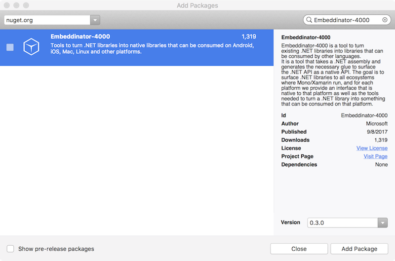
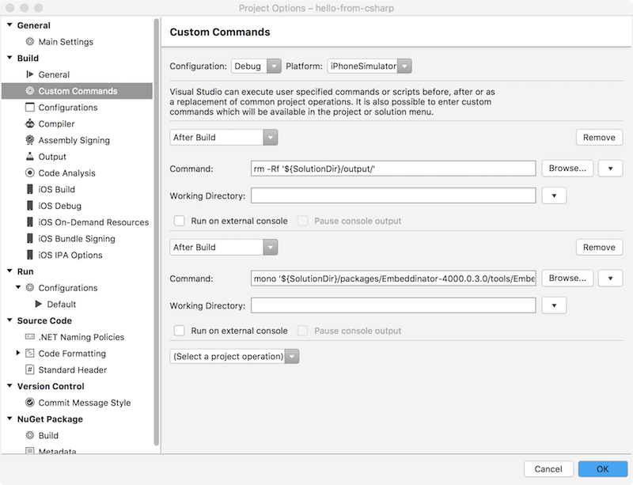

# Installing .NET Embedding

## Installing .NET Embedding from NuGet

Choose **Add > Add NuGet Packages...** and install **Embeddinator-4000** from the NuGet package manager:



This will install **Embeddinator-4000.exe** and **objcgen** into the **packages/Embeddinator-4000/tools** directory.

In general, the latest release of the Embeddinator-4000 should be selected for downloading. Objective-C support requires 0.4 or later.

## Running manually

Now that the NuGet is installed, you can run the tooling by hand.

- Open a Terminal (macOS) or Command Prompt (Windows)
- Change directory to your solution root
- The tooling is installed in:
  - **./packages/Embeddinator-4000.[VERSION]/tools/objcgen** (Objective-C)
  - **./packages/Embeddinator-4000.[VERSION]/tools/Embeddinator-4000.exe** (Java/C)
- On macOS, **objcgen** can be run directly.
- On Windows, **Embeddinator-4000.exe** can be run directly.
- On macOS, **Embeddinator-4000.exe** needs to be run with **mono**:
  - `mono ./packages/Embeddinator-4000.[VERSION]/tools/Embeddinator-4000.exe`

Each command invocation will need a number of paramaters listed in the platform-specific documentation.

## Automatic binding generation

There are two approaches for automatically running .NET Embedding part of your build process.

- Custom MSBuild targets
- Post-build steps

While this document will describe both, using a custom MSBuild target is preferred. Post Build Steps will not necessarily run when building from the command line.

### Custom MSBuild targets

To customize your build with MSbuild targets, first create a **Embeddinator-4000.targets** file next to your csproj similar to the following:

```xml
<Project DefaultTargets="Build" xmlns="http://schemas.microsoft.com/developer/msbuild/2003">
    <Target Name="RunEmbeddinator" AfterTargets="AfterBuild" Inputs="$(OutputPath)/$(AssemblyName).dll" Outputs="$(IntermediateOutputPath)/Embeddinator/$(AssemblyName).framework/$(AssemblyName)">
        <Exec Command="" />
    </Target>
</Project>
```

Here, the command's text should be filled in with one of the .NET Embedding invocations listed in the platform-specific documentation.

To use this target:

- Close your project in Visual Studio 2017 or Visual Studio for Mac
- Open the library csproj in a text editor
- Add this line at the bottom, above the final `</Project>` line:

```xml
 <Import Project="Embeddinator-4000.targets" />
```

- Reopen your project

### Post-build steps

The steps to add a post-build step to run .NET Embedding vary depending on the IDE:

#### Visual Studio for Mac

In Visual Studio for Mac, go to **Project Options > Build > Custom Commands** and add an **After Build** step.

Set up the command listed in the platform-specific documentation.

> [!NOTE]
> Make sure to use the version number you installed from NuGet

If you are going to be doing ongoing development on the C# project, you might also add a custom command to clean the **output** directory prior to running .NET Embedding:

```shell
rm -Rf '${SolutionDir}/output/'
```



> [!NOTE]
> The generated binding will be placed in the directory indicated by the
> `--outdir` or `--out` parameter. The generated binding name may vary as
> some platforms have limitations on package names.

#### Visual Studio 2017

We will essentially set up the same thing, but the menus in Visual Studio 2017 are a bit different. The shell commands are also slightly different.

Go to **Project Options > Build Events** and enter the command listed in the platform-specific documentation into the **Post-build event command line** box. For example:


 