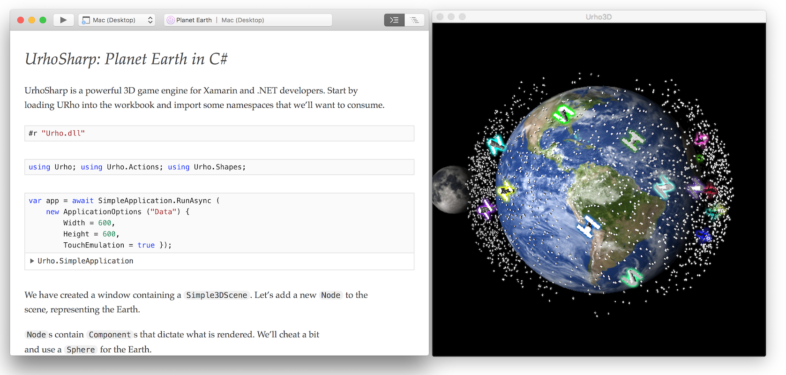

# Xamarin Workbooks

Xamarin Workbooks provide a blend of documentation and code that is perfect for
experimentation, learning, and creating guides and teaching aids.

Create a rich C# workbook for Android, iOS, Mac, WPF, or Console, and get instant live
results as you learn these APIs.

Xamarin Workbooks is open source software. Development happens in the open
on GitHub. We invite interested users and developers to get involved with the
project.

[Join us on GitHub!](https://github.com/Microsoft/workbooks)

Give it a try and let us know what you think, or if
you [run into any bugs](~/tools/workbooks/install.md#reporting-bugs). We have a
[forum](https://forums.xamarin.com/categories/inspector) too!

## [Installation and Requirements](install.md)

Information on getting Workbooks installed on your Mac or Windows computer.

## [Interactive Workbooks](workbook.md)

An introduction to how to use Xamarin Workbooks.

## Samples

There are a wide variety of [sample workbooks available on GitHub](https://github.com/xamarin/workbooks).

## [Integration SDK](sdk/index.md)

It is possible to extend Xamarin Workbooks with custom data representations
and renderers. Integrations are written with C# and TypeScript/JavaScript.
