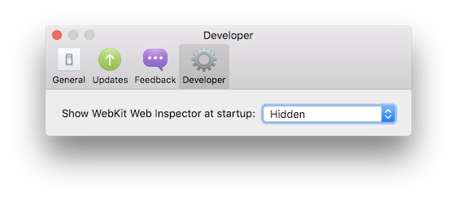
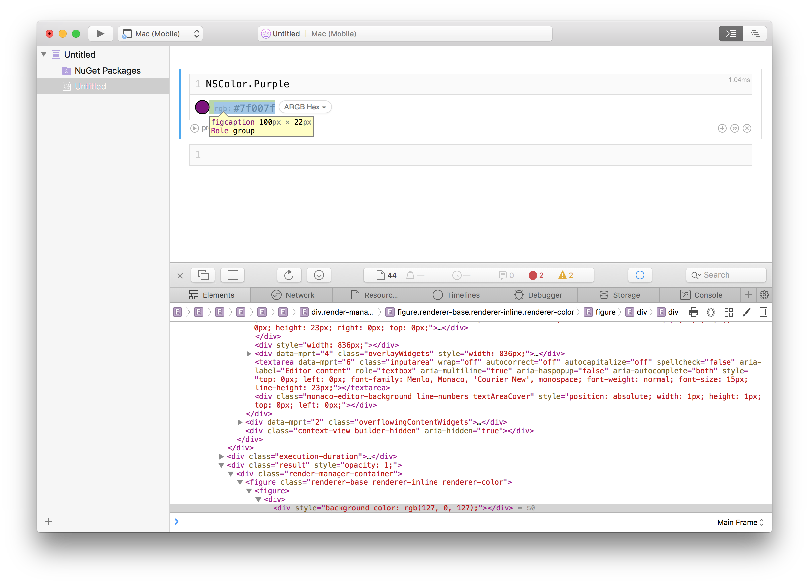
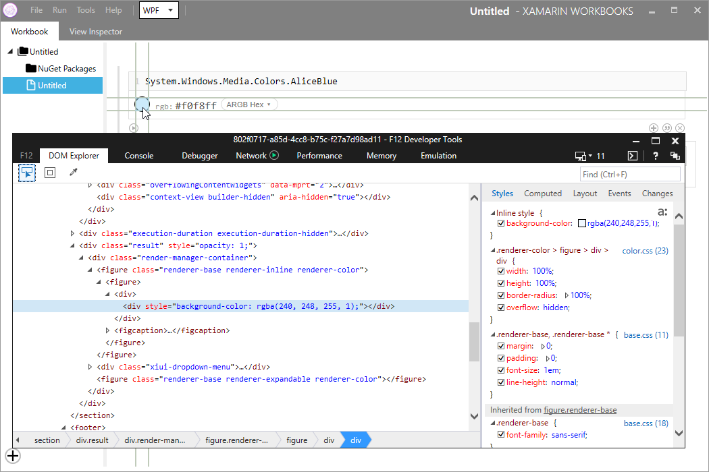

# Debugging integrations

## Debugging agent-side integrations

Debugging agent-side integrations is best done by using the logging methods
provided by the `Log` class in `Xamarin.Interactive.Logging`.

On macOS, log messages appear in both the log viewer menu (**Window > Log Viewer**)
and in the client log. On Windows, messages only appear in the client log,
as there is no log viewer there.

The client log is at the following locations on macOS and Windows:

- Mac: `~/Library/Logs/Xamarin/Workbooks/Xamarin Workbooks {date}.log`
- Windows: `%LOCALAPPDATA%\Xamarin\Workbooks\logs\Xamarin Workbooks {date}.log`

One thing to be aware of is that when loading integrations via the usual `#r` mechanism
during development, the integration assembly will be picked up as a _dependency_ of the
workbook and packaged with it if an absolute path is not used. This can cause changes to
appear to not propagate, as if rebuilding the integration did nothing.

## Debugging client-side integrations

As client-side integrations are written in JavaScript and loaded into our
web browser surface (see the [architecture](~/tools/workbooks/sdk/architecture.md) documentation), the best
way to debug them is using the WebKit developer tools on Mac, or using F12
Chooser on Windows.

Both sets of tools allow you to view JavaScript/TypeScript source, set breakpoints,
view console output, and inspect and modify the DOM.

### Mac

To enable the developer tools for Xamarin Workbooks on Mac, run the following
command in your terminal:

```shell
defaults write com.xamarin.Workbooks WebKitDeveloperExtras -bool true
```

and then restart Xamarin Workbooks. Once you do so, you should see **Inspect Element** 
appear in your right-click context menu, and a new **Developer** pane
will be available in Workbooks preferences. This option allows you to choose if you want
the developer tools opened at startup:

[](debugging-images/developer-pane.png#lightbox)

This preference is restart-only as well—you'll need to restart the Workbooks client
in order for it to take effect on new workbooks. Activating the developer tools via
the context menu or the preferences will show the familiar Safari UI:

[](debugging-images/mac-dev-tools.png#lightbox)

For information about using the Safari developer tools, see the
[WebKit inspector documentation][webkit-docs].

### Windows

On Windows, the IE team provides a tool known as "F12 Chooser" that is a remote
debugger for embedded Internet Explorer instances. You can find the tool in the
following location:

```shell
C:\Windows\System32\F12\F12Chooser.exe
```

Run F12 Chooser, and you should see the embedded instance that powers the Workbooks
client surface in the list. Choose it, and the familiar F12 debugging tools from Internet
Explorer will appear, attached to the client:

[](debugging-images/windows-dev-tools.png#lightbox)

[webkit-docs]: https://trac.webkit.org/wiki/WebInspector
