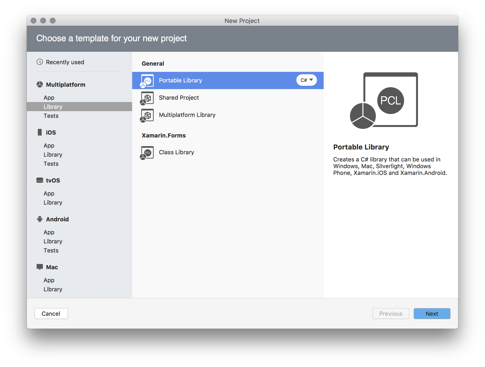
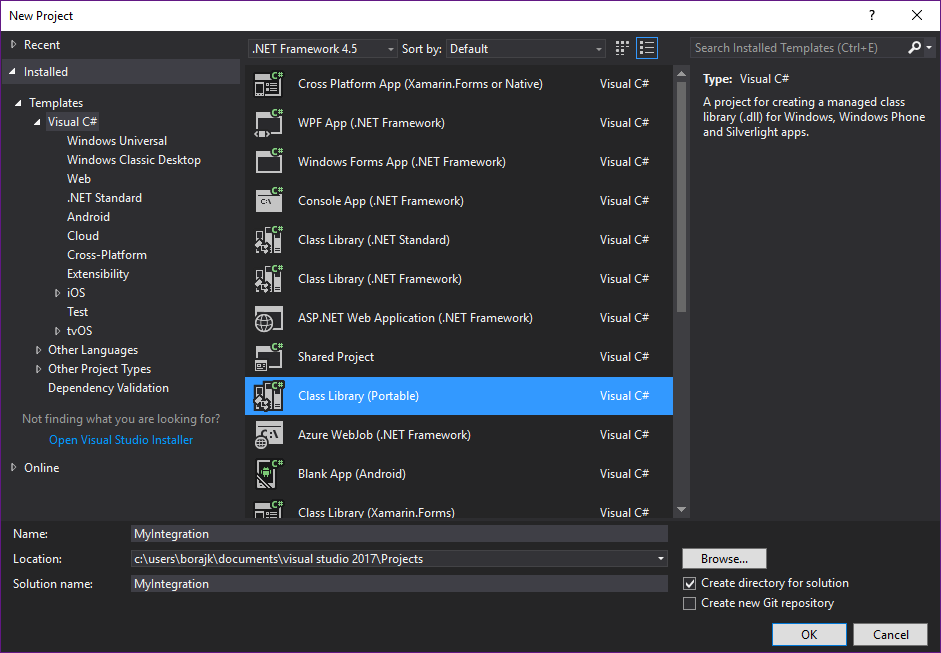
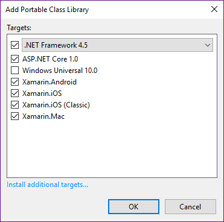
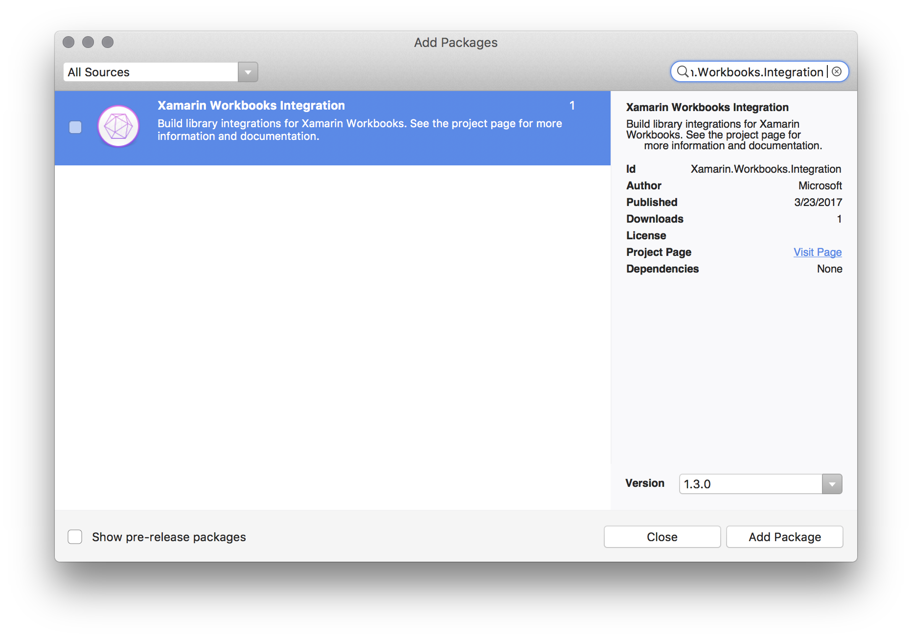
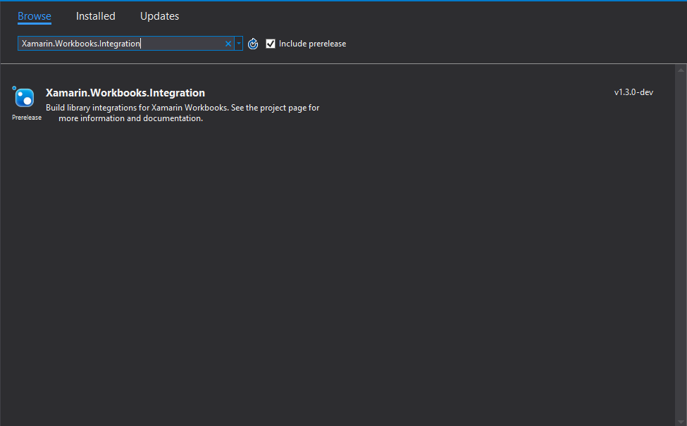
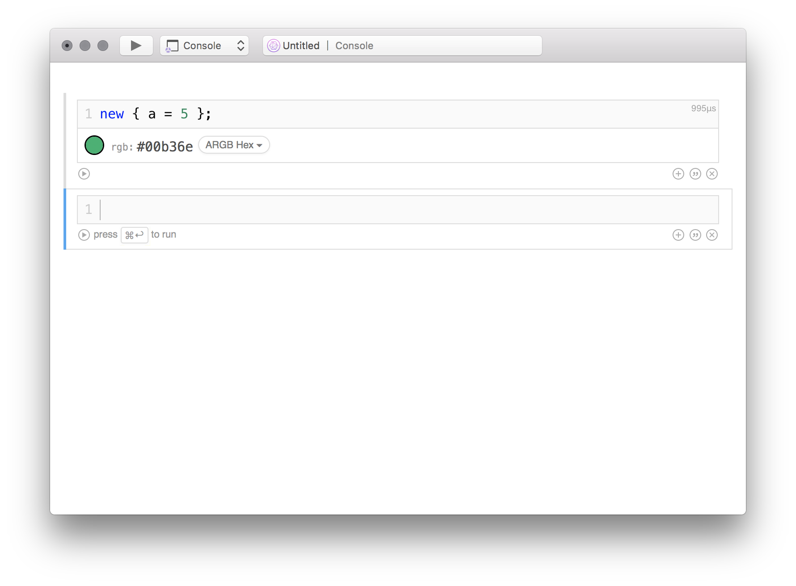
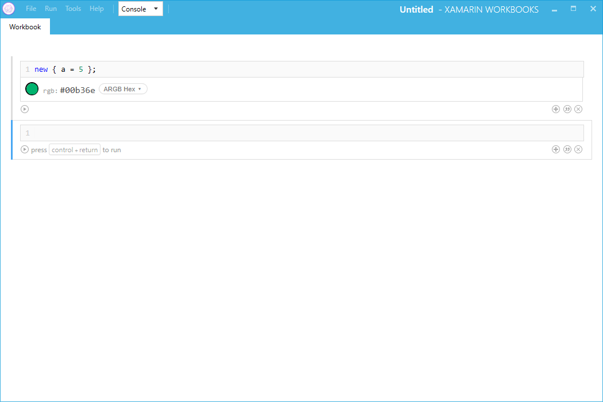

# Getting Started with the Xamarin Workbooks SDK

This document provides a quick guide to getting started with developing
integrations for Xamarin Workbooks. Much of this will work with the stable
Xamarin Workbooks, but **loading integrations via NuGet packages is only
supported in Workbooks 1.3**, in the alpha channel at the time of writing.

## General Overview

Xamarin Workbooks integrations are small libraries that use the
[`Xamarin.Workbooks.Integrations` NuGet][nuget] SDK to integrate with the Xamarin
Workbooks and Inspector agents to provide enhanced experiences.

There are 3 major steps to getting started with developing an
integration—we'll outline them here.

## Creating the Integration Project

Integration libraries are best developed as multiplatform libraries. Because you
want to provide the best integration on all the available agents, past and
future, you'll want to choose a broadly supported set of libraries. We recommend
using the "Portable Library" template for the broadest support:

# [Visual Studio for Mac](#tab/macos)

[](images/xamarin-studio-pcl.png#lightbox)

# [Visual Studio](#tab/windows)

[](images/visual-studio-pcl.png#lightbox)

In Visual Studio, you'll want to make sure you select the following target
platforms for your portable library:

[](images/visual-studio-pcl-platforms.png#lightbox)

-----

Once you create the library project, add a reference to our
`Xamarin.Workbooks.Integration` NuGet library via the NuGet Package Manager.

# [Visual Studio for Mac](#tab/macos)

[](images/xamarin-studio-nuget.png#lightbox)

# [Visual Studio](#tab/windows)

[](images/visual-studio-nuget.png#lightbox)

-----

You'll want to delete the empty class that's created for you as part of the
project—you won't be needing it for this. Once you've done these steps,
you're ready to begin building your integration.

## Building an Integration

We'll build a simple integration. We really love the color green, so we'll
add the color green as a representation to each object. First, create a new
class called `SampleIntegration`, and make it implement our
`IAgentIntegration` interface:

```csharp
using Xamarin.Interactive;

public class SampleIntegration : IAgentIntegration
{
    public void IntegrateWith (IAgent agent)
    {
    }
}
```

What we want to do is add a [representation](~/tools/workbooks/sdk/representations.md) for every object that is a
green color. We'll do this using a representation provider. Providers inherit
from the `RepresentationProvider` class—for ours, we just need to
override `ProvideRepresentations`:

```csharp
using Xamarin.Interactive.Representations;

class SampleRepresentationProvider : RepresentationProvider
{
    public override IEnumerable<object> ProvideRepresentations (object obj)
    {
        // This corresponds to Pantone 2250 XGC, our favorite color.
        yield return new Color (0.0, 0.702, 0.4314);
    }
}
```

We're returning a `Color`, a pre-built representation type in our SDK.
You'll notice that the return type here is an `IEnumerable<object>`&mdash;one
representation provider may return many representations for an object! All
representation providers are called for every object, so it's important to not
make any assumptions about what objects are being passed to you.

The final step is to actually register our provider with the agent and tell
Workbooks where to find our integration type. To register the provider, add this
code to the `IntegrateWith` method in the `SampleIntegration` class we created
earlier:

```csharp
agent.RepresentationManager.AddProvider (new SampleRepresentationProvider ());
```

Setting the integration type is done via an assembly-wide attribute. You can put
this in your AssemblyInfo.cs, or in the same class as your integration type for
convenience:

```csharp
[assembly: AgentIntegration (typeof (SampleIntegration))]
````

During development, you may find it more convenient to
use `AddProvider` overloads on `RepresentationManager` that allow
you to register a simple callback to provide representations inside a workbook,
and then move that code into your `RepresentationProvider` implementation once
you're finished. An example for rendering an [`OxyPlot`][oxyplot] `PlotModel`
might look like this:

```csharp
InteractiveAgent.RepresentationManager.AddProvider<PlotModel> (
  plotModel => Image (new SvgExporter {
      Width = 300,
      Height = 250
    }.ExportToString (plotModel)));
```

> [!NOTE]
> These APIs give you a quick way to get up and running, but we would not
> recommend shipping an entire integration only using them&mdash;they provide very
> little control over how your types are processed by the client.

With the representation registered, your integration is ready to ship!

## Shipping your integration

To ship your integration, you'll need to add it to a NuGet package.
You can ship it with your existing library's NuGet, or if you're creating a
new package, you can use this template .nuspec file as a starting point.
You'll need to fill out the sections relevant to your integration. The most
important part is that all of the files for your integration must be in a
`xamarin.interactive` directory at the root of the package. This enables us
to easily find all the relevant files for your integration, regardless of
whether you use an existing package or create a new one.

```xml
<?xml version="1.0"?>
<package xmlns="http://schemas.microsoft.com/packaging/2010/07/nuspec.xsd">
    <metadata>
      <id>$YourNuGetPackage$</id>
      <version>$YourVersion$</version>
      <authors>$YourNameHere$</authors>
      <projectUrl>$YourProjectPage$</projectUrl>
      <description>A short description of your library.</description>
    </metadata>
    <files>
      <file src="Path\To\Your\Integration.dll" target="xamarin.interactive" />
    </files>
</package>
```

Once you've created the .nuspec file, you can pack your NuGet like so:

```csharp
nuget pack MyIntegration.nuspec
```

and then publish it to [NuGet][nugetorg]. Once it's there, you'll be able to
reference it from any workbook and see it in action. In the screenshot below,
we've packaged the sample integration that we built in this document and
installed the NuGet package in a workbook:

# [Visual Studio for Mac](#tab/macos)

[](images/mac-workbooks-integrated.png#lightbox)

# [Visual Studio](#tab/windows)

[](images/windows-workbooks-integrated.png#lightbox)

-----

Notice that you don't see any `#r` directives or anything to initialize the
integration—Workbooks has taken care of all of that for you behind the scenes!

## Next Steps

Check out our other documentation for more information about the
moving pieces that make up the SDK, and our [sample integrations](~/tools/workbooks/samples/index.md) for
additional things you can do from your integration, like providing custom
JavaScript that is run in the Workbooks client.

[nugetorg]: https://nuget.org
[nuget]: https://nuget.org/packages/Xamarin.Workbooks.Integration
[oxyplot]: http://www.oxyplot.org/
