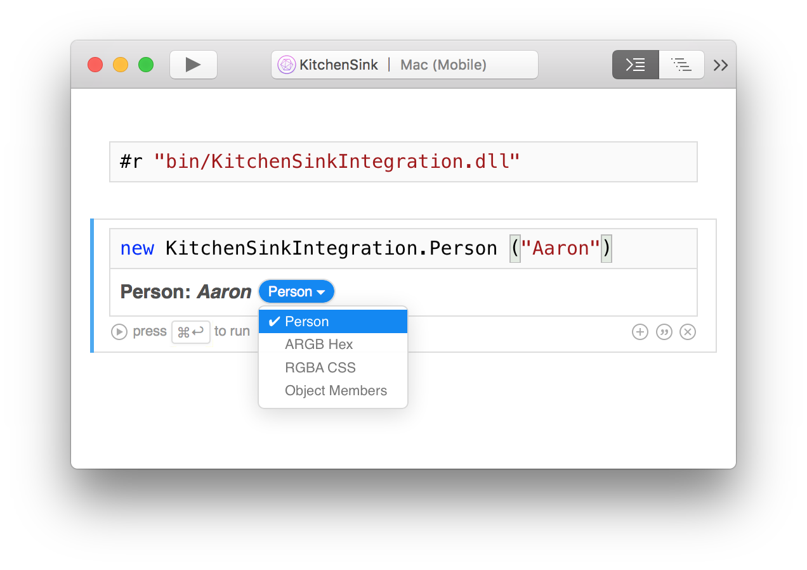

# Sample Integrations

See the [Kitchen Sink][KitchenSink] sample for a working example of an
integration. Simply build `KitchenSink.sln` in Visual Studio for Mac or
Visual Studio and then open `KitchenSink.workbook`.

The Kitchen Sink sample demonstrates both sets of concepts:

* The representation pieces demonstrate how to use `RepresentationManager` to
  enhance rendering by using the built-in representations.
* The `Person` object and its associated JavaScript renderer demonstrate using
  `ISerializableObject` without going through a representation provider.

Also see [SkiaSharp][skiasharp] for a real-world example of an integration
that uses the existing [representations](~/tools/workbooks/sdk/representations.md) provided by Xamarin Workbooks to render
its types.

[KitchenSink]: https://github.com/xamarin/Workbooks/tree/master/SDK/Samples/KitchenSink
[skiasharp]: https://github.com/mono/SkiaSharp/tree/master/source/SkiaSharp.Workbooks
