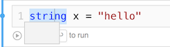

# Known Issues & Workarounds

## Persistence of CultureInfo across cells

Setting `System.Threading.CurrentThread.CurrentCulture` or
`System.Globalization.CultureInfo.CurrentCulture` does not persist across
workbook cells on Mono-based Workbooks targets (Mac, iOS, and Android) due to
a [bug in Mono's `AppContext.SetSwitch`][appcontext-bug] implementation.

### Workarounds

- Set the application-domain-local `DefaultThreadCurrentCulture`:

```csharp
using System.Globalization;
CultureInfo.DefaultThreadCurrentCulture = new CultureInfo("de-DE")
```

- Or, update to Workbooks 1.2.1 or newer , which will rewrite
  assignments to `System.Threading.CurrentThread.CurrentCulture` and
  `System.Globalization.CultureInfo.CurrentCulture` to provide for
  the desired behavior (working around the Mono bug).

## Unable to use Newtonsoft.Json

### Workaround

- Update to Workbooks 1.2.1, which will install Newtonsoft.Json 9.0.1.
  Workbooks 1.3, currently in the alpha channel, supports versions 10
  and newer.

### Details

Newtonsoft.Json 10 was released which bumped its dependency on
Microsoft.CSharp which conflicts with the version Workbooks ships
to support `dynamic`. This is addressed in the Workbooks 1.3 preview
release, but for now we have worked around this by pinning
Newtonsoft.Json specifically to version 9.0.1.

NuGet packages explicitly depending on Newtonsoft.Json 10 or newer
are only supported in Workbooks 1.3, currently in the alpha channel.

## Code Tooltips are Blank

There is a [bug in the Monaco editor][monaco-bug] in Safari/WebKit,
which is used in the Mac Workbooks app, that results in code
tooltips rendering without text.



### Workaround

- Clicking on the tooltip after it appears will force the text to render.

- Or update to Workbooks 1.2.1 or newer

[appcontext-bug]: https://bugzilla.xamarin.com/show_bug.cgi?id=54448
[monaco-bug]: https://github.com/Microsoft/monaco-editor/issues/408

## SkiaSharp renderers are missing in Workbooks 1.3

Starting in Workbooks 1.3, we've removed the SkiaSharp renderers that we shipped
in Workbooks 0.99.0, in favor of SkiaSharp providing the renderers itself, using
our [SDK](~/tools/workbooks/sdk/index.md).

### Workaround

- Update SkiaSharp to the latest version in NuGet. At the time of writing, this
  is 1.57.1.

## Related Links

- [Reporting Bugs](~/tools/workbooks/install.md#reporting-bugs)
