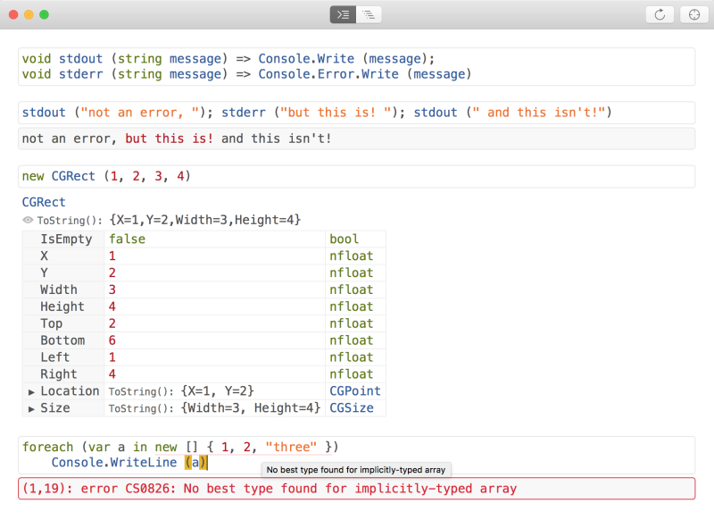
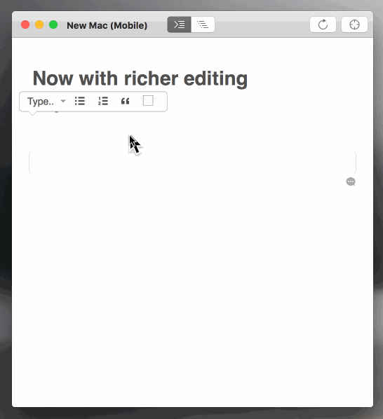

# Interactive Workbooks

You can use Workbooks as a standalone application, separate from your IDE.

To start creating a new workbook, run the Workbooks app. If you haven't installed this already, visit the [Installation](~/tools/workbooks/install.md#install) page. You will be prompted to create a workbook in your platform of choice, which will automatically connect to an agent app allowing you to visualize your document in real time.

If the Workbooks app is already running, you can create a new document by browsing to **File > New**.

Workbooks can be saved and opened again later within the application. You can then share them with others to demonstrate ideas, explore new APIs, or teach new concepts.

## Code Editing

The code editing window provides code completion, syntax coloring,
inline live-diagnostics, and multi-line statement support.

Xamarin Workbooks are saved in a `.workbook` file, which is a CommonMark
file with some metadata at the top (see [Workbooks File Types](#workbooks-files-types) for more
details on how workbooks can be saved).

### NuGet Package Support

Many popular NuGet packages are supported directly in Xamarin Workbooks. You can
search for packages by browsing to **File > Add Package**. Adding a package will
automatically bring in `#r` statements referencing package assemblies, allowing
you to use them right away.

When you save a workbook with package references, those references are saved as
well. If you share the workbook with another person, it will automatically
download the referenced packages.

There are some known limitations with NuGet package support in Workbooks:

- Native libraries are supported only on iOS, and only when linked with
  the managed library.
- Packages which depend on `.targets` files or PowerShell scripts will likely
  fail to work as expected.
- To remove or modify a package dependency, edit the workbook's manifest with
  a text editor. Proper package management is on the way.

### Xamarin.Forms Support

If you reference the Xamarin.Forms NuGet package in your workbook, the workbook
app will change its main view to be Xamarin.Forms-based. You can access it through
`Xamarin.Forms.Application.Current.MainPage`.

The View Inspector tab also has special support for showing the Xamarin.Forms
view hierarchy to help you understand your layouts.

## Rich Text Editing

You can edit the text around your code using the rich text editor included, as illustrated below:

### Markdown Authoring

Workbook authors may sometimes find it easier to directly edit the CommonMark "source"
of the workbook with their favorite editor.

Be aware that if you then edit and save your workbook within the Workbooks client,
your CommonMark text may be reformatted.

Please note that due to the CommonMark extension we use to enable YAML metadata in
workbook files, `---` is reserved for that purpose. If you wish to create
[thematic breaks](https://spec.commonmark.org/0.27/#thematic-break) in your text,
you should use `***` or `___` instead. Such breaks should be avoided in Workbooks 1.2
and earlier due to a bug during save.

### Improvements in Workbooks 1.3

We've also extended the Markdown block quote syntax slightly to improve presentation. By
adding an emoji as the first character in your block quote, you can influence the background
color of the quote:

- `> [!NOTE]`
    > will render as a note with a blue background
- `> [!IMPORTANT]`
    > will render as a warning with a yellow background
- `> [!WARNING]`
    > will render as a problem with a red background

You can also link to headers in the Workbook document. We generate anchors for each header,
with the anchor ID being the header text, processed as follows:

1. The header is lower-cased.
1. All characters except for alphanumerics and dashes are removed.
1. All spaces are replaced with dashes.

This means that a header like "Important Header" gets an id of `important-header` and can be
linked to by inserting a link to `#important-header` in the workbook.

## Document Structure

### Cell

A discrete unit of content, representing either executable code
or markdown. A code cell is comprised of up to four sub-components:

- Editor
  - Buffer
- Compiler Diagnostics
- Console Output
- Execution Results

### Editor

The interactive text component of a cell. For code cells, this is
the actual code editor with syntax highlighting, etc. For markdown
cells this is a rich-text content editor with a context sensitive
formatting and authoring toolbar.

### Buffer

The actual text content of an editor.

### Compiler Diagnostics

Any diagnostics produced when compiling code, rendered only when
explicit execution is requested. Displayed immediately below the
cell editor.

### Console Output

Any output written to standard out or standard error during the
execution of the cell. Standard out will be rendered in black
text and standard error will be rendered in red text.

### Execution Results

Rich and potentially interactive representations of results for
a cell will be rendered upon successful compilation, provided
a result is actually produced by execution. Exceptions are
considered results in this context, since they are produced
as a result of actually executing the compilation.

## Workbooks Files Types

### Plain Files

By default, a workbook saves as a plain text `.workbook` file containing
CommonMark-formatted text.

### Packages

A workbook package is a directory that is named with the `.workbook` extension.
On Mac's Finder and in the Xamarin Workbooks open dialog and recent
files menu, this directory will be recognized as if it were a file.

The directory must contain an `index.workbook` file, which is the actual plain
text workbook that will be loaded in Xamarin Workbooks. The directory can also
contain resources required by `index.workbook`, including images or other
files.

If a plain text `.workbook` file that references resources from its same
directory is opened in Workbooks 0.99.3 or later, when it is saved, it will be
converted into a `.workbook` package. This is true on both Mac and Windows.

> [!NOTE]
> Windows users will open the `package.workbook\index.workbook` file
directly, but otherwise the package will behave the same as on Mac.

### Archives

Workbook packages, being directories, can be hard to distribute easily over the
internet. The solution is workbook archives. A workbook archive is a
zip-compressed workbook package, named with the `.workbook` extension.

Starting in Workbooks 1.1, when saving a workbook package, the Save dialog
offers the choice of saving as an archive instead. Workbooks 1.0 had no
built-in way of creating or saving archives.

In Workbooks 1.0, when a workbook archive was opened, it was transparently
converted into a workbook package, and the zip file was lost. In Workbooks 1.1,
the zip file remains. When the user saves the archive, it is replaced with a
new zip file.

You can create a workbook archive manually by right-clicking a workbook package
and selecting **Compress** on Mac, or **Send To > Compressed (zipped) folder**
on Windows. Then rename the zip file to have a `.workbook` file extension. This
only works with workbook packages, not plain workbook files.

## Related Links

- [Welcome to Workbooks](https://developer.xamarin.com/workbooks/workbooks/getting-started/welcome.workbook)
