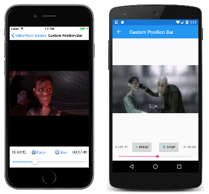

# Custom video positioning

[ Download the sample](/samples/xamarin/xamarin-forms-samples/customrenderers-videoplayerdemos)

The transport controls implemented by each platform include a position bar. This bar resembles a slider or scroll bar and shows the current location of the video within its total duration. In addition, the user can manipulate the position bar to move forwards or backwards to a new position in the video.

This article shows how you can implement your own custom position bar.

## The Duration property

One item of information that `VideoPlayer` needs to support a custom position bar is the duration of the video. The `VideoPlayer` defines a read-only `Duration` property of type `TimeSpan`:

```csharp
namespace FormsVideoLibrary
{
    public class VideoPlayer : View, IVideoPlayerController
    {
        ···
        // Duration read-only property
        private static readonly BindablePropertyKey DurationPropertyKey =
            BindableProperty.CreateReadOnly(nameof(Duration), typeof(TimeSpan), typeof(VideoPlayer), new TimeSpan(),
                propertyChanged: (bindable, oldValue, newValue) => ((VideoPlayer)bindable).SetTimeToEnd());

        public static readonly BindableProperty DurationProperty = DurationPropertyKey.BindableProperty;

        public TimeSpan Duration
        {
            get { return (TimeSpan)GetValue(DurationProperty); }
        }

        TimeSpan IVideoPlayerController.Duration
        {
            set { SetValue(DurationPropertyKey, value); }
            get { return Duration; }
        }
        ···
    }
}
```

Like the `Status` property described in the [previous article](custom-transport.md), this `Duration` property is read-only. It's defined with a private `BindablePropertyKey` and can only be set by referencing the `IVideoPlayerController` interface, which includes this `Duration` property:

```csharp
namespace FormsVideoLibrary
{
    public interface IVideoPlayerController
    {
        VideoStatus Status { set; get; }

        TimeSpan Duration { set; get; }
    }
}
```

Also notice the property-changed handler that calls a method named `SetTimeToEnd` that is described later in this article.

The duration of a video is *not* available immediately after the `Source` property of `VideoPlayer` is set. The video file must be partially downloaded before the underlying video player can determine its duration.

Here's how each of the platform renderers obtains the video's duration:

### Video duration in iOS

In iOS, the duration of a video is obtained from the `Duration` property of `AVPlayerItem`, but not immediately after the `AVPlayerItem` is created. It's possible to set an iOS observer for the `Duration` property, but the `VideoPlayerRenderer` obtains the duration in the `UpdateStatus` method, which is called 10 times a second:

```csharp
namespace FormsVideoLibrary.iOS
{
    public class VideoPlayerRenderer : ViewRenderer<VideoPlayer, UIView>
    {
        ···
        void OnUpdateStatus(object sender, EventArgs args)
        {
            ···
            if (playerItem != null)
            {
                ((IVideoPlayerController)Element).Duration = ConvertTime(playerItem.Duration);
                ···
            }
        }

        TimeSpan ConvertTime(CMTime cmTime)
        {
            return TimeSpan.FromSeconds(Double.IsNaN(cmTime.Seconds) ? 0 : cmTime.Seconds);

        }
        ···
    }
}
```

The `ConvertTime` method converts a `CMTime` object to a `TimeSpan` value.

### Video duration in Android

The `Duration` property of the Android `VideoView` reports a valid duration in milliseconds when the `Prepared` event of `VideoView` is fired. The Android `VideoPlayerRenderer` class uses that handler to obtain the `Duration` property:

```csharp
namespace FormsVideoLibrary.Droid
{
    public class VideoPlayerRenderer : ViewRenderer<VideoPlayer, ARelativeLayout>
    {
        ···
        void OnVideoViewPrepared(object sender, EventArgs args)
        {
            ···
            ((IVideoPlayerController)Element).Duration = TimeSpan.FromMilliseconds(videoView.Duration);
        }
        ···
    }
}
```

### Video duration in UWP

The `NaturalDuration` property of `MediaElement` is a `TimeSpan` value and becomes valid when `MediaElement` fires the `MediaOpened` event:

```csharp
namespace FormsVideoLibrary.UWP
{
    public class VideoPlayerRenderer : ViewRenderer<VideoPlayer, MediaElement>
    {
        ···
        void OnMediaElementMediaOpened(object sender, RoutedEventArgs args)
        {
            ((IVideoPlayerController)Element).Duration = Control.NaturalDuration.TimeSpan;
        }
        ···
    }
}
```

## The Position property

`VideoPlayer` also needs a `Position` property that increases from zero to `Duration` as the video is playing. `VideoPlayer` implements this property like the `Position` property in the UWP `MediaElement`, which is a normal bindable property with public `set` and `get` accessors:

```csharp
namespace FormsVideoLibrary
{
    public class VideoPlayer : View, IVideoPlayerController
    {
        ···
        // Position property
        public static readonly BindableProperty PositionProperty =
            BindableProperty.Create(nameof(Position), typeof(TimeSpan), typeof(VideoPlayer), new TimeSpan(),
                propertyChanged: (bindable, oldValue, newValue) => ((VideoPlayer)bindable).SetTimeToEnd());

        public TimeSpan Position
        {
            set { SetValue(PositionProperty, value); }
            get { return (TimeSpan)GetValue(PositionProperty); }
        }
        ···
    }
}
```

The `get` accessor returns the current position of the video as it is playing, but the `set` accessor is intended to respond to the user's manipulation of the position bar by moving the video position forwards or backwards.

In iOS and Android, the property that obtains the current position has only a `get` accessor, and a `Seek` method is available to perform this second task. If you think about it, a separate `Seek` method seems to be a more sensible approach than a single `Position` property. A single `Position` property has an inherent problem: As the video plays, the `Position` property must be continually updated to reflect the new position. But you don't want most changes to the `Position` property to cause the video player to move to a new position in the video. If that happens, the video player would respond by seeking to the last value of the `Position` property, and the video wouldn't advance.

Despite the difficulties of implementing a `Position` property with `set` and `get` accessors, this approach was chosen because it is consistent with the UWP `MediaElement`, and it has a big advantage with data binding: The `Position` property of the `VideoPlayer` can be bound to the slider that is used both to display the position and to seek to a new position. However, several precautions are necessary when implementing this `Position` property to avoid feedback loops.

### Setting and getting iOS position

In iOS, the `CurrentTime` property of the `AVPlayerItem` object indicates the current position of the playing video. The iOS `VideoPlayerRenderer` sets the `Position` property in the `UpdateStatus` handler at the same time that it sets the `Duration` property:

```csharp
namespace FormsVideoLibrary.iOS
{
    public class VideoPlayerRenderer : ViewRenderer<VideoPlayer, UIView>
    {
        ···
        void OnUpdateStatus(object sender, EventArgs args)
        {
            ···
            if (playerItem != null)
            {
                ···
                ((IElementController)Element).SetValueFromRenderer(VideoPlayer.PositionProperty, ConvertTime(playerItem.CurrentTime));
            }
        }
        ···
    }
}
```

The renderer detects when the `Position` property set from `VideoPlayer` has changed in the `OnElementPropertyChanged` override, and uses that new value to call a `Seek` method on the `AVPlayer` object:

```csharp
namespace FormsVideoLibrary.iOS
{
    public class VideoPlayerRenderer : ViewRenderer<VideoPlayer, UIView>
    {
        ···
        protected override void OnElementPropertyChanged(object sender, PropertyChangedEventArgs args)
        {
            ···
            else if (args.PropertyName == VideoPlayer.PositionProperty.PropertyName)
            {
                TimeSpan controlPosition = ConvertTime(player.CurrentTime);

                if (Math.Abs((controlPosition - Element.Position).TotalSeconds) > 1)
                {
                    player.Seek(CMTime.FromSeconds(Element.Position.TotalSeconds, 1));
                }
            }
        }
        ···
    }
}
```

Keep in mind that every time the `Position` property in `VideoPlayer` is set from the `OnUpdateStatus` handler, the `Position` property fires a `PropertyChanged` event, which is detected in the `OnElementPropertyChanged` override. For most of these changes, the `OnElementPropertyChanged` method should do nothing. Otherwise, with every change in the video's position, it would be moved to the same position it just reached!

To avoid this feedback loop, the `OnElementPropertyChanged` method only calls `Seek` when the difference between the `Position` property and the current position of the `AVPlayer` is greater than one second.

### Setting and getting Android position

Just as in the iOS renderer, the Android `VideoPlayerRenderer` sets a new value for the `Position` property in the `OnUpdateStatus` handler. The `CurrentPosition` property of `VideoView` contains the new position in units of milliseconds:

```csharp
namespace FormsVideoLibrary.Droid
{
    public class VideoPlayerRenderer : ViewRenderer<VideoPlayer, ARelativeLayout>
    {
        ···
        void OnUpdateStatus(object sender, EventArgs args)
        {
            ···
            TimeSpan timeSpan = TimeSpan.FromMilliseconds(videoView.CurrentPosition);
            ((IElementController)Element).SetValueFromRenderer(VideoPlayer.PositionProperty, timeSpan);
        }
        ···
    }
}
```

Also, just as in the iOS renderer, the Android renderer calls the `SeekTo` method of `VideoView` when the `Position` property has changed, but only when the change is more than one second different from the `CurrentPosition` value of `VideoView`:

```csharp
namespace FormsVideoLibrary.Droid
{
    public class VideoPlayerRenderer : ViewRenderer<VideoPlayer, ARelativeLayout>
    {
        ···
        protected override void OnElementPropertyChanged(object sender, PropertyChangedEventArgs args)
        {
            ···
            else if (args.PropertyName == VideoPlayer.PositionProperty.PropertyName)
            {
                if (Math.Abs(videoView.CurrentPosition - Element.Position.TotalMilliseconds) > 1000)
                {
                    videoView.SeekTo((int)Element.Position.TotalMilliseconds);
                }
            }
        }
        ···
    }
}
```

### Setting and getting UWP position

The UWP `VideoPlayerRenderer` handles the `Position` in the same way as the iOS and Android renderers, but because the `Position` property of the UWP `MediaElement` is also a `TimeSpan` value, no conversion is necessary:

```csharp
namespace FormsVideoLibrary.UWP
{
    public class VideoPlayerRenderer : ViewRenderer<VideoPlayer, MediaElement>
    {
        ···
        protected override void OnElementPropertyChanged(object sender, PropertyChangedEventArgs args)
        {
            ···
            else if (args.PropertyName == VideoPlayer.PositionProperty.PropertyName)
            {
                if (Math.Abs((Control.Position - Element.Position).TotalSeconds) > 1)
                {
                    Control.Position = Element.Position;
                }
            }
        }
        ···
        void OnUpdateStatus(object sender, EventArgs args)
        {
            ((IElementController)Element).SetValueFromRenderer(VideoPlayer.PositionProperty, Control.Position);
        }
        ···
    }
}
```

## Calculating a TimeToEnd property

Sometimes video players show the time remaining in the video. This value begins at the video's duration when the video begins and decreases down to zero when the video ends.

`VideoPlayer` includes a read-only `TimeToEnd` property that is handled entirely within the class based on changes to the `Duration` and `Position` properties:

```csharp
namespace FormsVideoLibrary
{
    public class VideoPlayer : View, IVideoPlayerController
    {
        ···
        private static readonly BindablePropertyKey TimeToEndPropertyKey =
            BindableProperty.CreateReadOnly(nameof(TimeToEnd), typeof(TimeSpan), typeof(VideoPlayer), new TimeSpan());

        public static readonly BindableProperty TimeToEndProperty = TimeToEndPropertyKey.BindableProperty;

        public TimeSpan TimeToEnd
        {
            private set { SetValue(TimeToEndPropertyKey, value); }
            get { return (TimeSpan)GetValue(TimeToEndProperty); }
        }

        void SetTimeToEnd()
        {
            TimeToEnd = Duration - Position;
        }
        ···
    }
}
```

The `SetTimeToEnd` method is called from the property-changed handlers of both `Duration` and `Position`.

## A custom slider for video

It's possible to write a custom control for a position bar, or to use the Xamarin.Forms `Slider` or a class that derives from `Slider`, such as the following `PositionSlider` class. The class defines two new properties named `Duration` and `Position` of type `TimeSpan` that are intended to be data-bound to the two properties of the same name in `VideoPlayer`. Notice that the default binding mode of the `Position` property is two-way:

```csharp
namespace FormsVideoLibrary
{
    public class PositionSlider : Slider
    {
        public static readonly BindableProperty DurationProperty =
            BindableProperty.Create(nameof(Duration), typeof(TimeSpan), typeof(PositionSlider), new TimeSpan(1),
                                    propertyChanged: (bindable, oldValue, newValue) =>
                                    {
                                        double seconds = ((TimeSpan)newValue).TotalSeconds;
                                        ((PositionSlider)bindable).Maximum = seconds <= 0 ? 1 : seconds;
                                    });

        public TimeSpan Duration
        {
            set { SetValue(DurationProperty, value); }
            get { return (TimeSpan)GetValue(DurationProperty); }
        }

        public static readonly BindableProperty PositionProperty =
            BindableProperty.Create(nameof(Position), typeof(TimeSpan), typeof(PositionSlider), new TimeSpan(0),
                                    defaultBindingMode: BindingMode.TwoWay,
                                    propertyChanged: (bindable, oldValue, newValue) =>
                                    {
                                        double seconds = ((TimeSpan)newValue).TotalSeconds;
                                        ((PositionSlider)bindable).Value = seconds;
                                    });

        public TimeSpan Position
        {
            set { SetValue(PositionProperty, value); }
            get { return (TimeSpan)GetValue(PositionProperty); }
        }

        public PositionSlider()
        {
            PropertyChanged += (sender, args) =>
            {
                if (args.PropertyName == "Value")
                {
                    TimeSpan newPosition = TimeSpan.FromSeconds(Value);

                    if (Math.Abs(newPosition.TotalSeconds - Position.TotalSeconds) / Duration.TotalSeconds > 0.01)
                    {
                        Position = newPosition;
                    }
                }
            };
        }
    }
}
```

The property-changed handler for the `Duration` property sets the `Maximum` property of the underlying `Slider` to the `TotalSeconds` property of the `TimeSpan` value. Similarly, the property-changed handler for `Position` sets the `Value` property of the `Slider`. In this way, the underlying `Slider` tracks the position of the `PositionSlider`.

The `PositionSlider` is updated from the underlying `Slider` in only one instance: When the user manipulates the `Slider` to indicate that the video should be advanced or reversed to a new position. This is detected in the `PropertyChanged` handler in the constructor of the `PositionSlider`. The handler checks for a change in the `Value` property, and if it's different from the `Position` property, then the `Position` property is set from the `Value` property.

In theory, the inner `if` statement could be written like this:

```csharp
if (newPosition.Seconds != Position.Seconds)
{
    Position = newPosition;
}
```

However, the Android implementation of `Slider` has only 1,000 discrete steps regardless of the `Minimum` and `Maximum` settings. It the length of a video is greater than 1,000 seconds, then two different `Position` values would correspond to the same `Value` setting of the `Slider`, and this `if` statement would trigger a false positive for a user manipulation of the `Slider`. It's safer to instead check that the new position and existing position are greater than one-hundredth of the overall duration.

## Using the PositionSlider

Documentation for the UWP [`MediaElement`](/uwp/api/Windows.UI.Xaml.Controls.MediaElement/) warns about binding to the `Position` property because the property frequently updates. The documentation recommends that a timer be used to query the `Position` property.

That's a good recommendation, but the three `VideoPlayerRenderer` classes are already indirectly using a timer to update the `Position` property. The `Position` property is changed in a handler for the `UpdateStatus` event, which is fired only 10 times a second.

Therefore, the `Position` property of the `VideoPlayer` can be bound to the `Position` property of the `PositionSlider` without performance issues, as demonstrated in the **Custom Position Bar** page:

```xaml
<ContentPage xmlns="http://xamarin.com/schemas/2014/forms"
             xmlns:x="http://schemas.microsoft.com/winfx/2009/xaml"
             xmlns:video="clr-namespace:FormsVideoLibrary"
             x:Class="VideoPlayerDemos.CustomPositionBarPage"
             Title="Custom Position Bar">
    <Grid>
        <Grid.RowDefinitions>
            <RowDefinition Height="*" />
            <RowDefinition Height="Auto" />
            <RowDefinition Height="Auto" />
        </Grid.RowDefinitions>

        <video:VideoPlayer x:Name="videoPlayer"
                           Grid.Row="0"
                           AreTransportControlsEnabled="False"
                           Source="{StaticResource ElephantsDream}" />

        ···

        <StackLayout Grid.Row="1"
                     Orientation="Horizontal"
                     Margin="10, 0"
                     BindingContext="{x:Reference videoPlayer}">

            <Label Text="{Binding Path=Position,
                                  StringFormat='{0:hh\\:mm\\:ss}'}"
                   VerticalOptions="Center"/>

            ···

            <Label Text="{Binding Path=TimeToEnd,
                                  StringFormat='{0:hh\\:mm\\:ss}'}"
                   VerticalOptions="Center" />
        </StackLayout>

        <video:PositionSlider Grid.Row="2"
                              Margin="10, 0, 10, 10"
                              BindingContext="{x:Reference videoPlayer}"
                              Duration="{Binding Duration}"           
                              Position="{Binding Position}">
            <video:PositionSlider.Triggers>
                <DataTrigger TargetType="video:PositionSlider"
                             Binding="{Binding Status}"
                             Value="{x:Static video:VideoStatus.NotReady}">
                    <Setter Property="IsEnabled" Value="False" />
                </DataTrigger>
            </video:PositionSlider.Triggers>
        </video:PositionSlider>
    </Grid>
</ContentPage>
```

The first ellipsis (···) hides the `ActivityIndicator`; it's the same as in the previous **Custom Transport** page. Notice the two `Label` elements displaying the `Position` and `TimeToEnd` properties. The ellipsis between those two `Label` elements hides the two `Button` elements shown in the **Custom Transport** page for Play, Pause, and Stop. The code-behind logic is also the same as the **Custom Transport** page.

[](custom-positioning-images/custompositioning-large.png#lightbox "Custom Positioning")

This concludes the discussion of the `VideoPlayer`.

## Related Links

- [Video Player Demos (sample)](/samples/xamarin/xamarin-forms-samples/customrenderers-videoplayerdemos)