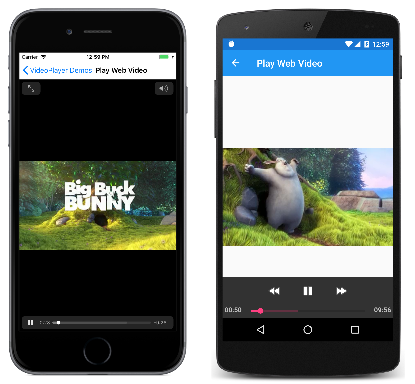

# Implementing a video player

[ Download the sample](/samples/xamarin/xamarin-forms-samples/customrenderers-videoplayerdemos)

It is sometimes desirable to play video files in a Xamarin.Forms application. This series of articles discusses how to write custom renderers for iOS, Android, and the Universal Windows Platform (UWP) for a Xamarin.Forms class named `VideoPlayer`.

In the [**VideoPlayerDemos**](/samples/xamarin/xamarin-forms-samples/customrenderers-videoplayerdemos) sample, all the files that implement and support `VideoPlayer` are in folders named `FormsVideoLibrary` and identified with the namespace `FormsVideoLibrary` or namespaces that begin `FormsVideoLibrary`. This organization and naming should make it easy to copy the video player files into your own Xamarin.Forms solution.

`VideoPlayer` can play video files from three types of sources:

- The Internet using a URL
- A resource embedded in the platform application
- The device's video library

Video players require *transport controls*, which are buttons for playing and pausing the video, and a positioning bar that shows the progress through the video and allows the user to skip quickly to a different location. `VideoPlayer` can use either the transport controls and positioning bar provided by the platform (as shown below), or you can supply custom transport controls and a positioning bar. Here's the program running under iOS, Android, and the Universal Windows Platform:

Of course, you can turn the phone sideways for a larger view.

A more sophisticated video player would have some additional features, such as volume control, a mechanism to interrupt the video when a telephone call comes through, and a way of keeping the screen active during playback.

The following series of articles progressively shows how the platform renderers and supporting classes are built:

## [Creating the platform video players](player-creation.md)

Each platform requires a `VideoPlayerRenderer` class that creates and maintains a video player control supported by the platform. This article shows the structure of the renderer classes, and how the players are created.

## [Playing a Web video](web-videos.md)

Probably the most common source of videos for a video player is the Internet. This article describes how a Web video can be referenced and used as a source for the video player.

## [Binding video sources to the player](source-bindings.md)

This article uses a `ListView` to present a collection of videos to play. One program shows how the code-behind file can set the video source of the video player, but a second program shows how you can use data binding between the `ListView` and the video player.

## [Loading application resource videos](loading-resources.md)

Videos can be embedded as resources in the platform projects. This article shows how to store those resources and later load them into the program to be played by the video player.

## [Accessing the device's video library](accessing-library.md)

When a video is created using the device's camera, the video file is stored in the device's image library. This article shows how to access the device's image picker to select the video, and then play it using the video player.

## [Custom video transport controls](custom-transport.md)

Although the video players on each platform provide their own transport controls in the form of buttons for **Play** and **Pause**, you can suppress the display of those buttons and supply your own. This article shows you how.

## [Custom video positioning](custom-positioning.md)

Each of the platform video players has a position bar that shows the progress of the video and allows you to skip ahead or back to a particular position. This article demonstrates how you can replace that position bar with a custom control.

## Related Links

- [Video Player Demos (sample)](/samples/xamarin/xamarin-forms-samples/customrenderers-videoplayerdemos)