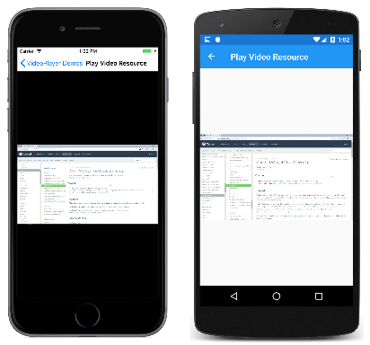

# Loading application resource videos

[ Download the sample](/samples/xamarin/xamarin-forms-samples/customrenderers-videoplayerdemos)

The custom renderers for the `VideoPlayer` view are capable of playing video files that have been embedded in the individual platform projects as application resources. However, the current version of `VideoPlayer` cannot access resources embedded in a .NET Standard library.

To load these resources, create an instance of `ResourceVideoSource` by setting the `Path` property to the filename (or the folder and filename) of the resource. Alternatively, you can call the static `VideoSource.FromResource` method to reference the resource. Then, set the `ResourceVideoSource` object to the `Source` property of `VideoPlayer`.

## Storing the video files

Storing a video file in the platform project is different for each platform.

### iOS video resources

In an iOS project, you can store a video in the **Resources** folder, or a subfolder of the **Resources** folder. The video file must have a `Build Action` of `BundleResource`. Set the `Path` property of `ResourceVideoSource` to the filename, for example, **MyFile.mp4** for a file in the **Resources** folder, or **MyFolder/MyFile.mp4**, where **MyFolder** is a subfolder of **Resources**.

In the **VideoPlayerDemos** solution, the **VideoPlayerDemos.iOS** project contains a subfolder of **Resources** named **Videos** containing a file named **iOSApiVideo.mp4**. This is a short video that shows you how to use the Xamarin web site to find documentation for the iOS `AVPlayerViewController` class.

### Android video resources

In an Android project, videos must be stored in a subfolder of **Resources** named **raw**. The **raw** folder cannot contain subfolders. Give the video file a `Build Action` of `AndroidResource`. Set the `Path` property of `ResourceVideoSource` to the filename, for example, **MyFile.mp4**.

The **VideoPlayerDemos.Android** project contains a subfolder of **Resources** named **raw**, which contains a file named **AndroidApiVideo.mp4**.

### UWP video resources

In a Universal Windows Platform project, you can store videos in any folder in the project. Give the file a `Build Action` of `Content`. Set the `Path` property of `ResourceVideoSource` to the folder and filename, for example, **MyFolder/MyVideo.mp4**.

The **VideoPlayerDemos.UWP** project contains a folder named **Videos** with the file **UWPApiVideo.mp4**.

## Loading the video files

Each of the platform renderer classes contains code in its `SetSource` method for loading video files stored as resources.

### iOS resource loading

The iOS version of `VideoPlayerRenderer` uses the `GetUrlForResource` method of `NSBundle` for loading the resource. The complete path must be divided into a filename, extension, and directory. The code uses the `Path` class in the .NET `System.IO` namespace for dividing the file path into these components:

```csharp
namespace FormsVideoLibrary.iOS
{
    public class VideoPlayerRenderer : ViewRenderer<VideoPlayer, UIView>
    {
        ···
        void SetSource()
        {
            AVAsset asset = null;
            ···
            else if (Element.Source is ResourceVideoSource)
            {
                string path = (Element.Source as ResourceVideoSource).Path;

                if (!String.IsNullOrWhiteSpace(path))
                {
                    string directory = Path.GetDirectoryName(path);
                    string filename = Path.GetFileNameWithoutExtension(path);
                    string extension = Path.GetExtension(path).Substring(1);
                    NSUrl url = NSBundle.MainBundle.GetUrlForResource(filename, extension, directory);
                    asset = AVAsset.FromUrl(url);
                }
            }
            ···
        }
        ···
    }
}
```

### Android resource loading

The Android `VideoPlayerRenderer` uses the filename and package name to construct a `Uri` object. The package name is the name of the application, in this case **VideoPlayerDemos.Android**, which can be obtained from the static `Context.PackageName` property. The resultant `Uri` object is then passed to the `SetVideoURI` method of `VideoView`:

```csharp
namespace FormsVideoLibrary.Droid
{
    public class VideoPlayerRenderer : ViewRenderer<VideoPlayer, ARelativeLayout>
    {
        ···    
        void SetSource()
        {
            isPrepared = false;
            bool hasSetSource = false;
            ···
            else if (Element.Source is ResourceVideoSource)
            {
                string package = Context.PackageName;
                string path = (Element.Source as ResourceVideoSource).Path;

                if (!String.IsNullOrWhiteSpace(path))
                {
                    string filename = Path.GetFileNameWithoutExtension(path).ToLowerInvariant();
                    string uri = "android.resource://" + package + "/raw/" + filename;
                    videoView.SetVideoURI(Android.Net.Uri.Parse(uri));
                    hasSetSource = true;
                }
            }
            ···
        }
        ···
    }
}
```

### UWP resource loading

The UWP `VideoPlayerRenderer` constructs a `Uri` object for the path and sets it to the `Source` property of `MediaElement`:

```csharp
namespace FormsVideoLibrary.UWP
{
    public class VideoPlayerRenderer : ViewRenderer<VideoPlayer, MediaElement>
    {
        ···
        async void SetSource()
        {
            bool hasSetSource = false;
            ···
            else if (Element.Source is ResourceVideoSource)
            {
                string path = "ms-appx:///" + (Element.Source as ResourceVideoSource).Path;

                if (!String.IsNullOrWhiteSpace(path))
                {
                    Control.Source = new Uri(path);
                    hasSetSource = true;
                }
            }
        }
        ···
    }
}
```

## Playing the resource file

The **Play Video Resource** page in the **VideoPlayerDemos** solution uses the `OnPlatform` class to specify the video file for each platform:

```xaml
<ContentPage xmlns="http://xamarin.com/schemas/2014/forms"
             xmlns:x="http://schemas.microsoft.com/winfx/2009/xaml"
             xmlns:video="clr-namespace:FormsVideoLibrary"
             x:Class="VideoPlayerDemos.PlayVideoResourcePage"
             Title="Play Video Resource">
    <video:VideoPlayer>
        <video:VideoPlayer.Source>
            <video:ResourceVideoSource>
                <video:ResourceVideoSource.Path>
                    <OnPlatform x:TypeArguments="x:String">
                        <On Platform="iOS" Value="Videos/iOSApiVideo.mp4" />
                        <On Platform="Android" Value="AndroidApiVideo.mp4" />
                        <On Platform="UWP" Value="Videos/UWPApiVideo.mp4" />
                    </OnPlatform>
                </video:ResourceVideoSource.Path>
            </video:ResourceVideoSource>
        </video:VideoPlayer.Source>
    </video:VideoPlayer>
</ContentPage>
```

If the iOS resource is stored in the **Resources** folder, and if the UWP resource is stored in the root folder of the project, you can use the same filename for each platform. If that is the case, then you can set that name directly to the `Source` property of `VideoPlayer`.

Here's that page running:

[](loading-resources-images/playvideoresource-large.png#lightbox "Play Video Resource")

You've now seen how to [load videos from a Web URI](web-videos.md) and how to play embedded resources. In addition, you can [load videos from the device's video library](accessing-library.md).

## Related Links

- [Video Player Demos (sample)](/samples/xamarin/xamarin-forms-samples/customrenderers-videoplayerdemos)