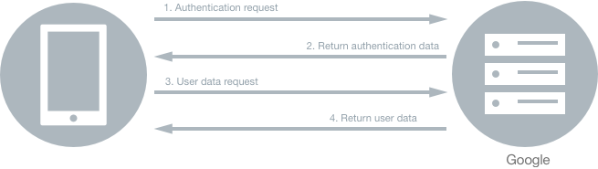
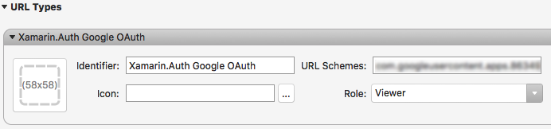

# Authenticate Users with an Identity Provider

[ Download the sample](https://docs.microsoft.com/samples/xamarin/xamarin-forms-samples/webservices-oauthnativeflow)

_Xamarin.Auth is a cross-platform SDK for authenticating users and storing their accounts. It includes OAuth authenticators that provide support for consuming identity providers such as Google, Microsoft, Facebook, and Twitter. This article explains how to use Xamarin.Auth to manage the authentication process in a Xamarin.Forms application._

OAuth is an open standard for authentication, and enables a resource owner to notify a resource provider that permission should be granted to a third party to access their information without sharing the resource owners identity. An example of this would be enabling a user to notify an identity provider (such as Google, Microsoft, Facebook, or Twitter) that permission should be granted to an application to access their data, without sharing the user's identity. It is commonly used as an approach for users to sign-in to websites and applications using an identity provider, but without exposing their password to the website or application.

A high-level overview of the authentication flow when consuming an OAuth identity provider is as follows:

1. The application navigates a browser to an identity provider URL.
1. The identity provider handles user authentication and returns an authorization code to the application.
1. The application exchanges the authorization code for an access token from the identity provider.
1. The application uses the access token to access APIs on the identity provider, such as an API for requesting basic user data.

The sample application demonstrates how to use Xamarin.Auth to implement a native authentication flow against Google. While Google is used as the identity provider in this topic, the approach is equally applicable to other identity providers. For more information about authentication using Google's OAuth 2.0 endpoint, see [Using OAuth2.0 to Access Google APIs](https://developers.google.com/identity/protocols/OAuth2) on Google's website.

> [!NOTE]
> In iOS 9 and greater, App Transport Security (ATS) enforces secure connections between internet resources (such as the app's back-end server) and the app, thereby preventing accidental disclosure of sensitive information. Since ATS is enabled by default in apps built for iOS 9, all connections will be subject to ATS security requirements. If connections do not meet these requirements, they will fail with an exception.
> ATS can be opted out of if it is not possible to use the `HTTPS` protocol and secure communication for internet resources. This can be achieved by updating the app's **Info.plist** file. For more information see [App Transport Security](~/ios/app-fundamentals/ats.md).

## Using Xamarin.Auth to Authenticate Users

Xamarin.Auth supports two approaches for applications to interact with an identity provider's authorization endpoint:

1. Using an embedded web view. While this has been a common practice, it's no longer recommended for the following reasons:

    - The application that hosts the web view can access the user's full authentication credential, not just the OAuth authorization grant that was intended for the application. This violates the principle of least privilege, as the application has access to more powerful credentials than it requires, potentially increasing the attack surface of the application.
    - The host application could capture usernames and passwords, automatically submit forms and bypass user-consent, and copy session cookies and use them to perform authenticated actions as the user.
    - Embedded web views don't share the authentication state with other applications, or the device's web browser, requiring the user to sign-in for every authorization request which is considered an inferior user experience.
    - Some authorization endpoints take steps to detect and block authorization requests that come from web views.

1. Using the device's web browser, which is the recommended approach. Using the device browser for OAuth requests improves the usability of an application, as users only need to sign-in to the identity provider once per device, improving conversion rates of sign-in and authorization flows in the application. The device browser also provides improved security as applications are able to inspect and modify content in a web view, but not content shown in the browser. This is the approach taken in this article and sample application.

A high-level overview of how the sample application uses Xamarin.Auth to authenticate users and retrieve their basic data is shown in the following diagram:



The application makes an authentication request to Google using the `OAuth2Authenticator` class. An authentication response is returned, once the user has successfully authenticated with Google through their sign-in page, which includes an access token. The application then makes a request to Google for basic user data, using the `OAuth2Request` class, with the access token being included in the request.

### Setup

A Google API Console project must be created to integrate Google sign-in with a Xamarin.Forms application. This can be accomplished as follows:

1. Go to the [Google API Console](https://console.developers.google.com) website, and sign in with Google account credentials.
1. From the project drop-down, select an existing project, or create a new one.
1. In the sidebar under "API Manager", select **Credentials**, then select the **OAuth consent screen tab**. Choose an **Email address**, specify a **Product name shown to users**, and press **Save**.
1. In the **Credentials** tab, select the **Create credentials** drop-down list, and choose **OAuth client ID**.
1. Under **Application type**, select the platform that the mobile application will be running on (**iOS** or **Android**).
1. Fill in the required details and select the **Create** button.

> [!NOTE]
> A Client ID lets an application access enabled Google APIs, and for mobile applications is unique to a single platform. Therefore, a **OAuth client ID** should be created for each platform that will use Google sign-in.

After performing these steps, Xamarin.Auth can be used to initiate an OAuth2 authentication flow with Google.

### Creating and Configuring an Authenticator

Xamarin.Auth's `OAuth2Authenticator` class is responsible for handling the OAuth authentication flow. The following code example shows the instantiation of the `OAuth2Authenticator` class when performing authentication using the device's web browser:

```csharp
var authenticator = new OAuth2Authenticator(
    clientId,
    null,
    Constants.Scope,
    new Uri(Constants.AuthorizeUrl),
    new Uri(redirectUri),
    new Uri(Constants.AccessTokenUrl),
    null,
    true);
```

The `OAuth2Authenticator` class requires a number of parameters, which are as follows:

- **Client ID** – this identifies the client that is making the request, and can be retrieved from the project in the [Google API Console](https://console.developers.google.com).
- **Client Secret** – this should be `null` or `string.Empty`.
- **Scope** – this identifies the API access being requested by the application, and the value informs the consent screen that is shown to the user. For more information about scopes, see [Authorize requests](https://developers.google.com/docs/api/how-tos/authorizing) on Google's website.
- **Authorize URL** – this identifies the URL where the authorization code will be obtained from.
- **Redirect URL** – this identifies the URL where the response will be sent. The value of this parameter must match one of the values that appears in the **Credentials** tab for the project in the [Google Developers Console](https://console.developers.google.com/).
- **AccessToken Url** – this identifies the URL used to request access tokens after an authorization code is obtained.
- **GetUserNameAsync Func** – an optional `Func` that will be used to asynchronously retrieve the username of the account after it's been successfully authenticated.
- **Use Native UI** – a `boolean` value indicating whether to use the device's web browser to perform the authentication request.

### Setup Authentication Event Handlers

Before presenting the user interface, an event handler for the `OAuth2Authenticator.Completed` event must be registered, as shown in the following code example:

```csharp
authenticator.Completed += OnAuthCompleted;
```

This event will fire when the user successfully authenticates or cancels the sign-in.

Optionally, an event handler for the `OAuth2Authenticator.Error` event can also be registered.

### Presenting the Sign-In User Interface

The sign-in user interface can be presented to the user by using a Xamarin.Auth login presenter, which must be initialized in each platform project. The following code example shows how to initialize a login presenter in the `AppDelegate` class in the iOS project:

```csharp
global::Xamarin.Auth.Presenters.XamarinIOS.AuthenticationConfiguration.Init();
```

The following code example shows how to initialize a login presenter in the `MainActivity` class in the Android project:

```csharp
global::Xamarin.Auth.Presenters.XamarinAndroid.AuthenticationConfiguration.Init(this, bundle);
```

The .NET Standard library project can then invoke the login presenter as follows:

```csharp
var presenter = new Xamarin.Auth.Presenters.OAuthLoginPresenter();
presenter.Login(authenticator);
```

Note that the argument to the `Xamarin.Auth.Presenters.OAuthLoginPresenter.Login` method is the `OAuth2Authenticator` instance. When the `Login` method is invoked, the sign-in user interface is presented to the user in a tab from the device's web browser, which is shown in the following screenshots:


### Processing the Redirect URL

After the user completes the authentication process, control will return to the application from the web browser tab. This is achieved by registering a custom URL scheme for the redirect URL that's returned from the authentication process, and then detecting and handling the custom URL once it's sent.

When choosing a custom URL scheme to associate with an application, applications must use a scheme based on a name under their control. This can be achieved by using the bundle identifier name on iOS, and the package name on Android, and then reversing them to make the URL scheme. However, some identity providers, such as Google, assign client identifiers based on domain names, which are then reversed and used as the URL scheme. For example, if Google creates a client id of `902730282010-ks3kd03ksoasioda93jldas93jjj22kr.apps.googleusercontent.com`, the URL scheme will be `com.googleusercontent.apps.902730282010-ks3kd03ksoasioda93jldas93jjj22kr`. Note that only a single `/` can appear after the scheme component. Therefore, a complete example of a redirect URL utilizing a custom URL scheme is `com.googleusercontent.apps.902730282010-ks3kd03ksoasioda93jldas93jjj22kr:/oauth2redirect`.

When the web browser receives a response from the identity provider that contains a custom URL scheme, it tries to load the URL, which will fail. Instead, the custom URL scheme is reported to the operating system by raising an event. The operating system then checks for registered schemes, and if one is found, the operating system will launch the application that registered the scheme, and send it the redirect URL.

The mechanism for registering a custom URL scheme with the operating system and handling the scheme is specific to each platform.

#### iOS

On iOS, a custom URL scheme is registered in **Info.plist**, as shown in the following screenshot:



The **Identifier** value can be anything, and the **Role** value must be set to **Viewer**. The **Url Schemes** value, which begins with `com.googleusercontent.apps`, can be obtained from the iOS client id for the project on [Google API Console](https://console.developers.google.com).

When the identity provider completes the authorization request, it redirects to the application's redirect URL. Because the URL uses a custom scheme it results in iOS launching the application, passing in the URL as a launch parameter, where it's processed by the `OpenUrl` override of the application's `AppDelegate` class, which is shown in the following code example:

```csharp
public override bool OpenUrl(UIApplication app, NSUrl url, NSDictionary options)
{
    // Convert NSUrl to Uri
    var uri = new Uri(url.AbsoluteString);

    // Load redirectUrl page
    AuthenticationState.Authenticator.OnPageLoading(uri);

    return true;
}
```

The `OpenUrl` method converts the received URL from an `NSUrl` to a .NET `Uri`, before processing the redirect URL with the `OnPageLoading` method of a public `OAuth2Authenticator` object. This causes Xamarin.Auth to close the web browser tab, and to parse the received OAuth data.

#### Android

On Android, a custom URL scheme is registered by specifying an [`IntentFilter`](xref:Android.App.IntentFilterAttribute) attribute on the `Activity` that will handle the scheme. When the identity provider completes the authorization request, it redirects to the application's redirect URL. As the URL uses a custom scheme it results in Android launching the application, passing in the URL as a launch parameter, where it's processed by the `OnCreate` method of the `Activity` registered to handle the custom URL scheme. The following code example shows the class from the sample application that handles the custom URL scheme:

```csharp
[Activity(Label = "CustomUrlSchemeInterceptorActivity", NoHistory = true, LaunchMode = LaunchMode.SingleTop )]
[IntentFilter(
    new[] { Intent.ActionView },
    Categories = new [] { Intent.CategoryDefault, Intent.CategoryBrowsable },
    DataSchemes = new [] { "<insert custom URL here>" },
    DataPath = "/oauth2redirect")]
public class CustomUrlSchemeInterceptorActivity : Activity
{
    protected override void OnCreate(Bundle savedInstanceState)
    {
        base.OnCreate(savedInstanceState);

        // Convert Android.Net.Url to Uri
        var uri = new Uri(Intent.Data.ToString());

        // Load redirectUrl page
        AuthenticationState.Authenticator.OnPageLoading(uri);

        Finish();
    }
}
```

The `DataSchemes` property of the [`IntentFilter`](xref:Android.App.IntentFilterAttribute) must be set to the reversed client identifier that's obtained from the Android client id for the project on [Google API Console](https://console.developers.google.com).

The `OnCreate` method converts the received URL from an `Android.Net.Url` to a .NET `Uri`, before processing the redirect URL with the `OnPageLoading` method of a public `OAuth2Authenticator` object. This causes Xamarin.Auth to close the web browser tab, and parse the received OAuth data.

> [!IMPORTANT]
> On Android, Xamarin.Auth uses the `CustomTabs` API to communicate with the web browser and operating system. However, it's not guaranteed that a `CustomTabs` compatible browser will be installed on the user's device.

### Examining the OAuth Response

After parsing the received OAuth data, Xamarin.Auth will raise the `OAuth2Authenticator.Completed` event. In the event handler for this event, the `AuthenticatorCompletedEventArgs.IsAuthenticated` property can be used to identify whether authentication succeeded, as shown in the following code example:

```csharp
async void OnAuthCompleted(object sender, AuthenticatorCompletedEventArgs e)
{
  ...
  if (e.IsAuthenticated)
  {
    ...
  }
}
```

The data gathered from a successful authentication is available in the `AuthenticatorCompletedEventArgs.Account` property. This includes an access token, which can be used to sign requests for data to an API provided by the identity provider.

### Making Requests for Data

After the application obtains an access token, it's used to make a request to the `https://www.googleapis.com/oauth2/v2/userinfo` API, to request basic user data from the identity provider. This request is made with Xamarin.Auth's `OAuth2Request` class, which represents a request that is authenticated using an account retrieved from an `OAuth2Authenticator` instance, as shown in the following code example:

```csharp
// UserInfoUrl = https://www.googleapis.com/oauth2/v2/userinfo
var request = new OAuth2Request ("GET", new Uri (Constants.UserInfoUrl), null, e.Account);
var response = await request.GetResponseAsync ();
if (response != null)
{
  string userJson = response.GetResponseText ();
  var user = JsonConvert.DeserializeObject<User> (userJson);
}
```

As well as the HTTP method and the API URL, the `OAuth2Request` instance also specifies an `Account` instance that contains the access token that signs the request to the URL specified by the `Constants.UserInfoUrl` property. The identity provider then returns basic user data as a JSON response, including the users' name and email address, provided that it recognizes the access token as being valid. The JSON response is then read and deserialized into the `user` variable.

For more information, see [Calling a Google API](https://developers.google.com/identity/protocols/OAuth2InstalledApp#callinganapi) on the Google Developers portal.

### Storing and Retrieving Account Information on Devices

Xamarin.Auth securely stores `Account` objects in an account store so that applications do not always have to re-authenticate users. The `AccountStore` class is responsible for storing account information, and is backed by Keychain services in iOS, and the `KeyStore` class in Android.

> [!IMPORTANT]
> The `AccountStore` class in Xamarin.Auth has been deprecated, and the Xamarin.Essentials `SecureStorage` class should be used instead. For more information, see [Migrating from AccountStore to Xamarin.Essentials SecureStorage](https://github.com/xamarin/Xamarin.Auth/wiki/Migrating-from-AccountStore-to-Xamarin.Essentials-SecureStorage).

The following code example shows how an `Account` object is securely saved:

```csharp
AccountStore.Create ().Save (e.Account, Constants.AppName);
```

Saved accounts are uniquely identified using a key composed of the account's `Username` property and a service ID, which is a string that is used when fetching accounts from the account store. If an `Account` was previously saved, calling the `Save` method again will overwrite it.

`Account` objects for a service can be retrieved by calling the `FindAccountsForService` method, as shown in the following code example:

```csharp
var account = AccountStore.Create ().FindAccountsForService (Constants.AppName).FirstOrDefault();
```

The `FindAccountsForService` method returns an `IEnumerable` collection of `Account` objects, with the first item in the collection being set as the matched account.

## Troubleshooting

- On Android, if you receive a toast notification when you close the browser after authentication, and want to stop the toast notification, add the following code to the Android project after initializing Xamarin.Auth:

```csharp
Xamarin.Auth.CustomTabsConfiguration.CustomTabsClosingMessage = null;
```

- On Android, if the browser doesn't close automatically, a temporary work around is to downgrade the Xamarin.Auth package to version 1.5.0.3. Then, add the [PCL Crypto v2.0.147](https://www.nuget.org/packages/PCLCrypto/2.0.147) to the Android project.

## Summary

This article explained how to use Xamarin.Auth to manage the authentication process in a Xamarin.Forms application. Xamarin.Auth provides the `OAuth2Authenticator` and `OAuth2Request` classes that are used by Xamarin.Forms applications to consume identity providers such as Google, Microsoft, Facebook, and Twitter.

## Related Links

- [OAuthNativeFlow (sample)](https://docs.microsoft.com/samples/xamarin/xamarin-forms-samples/webservices-oauthnativeflow)
- [OAuth 2.0 for Native Apps](https://tools.ietf.org/html/draft-ietf-oauth-native-apps-12)
- [Using OAuth2.0 to Access Google APIs](https://developers.google.com/identity/protocols/OAuth2)
- [Xamarin.Auth (NuGet)](https://www.nuget.org/packages/xamarin.auth/)
- [Xamarin.Auth (GitHub)](https://github.com/xamarin/Xamarin.Auth)
