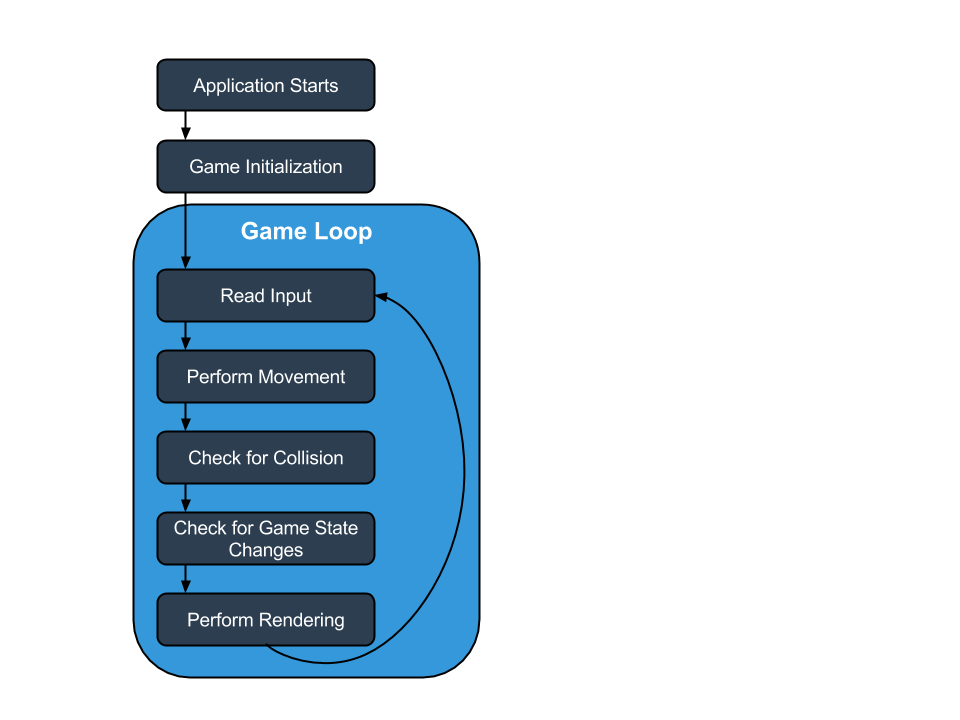
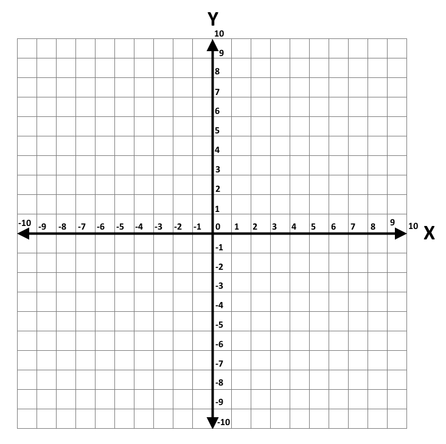
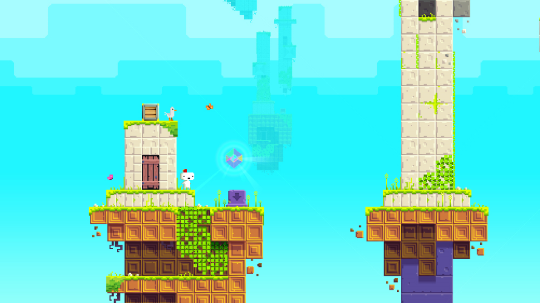
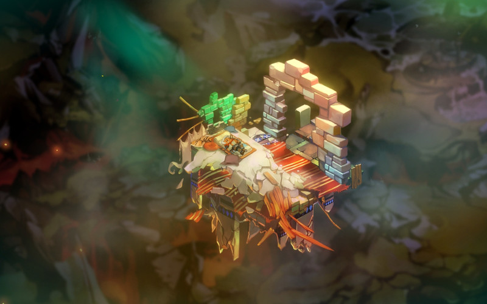

# Introduction to Game Development with Xamarin

Developing games can be very exciting, especially given how easy it can be to publish your work on mobile platforms. This article discusses concepts and technologies related to game development that will help you create games, whether your goal is to create a high-quality AAA game or just to program for fun.

This article covers the following topics:

- **Game vs. non-game programming concepts** – We’ll explore some concepts that are either unique to game development, or are shared with other types of development but deserve emphasis here due to their importance.
- **Game development team** – This section looks at the various roles in a team of game developers.
- **Creating a game idea** – This section can help you create a new game idea – the first step in making a new game.
- **Game development technology** – Here we’ll list some of the cross-platform technologies available that can improve your productivity as a game developer.

## Game vs. Non-Game Programming Concepts

Programmers moving into game development are often confronted with new concepts and development patterns. This section presents a high-level view of some of these concepts.

### The Game Loop

A typical game requires constant movement or change to be happening on the screen in response to both user interaction and automatic game logic. This is achieved through what is typically referred to as a *game loop*. A game loop is some type of looping statement (such as a while-loop) which runs at a very high frequency, such as 30 or 60 *frames per second*.

The following is a diagram of a simple game loop:

The technologies we discuss below will abstract away the actual while-loop, but despite this abstraction the concept of every-frame updates will be present.

Code performance can take priority in even the simplest of games. For example: a function which takes 10 milliseconds to execute could have a significant impact on the performance of a game – especially if it’s called more than once per frame. If your game is running at 30 frames per second then that means each frame must execute in under 33 milliseconds. By contrast, such a function may not even be noticeable if it only executes in response to a button click in a non-game application.

Common types of logic that may be performed every-frame include:

- **Reading Input** – The game may need to check if the user has interacted with the game by checking input hardware, such as the touch screen, keyboard, mouse, or game controller.
- **Movement** – Objects which move from one place to another will typically move a very small amount every frame to give the illusion of fluid motion.
- **Collision** – Many games require the frequent testing of whether various objects are overlapping or intersecting. We’ll cover collision in more depth in a later section in this article. Movement and collision may be handled by a dedicated physics simulation system.
- **Checking for game-specific conditions** – The state of a game may be controlled by certain conditions, such as whether the player has earned enough points or whether allotted time has run out.
- **AI behavior** – Every-frame logic that may be used to control the behavior of objects which are not controlled by the player, such as the patrolling of an enemy or the movement of opponent drivers around a racetrack.
- **Rendering** – Most games will update what is displayed on screen every frame. This may be done in response to changes which have impact on game play (such as a character moving through a level) or simply to provide visual polish (such as falling snow or animated icons).

Keep in mind that many of the activities listed above can change the state of the entire application, whereas many non-game apps tend to change state in response to events being raised.

### Content Loading and Unloading

Manually loading and unloading (or disposing) content may be needed depending on which technology you are using in development. Manually loading and unloading of assets may be necessary for a number of reasons:

- Assets may take a long time to load relative to the length of a single frame. Some assets may even take seconds to load, which would severely disrupt the experience if loaded mid gameplay. If the load time is especially lengthy (such as more than a second or two) you may want to show an animated loading screen or progress bar.
- Assets can consume a lot of RAM, requiring active management of what is loaded to fit within what is provided by the game’s target platforms.
- Games may need to display more assets than can fit in RAM. "Open World" games often include large environments which players can navigate through seamlessly – that is with no loading screens. In this case you may need to create a custom system for streaming content in and managing memory usage.

Custom file formats may need processing at load time, requiring custom loading code.

### Math

Many games require more advanced mathematics than non-game applications. Of course, the level of math depends on the complexity of the game. In general 3D games require more math than 2D. Fortunately you can always get started with simple games and learn as you go. Game development can be a great way to learn math!

If you’re familiar with the Cartesian plane – that is using X and Y coordinates to position objects – then you know enough to get started with game development. The following shows a Cartesian plane with positive Y pointing upward:

> [!IMPORTANT]
> Some engines/APIs use a coordinate system where increasing an object’s Y value will move it down, while other systems use a coordinate system where positive Y is up. Keep this in mind if you are moving between systems.
Trigonometric functions (such as Sine and Cosine) are commonly used in 2D games which implement any form of rotation.

If you are planning on making a 3D game then you will likely need to be familiar with concepts from Linear Algebra (for rotation and movement in 3D space) as well as some Calculus (for implementing acceleration).

### Content Pipelines

The term *content pipeline* refers to the process that a file takes to get from its format when authored (such as a .png image file) to its final format when used in a game. The ending format depends on which type of content is being used as well as which technology is being used to present the content.

Some content pipelines may be very fast and require no manual effort. For example, most game engines and APIs can load the .png file format in its unprocessed format. On the other hand, more complicated formats (such as 3D models) may need to be processed into a different format before being loaded, and this processing can take some time depending on the asset’s size and complexity.

## Game Development Teams

Game development introduces new roles and titles for individuals involved in the process. Most game developers are not able to satisfy the broad set of skills required to release a full game, so a number of disciplines exist. Keep in mind that this is not a full list of areas of development – just some of the more common ones.

- **Programmer** – Most people reading this article will fall into this category. The role of a programmer in game development is similar to a programmer’s role in a non-game application. Responsibilities include writing logic to control the flow of a game, developing systems for common tasks in the context of a given project, adding and displaying content, and – of course – fixing bugs.
- **2D artist** – 2D artists are responsible for creating *2D assets*. These include image files for the game’s GUI, particles, environments, and characters. If the game you are developing is 3D, then 2D artists may not be responsible for environments and characters. You can find free art for your game at [http://opengameart.org/](http://opengameart.org/) .
- **3D artists** – 3D artists are responsible for creating *3D assets*. These include 3D models for environments, characters, and props (furniture, plants, and other inanimate objects). Some teams differentiate between 3D artists and 3D animators depending on the size of the team. You can find free 3D art for your game at [http://opengameart.org/](http://opengameart.org/) .
- **Game Designer** – Game designers are responsible for defining how the game is played. This can include high-level decisions such as the setting of the game, the overall goal of the game, and how a player progresses through the game. Game designers can also be involved in very detailed decisions such as mapping input to actions, defining coefficients for movement or level-ups, and designing level layout. Keep in mind that the term *designer* may refer to a game designer or a visual designer depending on the context.
- **Sound Designer** – Sound designers are responsible for a game’s audio assets. Some teams may differentiate between individuals responsible for creating sound effects and composers, while smaller teams may have a single individual responsible for all audio.

## Creating a Game Idea

Designing a game may appear to be easy to do – after all the only requirement is "make something fun." Unfortunately, many developers find themselves at a loss when it comes time to create an idea from which to launch development.

The discipline of game design is not easily explained, and requires practice to improve just as the art or programming does, but this section can help you start down the path.

New developers should start small. It can be difficult to resist the temptation to remake a large, modern video game, but smaller games can be a better learning environment and the faster progress makes for a more rewarding experience.

Many games, both for the purpose of learning as well as commercial games, begin as an improvement or modification to an existing game. One way to generate ideas is to look at other games for inspiration. For example, you can consider a game that you personally like and try to identify what characteristics about the game play make it fun. It may be exploration, mastery of the game’s mechanics, or progressing through a story. Don’t forget to consider "retro" games as well when searching for new ideas.

Another technique for generating new ideas is to consider a specific genre, such as puzzle games, strategy games, or platformers. A genre familiar to the developer might provide a good starting point.

Remaking existing games is also an educational experience, although this may limit the finished product’s commercial viability. The process of creating a game, even one which is an accurate clone, provides a valuable educational experience.

## Game Development Technology

Developers using Xamarin.Android and Xamarin.iOS have a wide range of technologies available to them to assist in game development. This section will discuss some of the most popular cross-platform solutions.

### MonoGame

MonoGame is an open-source, cross platform version of Microsoft’s XNA API. MonoGame can be used to make games for iOS, Android, Mac OS X, Linux, Windows, Windows RT, PS4, PSVita, Xbox One, and Switch.

MonoGame is technically not a game engine, but rather a game development API. This means that working with MonoGame requires directly managing game objects, manually drawing objects, and implementing common objects such as cameras and *scene graphs* (the parent child hierarchy between game objects).

MonoGame does not offer a standard visual development environment, so working with MonoGame requires programming knowledge.

Notable examples of games using MonoGame include:

FEZ:

Bastion:

To start working with MonoGame, head over to our [MonoGame Guides](~/graphics-games/monogame/index.md).

### UrhoSharp

UrhoSharp is a cross-platform high-level 3D and 2D engine that can be used
to create animated 3D and 2D scenes for your applications using geometries,
materials, lights and cameras.

Check out the [UrhoSharp Guides](~/graphics-games/urhosharp/index.md) to get started.

### Additional Technology

The technologies highlighted above is only a sample of the technologies available. Other notable technologies include:

- **Sprite Kit** – Xamarin provides support for Apple’s Sprite Kit game framework, which gives you access to all of the functionality of the native API. Since Sprite Kit is technology created by Apple, it provides deep integration with the rest of the iOS ecosystem. Of course, Sprite Kit is not cross-platform so it cannot be used on Android. For more information on using Sprite Kit, see this post:  [https://blog.xamarin.com/make-games-with-xamarin.ios-and-sprite-kit/](https://blog.xamarin.com/make-games-with-xamarin.ios-and-sprite-kit/)
- **Scene Kit** – Xamarin also provides support for Apple’s Scene Kit framework, which simplifies implementing 3D graphics into iOS apps. Scene Kit is also technology provided by Apple, so it has both the integration and platform-specific considerations mentioned above for Sprite Kit. For more information on Scene Kit, see this post: [https://blog.xamarin.com/3d-in-ios-8-with-scene-kit/](https://blog.xamarin.com/3d-in-ios-8-with-scene-kit/)
- **OpenTK –** OpenTK (which stands for Open Tool Kit) provides low-level OpenGL access to iOS, Apple, and Mac hardware. For more information on OpenTK, see the main page at: [https://opentk.net/](https://opentk.net/)

## Related Links

- [MonoGame Guides](~/graphics-games/monogame/index.md)
- [UrhoSharp Guides](~/graphics-games/urhosharp/index.md)
