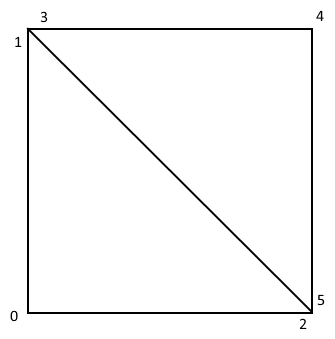
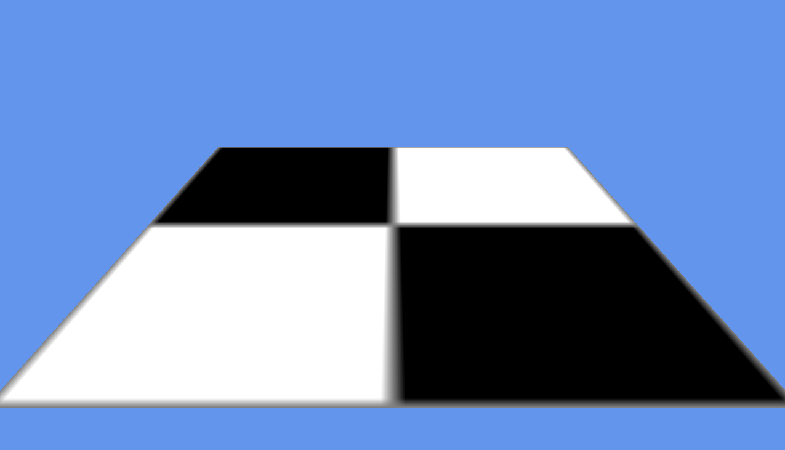
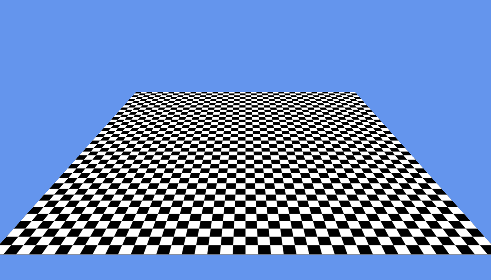

# Drawing 3D Graphics with Vertices in MonoGame

_MonoGame supports using arrays of vertices to define how a 3D object is rendered on a per-point basis. Users can take advantage of vertex arrays to create dynamic geometry, implement special effects, and improve the efficiency of their rendering through culling._

Users who have read through the [guide on rendering Models](~/graphics-games/monogame/3d/part1.md) will be familiar with rendering a 3D model in MonoGame. The `Model` class is an effective way to render 3D graphics when working with data defined in a file (such as .fbx), and when dealing with static data. Some games require 3D geometry to be defined or manipulated dynamically at runtime. In these cases, we can use arrays of *vertices* to define and render geometry. A vertex is a general term for a point in 3D space which is part of an ordered list used to define geometry. Typically vertices are ordered in such a way as to define a series of triangles.

To help visualize how vertices are used to create 3D objects, let’s consider the following sphere:


As shown above, the sphere is clearly composed of multiple triangles. We can view the wireframe of the sphere to see how the vertices connect to form triangles:


This walkthrough will cover the following topics:

- Creating a project
- Creating the vertices
- Adding drawing code
- Rendering with a texture
- Modifying texture coordinates
- Rendering vertices with models

The finished project will contain a checkered floor which will be drawn using a vertex array:


## Creating a Project

First, we’ll download a project which will serve as our starting point. We’ll use the Model project [which can be found here](/samples/xamarin/mobile-samples/modelrenderingmg/).

Once downloaded and unzipped, open and run the project. We expect to see six robot models being drawn on-screen:


By the end of this project we’ll be combining our own custom vertex rendering with the robot `Model`, so we aren’t going to delete the robot rendering code. Instead, we’ll just clear out the `Game1.Draw` call to remove the drawing of the 6 robots for now. To do this, open the **Game1.cs** file and locate the `Draw` method. Modify it so it contains the following code:

```csharp
protected override void Draw(GameTime gameTime)
{
  GraphicsDevice.Clear(Color.CornflowerBlue);
  base.Draw(gameTime);
}
```

This will result in our game displaying an empty blue screen:


## Creating the Vertices

We will create an array of vertices to define our geometry. In this walkthrough, we’ll be creating a 3D plane (a square in 3D space, not an airplane). Although our plane has four sides and four corners, it will be composed of two triangles, each of which requires three vertices. Therefore, we will be defining a total of six points.

So far we’ve been talking about vertices in a general sense, but MonoGame provides some standard structs which can be used for vertices:

- `Microsoft.Xna.Framework.Graphics.VertexPositionColor`
- `Microsoft.Xna.Framework.Graphics.VertexPositionColorTexture`
- `Microsoft.Xna.Framework.Graphics.VertexPositionNormalTexture`
- `Microsoft.Xna.Framework.Graphics.VertexPositionTexture`

Each type’s name indicates the components it contains. For example, `VertexPositionColor` contains values for position and color. Let’s look at each of the components:

- Position – All vertex types include a `Position` component. The `Position` values define where the vertex is located in 3D space (X, Y, and Z).
- Color – Vertices can optionally specify a `Color` value to perform custom tinting.
- Normal – Normals define which way the surface of the object is facing. Normals are necessary if rendering an object with lighting since the direction that a surface is facing impacts how much light it receives. Normals are typically specified as a *unit vector* – a 3D vector which has a length of 1.
- Texture – Texture refers to texture coordinates – that is, which portion of a texture should appear at a given vertex. Texture values are necessary if rendering a 3D object with a texture. Texture coordinates are normalized coordinates, which means that values will fall between 0 and 1. We’ll cover texture coordinates in more detail later in this guide.

Our plane will serve as a floor, and we’ll want to apply a texture when performing our rendering, so we will use the `VertexPositionTexture` type to define our vertices.

First, we’ll add a member to our Game1 class:

```csharp
VertexPositionTexture[] floorVerts;
```

Next, define our vertices in `Game1.Initialize`. Notice that the provided template referenced earlier in this article does not contain a `Game1.Initialize` method, so we need to add the entire method to `Game1`:

```csharp
protected override void Initialize ()
{
    floorVerts = new VertexPositionTexture[6];
    floorVerts [0].Position = new Vector3 (-20, -20, 0);
    floorVerts [1].Position = new Vector3 (-20,  20, 0);
    floorVerts [2].Position = new Vector3 ( 20, -20, 0);
    floorVerts [3].Position = floorVerts[1].Position;
    floorVerts [4].Position = new Vector3 ( 20,  20, 0);
    floorVerts [5].Position = floorVerts[2].Position;
    // We’ll be assigning texture values later
    base.Initialize ();
}
```

To help visualize what our vertices will look like, consider the following diagram:



We need to rely on our diagram to visualize the vertices until we finish implementing our rendering code.

## Adding Drawing Code

Now that we have the positions for our geometry defined, we can write our rendering code.

First, we’ll need to define a `BasicEffect` instance which will hold parameters for rendering such as position and lighting. To do this, add a `BasicEffect` member to the `Game1` class below where the `floorVerts` field is defined:

```csharp
...
VertexPositionTexture[] floorVerts;
// new code:
BasicEffect effect;
```

Next, modify the `Initialize` method to define the effect:

```csharp
protected override void Initialize ()
{
    floorVerts = new VertexPositionTexture[6];

    floorVerts [0].Position = new Vector3 (-20, -20, 0);
    floorVerts [1].Position = new Vector3 (-20,  20, 0);
    floorVerts [2].Position = new Vector3 ( 20, -20, 0);

    floorVerts [3].Position = floorVerts[1].Position;
    floorVerts [4].Position = new Vector3 ( 20,  20, 0);
    floorVerts [5].Position = floorVerts[2].Position;
    // new code:
    effect = new BasicEffect (graphics.GraphicsDevice);

    base.Initialize ();
}
```

Now we can add code to perform the drawing:

```csharp
void DrawGround()
{
    // The assignment of effect.View and effect.Projection
    // are nearly identical to the code in the Model drawing code.
    var cameraPosition = new Vector3 (0, 40, 20);
    var cameraLookAtVector = Vector3.Zero;
    var cameraUpVector = Vector3.UnitZ;

    effect.View = Matrix.CreateLookAt (
        cameraPosition, cameraLookAtVector, cameraUpVector);

    float aspectRatio = 
        graphics.PreferredBackBufferWidth / (float)graphics.PreferredBackBufferHeight;
    float fieldOfView = Microsoft.Xna.Framework.MathHelper.PiOver4;
    float nearClipPlane = 1;
    float farClipPlane = 200;

    effect.Projection = Matrix.CreatePerspectiveFieldOfView(
        fieldOfView, aspectRatio, nearClipPlane, farClipPlane);

    foreach (var pass in effect.CurrentTechnique.Passes)
    {
        pass.Apply ();

        graphics.GraphicsDevice.DrawUserPrimitives (
            // We’ll be rendering two trinalges
            PrimitiveType.TriangleList,
            // The array of verts that we want to render
            floorVerts,
            // The offset, which is 0 since we want to start
            // at the beginning of the floorVerts array
            0,
            // The number of triangles to draw
            2);
    }
}
```

We'll need to call `DrawGround` in our `Game1.Draw`:

```csharp
protected override void Draw (GameTime gameTime)
{
    GraphicsDevice.Clear (Color.CornflowerBlue);

    DrawGround ();

    base.Draw (gameTime);
}
```

The app will display the following when executed:


Let’s look at some of the details in the code above.

### View and Projection Properties

The `View` and `Projection` properties control how we view the scene. We’ll be modifying this code later when we re-add the model rendering code. Specifically, `View` controls the location and orientation of the camera, and `Projection` controls the *field of view* (which can be used to zoom the camera).

### Techniques and Passes

Once we’ve assigned properties on our effect we can perform the actual rendering.

We won’t be changing the `CurrentTechnique` property in this walkthrough, but more advanced games may have a single effect which can perform drawing in different ways (such as how the color value is applied). Each of these rendering modes can be represented as a technique which can be assigned prior to rendering. Furthermore, each technique may require multiple passes to render properly. Effects may need multiple passes if rendering complex visuals such as a glowing surface or fur.

The important thing to keep in mind is that the `foreach` loop enables the same C# code to render any effect regardless of the complexity of the underlying `BasicEffect`.

### DrawUserPrimitives

`DrawUserPrimitives` is where the vertices are rendered. The first parameter tells the method how we have organized our vertices. We have structured them so that each triangle is defined by three ordered vertices, so we use the `PrimitiveType.TriangleList` value.

The second parameter is the array of vertices which we defined earlier.

The third parameter specifies the first index to draw. Since we want our entire vertex array to be rendered, we’ll pass a value of 0.

Finally, we specify how many triangles to render. Our vertex array contains two triangles, so pass a value of 2.

## Rendering with a Texture

At this point our app renders a white plane (in perspective). Next we’ll add a texture to our project to be used when rendering our plane.

To keep things simple we’ll add the .png directly to our project rather than using the MonoGame Pipeline tool. To do this, download [this .png file](https://github.com/xamarin/mobile-samples/blob/master/ModelRenderingMG/Resources/checkerboard.png?raw=true) to your computer. Once downloaded, right-click on the **Content** folder in the Solution pad and select **Add>Add Files...** . If working on Android, then this folder will be located under the **Assets** folder in the Android-specific project. If on iOS, then this folder will be in the root of the iOS project. Navigate to the location where **checkerboard.png** is saved and select this file. Select to copy the file to the directory.

Next, we’ll add the code to create our `Texture2D` instance. First, add the `Texture2D` as a member of `Game1` under the `BasicEffect` instance:

```csharp
...
BasicEffect effect;
// new code:
Texture2D checkerboardTexture;
```

Modify `Game1.LoadContent` as follows:

```csharp
protected override void LoadContent()
{
    // Notice that loading a model is very similar
    // to loading any other XNB (like a Texture2D).
    // The only difference is the generic type.
    model = Content.Load<Model> ("robot");

    // We aren't using the content pipeline, so we need
    // to access the stream directly:
    using (var stream = TitleContainer.OpenStream ("Content/checkerboard.png"))
    {
        checkerboardTexture = Texture2D.FromStream (this.GraphicsDevice, stream);
    }
}
```

Next, modify the `DrawGround` method. The only modification necessary is to assign `effect.TextureEnabled` to `true` and to set the `effect.Texture` to `checkerboardTexture`:

```csharp
void DrawGround()
{
    // The assignment of effect.View and effect.Projection
    // are nearly identical to the code in the Model drawing code.
    var cameraPosition = new Vector3 (0, 40, 20);
    var cameraLookAtVector = Vector3.Zero;
    var cameraUpVector = Vector3.UnitZ;

    effect.View = Matrix.CreateLookAt (
        cameraPosition, cameraLookAtVector, cameraUpVector);

    float aspectRatio = 
        graphics.PreferredBackBufferWidth / (float)graphics.PreferredBackBufferHeight;
    float fieldOfView = Microsoft.Xna.Framework.MathHelper.PiOver4;
    float nearClipPlane = 1;
    float farClipPlane = 200;

    effect.Projection = Matrix.CreatePerspectiveFieldOfView(
        fieldOfView, aspectRatio, nearClipPlane, farClipPlane);

    // new code:
    effect.TextureEnabled = true;
    effect.Texture = checkerboardTexture;

    foreach (var pass in effect.CurrentTechnique.Passes)
    {
        pass.Apply ();

        graphics.GraphicsDevice.DrawUserPrimitives (
                    PrimitiveType.TriangleList,
            floorVerts,
            0,
            2);
    }
}
```

Finally, we need to modify the `Game1.Initialize` method to also assign texture coordinates on our vertices:

```csharp
protected override void Initialize ()
{
    floorVerts = new VertexPositionTexture[6];

    floorVerts [0].Position = new Vector3 (-20, -20, 0);
    floorVerts [1].Position = new Vector3 (-20,  20, 0);
    floorVerts [2].Position = new Vector3 ( 20, -20, 0);

    floorVerts [3].Position = floorVerts[1].Position;
    floorVerts [4].Position = new Vector3 ( 20,  20, 0);
    floorVerts [5].Position = floorVerts[2].Position;

    // New code:
    floorVerts [0].TextureCoordinate = new Vector2 (0, 0);
    floorVerts [1].TextureCoordinate = new Vector2 (0, 1);
    floorVerts [2].TextureCoordinate = new Vector2 (1, 0);

    floorVerts [3].TextureCoordinate = floorVerts[1].TextureCoordinate;
    floorVerts [4].TextureCoordinate = new Vector2 (1, 1);
    floorVerts [5].TextureCoordinate = floorVerts[2].TextureCoordinate;

    effect = new BasicEffect (graphics.GraphicsDevice);

    base.Initialize ();
}
```

If we run the code, we can see that our plane now displays a checkerboard pattern:



## Modifying Texture Coordinates

MonoGame uses normalized texture coordinates, which are coordinates between 0 and 1 rather than between 0 and the texture’s width or height. The following diagram can help visualize normalized coordinates:


Normalized texture coordinates allow texture resizing without needing to rewrite code or recreate models (such as .fbx files). This is possible because normalized coordinates represent a ratio rather than specific pixels. For example, (1,1) will always represent the bottom-right corner regardless of the texture size.

We can change the texture coordinate assignment to use a single variable for the number of repetitions:

```csharp
protected override void Initialize ()
{
    floorVerts = new VertexPositionTexture[6];

    floorVerts [0].Position = new Vector3 (-20, -20, 0);
    floorVerts [1].Position = new Vector3 (-20,  20, 0);
    floorVerts [2].Position = new Vector3 ( 20, -20, 0);

    floorVerts [3].Position = floorVerts[1].Position;
    floorVerts [4].Position = new Vector3 ( 20,  20, 0);
    floorVerts [5].Position = floorVerts[2].Position;

    int repetitions = 20;

    floorVerts [0].TextureCoordinate = new Vector2 (0, 0);
    floorVerts [1].TextureCoordinate = new Vector2 (0, repetitions);
    floorVerts [2].TextureCoordinate = new Vector2 (repetitions, 0);

    floorVerts [3].TextureCoordinate = floorVerts[1].TextureCoordinate;
    floorVerts [4].TextureCoordinate = new Vector2 (repetitions, repetitions);
    floorVerts [5].TextureCoordinate = floorVerts[2].TextureCoordinate;

    effect = new BasicEffect (graphics.GraphicsDevice);

    base.Initialize ();
}
```

This results in the texture repeating 20 times:



## Rendering Vertices with Models

Now that our plane is rendering properly, we can re-add the models to view everything together. First, we’ll re-add the model code to our `Game1.Draw` method (with modified positions):

```csharp
protected override void Draw(GameTime gameTime)
{
    GraphicsDevice.Clear(Color.CornflowerBlue);

    DrawGround ();

    DrawModel (new Vector3 (-4, 0, 3));
    DrawModel (new Vector3 ( 0, 0, 3));
    DrawModel (new Vector3 ( 4, 0, 3));

    DrawModel (new Vector3 (-4, 4, 3));
    DrawModel (new Vector3 ( 0, 4, 3));
    DrawModel (new Vector3 ( 4, 4, 3));

    base.Draw(gameTime);
}
```

We will also create a `Vector3` in `Game1` to represent our camera’s position. We’ll add a field under our `checkerboardTexture` declaration:

```csharp
...
Texture2D checkerboardTexture;
// new code:
Vector3 cameraPosition = new Vector3(0, 10, 10);
```

Next, remove the local `cameraPosition` variable from the `DrawModel` method:

```csharp
void DrawModel(Vector3 modelPosition)
{
    foreach (var mesh in model.Meshes)
    {
        foreach (BasicEffect effect in mesh.Effects)
        {
            effect.EnableDefaultLighting ();
            effect.PreferPerPixelLighting = true;

            effect.World = Matrix.CreateTranslation (modelPosition);

            var cameraLookAtVector = Vector3.Zero;
            var cameraUpVector = Vector3.UnitZ;

            effect.View = Matrix.CreateLookAt (
                cameraPosition, cameraLookAtVector, cameraUpVector);
            ...
```

Similarly remove the local `cameraPosition` variable from the `DrawGround` method:

```csharp
void DrawGround()
{
    // The assignment of effect.View and effect.Projection
    // are nearly identical to the code in the Model drawing code.
    var cameraLookAtVector = Vector3.Zero;
    var cameraUpVector = Vector3.UnitZ;

    effect.View = Matrix.CreateLookAt (
        cameraPosition, cameraLookAtVector, cameraUpVector);
    ...
```

Now if we run the code we can see both the models and the ground at the same time:


If we modify the camera position (such as by increasing its X value, which in this case moves the camera to the left) we can see that the value impacts both the ground and the models:

```csharp
Vector3 cameraPosition = new Vector3(15, 10, 10);
```

This code results in the following:


## Summary

This walkthrough showed how to use a vertex array to perform custom rendering. In this case, we created a checkered floor by combining our vertex-based rendering with a texture and `BasicEffect`, but the code presented here serves as the basis for any 3D rendering. We also showed that vertex based rendering can be mixed with models in the same scene.

## Related Links

- [Checkerboard file (sample)](https://github.com/xamarin/mobile-samples/blob/master/ModelRenderingMG/Resources/checkerboard.png?raw=true)
- [Completed project (sample)](/samples/xamarin/mobile-samples/modelsandvertsmg/)