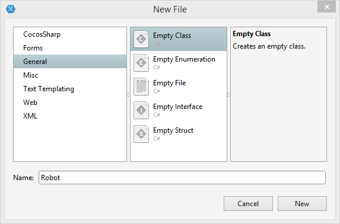
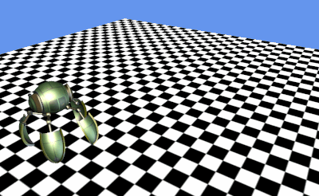
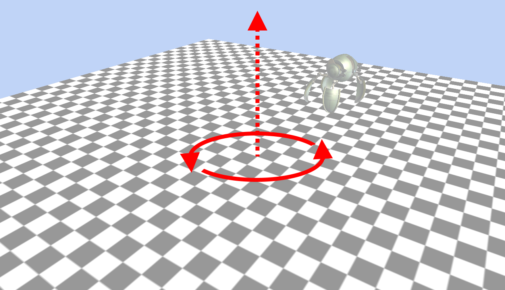
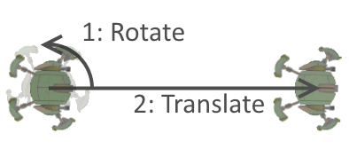
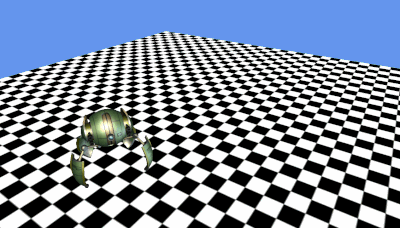

# 3D Coordinates in MonoGame

_Understanding the 3D coordinate system is an important step in developing 3D games. MonoGame provides a number of classes for positioning, orienting, and scaling objects in 3D space._

Developing 3D games requires an understanding of how to manipulate objects in a 3D coordinate system. This walkthrough will cover how to manipulate visual objects (specifically a Model). We’ll build on the concepts of controlling a model to create a 3D Camera class.

The concepts presented originate from linear algebra, but we’ll take a practical approach so that any user without a strong math background can apply these concepts in their own games.

We’ll be covering the following topics:

- Creating a Project
- Creating a Robot Entity
- Moving the Robot Entity
- Matrix Multiplication
- Creating the Camera Entity
- Moving the Camera with Input

Once finished, we’ll have a project with a robot moving in a circle and a camera which can be controlled by touch input:


## Creating a Project

This walkthrough focuses on moving objects in 3D space. We’ll begin with the project for rendering models and vertex arrays [which can be found here](/samples/xamarin/mobile-samples/modelsandvertsmg/). Once downloaded, unzip and open the project to make sure it runs and we should see the following:


## Creating a Robot Entity

Before we begin moving our robot around, we will create a `Robot` class to contain logic for drawing and movement. Game developers refer to this encapsulation of logic and data as an *entity*.

Add a new empty class file to the **MonoGame3D** Portable Class Library (not the platform-specific ModelAndVerts.Android). Name it **Robot** and click **New**:



Modify the `Robot` class as follows:

```csharp
using System;
using Microsoft.Xna.Framework;
using Microsoft.Xna.Framework.Graphics;
using Microsoft.Xna.Framework.Content;

namespace MonoGame3D
{
    public class Robot
    {
        Model model;

        public void Initialize(ContentManager contentManager)
        {
            model = contentManager.Load<Model> ("robot");

        }

        // For now we'll take these values in, eventually we'll
        // take a Camera object
        public void Draw(Vector3 cameraPosition, float aspectRatio)
        {
            foreach (var mesh in model.Meshes)
            {
                foreach (BasicEffect effect in mesh.Effects)
                {
                    effect.EnableDefaultLighting ();
                    effect.PreferPerPixelLighting = true;

                    effect.World = Matrix.Identity; 
                    var cameraLookAtVector = Vector3.Zero;
                    var cameraUpVector = Vector3.UnitZ;

                    effect.View = Matrix.CreateLookAt (
                        cameraPosition, cameraLookAtVector, cameraUpVector);

                    float fieldOfView = Microsoft.Xna.Framework.MathHelper.PiOver4;
                    float nearClipPlane = 1;
                    float farClipPlane = 200;

                    effect.Projection = Matrix.CreatePerspectiveFieldOfView(
                        fieldOfView, aspectRatio, nearClipPlane, farClipPlane);

                }

                // Now that we've assigned our properties on the effects we can
                // draw the entire mesh
                mesh.Draw ();
            }
        }
    }
}
```

The `Robot` code is essentially the same code in `Game1` for drawing a `Model`. For a review on `Model` loading and drawing, see [this guide on working with Models](~/graphics-games/monogame/3d/part1.md). We can now remove all of the `Model` loading and rendering code from `Game1`, and replace it with a `Robot` instance:

```csharp
using Microsoft.Xna.Framework;
using Microsoft.Xna.Framework.Graphics;

namespace MonoGame3D
{
    public class Game1 : Game
    {
        GraphicsDeviceManager graphics;

        VertexPositionNormalTexture[] floorVerts;

        BasicEffect effect;

        Texture2D checkerboardTexture;

        Vector3 cameraPosition = new Vector3(15, 10, 10);

        Robot robot;

        public Game1()
        {
            graphics = new GraphicsDeviceManager(this);
            graphics.IsFullScreen = true;

            Content.RootDirectory = "Content";
        }

        protected override void Initialize ()
        {
            floorVerts = new VertexPositionNormalTexture[6];

            floorVerts [0].Position = new Vector3 (-20, -20, 0);
            floorVerts [1].Position = new Vector3 (-20,  20, 0);
            floorVerts [2].Position = new Vector3 ( 20, -20, 0);

            floorVerts [3].Position = floorVerts[1].Position;
            floorVerts [4].Position = new Vector3 ( 20,  20, 0);
            floorVerts [5].Position = floorVerts[2].Position;

            int repetitions = 20;

            floorVerts [0].TextureCoordinate = new Vector2 (0, 0);
            floorVerts [1].TextureCoordinate = new Vector2 (0, repetitions);
            floorVerts [2].TextureCoordinate = new Vector2 (repetitions, 0);

            floorVerts [3].TextureCoordinate = floorVerts[1].TextureCoordinate;
            floorVerts [4].TextureCoordinate = new Vector2 (repetitions, repetitions);
            floorVerts [5].TextureCoordinate = floorVerts[2].TextureCoordinate;

            effect = new BasicEffect (graphics.GraphicsDevice);

            robot = new Robot ();
            robot.Initialize (Content);

            base.Initialize ();
        }

        protected override void LoadContent()
        {
            using (var stream = TitleContainer.OpenStream ("Content/checkerboard.png"))
            {
                checkerboardTexture = Texture2D.FromStream (this.GraphicsDevice, stream);
            }
        }

        protected override void Update(GameTime gameTime)
        {
            base.Update(gameTime);
        }

        protected override void Draw(GameTime gameTime)
        {
            GraphicsDevice.Clear(Color.CornflowerBlue);

            DrawGround ();

            float aspectRatio = 
                graphics.PreferredBackBufferWidth / (float)graphics.PreferredBackBufferHeight;
            robot.Draw (cameraPosition, aspectRatio);

            base.Draw(gameTime);
        }

        void DrawGround()
        {
            var cameraLookAtVector = Vector3.Zero;
            var cameraUpVector = Vector3.UnitZ;

            effect.View = Matrix.CreateLookAt (
                cameraPosition, cameraLookAtVector, cameraUpVector);

            float aspectRatio = 
                graphics.PreferredBackBufferWidth / (float)graphics.PreferredBackBufferHeight;
            float fieldOfView = Microsoft.Xna.Framework.MathHelper.PiOver4;
            float nearClipPlane = 1;
            float farClipPlane = 200;

            effect.Projection = Matrix.CreatePerspectiveFieldOfView(
                fieldOfView, aspectRatio, nearClipPlane, farClipPlane);

            effect.TextureEnabled = true;
            effect.Texture = checkerboardTexture;

            foreach (var pass in effect.CurrentTechnique.Passes)
            {
                pass.Apply ();

                graphics.GraphicsDevice.DrawUserPrimitives (
                            PrimitiveType.TriangleList,
                    floorVerts,
                    0,
                    2);
            }
        }
    }
}
```

If we run the code now we will have a scene with only one robot which is drawn mostly under the floor:


## Moving the Robot

Now that we have a `Robot` class, we can add movement logic to the robot. In this case, we’ll simply make the robot move in a circle according to the game time. This is a somewhat impractical implementation for a real game since a character may typically respond to input or artificial intelligence, but it provides an environment for us to explore 3D positioning and rotation.

The only information we’ll need from outside of the `Robot` class is the current game time. We’ll add an `Update` method which will take a `GameTime` parameter. This `GameTime` parameter will be used to increment an angle variable that we’ll use to determine the final position for the robot.

First, we’ll add the angle field to the `Robot` class under the `model` field:

```csharp
public class Robot
{
    public Model model;

    // new code:
    float angle;
    ...
```

 Now we can increment this value in an `Update` function:

```csharp
public void Update(GameTime gameTime)
{
    // TotalSeconds is a double so we need to cast to float
    angle += (float)gameTime.ElapsedGameTime.TotalSeconds;
}
```

We need to make sure that the `Update` method is called from `Game1.Update`:

```csharp
protected override void Update(GameTime gameTime)
{
    robot.Update (gameTime);
    base.Update(gameTime);
}
```

Of course, at this point the angle field does nothing – we need to write code to use it. We’ll modify the `Draw` method so that we can calculate the world `Matrix` in a dedicated method: 

```csharp
public void Draw(Vector3 cameraPosition, float aspectRatio)
{
    foreach (var mesh in model.Meshes)
    {
        foreach (BasicEffect effect in mesh.Effects)
        {
            effect.EnableDefaultLighting ();
            effect.PreferPerPixelLighting = true;
            // We’ll be doing our calculations here...
            effect.World = GetWorldMatrix();

            var cameraLookAtVector = Vector3.Zero;
            var cameraUpVector = Vector3.UnitZ;

            effect.View = Matrix.CreateLookAt (
                cameraPosition, cameraLookAtVector, cameraUpVector);

            float fieldOfView = Microsoft.Xna.Framework.MathHelper.PiOver4;
            float nearClipPlane = 1;
            float farClipPlane = 200;

            effect.Projection = Matrix.CreatePerspectiveFieldOfView(
                fieldOfView, aspectRatio, nearClipPlane, farClipPlane);
        }

        mesh.Draw ();
    }
}
```

Next, we’ll implement the `GetWorldMatrix` method in the `Robot` class:

```csharp
Matrix GetWorldMatrix()
{
    const float circleRadius = 8;
    const float heightOffGround = 3;

    // this matrix moves the model "out" from the origin
    Matrix translationMatrix = Matrix.CreateTranslation (
        circleRadius, 0, heightOffGround);

    // this matrix rotates everything around the origin
    Matrix rotationMatrix = Matrix.CreateRotationZ (angle);

    // We combine the two to have the model move in a circle:
    Matrix combined = translationMatrix * rotationMatrix;

    return combined;
}
```

The result of running this code results in the robot moving in a circle:



## Matrix Multiplication

The code above rotates the robot by creating a `Matrix` in the `GetWorldMatrix` method. The `Matrix` struct contains 16 float values which can be used to translate (set position), rotate, and scale (set size). When we assign the `effect.World` property, we are telling the underlying rendering system how to position, size, and orient whatever we happen to be drawing (a `Model` or geometry from vertices). 

Fortunately, the `Matrix` struct includes a number of methods which simplify the creation of common types of matrices. The first used in the code above is `Matrix.CreateTranslation`. The mathematical term *translation* refers to an operation which results in a point (or in our case a model) moving from one location to another without any other modification (such as rotating or resizing). The function takes an X, Y, and Z value for translation. If we view our scene from top-down, our `CreateTranslation` method (in isolation) performs the following:


The second matrix that we create is a rotation matrix using the `CreateRotationZ` matrix. This is one of three methods which can be used to create rotation:

- `CreateRotationX`
- `CreateRoationY`
- `CreateRotationZ`

Each method creates a rotation matrix by rotating about a given axis. In our case, we are rotating about the Z axis, which points "up". The following can help visualize how axis-based rotation works:



We are also using the `CreateRotationZ` method with the angle field, which increments over time due to our `Update` method being called. The result is that the `CreateRotationZ` method causes our robot to orbit around the origin as time passes.

The final line of code combines the two matrices into one:

```csharp
Matrix combined = translationMatrix * rotationMatrix;
```

This is referred to as matrix multiplication, which works slightly different than regular multiplication. The *commutative property of multiplication* states that the order of numbers in a multiplication operation does not change the result. That is, 3 \* 4 is equivalent to 4 \* 3. Matrix multiplication differs in that it is not commutative. That is, the above line can be read as "Apply the translationMatrix to move the model, then rotate everything by applying the rotationMatrix". We could visualize the way that the above line affects the position and rotation as follows:


To help understand how the order of matrix multiplication can impact the outcome, consider the following, where the matrix multiplication is inverted:

```csharp
Matrix combined = rotationMatrix * translationMatrix;
```

The code above would first rotate the model in-place, then translate it:



If we run the code with the inverted multiplication, we’ll notice that since the rotation applies first, it only impacts the orientation of the model and the position of the model stays the same. In other words, the model rotates in place:



## Creating the Camera Entity

The `Camera` entity will contain all of the logic necessary to perform input-based movement and to provide properties for assigning properties on the `BasicEffect` class.

First we’ll implement a static camera (no input-based movement) and integrate it into our existing project. Add a new class to the **MonoGame3D** Portable Class Library (the same project with `Robot.cs`) and name it **Camera**. Replace the contents of the file with the following code:

```csharp
using System;
using Microsoft.Xna.Framework;
using Microsoft.Xna.Framework.Graphics;

namespace MonoGame3D
{
    public class Camera
    {
        // We need this to calculate the aspectRatio
        // in the ProjectionMatrix property.
        GraphicsDevice graphicsDevice;

        Vector3 position = new Vector3(15, 10, 10);

        public Matrix ViewMatrix
        {
            get
            {
                var lookAtVector = Vector3.Zero;
                var upVector = Vector3.UnitZ;

                return Matrix.CreateLookAt (
                    position, lookAtVector, upVector);
            }
        }

        public Matrix ProjectionMatrix
        {
            get
            {
                float fieldOfView = Microsoft.Xna.Framework.MathHelper.PiOver4;
                float nearClipPlane = 1;
                float farClipPlane = 200;
                float aspectRatio = graphicsDevice.Viewport.Width / (float)graphicsDevice.Viewport.Height;

                return Matrix.CreatePerspectiveFieldOfView(
                    fieldOfView, aspectRatio, nearClipPlane, farClipPlane);
            }
        }

        public Camera(GraphicsDevice graphicsDevice)
        {
            this.graphicsDevice = graphicsDevice;
        }

        public void Update(GameTime gameTime)
        {
            // We'll be doing some input-based movement here
        }
    }
}
```

The code above is very similar to the code from `Game1` and `Robot` which assign the matrices on `BasicEffect`. 

Now we can integrate the new `Camera` class into our existing projects. First, we’ll modify the `Robot` class to take a `Camera` instance in its `Draw` method, which will eliminate a lot of duplicate code. Replace the `Robot.Draw` method with the following:

```csharp
public void Draw(Camera camera)
{
    foreach (var mesh in model.Meshes)
    {
        foreach (BasicEffect effect in mesh.Effects)
        {
            effect.EnableDefaultLighting ();
            effect.PreferPerPixelLighting = true;

            effect.World = GetWorldMatrix();
            effect.View = camera.ViewMatrix;
            effect.Projection = camera.ProjectionMatrix;
        }

        mesh.Draw ();
    }
}
```

Next ,modify the `Game1.cs` file:

```csharp
using Microsoft.Xna.Framework;
using Microsoft.Xna.Framework.Graphics;

namespace MonoGame3D
{
    public class Game1 : Game
    {
        GraphicsDeviceManager graphics;

        VertexPositionNormalTexture[] floorVerts;

        BasicEffect effect;

        Texture2D checkerboardTexture;

        // New camera code
        Camera camera;

        Robot robot;

        public Game1()
        {
            graphics = new GraphicsDeviceManager(this);
            graphics.IsFullScreen = true;

            Content.RootDirectory = "Content";
        }

        protected override void Initialize ()
        {
            floorVerts = new VertexPositionNormalTexture[6];

            floorVerts [0].Position = new Vector3 (-20, -20, 0);
            floorVerts [1].Position = new Vector3 (-20,  20, 0);
            floorVerts [2].Position = new Vector3 ( 20, -20, 0);

            floorVerts [3].Position = floorVerts[1].Position;
            floorVerts [4].Position = new Vector3 ( 20,  20, 0);
            floorVerts [5].Position = floorVerts[2].Position;

            int repetitions = 20;

            floorVerts [0].TextureCoordinate = new Vector2 (0, 0);
            floorVerts [1].TextureCoordinate = new Vector2 (0, repetitions);
            floorVerts [2].TextureCoordinate = new Vector2 (repetitions, 0);

            floorVerts [3].TextureCoordinate = floorVerts[1].TextureCoordinate;
            floorVerts [4].TextureCoordinate = new Vector2 (repetitions, repetitions);
            floorVerts [5].TextureCoordinate = floorVerts[2].TextureCoordinate;

            effect = new BasicEffect (graphics.GraphicsDevice);

            robot = new Robot ();
            robot.Initialize (Content);

            // New camera code
            camera = new Camera (graphics.GraphicsDevice);

            base.Initialize ();
        }

        protected override void LoadContent()
        {
            using (var stream = TitleContainer.OpenStream ("Content/checkerboard.png"))
            {
                checkerboardTexture = Texture2D.FromStream (this.GraphicsDevice, stream);
            }
        }

        protected override void Update(GameTime gameTime)
        {
            robot.Update (gameTime);
            // New camera code
            camera.Update (gameTime);
            base.Update(gameTime);
        }

        protected override void Draw(GameTime gameTime)
        {
            GraphicsDevice.Clear(Color.CornflowerBlue);

            DrawGround ();

            // New camera code
            robot.Draw (camera);

            base.Draw(gameTime);
        }

        void DrawGround()
        {
            // New camera code
            effect.View = camera.ViewMatrix;
            effect.Projection = camera.ProjectionMatrix;

            effect.TextureEnabled = true;
            effect.Texture = checkerboardTexture;

            foreach (var pass in effect.CurrentTechnique.Passes)
            {
                pass.Apply ();

                graphics.GraphicsDevice.DrawUserPrimitives (
                            PrimitiveType.TriangleList,
                    floorVerts,
                    0,
                    2);
            }
        }
    }
}
```

The modifications to the `Game1` from the previous version (which are identified with `// New camera code` ) are:

- `Camera` field in `Game1`
- `Camera` instantiation in `Game1.Initialize`
- `Camera.Update` call in `Game1.Update`
- `Robot.Draw` now takes a `Camera` parameter
- `Game1.Draw` now uses `Camera.ViewMatrix` and `Camera.ProjectionMatrix`

## Moving the Camera with Input

So far, we’ve added a `Camera` entity but haven’t done anything with it to change runtime behavior. We will add behavior which allows the user to:

- Touch the left side of the screen to turn the camera toward the left
- Touch the right side of the screen to turn the camera to the right
- Touch the center of the screen to move the camera forward

### Making lookAt Relative

First we’ll update the `Camera` class to include an `angle` field which will be used to set the direction that the `Camera` is facing. Currently, our `Camera` determines the direction it is facing through the local `lookAtVector`, which is assigned to `Vector3.Zero`. In other words, our `Camera` always looks at the origin. If the Camera moves, then the angle that the camera is facing will also change:


We want the `Camera` to be facing the same direction regardless of its position – at least until we implement the logic for rotating the `Camera` using input. The first change will be to adjust the `lookAtVector` variable to be based off of our current location, rather than looking at an absolute position:

```csharp
public class Camera
{
    GraphicsDevice graphicsDevice;

    // Let's start at X = 0 so we're looking at things head-on
    Vector3 position = new Vector3(0, 20, 10);

    public Matrix ViewMatrix
    {
        get
        {
            var lookAtVector = new Vector3 (0, -1, -.5f);
            lookAtVector += position;

            var upVector = Vector3.UnitZ;

            return  Matrix.CreateLookAt (
                position, lookAtVector, upVector);
        }
    }
    ...
```

This results in the `Camera` viewing the world straight-on. Notice that the initial `position` value has been modified to `(0, 20, 10)` so the `Camera` is centered on the X axis. Running the game displays:


### Creating an angle Variable

The `lookAtVector` variable controls the angle that our camera is viewing. Currently it is fixed to view down the negative Y axis, and slightly tilted down (from the `-.5f` Z value). We’ll create an `angle` variable which will be used to adjust the `lookAtVector` property. 

In earlier sections of this walkthrough we showed that matrices can be used to rotate how objects are drawn. We can also use matrices to rotate vectors like the `lookAtVector` using the `Vector3.Transform` method. 

Add an `angle` field and modify the `ViewMatrix` property as follows:

```csharp
public class Camera
{
    GraphicsDevice graphicsDevice;

    Vector3 position = new Vector3(0, 20, 10);

    float angle;

    public Matrix ViewMatrix
    {
        get
        {
            var lookAtVector = new Vector3 (0, -1, -.5f);
            // We'll create a rotation matrix using our angle
            var rotationMatrix = Matrix.CreateRotationZ (angle);
            // Then we'll modify the vector using this matrix:
            lookAtVector = Vector3.Transform (lookAtVector, rotationMatrix);
            lookAtVector += position;

            var upVector = Vector3.UnitZ;

            return  Matrix.CreateLookAt (
                position, lookAtVector, upVector);
        }
    }
    ...
```

### Reading input

Our `Camera` entity can now be fully controlled through its position and angle variables – we just need to change them according to input.

First, we’ll get the `TouchPanel` state to find where the user is touching the screen. For more information on using the `TouchPanel` class, see [the TouchPanel API reference](http://www.monogame.net/documentation/?page=T_Microsoft_Xna_Framework_Input_Touch_TouchPanel).

If the user is touching on the left third then we’ll adjust the `angle` value so the `Camera` rotates left, and if the user is touching on the right third, we’ll rotate the other way. If the user is touching in the middle third of the screen, then we’ll move the `Camera` forward.

First, add a using statement to qualify the `TouchPanel` and `TouchCollection` classes in `Camera.cs`:

```csharp
using Microsoft.Xna.Framework.Input.Touch; 
```

Next, modify the `Update` method to read the touch panel and adjust the `angle` and `position` variables appropriately:

```csharp
public void Update(GameTime gameTime)
{
    TouchCollection touchCollection = TouchPanel.GetState();

    bool isTouchingScreen = touchCollection.Count > 0;
    if (isTouchingScreen)
    {
        var xPosition = touchCollection [0].Position.X;

        float xRatio = xPosition / (float)graphicsDevice.Viewport.Width;

        if (xRatio < 1 / 3.0f)
        {
            angle += (float)gameTime.ElapsedGameTime.TotalSeconds;
        }
        else if (xRatio < 2 / 3.0f)
        {
            var forwardVector = new Vector3 (0, -1, 0);

            var rotationMatrix = Matrix.CreateRotationZ (angle);
            forwardVector = Vector3.Transform (forwardVector, rotationMatrix);

            const float unitsPerSecond = 3;

            this.position += forwardVector * unitsPerSecond *
                (float)gameTime.ElapsedGameTime.TotalSeconds ;
        }
        else
        {
            angle -= (float)gameTime.ElapsedGameTime.TotalSeconds;
        }
    }
}
```

Now the `Camera` will respond to touch input:


The Update method begins by calling `TouchPanel.GetState`, which returns a collection of touches. Although `TouchPanel.GetState` can return multiple touch points, we’ll only worry about the first one for simplicity.

If the user is touching the screen, then the code checks to see if the first touch is in the left, middle, or right third of the screen. The left and right thirds rotate the camera by increasing or decreasing the `angle` variable according to the `TotalSeconds` value (so that the game behaves the same regardless of frame rate).

If the user is touching the center third of the screen, then the camera will move forward. This is accomplished first by obtaining the forward vector, which is initially defined as pointing towards the negative Y axis, then rotated by a matrix created using `Matrix.CreateRotationZ` and the `angle` value. Finally the `forwardVector` is applied to `position` using the `unitsPerSecond` coefficient.

## Summary

This walkthrough covers how to move and rotate `Models` in 3D space using `Matrices` and the `BasicEffect.World` property. This form of movement provides the basis for moving objects in 3D games. This walkthrough also covers how to implement a `Camera` entity for viewing the world from any position and angle.

## Related Links

- [MonoGame API Link](http://www.monogame.net/documentation/?page=api)
- [Finished Project (sample)](/samples/xamarin/monodroid-samples/monogame3dcamera)