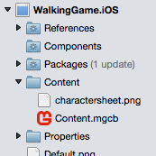
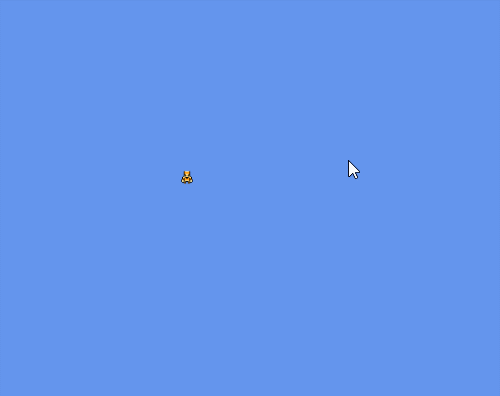

# Part 2 – Implementing the WalkingGame

_This walkthrough shows how to add game logic and content to an empty MonoGame project to create a demo of an animated sprite moving with touch input._

The previous parts of this walkthrough showed how to create empty MonoGame projects. We will build on these previous parts by making a simple game demo. This article contains the following sections:

- Unzipping our game content
- MonoGame Class Overview
- Rendering our first Sprite
- Creating the CharacterEntity
- Adding CharacterEntity to the game
- Creating the Animation class
- Adding the first Animation to CharacterEntity
- Adding movement to the character
- Matching movement and animation

## Unzipping our Game Content

Before we begin writing code, we will want to unzip our game *content*. Game developers often use the term *content* to refer to non-code files which are usually created by visual artists, game designers, or audio designers. Common types of content include files used to display visuals, play sound, or control artificial intelligence (AI) behavior. From a game development team’s perspective content is usually created by non-programmers.

The content used here can be found [on GitHub](https://github.com/xamarin/mobile-samples/blob/master/WalkingGameMG/Resources/charactersheet.png?raw=true). We’ll need these files downloaded to a location that we will access later in this walkthrough.

## MonoGame Class Overview

For starters we will explore the MonoGame classes used in basic rendering:

- `SpriteBatch` – used to draw 2D graphics to the screen. *Sprites* are 2D visual elements which are used to display images on screen. The `SpriteBatch` object can draw a single sprite at a time between its `Begin` and `End` methods, or multiple sprites can be grouped together, or *batched*.
- `Texture2D` – represents an image object at runtime. `Texture2D` instances are often created from file formats such as .png or .bmp, although they can also be created dynamically at runtime. `Texture2D` instances are used when rendering with `SpriteBatch` instances.
- `Vector2` – represents a position in a 2D coordinate system which is often used for positioning visual objects. MonoGame also includes `Vector3` and `Vector4` but we will only use `Vector2` in this walkthrough.
- `Rectangle` – a four-sided area with position, width, and height. We’ll be using this to define which portion of our `Texture2D` to render when we start working with animations.

We should also note that MonoGame is not maintained by Microsoft – despite its namespace. The `Microsoft.Xna` namespace is used in MonoGame to make it easier to migrate existing XNA projects to MonoGame.

## Rendering our First Sprite

Next we will draw a single sprite to the screen to show how to perform 2D rendering in MonoGame.

### Creating a Texture2D

We need to create a `Texture2D` instance to use when rendering our sprite. All game content is ultimately contained in a folder named **Content,** located in the platform-specific project. MonoGame shared projects cannot contain content, as the content must use build actions specific to the platform. The Content folder can be found in the iOS project, and inside the Assets folder in the Android project.

To add our game’s content, right-click on the **Content** folder and select **Add > Add Files...** Navigate to the location where the content.zip file was extracted and select the **charactersheet.png** file. If asked about how to add the file to folder, we should select the **Copy** option:


The Content folder now contains the charactersheet.png file:



Next, we’ll add code to load the charactersheet.png file and create a `Texture2D`. To do this open the `Game1.cs` file and add the following field to the Game1.cs class:

```csharp
Texture2D characterSheetTexture;
```

Next, we’ll create the `characterSheetTexture` in the `LoadContent` method. Before any modifications `LoadContent` method looks like this:

```csharp
protected override void LoadContent()
{
    // Create a new SpriteBatch, which can be used to draw textures.
    spriteBatch = new SpriteBatch(GraphicsDevice);
    // TODO: use this.Content to load your game content here
}
```

We should note that the default project already instantiates the `spriteBatch` instance for us. We’ll be using this later but we won’t be adding any additional code to prepare the `spriteBatch` for use. On the other hand, our `spriteSheetTexture` does require initialization, so we will initialize it after the `spriteBatch` is created:

```csharp
protected override void LoadContent()
{
    // Create a new SpriteBatch, which can be used to draw textures.
    spriteBatch = new SpriteBatch(GraphicsDevice);
    using (var stream = TitleContainer.OpenStream ("Content/charactersheet.png"))
    {
        characterSheetTexture = Texture2D.FromStream (this.GraphicsDevice, stream);

    }
}
```

Now that we have a `SpriteBatch` instance and a `Texture2D` instance we can add our rendering code to the `Game1.Draw` method:

```csharp
protected override void Draw(GameTime gameTime)
{
    GraphicsDevice.Clear(Color.CornflowerBlue);

    spriteBatch.Begin ();

    Vector2 topLeftOfSprite = new Vector2 (50, 50);
    Color tintColor = Color.White;

    spriteBatch.Draw(characterSheetTexture, topLeftOfSprite, tintColor);

    spriteBatch.End ();

    base.Draw(gameTime);
}
```

Running the game now shows a single sprite displaying the texture created from charactersheet.png:


## Creating the CharacterEntity

So far we’ve added code to render a single sprite to the screen; however, if we were to develop a full game without creating any other classes, we’d run into code organization issues.

### What is an Entity?

A common pattern for organizing game code is to create a new class for each game *entity* type. An entity in game development is an object which can contain some of the following characteristics (not all are required):

- A visual element such as a sprite, text, or 3D model
- Physics or every frame behavior such as a unit patrolling a set path or a player character responding to input
- Can be created and destroyed dynamically, such as a power-up appearing and being collected by the player

Entity organization systems can be complex, and many game engines offer classes to help manage entities. We’ll be implementing a very simple entity system, so it’s worth noting that full games usually require more organization on the developer’s part.

### Defining the CharacterEntity

Our entity, which we’ll call `CharacterEntity`, will have the following characteristics:

- The ability to load its own `Texture2D`
- The ability to render itself, including containing calling methods to update the walking animation
- `X` and Y properties to control the character’s position.
- The ability to update itself – specifically, to read values from the touch screen and adjust position appropriately.

To add the `CharacterEntity` to our game, right-click or Control-click on the **WalkingGame** project and select **Add > New File...**. Select the **Empty Class** option and name the new file **CharacterEntity**, then click **New**.

First we’ll add the ability for the `CharacterEntity` to load a `Texture2D` as well as to draw itself. We will modify the newly-added `CharacterEntity.cs` file as follows:

```csharp
using System;
using Microsoft.Xna.Framework.Graphics;
using Microsoft.Xna.Framework;
using Microsoft.Xna.Framework.Input.Touch;

namespace WalkingGame
{
    public class CharacterEntity
    {
        static Texture2D characterSheetTexture;

        public float X
        {
            get;
            set;
        }

        public float Y
        {
            get;
            set;
        }

        public CharacterEntity (GraphicsDevice graphicsDevice)
        {
            if (characterSheetTexture == null)
            {
                using (var stream = TitleContainer.OpenStream ("Content/charactersheet.png"))
                {
                    characterSheetTexture = Texture2D.FromStream (graphicsDevice, stream);
                }
            }
        }

        public void Draw(SpriteBatch spriteBatch)
        {
            Vector2 topLeftOfSprite = new Vector2 (this.X, this.Y);
            Color tintColor = Color.White;
            spriteBatch.Draw(characterSheetTexture, topLeftOfSprite, tintColor);
        }
    }
}
```

The above code adds the responsibility of positioning, rendering, and loading content to the `CharacterEntity`. Let’s take a moment to point out some considerations taken in the code above.

### Why are X and Y Floats?

Developers who are new to game programming may wonder why the `float` type is being used as opposed to `int` or `double`. The reason is that a 32-bit value is most common for positioning in low-level rendering code. The double type occupies 64 bits for precision, which is rarely needed for positioning objects. While a 32 bit difference may seem insignificant, many modern games include graphics which require processing tens of thousands of position values each frame (30 or 60 times per second). Cutting the amount of memory that must move through the graphics pipeline by half can have a significant impact on a game’s performance.

The `int` data type can be an appropriate unit of measurement for positioning, but it can place limitations on the way entities are positioned. For example, using integer values makes it more difficult to implement smooth movement for games which support zooming in or 3D cameras (which are allowed by `SpriteBatch`).

Finally, we will see that the logic which moves our character around the screen will do so using the game’s timing values. The result of multiplying velocity by how much time has passed in a given frame will rarely result in a whole number, so we need to use `float` for `X` and `Y`.

### Why is characterSheetTexture Static?

The `characterSheetTexture` `Texture2D` instance is a runtime representation of the charactersheet.png file. In other words, it contains the color values for each pixel as extracted from the source **charactersheet.png** file. If our game were to create two `CharacterEntity` instances, then each one would need access to information from charactersheet.png. In this situation we wouldn’t want to incur the performance cost of loading charactersheet.png twice, nor would we want to have duplicate texture memory stored in ram. Using a `static` field allows us to share the same `Texture2D` across all `CharacterEntity` instances.

Using `static` members for the runtime representation of content is a simplistic solution and it does not address problems encountered in larger games such as unloading content when moving from one level to another. More sophisticated solutions, which are beyond the scope of this walkthrough, include using MonoGame’s content pipeline or creating a custom content management system.

### Why is SpriteBatch Passed as an Argument Instead of Instantiated by the Entity?

The `Draw` method as implemented above takes a `SpriteBatch` argument, but by contrast, the `characterSheetTexture` is instantiated by the `CharacterEntity`.

The reason for this is because the most efficient rendering is possible when the same `SpriteBatch` instance is used for all `Draw` calls, and when all `Draw` calls are being made between a single set of `Begin` and `End` calls. Of course, our game will only include a single entity instance, but more complicated games will benefit from pattern that allows multiple entities to use the same `SpriteBatch` instance.

## Adding CharacterEntity to the Game

Now that we’ve added our `CharacterEntity` with code for rendering itself, we can replace the code in `Game1.cs` to use an instance of this new entity. To do this we’ll replace the `Texture2D` field with a `CharacterEntity` field in `Game1`:

```csharp
public class Game1 : Game
{
    GraphicsDeviceManager graphics;
    SpriteBatch spriteBatch;
    // New code:
    CharacterEntity character;

    public Game1()
    {
    ...
```

Next, we’ll add the instantiation of this entity in `Game1.Initialize`:

```csharp
protected override void Initialize()
{
    character = new CharacterEntity (this.GraphicsDevice);

    base.Initialize();
}
```

We also need to remove the `Texture2D` creation from `LoadContent` since that is now handled inside of our `CharacterEntity`. `Game1.LoadContent` should look like this:

```csharp
protected override void LoadContent()
{
    // Create a new SpriteBatch, which can be used to draw textures.
    spriteBatch = new SpriteBatch(GraphicsDevice);
}
```

It’s worth noting that despite its name the `LoadContent` method is not the only place where content can be loaded – many games implement content loading in their Initialize method, or even in their Update code as content, may not be needed until the player reaches a certain point of the game.

Finally we can modify the Draw method as follows:

```csharp
protected override void Draw(GameTime gameTime)
{
    GraphicsDevice.Clear(Color.CornflowerBlue);

    // We'll start all of our drawing here:
    spriteBatch.Begin ();

    // Now we can do any entity rendering:
    character.Draw(spriteBatch);
    // End renders all sprites to the screen:
    spriteBatch.End ();

    base.Draw(gameTime);
}
```

If we run the game, we will now see the character. Since X and Y default to 0, then the character is positioned against the top left corner of the screen:


## Creating the Animation Class

Currently our `CharacterEntity` displays the full **charactersheet.png** file. This arrangement of multiple images in one file is referred to as a *sprite sheet*. Typically, a sprite will render only a portion of the sprite sheet. We will modify the `CharacterEntity` to render a portion of this **charactersheet.png**, and this portion will change over time to display a walking animation.

We will create the `Animation` class to control the logic and state of the CharacterEntity animation. The Animation class will be a general class which could be used for any entity, not just `CharacterEntity` animations. Ultimate the `Animation` class will provide a `Rectangle` which the `CharacterEntity` will use when drawing itself. We'll also create an `AnimationFrame` class which will be used to define the animation.

### Defining AnimationFrame

`AnimationFrame` will not contain any logic related to animation. We’ll be using it only to store data. To add the `AnimationFrame` class, right-click or Control-click on the **WalkingGame** shared project and select **Add > New File....** Enter the name **AnimationFrame** and click the **New** button. We’ll modify the `AnimationFrame.cs` file so that it contains the following code:

```csharp
using System;
using Microsoft.Xna.Framework;

namespace WalkingGame
{
    public class AnimationFrame
    {
        public Rectangle SourceRectangle { get; set; }
        public TimeSpan Duration { get; set; }
    }
}
```

The `AnimationFrame` class contains two pieces of information:

- `SourceRectangle` – Defines the area of the `Texture2D` which will be displayed by the `AnimationFrame`. This value is measured in pixels, with the top left being (0, 0).
- `Duration` – Defines how long an `AnimationFrame` is displayed when used in an `Animation`.

### Defining Animation

The `Animation` class will contain a `List<AnimationFrame>` as well as the logic to switch which frame is currently displayed according to how much time has passed.

To add the `Animation` class, right-click or Control-click on the **WalkingGame** shared project and select **Add > New File...**. Enter the name **Animation** and click the **New** button. We’ll modify the `Animation.cs` file so it contains the following code:

```csharp
using System;
using System.Collections.Generic;
using System.Linq;
using Microsoft.Xna.Framework;

namespace WalkingGame
{
    public class Animation
    {
        List<AnimationFrame> frames = new List<AnimationFrame>();
        TimeSpan timeIntoAnimation;

        TimeSpan Duration
        {
            get
            {
                double totalSeconds = 0;
                foreach (var frame in frames)
                {
                    totalSeconds += frame.Duration.TotalSeconds;
                }

                return TimeSpan.FromSeconds (totalSeconds);
            }
        }

        public void AddFrame(Rectangle rectangle, TimeSpan duration)
        {
            AnimationFrame newFrame = new AnimationFrame()
            {
                SourceRectangle = rectangle,
                Duration = duration
            };

            frames.Add(newFrame);
        }

        public void Update(GameTime gameTime)
        {
            double secondsIntoAnimation = 
                timeIntoAnimation.TotalSeconds + gameTime.ElapsedGameTime.TotalSeconds;

            double remainder = secondsIntoAnimation % Duration.TotalSeconds;

            timeIntoAnimation = TimeSpan.FromSeconds (remainder);
        }
    }
}
```

Let’s look at some of the details from the `Animation` class.

### frames List

The `frames` member is what stores the data for our animation. The code which instantiates the animations will add `AnimationFrame` instances to the `frames` list through the `AddFrame` method. A more complete implementation may offer `public` methods or properties for modifying `frames`, but we’ll limit the functionality to adding frames for this walkthrough.

### Duration

Duration returns the total duration of the `Animation,` which is obtained by adding the duration of all of the contained `AnimationFrame` instances. This value could be cached if `AnimationFrame` were an immutable object, but since we implemented AnimationFrame as a class which can be changed after being added to Animation, we need to calculate this value whenever the property is accessed.

### Update

The `Update` method should be called every frame (that is, every time the entire game is updated). Its purpose is to increase the `timeIntoAnimation` member which is used to return the currently displayed frame. The logic in `Update` prevents the `timeIntoAnimation` from ever being larger than the duration of the entire animation.

Since we’ll be using the `Animation` class to display a walking animation then we want to have this animation repeat when it has reached the end. We can accomplish this by checking if the `timeIntoAnimation` is larger than the `Duration` value. If so it will cycle back to the beginning and preserve the remainder, resulting in a looping animation.

### Obtaining the Current Frame’s Rectangle

The purpose of the `Animation` class is ultimately to provide a `Rectangle` which can be used when drawing a sprite. Currently the `Animation` class contains logic for changing the `timeIntoAnimation` member, which we’ll use to obtain which `Rectangle` should be displayed. We’ll do this by creating a `CurrentRectangle` property in the `Animation` class. Copy this property into the `Animation` class:

```csharp
public Rectangle CurrentRectangle
{
    get
    {
        AnimationFrame currentFrame = null;

        // See if we can find the frame
        TimeSpan accumulatedTime = new TimeSpan();
        foreach(var frame in frames)
        {
            if (accumulatedTime + frame.Duration >= timeIntoAnimation)
            {
                currentFrame = frame;
                break;
            }
            else
            {
                accumulatedTime += frame.Duration;
            }
        }

        // If no frame was found, then try the last frame, 
        // just in case timeIntoAnimation somehow exceeds Duration
        if (currentFrame == null)
        {
            currentFrame = frames.LastOrDefault ();
        }

        // If we found a frame, return its rectangle, otherwise
        // return an empty rectangle (one with no width or height)
        if (currentFrame != null)
        {
            return currentFrame.SourceRectangle;
        }
        else
        {
            return Rectangle.Empty;
        }
    }
}
```

## Adding the first Animation to CharacterEntity

The `CharacterEntity` will contain animations for walking and standing, as well as a reference to the current `Animation` being displayed.

First, we’ll add our first `Animation,` which we’ll use to test out the functionality as written so far. Let’s add the following members to the CharacterEntity class:

```csharp
Animation walkDown;
Animation currentAnimation;
```

Next, let’s define the `walkDown` animation. To do this modify the `CharacterEntity` constructor as follows:

```csharp
public CharacterEntity (GraphicsDevice graphicsDevice)
{
    if (characterSheetTexture == null)
    {
        using (var stream = TitleContainer.OpenStream ("Content/charactersheet.png"))
        {
            characterSheetTexture = Texture2D.FromStream (graphicsDevice, stream);
        }
    }

    walkDown = new Animation ();
    walkDown.AddFrame (new Rectangle (0, 0, 16, 16), TimeSpan.FromSeconds (.25));
    walkDown.AddFrame (new Rectangle (16, 0, 16, 16), TimeSpan.FromSeconds (.25));
    walkDown.AddFrame (new Rectangle (0, 0, 16, 16), TimeSpan.FromSeconds (.25));
    walkDown.AddFrame (new Rectangle (32, 0, 16, 16), TimeSpan.FromSeconds (.25));
}
```

As mentioned earlier, we need to call `Animation.Update` for time-based animations to play. We also need to assign the `currentAnimation`. For now we’ll assign the `currentAnimation` to `walkDown`, but we’ll be replacing this code later when we implement our movement logic. We’ll add the `Update` method to `CharacterEntity` as follows:

```csharp
public void Update(GameTime gameTime)
{
    // temporary - we'll replace this with logic based off of which way the
    // character is moving when we add movement logic
    currentAnimation = walkDown;

    currentAnimation.Update (gameTime);
}
```

Now that we have the `currentAnimation` being assigned and updated, we can use it to perform our drawing. We’ll modify `CharacterEntity.Draw` as follows:

```csharp
public void Draw(SpriteBatch spriteBatch)
{
    Vector2 topLeftOfSprite = new Vector2 (this.X, this.Y);
    Color tintColor = Color.White;
    var sourceRectangle = currentAnimation.CurrentRectangle;

    spriteBatch.Draw(characterSheetTexture, topLeftOfSprite, sourceRectangle, Color.White);
}
```

The last step to getting the `CharacterEntity` animating is to call the newly added `Update` method from `Game1`. Modify `Game1.Update` as follows:

```csharp
protected override void Update(GameTime gameTime)
{
    character.Update (gameTime);
    base.Update(gameTime);
}
```

Now the `CharacterEntity` will play its `walkDown` animation:


## Adding Movement to the Character

Next, we’ll be adding movement to our character using touch controls. When the user touches the screen, the character will move towards the point where the screen is touched. If no touches are detected, then the character will stand in place.

### Defining GetDesiredVelocityFromInput

We’ll be using MonoGame’s `TouchPanel` class, which provides information about the current state of the touch screen. Let’s add a method which will check the `TouchPanel` and return our character’s desired velocity:

```csharp
Vector2 GetDesiredVelocityFromInput()
{
    Vector2 desiredVelocity = new Vector2 ();

    TouchCollection touchCollection = TouchPanel.GetState();

    if (touchCollection.Count > 0)
    {
        desiredVelocity.X = touchCollection [0].Position.X - this.X;
        desiredVelocity.Y = touchCollection [0].Position.Y - this.Y;

        if (desiredVelocity.X != 0 || desiredVelocity.Y != 0)
        {
            desiredVelocity.Normalize();
            const float desiredSpeed = 200;
            desiredVelocity *= desiredSpeed;
        }
    }

    return desiredVelocity;
}
```

The `TouchPanel.GetState` method returns a `TouchCollection` which contains information about where the user is touching the screen. If the user is not touching the screen, then the `TouchCollection` will be empty, in which case we shouldn’t move the character.

If the user is touching the screen, we will move the character towards the first touch, in other words, the `TouchLocation` at index 0. Initially we’ll set the desired velocity to equal the difference between the character’s location and the first touch’s location:

```csharp
        desiredVelocity.X = touchCollection [0].Position.X - this.X;
        desiredVelocity.Y = touchCollection [0].Position.Y - this.Y;
```

What follows is a bit of math which will keep the character moving at the same speed. To help explain why this is important, let’s consider a situation where the user is touching the screen 500 pixels away from where the character is located. The first line where `desiredVelocity.X` is set would assign a value of 500. However, if the user were touching the screen at a distance of only 100 units from the character, then the `desiredVelocity.X` would be set to 100. The result would be that the character’s movement speed would respond to how far away the touch point is from the character. Since we want the character to always move at the same speed, we need to modify the desiredVelocity.

The `if (desiredVelocity.X != 0 || desiredVelocity.Y != 0)` statement is checking if the velocity is non-zero – in other words, it’s checking to make sure that the user is not touching the same spot as the character’s current position. If not, then we need to set the character’s speed to be constant regardless of how far away the touch is. We accomplish this by normalizing the velocity vector which, results in it being a length of 1. A velocity vector of 1 means that the character will move at 1 pixel per second. We’ll speed this up by multiplying the value by the desired speed of 200.

### Applying Velocity to Position

The velocity returned from `GetDesiredVelocityFromInput` needs to be applied to the character’s `X` and `Y` values to have any effect at runtime. We’ll modify the `Update` method as follows:

```csharp
public void Update(GameTime gameTime)
{

    var velocity = GetDesiredVelocityFromInput ();

    this.X += velocity.X * (float)gameTime.ElapsedGameTime.TotalSeconds;
    this.Y += velocity.Y * (float)gameTime.ElapsedGameTime.TotalSeconds;

    // temporary - we'll replace this with logic based off of which way the
    // character is moving when we add movement logic
    currentAnimation = walkDown;

    currentAnimation.Update (gameTime);
}
```

What we’ve implemented here is called *time-based* movement (as opposed to *frame-based* movement). Time-based movement multiplies a velocity value (in our case the values stored in the `velocity` variable) by how much time has passed since last update which is stored in `gameTime.ElapsedGameTime.TotalSeconds`. If the game runs at fewer frames per second, the elapsed time between frames goes up – the end result is that objects using time-based movement will always move at the same speed regardless of frame rate.

If we run our game now, we’ll see that the character is moving towards the touch location:



## Matching Movement and Animation

Once we have our character moving and playing a single animation, we can define the remainder of our animations, then use them to reflect the movement of the character. When finished we will have eight animations in total:

- Animations for walking up, down, left, and right
- Animations for standing still and facing up, down, left, and right

### Defining the Rest of the Animations

We’ll first add the `Animation` instances to the `CharacterEntity` class for all of our animations in the same place where we added `walkDown`. Once we do this, the `CharacterEntity` will have the following `Animation` members:

```csharp
Animation walkDown;
Animation walkUp;
Animation walkLeft;
Animation walkRight;

Animation standDown;
Animation standUp;
Animation standLeft;
Animation standRight;

Animation currentAnimation;
```

Now we’ll define the animations in the `CharacterEntity` constructor as follows:

```csharp
public CharacterEntity (GraphicsDevice graphicsDevice)
{
    if (characterSheetTexture == null)
    {
        using (var stream = TitleContainer.OpenStream ("Content/charactersheet.png"))
        {
            characterSheetTexture = Texture2D.FromStream (graphicsDevice, stream);
        }
    }

    walkDown = new Animation ();
    walkDown.AddFrame (new Rectangle (0, 0, 16, 16), TimeSpan.FromSeconds (.25));
    walkDown.AddFrame (new Rectangle (16, 0, 16, 16), TimeSpan.FromSeconds (.25));
    walkDown.AddFrame (new Rectangle (0, 0, 16, 16), TimeSpan.FromSeconds (.25));
    walkDown.AddFrame (new Rectangle (32, 0, 16, 16), TimeSpan.FromSeconds (.25));

    walkUp = new Animation ();
    walkUp.AddFrame (new Rectangle (144, 0, 16, 16), TimeSpan.FromSeconds (.25));
    walkUp.AddFrame (new Rectangle (160, 0, 16, 16), TimeSpan.FromSeconds (.25));
    walkUp.AddFrame (new Rectangle (144, 0, 16, 16), TimeSpan.FromSeconds (.25));
    walkUp.AddFrame (new Rectangle (176, 0, 16, 16), TimeSpan.FromSeconds (.25));

    walkLeft = new Animation ();
    walkLeft.AddFrame (new Rectangle (48, 0, 16, 16), TimeSpan.FromSeconds (.25));
    walkLeft.AddFrame (new Rectangle (64, 0, 16, 16), TimeSpan.FromSeconds (.25));
    walkLeft.AddFrame (new Rectangle (48, 0, 16, 16), TimeSpan.FromSeconds (.25));
    walkLeft.AddFrame (new Rectangle (80, 0, 16, 16), TimeSpan.FromSeconds (.25));

    walkRight = new Animation ();
    walkRight.AddFrame (new Rectangle (96, 0, 16, 16), TimeSpan.FromSeconds (.25));
    walkRight.AddFrame (new Rectangle (112, 0, 16, 16), TimeSpan.FromSeconds (.25));
    walkRight.AddFrame (new Rectangle (96, 0, 16, 16), TimeSpan.FromSeconds (.25));
    walkRight.AddFrame (new Rectangle (128, 0, 16, 16), TimeSpan.FromSeconds (.25));

    // Standing animations only have a single frame of animation:
    standDown = new Animation ();
    standDown.AddFrame (new Rectangle (0, 0, 16, 16), TimeSpan.FromSeconds (.25));

    standUp = new Animation ();
    standUp.AddFrame (new Rectangle (144, 0, 16, 16), TimeSpan.FromSeconds (.25));

    standLeft = new Animation ();
    standLeft.AddFrame (new Rectangle (48, 0, 16, 16), TimeSpan.FromSeconds (.25));

    standRight = new Animation ();
    standRight.AddFrame (new Rectangle (96, 0, 16, 16), TimeSpan.FromSeconds (.25));
}
```

We should note that the above code was added to the `CharacterEntity` constructor to keep this walkthrough shorter. Games typically will separate the definition of character animations into their own classes or load this information from a data format such as XML or JSON.

Next, we’ll adjust the logic to use the animations according to the direction that the character is moving, or according to the last animation if the character has just stopped. To do this, we’ll modify the `Update` method:

```csharp
public void Update(GameTime gameTime)
{
    var velocity = GetDesiredVelocityFromInput ();

    this.X += velocity.X * (float)gameTime.ElapsedGameTime.TotalSeconds;
    this.Y += velocity.Y * (float)gameTime.ElapsedGameTime.TotalSeconds;

    if (velocity != Vector2.Zero)
    {
        bool movingHorizontally = Math.Abs (velocity.X) > Math.Abs (velocity.Y);
        if (movingHorizontally)
        {
            if (velocity.X > 0)
            {
                currentAnimation = walkRight;
            }
            else
            {
                currentAnimation = walkLeft;
            }
        }
        else
        {
            if (velocity.Y > 0)
            {
                currentAnimation = walkDown;
            }
            else
            {
                currentAnimation = walkUp;
            }
        }
    }
    else
    {
        // If the character was walking, we can set the standing animation
        // according to the walking animation that is playing:
        if (currentAnimation == walkRight)
        {
            currentAnimation = standRight;
        }
        else if (currentAnimation == walkLeft)
        {
            currentAnimation = standLeft;
        }
        else if (currentAnimation == walkUp)
        {
            currentAnimation = standUp;
        }
        else if (currentAnimation == walkDown)
        {
            currentAnimation = standDown;
        }
        else if (currentAnimation == null)
        {
            currentAnimation = standDown;
        }

        // if none of the above code hit then the character
        // is already standing, so no need to change the animation.
    }

    currentAnimation.Update (gameTime);
}
```

The code to switch the animations is broken up into two blocks. The first checks if the velocity is not equal to `Vector2.Zero` – this tells us whether the character is moving. If the character is moving, then we can look at the `velocity.X` and `velocity.Y` values to determine which walking animation to play.

If the character is not moving, then we want to set the character’s `currentAnimation` to a standing animation – but we only do it if the `currentAnimation` is a walking animation or if an animation hasn’t been set. If the `currentAnimation` is not one of the four walking animations, then the character is already standing so we don’t need to change `currentAnimation`.

The result of this code is that the character will properly animate when walking, and then face the last direction it was walking when it stops:


## Summary

This walkthrough showed how to work with MonoGame to create a cross-platform game with sprites, moving objects, input detection, and animation. It covers creating a general-purpose animation class. It also showed how to create a character entity for organizing code logic.

## Related Links

- [CharacterSheet Image Resource (sample)](https://github.com/xamarin/mobile-samples/blob/master/WalkingGameMG/Resources/charactersheet.png?raw=true)
- [Walking Game Complete (sample)](/samples/xamarin/mobile-samples/walkinggamemg/)