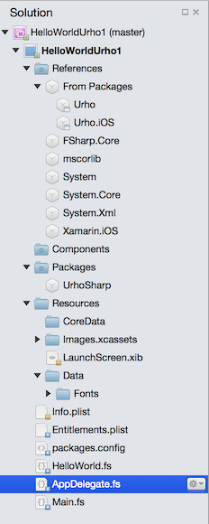
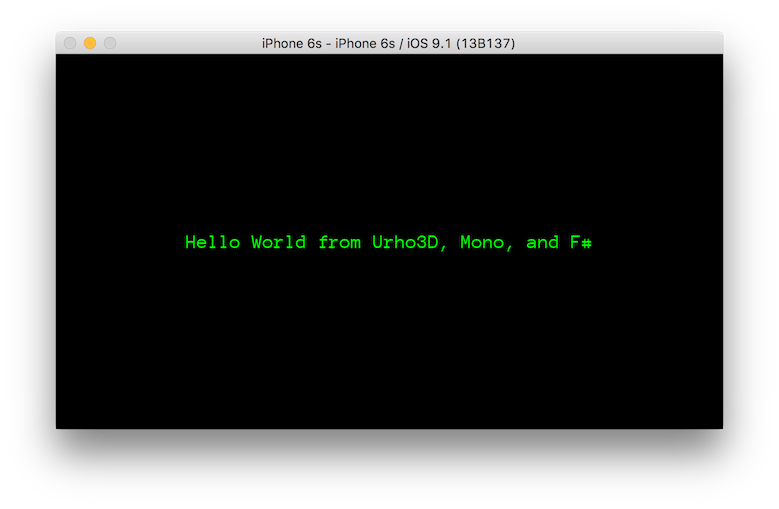

# Programming UrhoSharp with F\#

UrhoSharp can be programmed with F# using the same libraries and concepts used by C# programmers. The [Using UrhoSharp](~/graphics-games/urhosharp/using.md) article gives an overview of the UrhoSharp engine and should be read prior to this article.

Like many libraries that originated in the C++ world, many UrhoSharp functions return booleans or integers indicating success or failure. You should use `|> ignore` to ignore these values.

The [sample program](https://github.com/xamarin/recipes/tree/master/Recipes/cross-platform/urho/urho-fsharp/HelloWorldUrhoFsharp) is a "Hello World" for UrhoSharp from F#.

## Creating an empty project

There are no F# templates for UrhoSharp yet available, so to create your own UrhoSharp project you can either start with the [sample](https://github.com/xamarin/recipes/tree/master/Recipes/cross-platform/urho/urho-fsharp/HelloWorldUrhoFsharp) or follow these steps:

1. From Visual Studio for Mac, create a new **Solution**. Choose **iOS > App > Single View App** and select **F#** as the implementation language. 
1. Delete the **Main.storyboard** file. Open the **Info.plist** file and in the **iPhone / iPod Deployment Info** pane, delete the `Main` string in the **Main Interface** dropdown.
1. Delete the **ViewController.fs** file as well.

## Building Hello World in Urho

You are now ready to begin defining your game's classes. At a minimum, you will need to define a subclass of `Urho.Application` and override its `Start` method. To create this file, right-click on your F# project, choose **Add new file...** and add an empty F# class to your project. The new file will be added to the end of the list of files in your project, but you must drag it so that it appears *before* it is used in **AppDelegate.fs**.

1. Add a reference to the Urho NuGet package.
1. From an existing Urho project, copy the (large) directories **CoreData/** and **Data/** into your project's **Resources/** directory. In your F# project, right-click on the **Resources** folder and use **Add / Add Existing Folder** to add all of these files to your project.

Your project structure should now look like:



Define your newly-created class as a subtype of `Urho.Application` and override its `Start` method:

```fsharp
namespace HelloWorldUrho1

open Urho
open Urho.Gui
open Urho.iOS

type HelloWorld(o : ApplicationOptions) =
    inherit Urho.Application(o) 

override this.Start() = 
        let cache = this.ResourceCache
        let helloText = new Text()

        helloText.Value <- "Hello World from Urho3D, Mono, and F#"
        helloText.HorizontalAlignment <- HorizontalAlignment.Center
        helloText.VerticalAlignment <- VerticalAlignment.Center

        helloText.SetColor (new Color(0.f, 1.f, 0.f))
        let f = cache.GetFont("Fonts/Anonymous Pro.ttf")

        helloText.SetFont(f, 30) |> ignore
                  
        this.UI.Root.AddChild(helloText)
            
```

The code is very straightforward. It uses the `Urho.Gui.Text` class to display a center-aligned string with a certain font and color size. 

Before this code can run, though, UrhoSharp must be initialized. 

Open the AppDelegate.fs file and modify the `FinishedLaunching` method as follows:

```fsharp
namespace HelloWorldUrho1

open System
open UIKit
open Foundation
open Urho
open Urho.iOS

[<Register ("AppDelegate")>]
type AppDelegate () =
    inherit UIApplicationDelegate ()

    override this.FinishedLaunching (app, options) =
        let o = ApplicationOptions.Default
     
        let g = new HelloWorld(o)
        g.Run() |> ignore
       
        true
```

The `ApplicationOptions.Default` provides the default options for a landscape-mode application. Pass these `ApplicationOptions` to the default constructor for your `Application` subclass (note that when you defined the `HelloWorld` class, the line `inherit Application(o)` calls the base-class constructor).

The `Run` method of your `Application` initiates the program. It is defined as returning an `int`, which can be piped to `ignore`.

The resulting program should look like this screenshot:



## Related Links

- [Browse on GitHub (sample)](https://github.com/xamarin/recipes/tree/master/Recipes/cross-platform/urho/urho-fsharp/HelloWorldUrhoFsharp)
