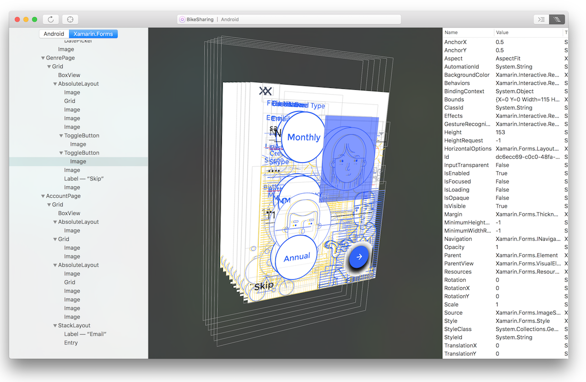

# Xamarin Inspector

The Xamarin Inspector integrates with the app debugging workflow of your IDE,
allowing you to interactively execute C# code or inspect properties of your UI,
serving as a debugging or diagnostics aid when inspecting your running app.

Live app inspection is available for enterprise customers. Let us know if
you [run into any bugs](~/tools/inspector/install.md#reporting-bugs). We have a
[forum](https://forums.xamarin.com/categories/inspector) too!

## [Installation and Requirements](~/tools/inspector/install.md)

Information on getting Xamarin Inspector installed on your Mac or
Windows computer.

## [Inspecting Live Applications](~/tools/inspector/inspect.md)

Discusses how to use the Inspector to attach to a app while it is being run from
the IDE, allowing its state to be explored and manipulated without pausing.
