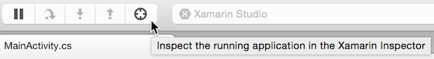
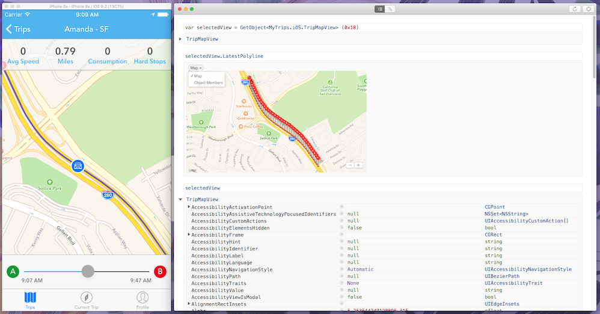

# Inspecting Live Applications

Live app inspection is available for enterprise customers.

1. Open any [supported app project](~/tools/inspector/install.md#supported-platforms) in Visual Studio for Mac or Visual Studio.
1. Run your app in debug mode.
1. Click the **Inspect** button in the IDE toolbar (in Visual Studio, the
**Inspect current app...** menu item is also available from the **Tools** or **Debug** menu).

[](inspect-images/mac-heres-the-button.png#lightbox)

A new Xamarin Inspector client window will open, with a fresh REPL prompt.

[](inspect-images/inspector-0.7.0-map-inspect.png#lightbox)

Once this window appears, you have an interactive C# prompt that you can use to
execute and evaluate C# statements and expressions. What makes this unique is
that the code is evaluated in the context of the target process. In this case,
we are showing the code running against the iOS application displayed.

Any changes that you make to the state of the application are actually happening
on the target process, so you can use C# to change the application live, or you
can inspect the state of the application live.

For example, on iOS, we might want to locate our UIApplication delegate class,
which is our main driver (where we store a lot of the application state):

```csharp
var del = (MyApp.AppDelegate) UIApplication.SharedApplication.Delegate
del.Database.GetAllCustomers ()
...
del.Database.AddCustomer (...)
```

(Note that each submission occurs in a multiline editor. `Shift + Enter` will
create a new line, and `Cmd + Enter` (`Ctrl + Enter` on Windows) will submit the
code for evaluation. `Enter` automatically submits when it is safe.)

A more convenient way to get to the visual elements of your application is
by using the "Inspect" button. Once you press this, you can select a UI element
by clicking on your application. The variable `selectedView` will be assigned to
point to the actual element on the screen. In the screenshot above, you can see
how we accessed and then edited `selectedView.BarTintColor` on the `UISearchBar`
we had selected.

The live visual tree is also very useful. It represents the current snapshot of
your view hierarchy. You can select rows to set `selectedView` in the REPL and
to see the view's property values. On Mac, you can interact with a 3D exploded
visualization of the layered views. On Windows, you can edit a view's property
values visually.

## Known Limitations

- View selection is only supported on your main display.
- Property grid editing is not available for Mac, and on Windows is limited to
  a few data types. Use the REPL for more powerful editing.
- As long as the Inspector addin/extension is installed and enabled in your IDE,
  we are injecting code into your app every time it starts in Debug mode. If you
  notice any strange behavior in your app, please try disabling or uninstalling
  the Inspector addin/extension, restarting the IDE, and rechecking. And please
  [file bugs](~/tools/inspector/install.md#reporting-bugs) to let us know!
- If inspecting a UI element causes it to change in anyway, please
  [let us know](~/tools/inspector/install.md#reporting-bugs), as this may indicate a bug.
