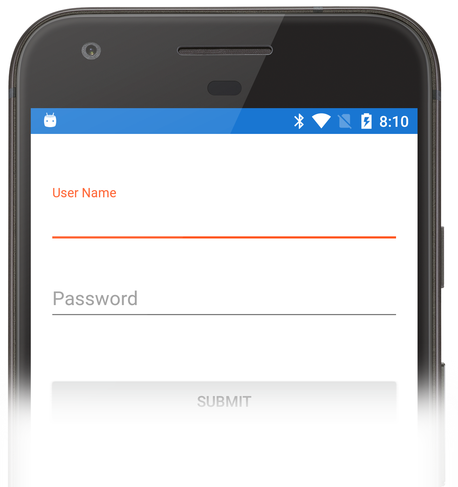

These recipies demonstrate how to use the `EditText` widget (or it's descendants) in a Xamarin.Android application:

* [Capture User Input Text](/Recipes/android/controls/edittext/capture_user_input_text) &ndash; The EditText control allows a user to enter text into an application.

    

* [Material Design text fields with the `TextInputLayout`](/Recipes/android/controls/edittext/textinputlayout) &ndash; Implement an edit text that conforms to the Material Design guidelines.

    

The EditText control allows a user to enter text into an application.

 

-   [Capture User Input Text](/Recipes/android/controls/edittext/capture_user_input_text)
