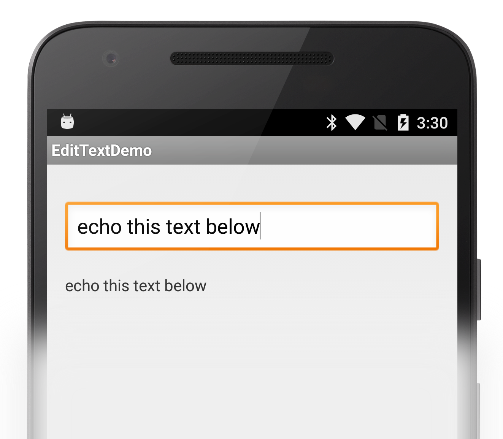

<a name="Recipe" class="injected"></a>


# Recipe

1.  Create a new Xamarin.Android application named *EditTextDemo*.
2.  In Main.xml to include an `EditText` and a `TextView`.


```
<?xml version="1.0" encoding="utf-8"?>

<LinearLayout xmlns:android="http://schemas.android.com/apk/res/android"

    android:orientation="vertical"

    android:layout_width="fill_parent"

    android:layout_height="fill_parent">

    <EditText

        android:id="@+id/editText"

        android:layout_width="fill_parent"

        android:layout_height="wrap_content"/>

    <TextView

        android:id="@+id/textView"

        android:layout_width="fill_parent"

        android:layout_height="wrap_content"/>  

</LinearLayout>
```

<ol start="3">
  <li>In MainActivity.cs, get references to the <code>EditText</code> and the <code>TextView</code>.</li>
</ol>


```
var editText = FindViewById<EditText> (Resource.Id.editText);

var textView = FindViewById<TextView> (Resource.Id.textView);
```

<ol start="4">
  <li>Implement the <code>TextChanged</code> event to capture the text from the <code>EditText</code> and write it to the <code>TextView</code>.</li>
</ol>


```
editText.TextChanged += (object sender, Android.Text.TextChangedEventArgs e) => {

       textView.Text = e.Text.ToString ();

};
```



 <a name="Additional_Information" class="injected"></a>


# Additional Information

The `EditText` control also has events for handling other user interactions
more such as when a key is pressed and before and after text is changed.

