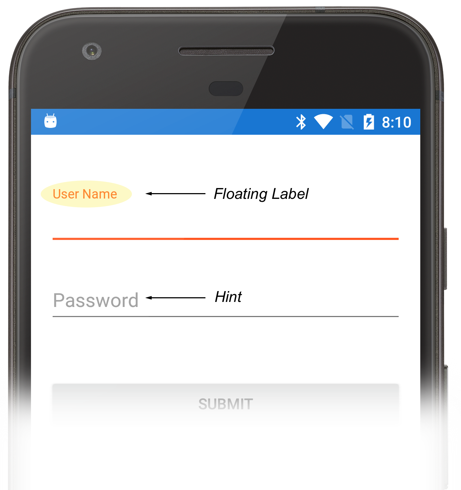
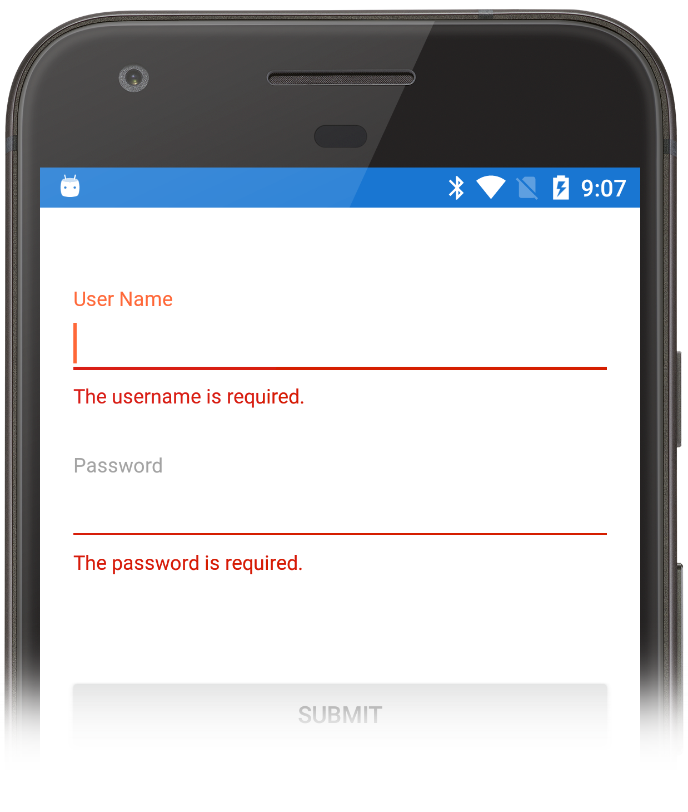

# Overview

The Android Design Support Library is a collection of widgets that make it easy for
The `TextInputLayout` widget makes it easy for developers to add [Material Design](https://material.io/guidelines/material-design/introduction.html) concepts to their Android apps. In particular, the [Material Design guidelines for text fields](https://material.io/guidelines/components/text-fields.html) can be implemented in an Android application with the use of the `Android.Support.Design.TextInputLayout` widget. This widget is a container around an `EditText` that will display a hint in a floating label when the user is enter text.

The following screenshot shows two `TextInputLayout`s on an Android device, one with focus and another without:

The `TextInputLayout` also provides a mechanism to display data entry errors to the user in a manner that is consistent with material design principals:  

The recipe will highlight how to add a `TextInputLayout` to a Xamarin.Android application and display data entry errors to the user.  

# Requirements

The Design Support Library requires Android 2.1 (API level 9) or higher.

# Using the TextInputLayout in Xamarin.Android

1. Ensure that the Target API of the Android project is set to API Level 9 or higher.
2. Add the [**Xamarin.Android.Support.Design** NuGet package](https://www.nuget.org/packages/Xamarin.Android.Support.Design/) to the project.
3. To use the `TextInputLayout` widget, the Activity must use one of the AppCompat themes (or implement it's own theme). The following snippet is an example of a custom AppCompat theme for an application that could be find in the file **Resources/values/styles.xml**:

        <?xml version="1.0" encoding="UTF-8" ?>
        <resources>        
                    
        </resources>
        
    The colour resources that are used by the theme are contained in their own resource file, **Resources/values/colours.xml**:

        <?xml version="1.0" encoding="utf-8"?>
        <resources>
          <color name="primary">#2196F3</color>
          <color name="primary_dark">#1976D2</color>
          <color name="primary_light">#BBDEFB</color>
          <color name="accent">#FF5722</color>
          <color name="primary_text">#212121</color>
          <color name="secondary_text">#757575</color>
          <color name="icons">#FFFFFF</color>
          <color name="divider">#BDBDBD</color>
        </resources>

    The simplest way to ensure that the `TextInputLayout` works through out the application is to set the default theme for the application. This is done by setting the `android:theme` attribute in the **AndroidManifest.XML**:

        <?xml version="1.0" encoding="utf-8"?>
        <manifest xmlns:android="http://schemas.android.com/apk/res/android"
                android:versionCode="1"
                android:versionName="1.0"
                package="com.xamarin.xample.textinputlayout">
            <uses-sdk android:minSdkVersion="21" />
            <application android:allowBackup="true"
                android:label="@string/app_name"
                android:theme="@style/AppTheme"></application>
        </manifest>

3. Open the **.AXML** file and add `TextInputLayout` and a `TextInputEditText` (or `EditText`) control:

        <android.support.design.widget.TextInputLayout
            android:id="@+id/username_layout"
            android:layout_marginTop="@dimen/top_margin"
            android:layout_marginStart="@dimen/start_or_end_margin"
            android:layout_marginEnd="@dimen/start_or_end_margin"
            android:layout_width="match_parent"
            android:layout_height="wrap_content">
            <android.support.design.widget.TextInputEditText
                android:layout_width="match_parent"
                android:hint="@string/form_username"
                android:layout_height="wrap_content"
                android:id="@+id/username_edittext" />
        </android.support.design.widget.TextInputLayout>

    The value of the `android:hint` property will be displayed in one of two locations. If the text view has focus or the user has entered some text into it, then the `hint` will be displayed as a floating label. The `TextInputLayout` is a container for any `EditText` subclass. The previous example uses a `TextInputEditText` widget (also from the Android Design Support Library). This widget extends the `EditText` and provides a way for the hint text to be shown in the IME (Input Method Editor) when the device is in landscape mode.

## Display a Validation Error

1. First, obtain a reference to the both the `TextInputLayout` and the contained `EditText`:

        Android.Support.Design.Widget.TextInputLayout passwordLayout;
        Android.Support.Design.Widget.TextInputEditText passwordView;

        passwordView = FindViewById<TextInputEditText>(Resource.Id.password_edittext);
        passwordLayout = FindViewById<Android.Support.Design.Widget.TextInputLayout>(Resource.Id.password_layout);

2. To display the error to the user, set the `.EnableError` property on the `TextInputLayout` to `true` and set the error message by providing a string via he `TextInputLayout.Error` property:

        bool ValidatePassword()
        {
            if (string.IsNullOrWhiteSpace(passwordView.Text))
            {
                passwordLayout.ErrorEnabled = true;
                passwordLayout.Error = GetString(Resource.String.password_required_error_message);
                return false;
            }
            else
            {
                return true;
            }
        }
