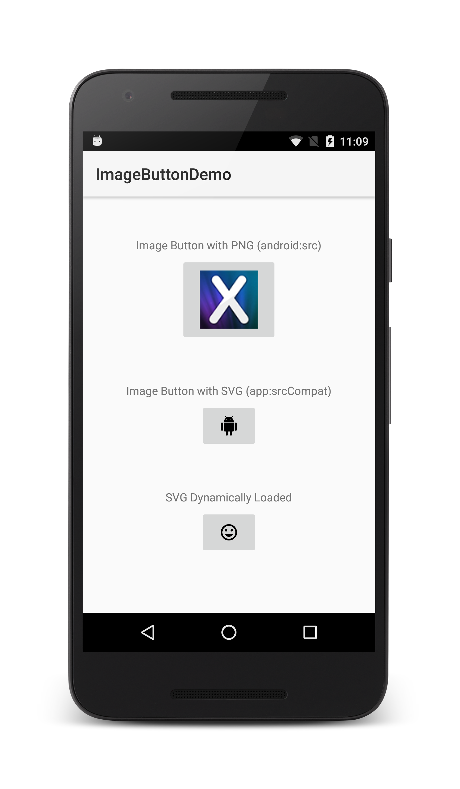

---
--
id: D8C547E3-6671-2680-6163-E0B21414A022
title: "Create An ImageButton"
brief: "This recipe shows how to use an ImageButton in a Xamarin.Android application."
dateupdated: 2017-07-17
--
---

<a name="Recipe" class="injected"></a>

# Recipe

The [`ImageButton`](https://developer.xamarin.com/api/type/Android.Widget.ImageButton/) will display button with an image. The image can be a PNG or, under certain circumstances, an SVG resource.

This recipe will discuss how to set the image displayed in an `ImageButton`, either declaratively in an Android layout file or programmatically in code.

## Using a PNG in an ImageButton

It is possible to use a PNG image on all Android API levels.

 [ ](Images/ImageButton.png)

1.  Create a new Xamarin.Android application named `ImageButtonDemo`.
2.  Add an image named **myButtonImage.png** under the **Resources &gt; drawable** folder in your IDE.
3.  Replace the `Button` declaration in Main.axml with the following,

        <ImageButton
            android:id="@+id/myButton"
            android:layout_width="wrap_content"
            android:layout_height="wrap_content"
            android:layout_marginTop="6dp"
            android:src="@drawable/myButtonImage"
            android:paddingStart="24dp"
            android:paddingEnd="24dp"
            android:paddingTop="16dp"
            android:paddingBottom="16dp" />

4. In **MainActivity.cs**, change the type from `Button` to `ImageButton`.

        var button = FindViewById<ImageButton> (Resource.Id.myButton);


## Using an SVG in an ImageButton

Starting in Android 5.0 (API level 21), Android introduced limited support for SVG drawable resources, making it possible to use SVG resources in an `ImageButton`. Backwards compatibility to API level 7 is provided with the [Xamarin Android Support Library v7 AppCompat](https://www.nuget.org/packages/Xamarin.Android.Support.v7.AppCompat/) NuGet package.

1. Add the [Xamarin Android Support Library v7 AppCompat](https://www.nuget.org/packages/Xamarin.Android.Support.v7.AppCompat/) NuGet package to your application.
2. Add a new XML file to the **Resources/drawable** folder of your application. The **Build Action** of the file should be **AndroidResource**.  The following snippet is a file named **ic_android.xml**:

        <vector xmlns:android="http://schemas.android.com/apk/res/android"
                android:width="24dp"
                android:height="24dp"
                android:viewportWidth="24.0"
                android:viewportHeight="24.0">
            <path
                android:fillColor="#FF000000"
                android:pathData="M6,18c0,0.55 0.45,1 1,1h1v3.5c0,0.83 0.67,1.5 1.5,1.5s1.5,-0.67 1.5,-1.5L11,19h2v3.5c0,0.83 0.67,1.5 1.5,1.5s1.5,-0.67 1.5,-1.5L16,19h1c0.55,0 1,-0.45 1,-1L18,8L6,8v10zM3.5,8C2.67,8 2,8.67 2,9.5v7c0,0.83 0.67,1.5 1.5,1.5S5,17.33 5,16.5v-7C5,8.67 4.33,8 3.5,8zM20.5,8c-0.83,0 -1.5,0.67 -1.5,1.5v7c0,0.83 0.67,1.5 1.5,1.5s1.5,-0.67 1.5,-1.5v-7c0,-0.83 -0.67,-1.5 -1.5,-1.5zM15.53,2.16l1.3,-1.3c0.2,-0.2 0.2,-0.51 0,-0.71 -0.2,-0.2 -0.51,-0.2 -0.71,0l-1.48,1.48C13.85,1.23 12.95,1 12,1c-0.96,0 -1.86,0.23 -2.66,0.63L7.85,0.15c-0.2,-0.2 -0.51,-0.2 -0.71,0 -0.2,0.2 -0.2,0.51 0,0.71l1.31,1.31C6.97,3.26 6,5.01 6,7h12c0,-1.99 -0.97,-3.75 -2.47,-4.84zM10,5L9,5L9,4h1v1zM15,5h-1L14,4h1v1z"/>
        </vector>

3. Next, edit the layout file of the activity, and add a new `ImageButton` widget to the layout. Set the `app:srcCompat` attribute to the SVG resource that was added in the previous step:
 
        <ImageButton
            android:id="@+id/myButton2"
            android:layout_width="wrap_content"
            android:layout_height="wrap_content"
            app:srcCompat="@drawable/ic_android"
            android:layout_marginTop="6dip"
            android:paddingStart="24dp"
            android:paddingEnd="24dp"
            android:paddingTop="16dp"
            android:paddingBottom="16dp" />

    It may be necessary to define the `app` namespace in the root layout for the XML file:
    
        <LinearLayout xmlns:android="http://schemas.android.com/apk/res/android"
            xmlns:app="http://schemas.android.com/apk/res-auto"
            android:orientation="vertical"
            android:layout_width="fill_parent"
            android:layout_height="fill_parent"
            android:gravity="center_horizontal">    


## Programatically Setting the Image Button 

It is possible to programmatically set an image in an `ImageButton` by calling the `ImageButton.SetImageDrawable` method and providing a `Drawable` object. Android 5.0 and higher can load SVG images. For older versions of Android, it may be necessary to first load the SVG image using the [`VectorDrawableCompat.Create`](https://developer.android.com/reference/android/support/graphics/drawable/VectorDrawableCompat.html) method. The following snippet shows how to programatically load and set the image in a in `ImageButton`:

```csharp
void DisplayImageInButton() 
{
    var button = FindViewById<ImageButton>(Resource.Id.myButton3);
    var tv = FindViewById<TextView>(Resource.Id.dynamic_load_textview);
    
    if (Build.VERSION.SdkInt >=  BuildVersionCodes.Lollipop ) 
    {
        // Android 5.0 and higher can load the SVG image from resources.
        var image = ContextCompat.GetDrawable(ApplicationContext, Resource.Drawable.ic_mood_black);
        button.SetImageDrawable(image);
        tv.SetText(Resource.String.dynamically_loaded_image);
    }
    else 
    {
        // Devices running < Android 5.0 should use the VectorDrawableCompat
        var image = Android.Support.Graphics.Drawable.VectorDrawableCompat.Create(this.Resources, Resource.Drawable.ic_sentiment_neutral_black_24dp, null);
        button.SetImageDrawable(image);
        tv.SetText(Resource.String.dynamically_loaded_image_compat);
    }
}
```

<a name="Additional_Information" class="injected"></a>

# Additional Information

The `ImageButton` class behaves like a `Button`, adding support for showing
displaying an image on the button’s surface. The layout of the can be managed
with the various android layout attributes as shown above, where we set the
margin and the padding.

